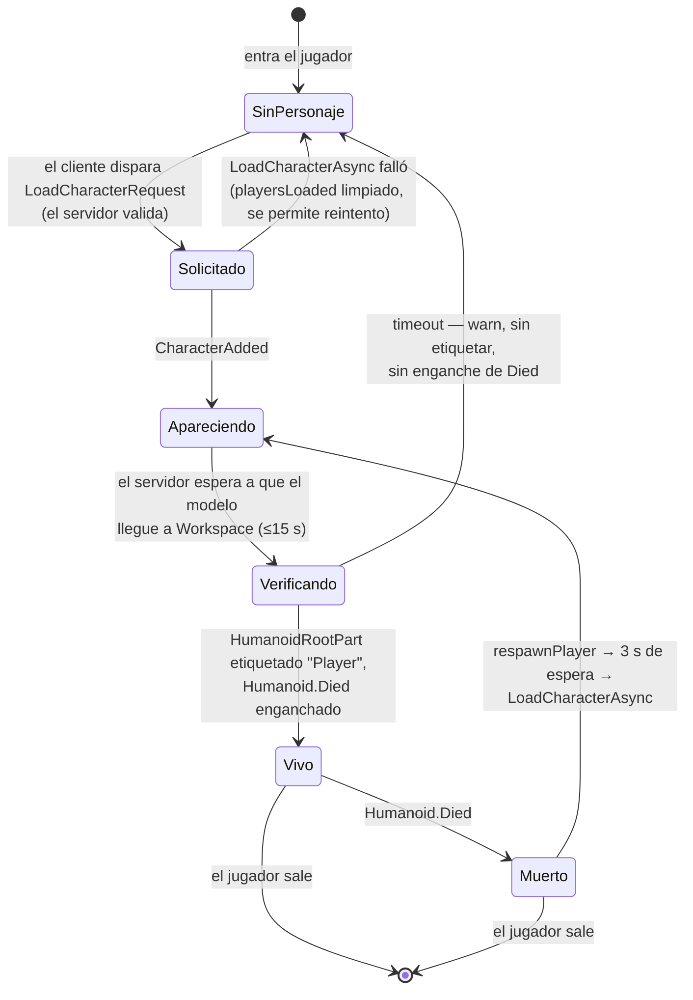
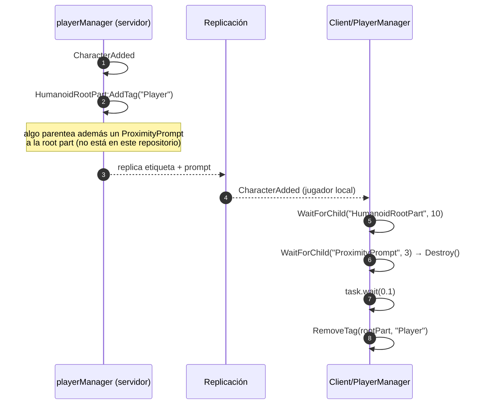

# Ciclo de vida del Character

El ciclo de vida del personaje en Voz Hispana lo llevan
`Core/ServerScriptService/ServerScripts/playerManager.server.luau` en el servidor y
`Core/ReplicatedStorage/Client/PlayerManager.server.luau` (un script con
`RunContext = "Client"`) en el cliente. Hacen mitades complementarias del mismo trabajo, y
la mitad del cliente **deshace** parte de lo que hace la del servidor.

## Estados



## Lado servidor

**HECHO.** En `CharacterAdded` (y una vez de inmediato para un personaje que ya exista),
`onCharacterAdded` lanza una tarea que:

1. **Espera a que el personaje esté realmente en `Workspace`**, sondeando cada 0,1 s
   durante como mucho `CHARACTER_READY_TIMEOUT = 15` segundos. Aborta antes si el jugador
   se fue o si `player.Character` cambió por debajo. Al agotarse el plazo avisa y retorna
   — **entonces el personaje nunca se etiqueta y su muerte nunca se engancha**.
2. **Etiqueta `HumanoidRootPart` con `"Player"`** vía `:AddTag`, tras un
   `WaitForChild("HumanoidRootPart", 10)`.
3. **Espera al `Humanoid`** (10 s) y conecta `humanoid.Died:Once(...)`.

`:Once`, no `:Connect` — un manejador de muerte por instancia de personaje, lo que encaja
con que cada muerte produce un personaje nuevo.

### Respawn

**HECHO.** `respawnPlayer` está protegido por un flag `respawning[player]`, y luego:

```lua
task.delay(RESPAWN_DELAY, function()   -- RESPAWN_DELAY = 3
    if player.Parent ~= Players then respawning[player] = nil; return end
    local ok, err = pcall(function() player:LoadCharacterAsync() end)
    if not ok then warn(...) end
    respawning[player] = nil
end)
```

**INFERENCIA.** El respawn deliberadamente **no** pasa por la ruta de
`LoadCharacterRequest`. Llama a `LoadCharacterAsync` directamente, así que
`playersLoaded[player]` —el flag de un-personaje-por-sesión del handshake de entrada— es
irrelevante para el respawn y se queda puesto. Las dos rutas son independientes por
construcción.

**OBSERVACIÓN.** Si `LoadCharacterAsync` falla dentro de `respawnPlayer`, el fallo se
avisa y se limpia `respawning[player]`, pero nada reintenta. El jugador se queda sin
personaje hasta que otra cosa le genere uno. `Humanoid.Died` ya se disparó y estaba
conectado con `:Once`, así que no volverá a dispararse para ese personaje. Registrado como
[BUG-CANDIDATE-003](../testing/verification-plan.md#bug-candidate-003).

## Lado cliente

**HECHO.** `Core/ReplicatedStorage/Client/PlayerManager.server.luau` corre con
`RunContext = "Client"`. Su `limpiarPersonaje` se ejecuta en cada `CharacterAdded` del
jugador local y:

1. espera hasta 10 s por `HumanoidRootPart`;
2. espera hasta 3 s por un `ProximityPrompt` bajo él y **lo destruye**;
3. espera 0,1 s y quita la etiqueta `"Player"` de `CollectionService` de la root part, si
   está.

Los comentarios del código explican ambas esperas: el prompt lo crea el servidor y puede
tardar, y la pausa de 0,1 s existe para que la etiqueta se haya replicado antes de que el
cliente la quite.



**INFERENCIA.** La etiqueta `"Player"` y el proximity prompt existen para que *otros*
jugadores puedan interactuar con un personaje, y el cliente local quita ambos de **su
propio** personaje para no poder interactuar consigo mismo. Como las etiquetas de
`CollectionService` y la destrucción de instancias aquí son locales al cliente, esto solo
afecta a la vista local.

**DESCONOCIDO.** Qué script crea el `ProximityPrompt` bajo `HumanoidRootPart`. Ningún
`.luau` de este repositorio parentea un `ProximityPrompt` ahí; el productor está o en un
asset binario o en los assets de plantilla publicados. Lo único seguro es que el cliente
espera que aparezca uno.

El mismo script de cliente arranca además el tutorial de bienvenida a través de
`Shared/GuideService`, con las páginas declaradas en
`Shared/Tutorials/ParametrosTutorialBienvenida`.

## Qué se reinicia y qué no

| | |
|---|---|
| **Por personaje** | Etiqueta `"Player"` en `HumanoidRootPart`; el enganche de `Died`; la limpieza de prompt/etiqueta del cliente; cualquier otra cosa conectada a `CharacterAdded`. |
| **Por sesión, sobrevive a la muerte** | `playersLoaded`, `lastLoadRequestAt`, `PlayerManagerLoaded`, y la tabla por jugador de cada sistema. |
| **DESCONOCIDO** | Qué añade `StarterCharacterScripts.rbxm` a cada personaje. Es binario y no se puede leer, así que esta página no puede pretender describir el ciclo de vida completo del personaje. |

## Implementación relacionada

| Paso | Código |
|---|---|
| Sondeo de llegada a Workspace | `playerManager.server.luau`, `waitUntilCharacterIsInWorkspace` |
| Etiquetado + enganche de muerte | `playerManager.server.luau`, `onCharacterAdded` |
| Respawn | `playerManager.server.luau`, `respawnPlayer` |
| Limpieza en el cliente | `Client/PlayerManager.server.luau`, `limpiarPersonaje` |
| Ragdoll al morir / al caer | `Core/…/ServerScripts/Ragdoll/*`, `Core/…/Client/Ragdoll/*` — aún sin analizar |
