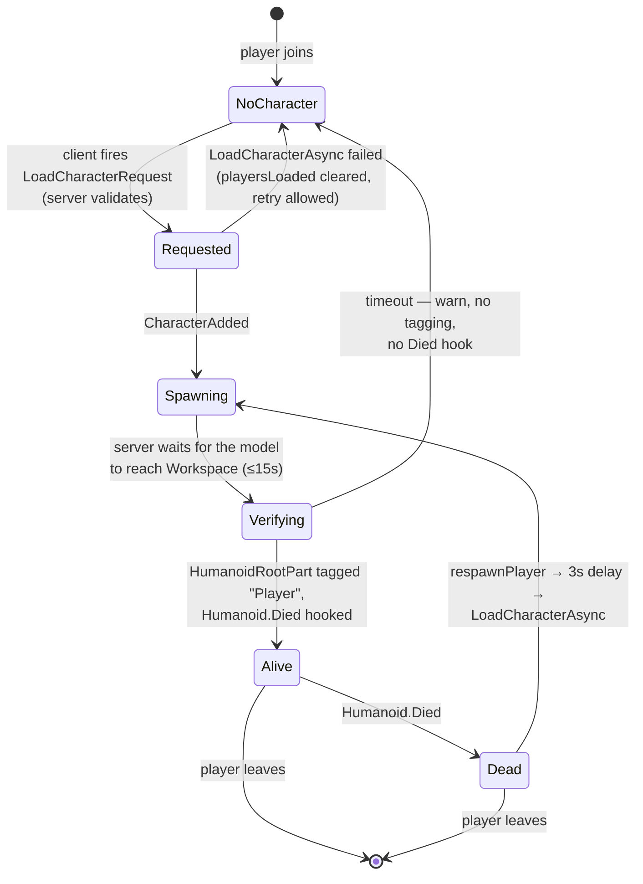
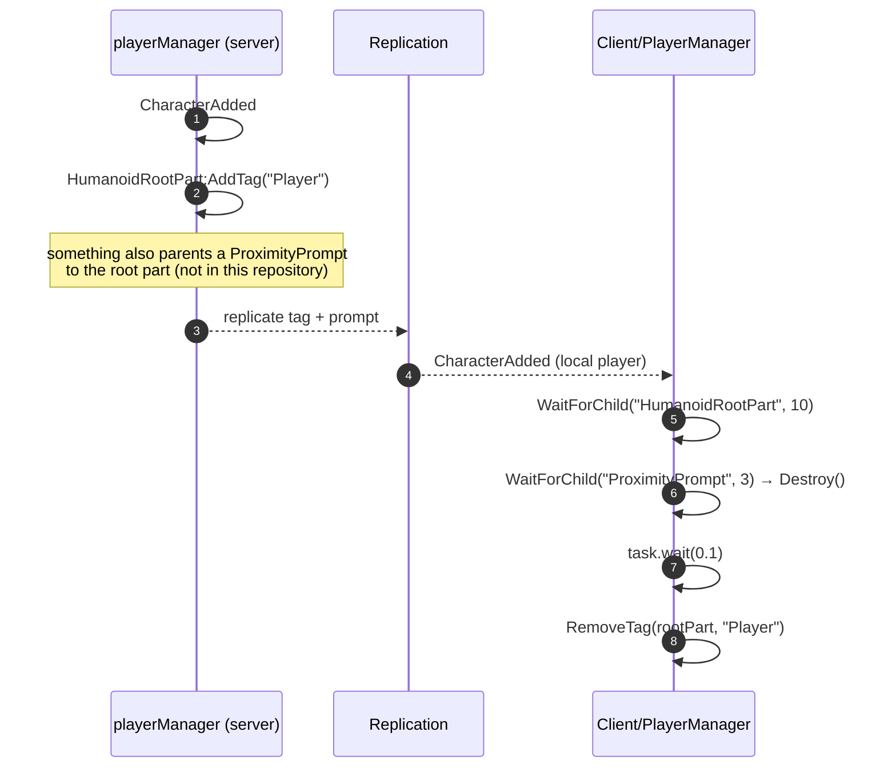

# Character lifecycle

The character lifecycle in Voz Hispana is owned by
`Core/ServerScriptService/ServerScripts/playerManager.server.luau` on the server and
`Core/ReplicatedStorage/Client/PlayerManager.server.luau` (a `RunContext = "Client"`
script) on the client. They do complementary halves of the same job, and the client half
partly *undoes* what the server half does.

## States



## Server side

**FACT.** On `CharacterAdded` (and once immediately for an already-existing character),
`onCharacterAdded` spawns a task that:

1. **Waits for the character to actually be in `Workspace`**, polling every 0.1 s for at
   most `CHARACTER_READY_TIMEOUT = 15` seconds. It aborts early if the player left or if
   `player.Character` changed underneath it. On timeout it warns and returns — **the
   character is then never tagged and its death is never hooked**.
2. **Tags `HumanoidRootPart` with `"Player"`** via `:AddTag`, after a
   `WaitForChild("HumanoidRootPart", 10)`.
3. **Waits for the `Humanoid`** (10 s) and connects `humanoid.Died:Once(...)`.

`:Once`, not `:Connect` — one death handler per character instance, which matches the
fact that each death produces a new character.

### Respawn

**FACT.** `respawnPlayer` is guarded by a `respawning[player]` flag, then:

```lua
task.delay(RESPAWN_DELAY, function()   -- RESPAWN_DELAY = 3
    if player.Parent ~= Players then respawning[player] = nil; return end
    local ok, err = pcall(function() player:LoadCharacterAsync() end)
    if not ok then warn(...) end
    respawning[player] = nil
end)
```

**INFERENCE.** Respawn deliberately does **not** go through the
`LoadCharacterRequest` path. It calls `LoadCharacterAsync` directly, so
`playersLoaded[player]` — the one-character-per-session flag from the join handshake — is
irrelevant to respawning and stays set. The two paths are independent by construction.

**OBSERVATION.** If `LoadCharacterAsync` fails inside `respawnPlayer`, the failure is
warned and `respawning[player]` is cleared, but nothing retries. The player is left
without a character until something else spawns one. `Humanoid.Died` has already fired
and was connected with `:Once`, so it will not fire again for that character.
Recorded as [BUG-CANDIDATE-003](../testing/verification-plan.md#bug-candidate-003).

## Client side

**FACT.** `Core/ReplicatedStorage/Client/PlayerManager.server.luau` runs with
`RunContext = "Client"`. Its `limpiarPersonaje` runs on every `CharacterAdded` for the
local player and:

1. waits up to 10 s for `HumanoidRootPart`;
2. waits up to 3 s for a `ProximityPrompt` under it and **destroys it**;
3. waits 0.1 s, then removes the `"Player"` `CollectionService` tag from the root part
   if present.

The source comments explain both waits: the prompt is created by the server and can lag,
and the 0.1 s pause exists so the tag has replicated before the client removes it.



**INFERENCE.** The `"Player"` tag and the proximity prompt exist so that *other* players
can interact with a character — and the local client removes both from its **own**
character so it cannot interact with itself. Because `CollectionService` tags and
instance destruction here are client-local, this affects only the local view.

**UNKNOWN.** Which script creates the `ProximityPrompt` under `HumanoidRootPart`. No
`.luau` in this repository parents a `ProximityPrompt` there; the producer is either in a
binary asset or in the published template assets. What is certain is only that the client
expects one to appear.

The same client script also starts the welcome tutorial through
`Shared/GuideService`, using the pages declared in
`Shared/Tutorials/ParametrosTutorialBienvenida`.

## What resets, and what does not

| | |
|---|---|
| **Per character** | `"Player"` tag on `HumanoidRootPart`; the `Died` hook; the client's prompt/tag cleanup; anything else connected to `CharacterAdded`. |
| **Per session, survives death** | `playersLoaded`, `lastLoadRequestAt`, `PlayerManagerLoaded`, and every system's own per-player table. |
| **UNKNOWN** | What `StarterCharacterScripts.rbxm` adds to every character. It is binary and cannot be read, so this page cannot claim to describe the full character lifecycle. |

## Related implementation

| Step | Code |
|---|---|
| Workspace readiness poll | `playerManager.server.luau`, `waitUntilCharacterIsInWorkspace` |
| Tagging + death hook | `playerManager.server.luau`, `onCharacterAdded` |
| Respawn | `playerManager.server.luau`, `respawnPlayer` |
| Client-side cleanup | `Client/PlayerManager.server.luau`, `limpiarPersonaje` |
| Ragdoll on death / falling | `Core/…/ServerScripts/Ragdoll/*`, `Core/…/Client/Ragdoll/*` — not yet analysed |
