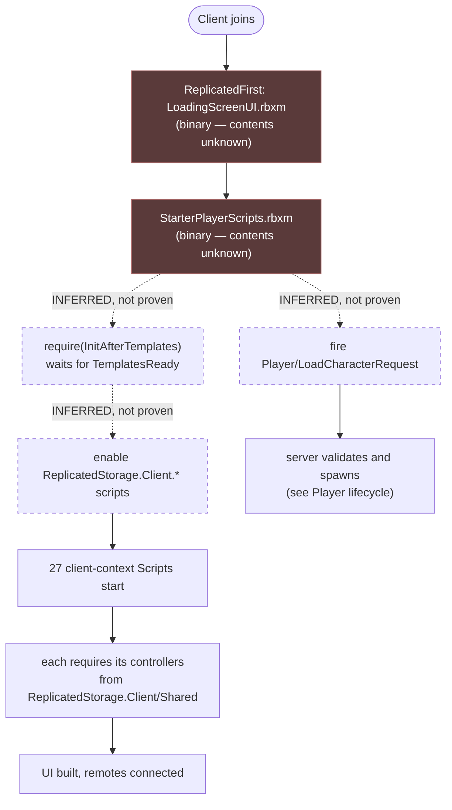

# Client lifecycle

:::warning This page is incomplete, and says so deliberately

The client's real entry point is almost certainly inside
`src/StarterPlayer/StarterPlayerScripts.rbxm`, which is a **binary file that cannot be
read**. Everything below is what the inspectable source proves. The gap is stated
explicitly rather than filled with a plausible guess.

:::

## Where client code lives

**FACT.** Voz Hispana barely uses `LocalScript`s. Client code lives in
`ReplicatedStorage.Client` as `Script`s with `RunContext = "Client"`.

| Location | Count | Notes |
|---|---|---|
| `Core/ReplicatedStorage/Client/**` — `RunContext: Client` `Script`s | 27 | Every one ships `Disabled: true` |
| `Core/ReplicatedStorage/Client/**` — `ModuleScript`s | 88 | Controllers, UI, interactables |
| `Core/ReplicatedStorage/Client/WorldSystem/ClientDataManager/init.client.luau` | 1 | The only true `LocalScript` here, also `Disabled` |
| `src/ReplicatedStorage/Client/visualsManager.server.luau` | 1 | `RunContext: Client`, `Disabled`, outside the templates |
| `Core/StarterGui/LocalScript.client.luau` | 1 | Toggles `ProximityPromptService.Enabled` from `IsInEvent` attributes |
| `src/StarterPlayer/StarterPlayerScripts.rbxm` | ? | **Binary — not inspectable** |
| `src/StarterPlayer/StarterCharacterScripts.rbxm` | ? | **Binary — not inspectable** |

The complete list of client-context scripts:

```
ClickDetectorHandler   MainPS                 NametagMicClient       PlayerManager
ProgressBarStarter     QuestClient            QuestPickableClient    Ragdoll/GettingUpAssist
Ragdoll/RToRagdoll     Ragdoll/RagdollAtHighSpeeds                   Ragdoll/RagdollRemote
ReferralClient         RouletteUIStarter      SurfacePlacer          UiManager
animation              cooking                interactable           interactable/DiscoBall/Laser
inventory              machines               messagesManager        notificationsManager
stats                  topbar                 CodeExamples/MicStatusExample
```

## The open question: who enables them?

**FACT.** Every one of those 27 scripts ships `Disabled: true`.

**FACT.** `InitScripts.server.luau`, the script that enables everything else, explicitly
**excludes** this folder:

```lua
local ClientScriptsFolder = ReplicatedStorage:FindFirstChild("Client")
…
if ClientScriptsFolder and obj:IsDescendantOf(ClientScriptsFolder) then
    continue
end
```

**FACT.** No `.luau` file in this repository assigns `Enabled = true` to a `Script` or
`LocalScript`. The only code that reads `BaseScript.Enabled` at all is
`InitScripts.server.luau` itself — and that is the server, which could not enable a
client-context script for a specific client anyway.

**FACT.** A `RemoteEvent` named `InitScriptsRequest` exists at
`Core/ReplicatedStorage/Events/GameLoad/InitScriptsRequest`, and **no `.luau` file in
this repository references it**. It is declared and unused, as far as inspectable source
goes.

**INFERENCE.** A client-side loader exists that this repository does not contain. It
enables the `ReplicatedStorage.Client` scripts on each client after the templates land,
and `InitScriptsRequest` is very likely its handshake with the server. The most probable
home is `StarterPlayerScripts.rbxm`.

**This inference is not a fact and is not treated as one anywhere else on this site.**
Recorded as [BUG-CANDIDATE-007](../testing/verification-plan.md#bug-candidate-007), which
carries a plan to settle it in Studio in about two minutes.



## What the client waits for

**FACT.** `InitAfterTemplates` has a client branch. It listens on the `TemplatesReady`
`RemoteEvent` **and** reads `TemplatesReadyFlag.Value` first, so a client that arrives
after the broadcast still resolves:

```lua
if TemplatesReadyFlag.Value then
    ready = true
else
    TemplatesReady.OnClientEvent:Connect(function() ready = true end)
end
```

**INFERENCE.** This matters because `TemplatesReady:FireAllClients()` reaches only the
clients connected at that instant. Everyone who joins later depends entirely on the
replicated `BoolValue`. The double check is what makes late joiners work.

## Client-visible server state

**FACT.** The client can read where the server is in its lifecycle without a remote
round-trip, because these are replicated instances in `ReplicatedStorage`:

| Instance | Class | Meaning |
|---|---|---|
| `TemplatesReadyFlag` | `BoolValue` | Templates merged |
| `InitScriptsReadyFlag` | `BoolValue` | Template scripts enabled |
| `ServerInfo` | `Configuration` | `ServerKey`, `HostingType`, `status` (`pending`/`ready`/`closed`) attributes |
| `isStarted` | `Configuration` | `Started` attribute — house servers only |
| `IsInEvent` | `Configuration` | Attributes gate `ProximityPromptService.Enabled` |
| `PlaceType` | `Configuration` | Present in the `PlayerHouses` template |

`IsInEvent` is the clearest example of the pattern. `Core/StarterGui/LocalScript.client.luau`
disables all proximity prompts while **any** attribute on `IsInEvent` is truthy:

```lua
function change()
    for _, value in Evento:GetAttributes() do
        if value then PPS.Enabled = false; return end
    end
    PPS.Enabled = true
end
change()
Evento.AttributeChanged:Connect(change)
```

**INFERENCE.** Any client feature that opens a full-screen UI can suppress world
interaction by setting its own named attribute, and clear it when done, without any
feature needing to know about the others. `Client/MainPS.server.luau` does exactly this
with `OpenGuiPaint`.

## Client → server communication

Covered in [Networking](./networking.md). In summary: **174 `RemoteEvent`s and 40
`RemoteFunction`s**, declared as Rojo `.model.json` files and organised into topic
folders under `ReplicatedStorage.Events`.

## Related implementation

| Concern | Code |
|---|---|
| Readiness barrier (client branch) | `ReplicatedStorage/InitAfterTemplates.luau` |
| Local character cleanup + welcome tutorial | `Client/PlayerManager.server.luau` |
| Proximity-prompt gating | `Core/StarterGui/LocalScript.client.luau`, `Client/MainPS.server.luau` |
| Topbar / icons | `Client/topbar.server.luau`, `Shared/Icon` |
| Notifications | `Client/notificationsManager/init.server.luau` |
| Rotating lobby visuals | `src/ReplicatedStorage/Client/visualsManager.server.luau` |
