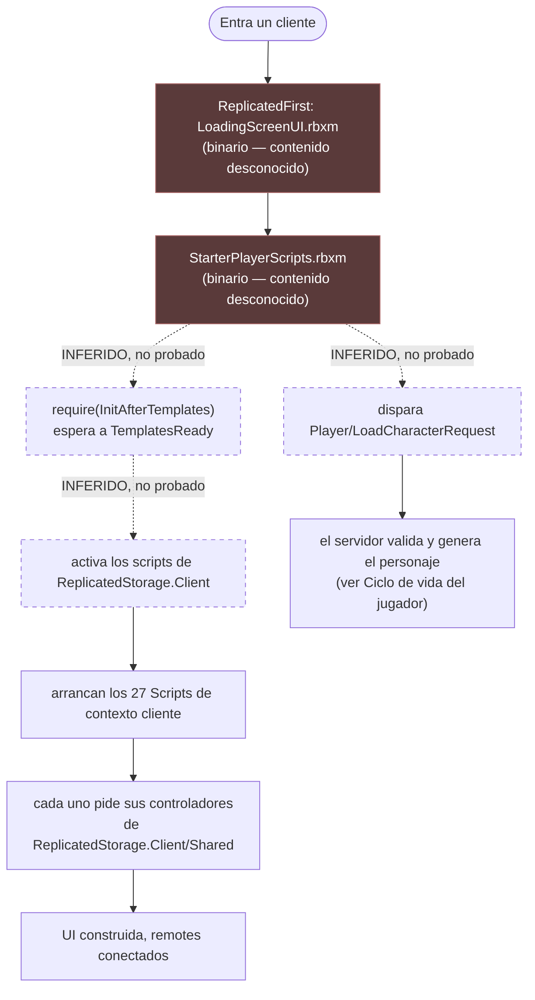

# Ciclo de vida del cliente

:::warning Esta página está incompleta, y lo dice a propósito

El punto de entrada real del cliente está casi con seguridad dentro de
`src/StarterPlayer/StarterPlayerScripts.rbxm`, que es un **archivo binario que no se
puede leer**. Todo lo de abajo es lo que demuestra el código inspeccionable. El hueco se
declara explícitamente en vez de rellenarlo con una suposición verosímil.

:::

## Dónde vive el código de cliente

**HECHO.** Voz Hispana apenas usa `LocalScript`. El código de cliente vive en
`ReplicatedStorage.Client` como `Script` con `RunContext = "Client"`.

| Ubicación | Cantidad | Notas |
|---|---|---|
| `Core/ReplicatedStorage/Client/**` — `Script` con `RunContext: Client` | 27 | Todos se distribuyen con `Disabled: true` |
| `Core/ReplicatedStorage/Client/**` — `ModuleScript` | 88 | Controladores, UI, interactuables |
| `Core/ReplicatedStorage/Client/WorldSystem/ClientDataManager/init.client.luau` | 1 | El único `LocalScript` de verdad aquí, también `Disabled` |
| `src/ReplicatedStorage/Client/visualsManager.server.luau` | 1 | `RunContext: Client`, `Disabled`, fuera de las plantillas |
| `Core/StarterGui/LocalScript.client.luau` | 1 | Conmuta `ProximityPromptService.Enabled` según los atributos de `IsInEvent` |
| `src/StarterPlayer/StarterPlayerScripts.rbxm` | ? | **Binario — no inspeccionable** |
| `src/StarterPlayer/StarterCharacterScripts.rbxm` | ? | **Binario — no inspeccionable** |

La lista completa de scripts de contexto cliente:

```
ClickDetectorHandler   MainPS                 NametagMicClient       PlayerManager
ProgressBarStarter     QuestClient            QuestPickableClient    Ragdoll/GettingUpAssist
Ragdoll/RToRagdoll     Ragdoll/RagdollAtHighSpeeds                   Ragdoll/RagdollRemote
ReferralClient         RouletteUIStarter      SurfacePlacer          UiManager
animation              cooking                interactable           interactable/DiscoBall/Laser
inventory              machines               messagesManager        notificationsManager
stats                  topbar                 CodeExamples/MicStatusExample
```

## La pregunta abierta: ¿quién los activa?

**HECHO.** Los 27 se distribuyen con `Disabled: true`.

**HECHO.** `InitScripts.server.luau`, el script que activa todo lo demás, **excluye**
explícitamente esa carpeta:

```lua
local ClientScriptsFolder = ReplicatedStorage:FindFirstChild("Client")
…
if ClientScriptsFolder and obj:IsDescendantOf(ClientScriptsFolder) then
    continue
end
```

**HECHO.** Ningún archivo `.luau` de este repositorio asigna `Enabled = true` a un
`Script` o `LocalScript`. El único código que lee `BaseScript.Enabled` es el propio
`InitScripts.server.luau` — y ese es el servidor, que de todos modos no podría activar un
script de contexto cliente para un cliente concreto.

**HECHO.** Existe un `RemoteEvent` llamado `InitScriptsRequest` en
`Core/ReplicatedStorage/Events/GameLoad/InitScriptsRequest`, y **ningún archivo `.luau` de
este repositorio lo referencia**. Está declarado y sin usar, en lo que respecta al código
inspeccionable.

**INFERENCIA.** Existe un cargador del lado cliente que este repositorio no contiene.
Activa los scripts de `ReplicatedStorage.Client` en cada cliente después de que lleguen
las plantillas, y `InitScriptsRequest` es muy probablemente su handshake con el servidor.
El sitio más probable es `StarterPlayerScripts.rbxm`.

**Esta inferencia no es un hecho y no se trata como tal en ningún otro punto del sitio.**
Registrada como
[BUG-CANDIDATE-007](../testing/verification-plan.md#bug-candidate-007), que incluye un
plan para resolverla en Studio en unos dos minutos.



## Qué espera el cliente

**HECHO.** `InitAfterTemplates` tiene una rama de cliente. Escucha el `RemoteEvent`
`TemplatesReady` **y** lee antes `TemplatesReadyFlag.Value`, de modo que un cliente que
llegue después del broadcast también resuelve:

```lua
if TemplatesReadyFlag.Value then
    ready = true
else
    TemplatesReady.OnClientEvent:Connect(function() ready = true end)
end
```

**INFERENCIA.** Esto importa porque `TemplatesReady:FireAllClients()` solo alcanza a los
clientes conectados en ese instante. Todo el que entre después depende enteramente del
`BoolValue` replicado. La doble comprobación es lo que hace que funcionen los que llegan
tarde.

## Estado del servidor visible para el cliente

**HECHO.** El cliente puede leer en qué punto del ciclo está el servidor sin ida y vuelta
por remote, porque son instancias replicadas en `ReplicatedStorage`:

| Instancia | Clase | Significado |
|---|---|---|
| `TemplatesReadyFlag` | `BoolValue` | Plantillas fusionadas |
| `InitScriptsReadyFlag` | `BoolValue` | Scripts de plantilla activados |
| `ServerInfo` | `Configuration` | Atributos `ServerKey`, `HostingType`, `status` (`pending`/`ready`/`closed`) |
| `isStarted` | `Configuration` | Atributo `Started` — solo servidores de casa |
| `IsInEvent` | `Configuration` | Sus atributos controlan `ProximityPromptService.Enabled` |
| `PlaceType` | `Configuration` | Presente en la plantilla `PlayerHouses` |

`IsInEvent` es el ejemplo más claro del patrón.
`Core/StarterGui/LocalScript.client.luau` desactiva todos los proximity prompts mientras
**cualquier** atributo de `IsInEvent` sea verdadero:

```lua
function change()
    for _, value in Evento:GetAttributes() do
        if value then PPS.Enabled = false; return end
    end
    PPS.Enabled = true
end
change()
Evento.AttributeChanged:Connect(change)
```

**INFERENCIA.** Cualquier función del cliente que abra una UI a pantalla completa puede
suprimir la interacción con el mundo poniendo su propio atributo con nombre, y limpiarlo
al terminar, sin que ninguna función necesite conocer a las demás.
`Client/MainPS.server.luau` hace exactamente eso con `OpenGuiPaint`.

## Comunicación cliente → servidor

Cubierto en [Red](./networking.md). En resumen: **174 `RemoteEvent` y 40
`RemoteFunction`**, declarados como archivos `.model.json` de Rojo y organizados en
carpetas por tema bajo `ReplicatedStorage.Events`.

## Implementación relacionada

| Aspecto | Código |
|---|---|
| Barrera de disponibilidad (rama cliente) | `ReplicatedStorage/InitAfterTemplates.luau` |
| Limpieza del personaje local + tutorial de bienvenida | `Client/PlayerManager.server.luau` |
| Control de proximity prompts | `Core/StarterGui/LocalScript.client.luau`, `Client/MainPS.server.luau` |
| Topbar / iconos | `Client/topbar.server.luau`, `Shared/Icon` |
| Notificaciones | `Client/notificationsManager/init.server.luau` |
| Visuales rotatorios del lobby | `src/ReplicatedStorage/Client/visualsManager.server.luau` |
