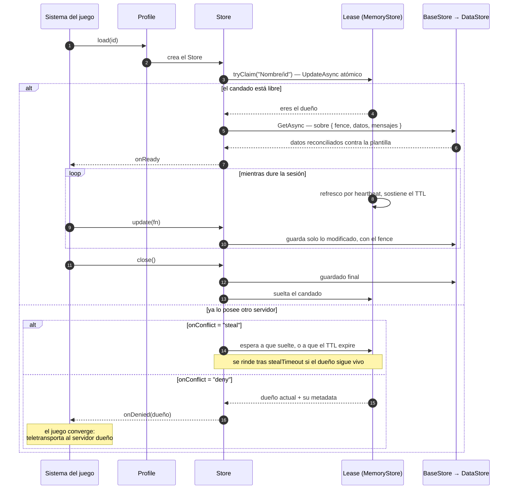
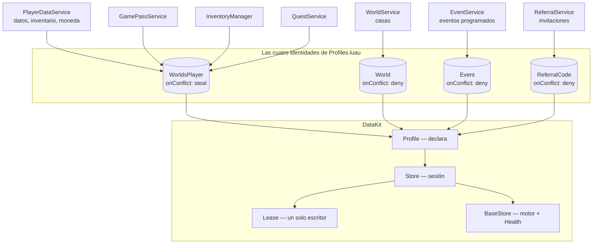

# DataKit — qué hace y quién lo usa

`DataKit` es el paquete que sostiene **casi toda** la persistencia de Voz Hispana. Vale la
pena entender qué problema resuelve y cómo, porque explica decisiones que aparecen por todo
el juego: por qué una casa «converge» en vez de robarse, por qué el pago de un cuadro llega
aunque el vendedor esté desconectado, y por qué el perfil de un jugador nunca se duplica al
saltar de servidor.

:::info Su documentación detallada vive aparte

`DataKit` es un paquete externo con **su propio sitio de documentación**:

### 📘 [arclyne.github.io/data-kit](https://arclyne.github.io/data-kit/)

Ese es el sitio canónico, escrito por sus autores, con el contrato de cada función. En
**este** repositorio está copiado al árbol, no traído por un gestor de paquetes: no hay ningún
`wally.toml`, así que actualizarlo es manual. Ver
[Librerías de terceros](./third-party.md). Sus
trece clases aparecen además en la [Referencia de API](/api/DataKit) de este sitio, porque
las anotaciones viajan con el código y Moonwave las extrae — pero **la fuente es la de
arriba**.

Esta página explica otra cosa: **para qué lo usa Voz Hispana y cómo encaja** con el resto
del juego. Para la firma exacta de un método, ve a su sitio.

:::

## El problema que resuelve

**El problema es el mismo en los cuatro casos: dos servidores queriendo escribir lo mismo.**

Roblox reparte a los jugadores entre muchos servidores, y todos ven el mismo DataStore. Sin
coordinación, dos servidores que carguen el perfil de un jugador y lo guarden acaban
pisándose: gana el último que escriba, y lo que hizo el otro desaparece. Con moneda de por
medio, eso además **duplica valor**.

DataKit resuelve eso con dos piezas que trabajan juntas:

| Pieza | Qué garantiza |
|---|---|
| [`Lease`](/api/Lease) | **Un solo servidor posee una identidad a la vez.** Un candado en MemoryStore con TTL |
| El *fence* durable | **Un escritor caducado no puede escribir.** Un número dentro del propio dato guardado |

El lease sirve para coordinar en vivo; el fence es la red de seguridad para cuando el lease
miente —porque el dueño se congeló, por ejemplo— y evita que una escritura tardía revierta
la del dueño nuevo.

## Cómo funciona

**El TTL es la clave del diseño.** Si un servidor se cae, no hay que detectarlo: su clave de
MemoryStore expira sola y otro puede reclamarla. No hace falta comparar relojes entre
servidores, que es donde este tipo de sistemas suele fallar.

### Las dos políticas de conflicto

Es la decisión de diseño con más consecuencias visibles en el juego, y la documentación de
`Store` la explica en sus propios términos:

| Política | Qué hace | Para qué |
|---|---|---|
| `"steal"` | Espera a que el dueño suelte, o a que su TTL expire tras un crash, y entonces reclama | **Identidades que se mueven.** Un jugador saltando de servidor: la sesión vieja está muerta, tomar el relevo es seguro |
| `"deny"` | Cede de inmediato, avisa con `onDenied` y **no carga** | **Lugares vivos compartidos.** Una casa hospedada con gente dentro no se roba: el aspirante *converge* |

Eso es exactamente lo que produce el comportamiento que documenta
[Servidores reservados](./reserved-servers.md): cuando dos jugadores intentan abrir la misma
casa a la vez, el segundo no la roba — recibe la dirección del primero y teletransporta a
sus jugadores allí.

### El lease es también un directorio

**HECHO.** Un detalle que se usa mucho en este juego: el valor publicado en el candado es
`{ owner, meta }`, y esa `meta` viaja y caduca **junto con el candado**.

Eso convierte al lease en un **directorio en vivo**: quién hospeda una identidad y cómo
llegar hasta ella (`placeId`, `accessCode`, jugadores dentro). `Lease.peek` lo consulta sin
efectos.

Es el motivo de que las casas no necesiten un registro aparte de «qué servidor hospeda qué»,
y de que no exista el problema de las referencias obsoletas: **la alcanzabilidad es el
candado, y la vida es su TTL**. Ver
[Casas → Ciclo de vida del servidor](../systems/housing/server-lifecycle.md).

### El buzón de mensajes

**HECHO.** El sobre durable guarda, junto a los datos, una **cola de mensajes** para esa
identidad. Quien posea el store los recibe por `onDelivered`, y la entrega es idempotente:
un mensaje se entrega una vez, aunque el receptor no estuviera conectado cuando se envió.

Es lo que hace funcionar el pago de una venta de cuadro con el vendedor ausente
([Cuadros](../systems/paint.md#la-venta)) y las recompensas de invitación
([Invitaciones](../systems/referrals.md)).

## Quién lo usa, y para qué

**HECHO.** `Profiles.luau` declara las cuatro identidades del juego, y de ahí cuelga todo:

| Identidad | Clave | Política | Quién la usa |
|---|---|---|---|
| `WorldsPlayer` | `tostring(userId)` | `"steal"` | `PlayerDataService`, y a través de él `InventoryManager`, `GamePassService`, `QuestService`, `Stores` |
| `World` | `"{userId}_{room}"` | `"deny"` | `WorldService`, `PlayerWorld_Init`, `WorldDataReplicator` |
| `Event` | id del evento | `"deny"` | `EventService` |
| `ReferralCode` | el código en mayúsculas | `"deny"` | `ReferralService` |

**HECHO.** `WorldsPlayer` declara además `maxMessages = 2000` y un manejador `onMessage`;
`World` declara una proyección `card` —`{ name, ownerId, serverType }`— que el navegador de
casas lee **sin cargar el perfil entero**.

## Lo que DataKit no cubre

**HECHO.** Dos módulos llaman a `DataStoreService` directamente, y los dos tienen motivo:

| Módulo | Por qué |
|---|---|
| `GiftInbox` | El lease es de un solo escritor, y regalar es escribir sobre la identidad de **otro** jugador, que puede estar desconectado |
| `GlobalDataStore` | Necesita `OrderedDataStore` con paginación para las listas de valoración, que DataKit no expone |

Está desarrollado en [Persistencia fuera de DataKit](../systems/global-storage.md).

## Qué mirar antes de tocar nada

| Si vas a… | Lee primero |
|---|---|
| Añadir una identidad persistente | `Profiles.luau`, y decide su `onConflict` con la tabla de arriba |
| Escribir en los datos de otro jugador | No uses un `Store`: mira cómo lo hace `GiftInbox` |
| Saltarte `Store` y usar `BaseStore` | Su propia documentación lo desaconseja explícitamente: es la capa que **no** garantiza un solo escritor |
| Cambiar `onConflict` de `World` a `"steal"` | Romperías la convergencia de casas descrita en [Servidores reservados](./reserved-servers.md) |

## Implementación relacionada

| Aspecto | Código |
|---|---|
| Las cuatro identidades | `Core/ServerStorage/WorldSystem/Profiles.luau` — [Profiles](/api/Profiles) |
| Documentación canónica del paquete | [arclyne.github.io/data-kit](https://arclyne.github.io/data-kit/) |
| Fachada y superficie pública | `Core/ServerStorage/DataKit/init.luau` — [DataKit](/api/DataKit) |
| Sesión y ciclo de vida | [Store](/api/Store) |
| Candado y directorio | [Lease](/api/Lease) |
| Motor, salud y reintentos | [BaseStore](/api/BaseStore), [Health](/api/Health) |
| Uso desde el juego | [PlayerDataService](/api/PlayerDataService), `WorldService.luau`, `EventService.luau`, `ReferralService.luau` |
