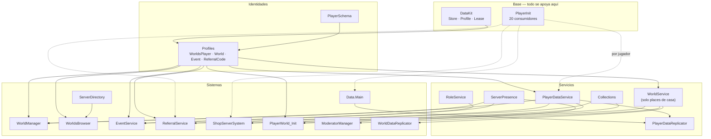

# Dependencias entre sistemas

Quién depende de quién, medido sobre los `require` reales del repositorio y no dibujado de
memoria. Cubre los sistemas leídos de punta a punta; los ~480 archivos de juego sin revisar
quedan fuera, y se dice dónde.

## Los cimientos

**HECHO.** Cinco módulos concentran las dependencias del lado servidor. Número de archivos
que hacen `require` de cada uno:

| Módulo | Consumidores | Qué es |
|---|---|---|
| [`PlayerInit`](/api/PlayerInit) | **20** | Reparto de `PlayerAdded` |
| `PlayerDataService` | 10 | Registro de `Store` por jugador |
| `Profiles` | 7 | Declaración de las cuatro identidades |
| `Collections` | 6 | Moneda |
| `HousesInfo` | 5 | Catálogo de casas |
| `DataKit` | 4 | El paquete de persistencia |
| `WorldService` | 4 | El store de la casa |
| [`ServerPresence`](/api/ServerPresence) | 3 | Directorio de servidores |
| `RolesInfo` | 3 | Escala de roles de casa |
| `RoleService` | 2 | Roles de administración por grupo de Roblox |
| `PlayerSchema` | 2 | Plantilla del perfil |
| `EventService` | 2 | Eventos |
| `ReferralService` | 1 | Invitaciones |
| `InitAfterTemplates` | 1 | Barrera de arranque |

**INFERENCIA.** `PlayerInit` es, con diferencia, el punto de acoplamiento más ancho del
proyecto: uno de cada veintisiete archivos `.luau` lo requiere. Cambiar su contrato —el
orden, la semántica de repetición, el manejo de errores— afectaría a veinte sistemas
independientes que no se conocen entre sí. Ver
[Ciclo de vida del jugador](./player-lifecycle.md).

## El grafo



**HECHO.** `PlayerDataReplicator` (el módulo de `WorldSystem`) tiene **un solo** consumidor:
`Core/ServerScriptService/Data/Main/init.server.luau`, que además es quien le inyecta
`KaraokeFactory` y quien llama a `hydrate`, `markReady` y `setExitSequence`.

**INFERENCIA.** `Data.Main` es por tanto el orquestador real del arranque de datos de un
jugador, aunque su nombre no lo sugiera y no aparezca en ninguna otra lista de
dependencias. No se ha leído entero; es la pieza más importante que queda pendiente.

## Direcciones que no existen

Tan informativo como el grafo es lo que **no** aparece en él. **HECHO**, verificado por
ausencia de `require`:

| No existe | Consecuencia |
|---|---|
| Nada requiere `WorldManager`, `WorldsBrowser` ni `ServerDirectory` | Son hojas: se comunican por remotes y por un `BindableFunction`, no por `require`. Se pueden cambiar sin romper importaciones. |
| `ServerDirectory` ↔ `WorldsBrowser` | El único enlace es el `BindableFunction` `GetOwnerServers`, deliberadamente, porque la caché de conteos vive solo en memoria de `ServerDirectory`. |
| Ningún sistema de juego requiere `WorldService` | Es exclusivo del place de casa. Los tres consumidores están todos en `PlayerHouses`, más `Shared/Stores/HouseAdded.luau`. |
| Ninguna dependencia circular entre los sistemas revisados | El grafo de arriba es acíclico. |

**INFERENCIA.** El acoplamiento entre sistemas es **casi todo por datos y por remotes**, no
por importación. Eso es lo que hace posible que 104 scripts se distribuyan desactivados y se
enciendan en orden indeterminado sin que el resultado sea un desastre: la mayoría no se
conocen entre sí.

## Acoplamientos frágiles

Los que no aparecen en el grafo porque no son `require`. **HECHO** en todos los casos:

| Acoplamiento | Entre | Cómo |
|---|---|---|
| `DataComplete` | `PlayerDataReplicator` ↔ `RevisarCanciones`, `ComprasTablero` | Por **nombre de campo**, por inyección: `.DataBase.DataComplete`. El comentario del código dice que el nombre está congelado por eso. |
| `KaraokeFactory` | `Data.Main` → `PlayerDataReplicator` | Inyección de una fábrica en un campo del módulo |
| `GetOwnerServers` | `WorldsBrowser` → `ServerDirectory` | `BindableFunction` en `ServerStorage.WorldSystem` |
| `ServerInfo.status` | `PlayerWorld_Init` → `ModeratorManager`, `WorldDataReplicator` | Atributo de una `Configuration` replicada, observado con `GetAttributeChangedSignal` |
| `IsInEvent` | Cualquier UI de cliente → `LocalScript` de `StarterGui` | Atributos con nombre libre sobre una `Configuration` |
| `leaderstats` | `Collections` ↔ `PlayerDataReplicator` | Por **nombre de `Instance`**, vía la tabla `SPEC` |

**INFERENCIA — el patrón y su coste.** Este proyecto prefiere sistemáticamente el
acoplamiento por nombre (de campo, de atributo, de `Instance`) al acoplamiento por
importación. Eso le da la flexibilidad que necesita —los scripts se importan en tiempo de
ejecución y se activan en orden indeterminado— pero significa que **un buscador de
referencias no encuentra estas relaciones**. Renombrar `DataComplete` compila
perfectamente y rompe dos sistemas.

El propio código es consciente en al menos un caso, y lo documenta:

```lua
-- Registro de estado por jugador. Conserva el nombre `DataComplete` porque
-- RevisarCanciones y ComprasTablero lo leen por inyeccion (.DataBase.DataComplete).
```

## Dependencias con la infraestructura de Roblox

**HECHO.** Qué sistema depende de qué servicio externo, y qué pasa si ese servicio falla:

| Servicio | Lo usan | Ante un fallo |
|---|---|---|
| `DataStoreService` | `DataKit` (y `GlobalDataStore`, `GiftInbox`, sin revisar) | `Store` reintenta con backoff acotado; [`Health`](/api/Health) abre el circuito a los 5 fallos en 120 s |
| `MemoryStoreService` | `ServerPresence`, `DataKit.Lease`, `ServerDirectory`, `EventService` | Los cuatro distinguen throttle de fallo y pausan 60 s ante un throttle |
| `MessagingService` | `ServerPresence`, `ServerDirectory`, `DataKit`, y otros | Best-effort: un mensaje perdido degrada la frescura, no la corrección |
| `TeleportService` | `WorldManager`, `EventService`, `PlayerWorld_Init` | 3 reintentos con 0,5 s; devuelve un motivo al cliente |
| `GroupService` | `RoleService` | **Falla cerrado**: sin roles, no con todos |
| `VoiceChatService` | `ImportTemplates`, `ReferralService` | **Falla abierto** en el arranque ([BUG-CANDIDATE-001](../testing/verification-plan.md#bug-candidate-001)) |
| `TextService` | `WorldDataReplicator` | **Falla abierto**: conserva el nombre saneado sin filtrar |
| `HttpService` | `WorldsBrowser` | Devuelve lista vacía; indistinguible de «sin resultados» |

**INFERENCIA — la incoherencia que salta a la vista.** Tres servicios que gobiernan
admisión o moderación fallan en direcciones distintas: `GroupService` cerrado,
`VoiceChatService` abierto, `TextService` abierto. La dirección correcta depende del caso,
pero conviene que sea una decisión y no un accidente; hoy no hay nada que indique que se
eligió deliberadamente en los tres.

## Qué falta en este grafo

| Ausente | Motivo |
|---|---|
| Los ~480 archivos de juego | Sin revisar. `Interactable` es el módulo más requerido de todo el repositorio (37 consumidores) y no está analizado. |
| `Data.Main` | El orquestador real del arranque de datos. Único consumidor de `PlayerDataReplicator`. Sin leer entero. |
| `Shared/Stores` | 13 manejadores de remote en un solo archivo, el máximo del repositorio. Requiere `HousesInfo` y `WorldService`. |
| `GlobalDataStore`, `GiftInbox` | Usan `DataStoreService` fuera de `DataKit` |
| Las plantillas publicadas | Este repositorio solo tiene los overrides locales |
