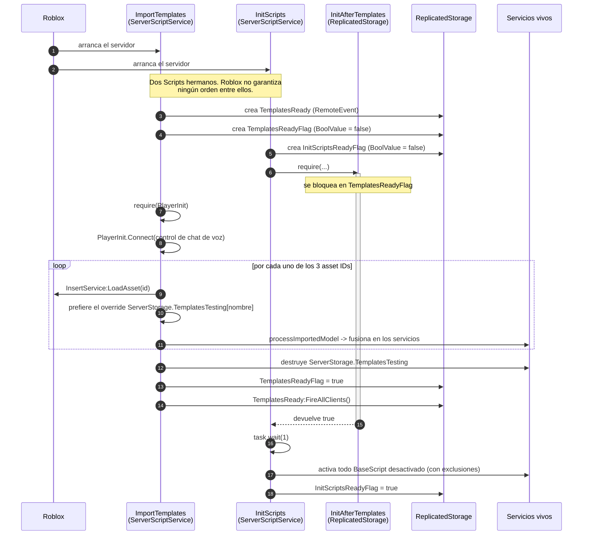
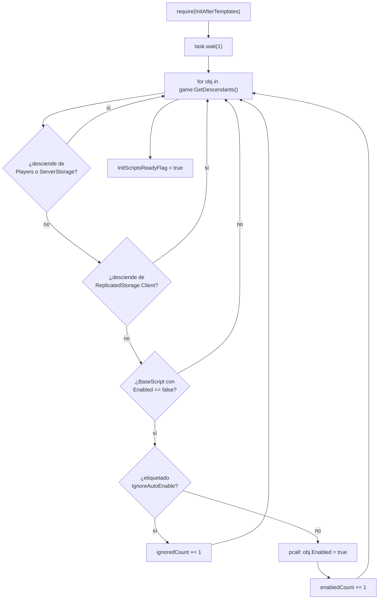

# Inicialización

Esta página describe cómo un servidor de Voz Hispana se ensambla a sí mismo, desde un
DataModel casi vacío hasta un juego en marcha. Es la página más importante del sitio,
porque sin ella nada del resto del código tiene sentido.

## La versión corta

Casi nada de lo que corre en Voz Hispana está en el árbol `src/` de este repositorio en
el sitio donde acabará viviendo. En ejecución, un servidor:

1. descarga tres assets de *plantilla* de Roblox con `InsertService:LoadAsset`,
2. fusiona su contenido dentro de los servicios vivos (`ReplicatedStorage`,
   `ServerScriptService`, `StarterGui`, …),
3. y solo entonces activa los scripts que han llegado, que se distribuyen desactivados.

Todo lo demás —inicialización del jugador, sistema de mundos, casas— ocurre después.

## Los cuatro archivos de arranque

**HECHO.** Solo cuatro archivos participan en el arranque, y son el único Luau del
repositorio fuera de las carpetas de plantillas:

| Archivo | Tipo | Papel |
|---|---|---|
| `src/ServerScriptService/ImportTemplates.server.luau` | `Script` | Importa y fusiona las plantillas |
| `src/ServerScriptService/InitScripts.server.luau` | `Script` | Activa los scripts importados |
| `src/ReplicatedStorage/InitAfterTemplates.luau` | `ModuleScript` | Barrera bloqueante «plantillas listas» |
| `src/ReplicatedStorage/PlayerInit.luau` | `ModuleScript` | Reparto diferido de `PlayerAdded` |

Ambos `Script` llevan la etiqueta `IgnoreLoader` en su `.meta.json`. **INFERENCIA:** la
etiqueta existe para que algún cargador los omita; nada en este repositorio lee
`IgnoreLoader`, así que su consumidor está en un asset de plantilla o no existe.

## Secuencia de arranque



### Implementación relacionada

| Paso | Código |
|---|---|
| IDs de los assets | `ImportTemplates.server.luau`, `TEMPLATES_IDS` |
| Búsqueda de override | `ImportTemplates.server.luau`, `testOverrides` |
| Fusión en servicios | `ImportTemplates.server.luau`, `processImportedModel` / `mergeInstances` |
| Barrera de disponibilidad | `InitAfterTemplates.luau` |
| Activación de scripts | `InitScripts.server.luau` |
| Reparto por jugador | [`PlayerInit`](/api/PlayerInit) |

## Paso 1 — Importación de plantillas

**HECHO.** `ImportTemplates.server.luau` declara tres asset IDs, en orden fijo, con un
comentario explícito de que el primero debe seguir siendo el primero:

```lua
local TEMPLATES_IDS = {
    137484964666215, -- CORE (siempre el primero)
    92258948630058,  -- GameWorlds
    94091855508048   -- BuildingSystem
}
```

Para cada ID llama a `InsertService:LoadAsset(assetId)` dentro de un `pcall`, toma el
primer hijo del modelo devuelto, y entonces elige entre dos fuentes:

- si `ServerStorage.TemplatesTesting` contiene un `Folder` o `Model` **con el mismo
  nombre**, se clona esa copia local y se usa en su lugar, destruyendo la descargada;
- si no, se usa la descargada.

**Esto es por lo que el repositorio tiene la forma que tiene.**
`src/ServerStorage/TemplatesTesting/Core/…` es un override local del asset `Core`
publicado. No es donde ese código vive en ejecución: en ejecución, el contenido de su
subcarpeta `ReplicatedStorage` son hijos del `ReplicatedStorage` real.

Así, una ruta como:

```
src/ServerStorage/TemplatesTesting/Core/ServerStorage/WorldSystem/Profiles.luau
```

es, en ejecución:

```
ServerStorage.WorldSystem.Profiles
```

que es exactamente como la piden otros scripts:

```lua
local worldSystemStorage = ServerStorage:WaitForChild("WorldSystem")
local Profiles = require(worldSystemStorage:WaitForChild("Profiles"))
```

### Qué servicios pueden recibir contenido

**HECHO.** Solo se fusionan las carpetas cuyo nombre esté en `validServices`; cualquier
otra cosa en la raíz de una plantilla se ignora:

```
ReplicatedFirst, StarterGui, ServerScriptService, ReplicatedStorage, ServerStorage,
StarterPack, StarterPlayer, SoundService, Lighting, MaterialService
```

### Semántica de la fusión

**HECHO.** `mergeInstances(source, target)` recorre los hijos del origen:

| Caso | Comportamiento |
|---|---|
| El destino no tiene hijo con ese nombre | La instancia se reparenta al destino |
| El destino tiene un hijo con ese nombre, **mismo** `ClassName` | Se recurre dentro, y luego se destruye la instancia entrante |
| El destino tiene un hijo con ese nombre, `ClassName` **distinto** | La instancia entrante se destruye, en silencio |

**INFERENCIA.** La instancia existente siempre gana. Como `Core` se importa primero,
`Core` gana toda colisión de nombre frente a `GameWorlds` y `BuildingSystem`. Eso es lo
que compra el «CORE (siempre el primero)».

**Nótese la asimetría:** una colisión de misma clase fusiona los *hijos* pero conserva la
instancia existente. Para un `Folder` eso es una unión. Para un `ModuleScript` o un
`Script`, el código fuente entrante se descarta: se conserva el existente y se destruye
el nuevo.

### Limpieza

**HECHO.** Tras el bucle, se elimina la carpeta de overrides entera:

```lua
local folderTest = ServerStorage:FindFirstChild("TemplatesTesting")
if folderTest then
    folderTest:Destroy()
    Debris:AddItem(folderTest)
end
```

**OBSERVACIÓN.** `Destroy()` seguido de `Debris:AddItem()` sobre la misma instancia ya
destruida es redundante, no dañino. Queda registrado solo como observación; no es un
defecto y no requiere ningún cambio.

## Paso 2 — La barrera de disponibilidad

**HECHO.** `InitAfterTemplates` es un `ModuleScript` que **se bloquea hasta que las
plantillas están listas y entonces devuelve `true`**. Pedirlo con `require` es la espera:

```lua
require(ReplicatedStorage:WaitForChild("InitAfterTemplates"))
```

Se resuelve distinto según el lado:

| Lado | Fuente de verdad |
|---|---|
| Servidor (`RunService:IsServer()`) | `TemplatesReadyFlag` (un `BoolValue`), leído ahora y vigilado con `.Changed` |
| Cliente | `TemplatesReady` (un `RemoteEvent`) vía `OnClientEvent`, **más** una lectura inmediata de `TemplatesReadyFlag` por si el evento ya se disparó |

Ambas ramas terminan en `repeat task.wait() until ready`.

Como Luau cachea el resultado de un `ModuleScript`, el bloqueo ocurre **una vez por
lado**; cada `require` posterior devuelve el `true` cacheado de inmediato.

## Paso 3 — Activación de los scripts importados

**HECHO.** Las plantillas traen sus scripts desactivados — 104 de los 170 `.meta.json`
del repositorio ponen `Disabled: true`. `InitScripts.server.luau` los enciende:



Tres exclusiones, todas **HECHO**:

1. **Se omiten los descendientes de `Players` y `ServerStorage`.** Los scripts dentro del
   `Backpack`/`PlayerGui` de un jugador, y cualquier cosa que quede en `ServerStorage`,
   se dejan como están.
2. **Se omiten los descendientes de `ReplicatedStorage.Client`.** Esa carpeta contiene
   scripts con `RunContext = "Client"`; el servidor no los activa.
3. **Se omite y se cuenta todo lo etiquetado `IgnoreAutoEnable`.** Cuatro scripts del
   repositorio llevan esa etiqueta.

**HECHO.** El `task.wait(1)` entre la barrera y el barrido es incondicional y no está
explicado en el código.

## Cómo leer bien este repositorio

Dos convenciones del repositorio despistarán a quien asuma la práctica habitual de
Roblox.

### El sufijo `.server.luau` no significa «servidor»

**HECHO.** Rojo deriva la clase de un script del sufijo del archivo, pero `RunContext` en
un `.meta.json` hermano manda sobre dónde corre realmente. En este repositorio
`RunContext` está puesto explícitamente en 74 scripts: **47 `Server` y 27 `Client`**.

Todo archivo bajo `Core/ReplicatedStorage/Client/` llamado `*.server.luau` es un `Script`
**de contexto cliente**. Por ejemplo,
`Core/ReplicatedStorage/Client/PlayerManager.server.luau` usa `Players.LocalPlayer` y su
`.meta.json` dice `"RunContext": "Client"`.

> **Lee siempre el `.meta.json` hermano antes de concluir dónde corre un script.**

### La ubicación de un archivo no es su ubicación en ejecución

Ya cubierto arriba: todo lo que está bajo `TemplatesTesting/<Plantilla>/<Servicio>/`
acaba bajo `<Servicio>` en ejecución.

## Garantías de orden

**HECHO.** `ImportTemplates` e `InitScripts` son `Script` hermanos en
`ServerScriptService`. Roblox no define un orden de ejecución entre scripts hermanos.

**INFERENCIA.** El diseño no depende de uno. `InitScripts` se bloquea en
`InitAfterTemplates`, que se bloquea en un `BoolValue` que `ImportTemplates` pone al
final. Arranque quien arranque primero, `InitScripts` no puede pasar de la barrera hasta
que `ImportTemplates` haya terminado. De forma parecida, `InitAfterTemplates` usa
`WaitForChild` para `TemplatesReady`/`TemplatesReadyFlag`, así que tolera que se le
requiera antes de que `ImportTemplates` los haya creado.

**TEORÍA — no verificada.** Hay un orden que la barrera no cubre. El `BoolValue`
`TemplatesReadyFlag` lo crea `ImportTemplates`, pero `InitScripts` crea
`InitScriptsReadyFlag` por su cuenta y los scripts de plantilla esperan a *ese*. Lo que
no queda cubierto es un script de plantilla que empiece a correr en cuanto se le activa y
lea estado que otro script activado *más tarde* debía publicar; el orden del barrido
sobre `game:GetDescendants()` no está definido por el código. Queda registrado, no
afirmado.

## Dos flags y un remote

**HECHO.** El arranque publica tres instancias en `ReplicatedStorage`:

| Nombre | Clase | Lo crea | Significado |
|---|---|---|---|
| `TemplatesReady` | `RemoteEvent` | `ImportTemplates` | Se dispara a todos los clientes cuando las plantillas están fusionadas |
| `TemplatesReadyFlag` | `BoolValue` | `ImportTemplates` | Fuente de verdad del mismo hecho, en el servidor |
| `InitScriptsReadyFlag` | `BoolValue` | `InitScripts` | Se pone cuando el barrido de activación ha terminado |

`InitScriptsReadyFlag` se lee fuera del arranque: `playerManager.server.luau` rechaza
`LoadCharacterRequest` mientras sea falso. Ver
[Ciclo de vida del jugador](./player-lifecycle.md).

## El control de chat de voz

**HECHO.** `ImportTemplates.server.luau` registra además el requisito de entrada al
juego, antes de importar nada:

```lua
PlayerInit.Connect(onPlayerAdded)
```

Para cada jugador llama a `VoiceChatService:IsVoiceEnabledForUserIdAsync(player.UserId)`
dentro de un `pcall`:

- la llamada tuvo éxito **y** la voz está desactivada → se expulsa al jugador;
- la llamada tuvo éxito y la voz está activada → no pasa nada;
- la llamada **falló** → solo `warn`, el jugador se queda.

El comentario del código en la rama de fallo dice *«quizas conviene que le hagamos kick
tambien»*, así que la tercera rama es una decisión abierta y conocida, no un descuido.
Registrado como
[BUG-CANDIDATE-001](../testing/verification-plan.md#bug-candidate-001).

## Lo que no se puede saber desde este repositorio

| | |
|---|---|
| **DESCONOCIDO** | Si el contenido publicado de los assets `137484964666215`, `92258948630058` y `94091855508048` coincide con `TemplatesTesting/Core`, `/GameWorlds` y `/BuildingSystem` en disco. El override solo aplica cuando existe una carpeta local con el mismo nombre; en producción manda el asset publicado. |
| **DESCONOCIDO** | Dónde se importa `PlayerHouses`. Existe bajo `TemplatesTesting/` pero ningún asset ID de `TEMPLATES_IDS` está comentado como tal, y `PlayerHouses` no es ninguno de los tres. Ver [Casas](../systems/housing/overview.md). |
| **DESCONOCIDO** | Qué hay dentro de `src/StarterPlayer/StarterPlayerScripts.rbxm` y `StarterCharacterScripts.rbxm`. Binarios. Ver [Ciclo de vida del cliente](./client-lifecycle.md). |
| **OBSERVACIÓN** | `default.project.json` mapea `StarterPack` a `src/StarterPack`, que no existe en el repositorio. |
