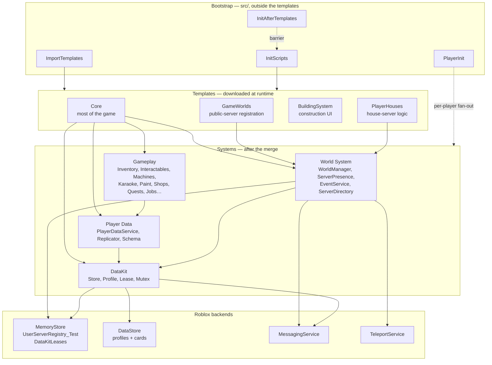

# Architecture overview

## What Voz Hispana is

Voz Hispana is a Spanish-language Roblox social game, **voice-chat only** — a player
without voice chat enabled is kicked on join. It spans **several Roblox places**: a lobby,
a karaoke place, an arcade club, a donation place, and one place per house design, each of
which runs as a private reserved server.

## The five structural facts

Everything else follows from these. Each is established directly from source, and each is
counter-intuitive enough that missing it will cause a reader to misread the codebase.

### 1. The game is assembled at runtime from downloaded templates

`ImportTemplates.server.luau` downloads three Roblox assets with
`InsertService:LoadAsset` and merges them into the live services. What is committed under
`src/ServerStorage/TemplatesTesting/` are **local overrides** of those assets, not their
runtime locations.

→ [Initialization](./initialization.md)

### 2. Most scripts ship disabled

104 of 170 `.meta.json` files set `Disabled: true`. `InitScripts.server.luau` enables the
server-side ones after the import completes. The client-side ones are excluded from that
sweep, and **nothing in this repository enables them** — the loader that does is not
inspectable.

→ [Client lifecycle](./client-lifecycle.md)

### 3. A file's name and path lie about where it runs

`RunContext` in a sibling `.meta.json` beats the `.server.luau` / `.client.luau` suffix
(47 scripts are forced to `Server`, 27 to `Client`), and the template import moves
everything out of `TemplatesTesting/` into real services. Read the `.meta.json`.

### 4. There is no central bootstrap for players

Systems register independently through [`PlayerInit`](/api/PlayerInit) and initialise
concurrently. There is no `PlayerReady` signal, no dependency graph, and no ordering
guarantee between them.

→ [Player lifecycle](./player-lifecycle.md)

### 5. World identity is a distributed lease, not a stored mapping

There is no persisted `HouseId → ServerCode` table that could go stale. A house's
reachability *is* a MemoryStore lease with a 120-second TTL, refreshed by the server that
holds it. When that server dies, the entry expires on its own.

→ [Reserved servers](./reserved-servers.md)

## The layers

## Server kinds

| Kind | Identified by | Registers as | Entered by |
|---|---|---|---|
| Public place | `game.PrivateServerId == ""` | `"{PlaceId}_{JobId}"`, `hostingType = "default"` | `ServerInstanceId` |
| Player house | `TeleportData.key` on the first joiner | `"{UserId}_{roomName}"`, `hostingType = "room"` | `ReservedServerAccessCode` |
| Event | registry entry | event key, `hostingType = "event"` | `ReservedServerAccessCode` |

→ [Server lifecycle](./server-lifecycle.md)

## The two directories

A recurring source of confusion, so it is worth stating once, prominently: there are
**two** MemoryStore-backed registries with different jobs.

| | `UserServerRegistry_Test` | `DataKitLeases` |
|---|---|---|
| Owned by | [`ServerPresence`](/api/ServerPresence) | `DataKit.Lease` |
| Answers | *"what servers exist, who is in them"* | *"who owns this world's data, and how do I reach them"* |
| Used for | browsing, server lists, friend/most-played queries | reservation decisions, host resolution |

→ [Reserved servers](./reserved-servers.md)

## Persistence in one paragraph

All durable state goes through **`DataKit`**, a wally-installed package vendored at
`Core/ServerStorage/DataKit`. It layers a single-writer distributed lease over a DataStore
so that exactly one server may write an identity at a time; adds autosave, a durable
message inbox for cross-server mutations of offline identities, and "cards" — small
projections a lobby can read without loading the full record. `Profiles.luau` declares the
four identities the game uses: `WorldsPlayer`, `World`, `Event` and `ReferralCode`.

→ [Persistence](./persistence.md)

## Where the documentation is incomplete

Stated up front rather than discovered later:

| Gap | Consequence |
|---|---|
| 320 `.rbxm` binaries are unreadable | The client entry point, all UI, all tools and all models are outside what can be documented from source. |
| `PlayerHouses` is not in `TEMPLATES_IDS` | How the house template reaches a house place is unproven. |
| The three template asset IDs may differ from the on-disk overrides | Only the local overrides can be read; the published assets are authoritative in production. |
| ~200 gameplay remotes not yet reviewed | The security assessment in [Networking](./networking.md) covers only the paths read end-to-end. |

Current status and what remains is tracked in `DOCS_PROGRESS.md` at the repository root.
