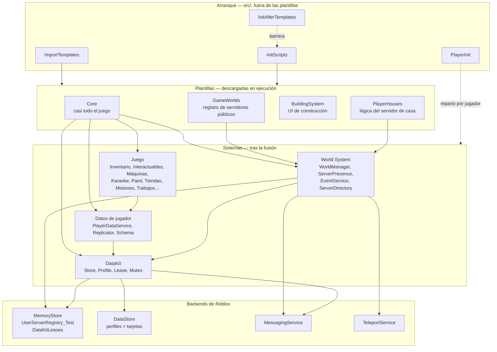

# Resumen de la arquitectura

## Qué es Voz Hispana

Voz Hispana es un juego social de Roblox en español, **exclusivo de chat de voz**: a un
jugador sin chat de voz activado se le expulsa al entrar. Abarca **varios places de
Roblox**: un lobby, un place de karaoke, un club arcade, un place de donaciones, y un
place por cada diseño de casa, cada uno de los cuales corre como servidor reservado
privado.

## Los cinco hechos estructurales

Todo lo demás se deriva de estos. Cada uno está establecido directamente desde el código,
y cada uno es lo bastante contraintuitivo como para que pasarlo por alto lleve a leer mal
el proyecto.

### 1. El juego se ensambla en tiempo de ejecución a partir de plantillas descargadas

`ImportTemplates.server.luau` descarga tres assets de Roblox con
`InsertService:LoadAsset` y los fusiona dentro de los servicios vivos. Lo versionado bajo
`src/ServerStorage/TemplatesTesting/` son **overrides locales** de esos assets, no sus
ubicaciones en ejecución.

→ [Inicialización](./initialization.md)

### 2. La mayoría de los scripts se distribuyen desactivados

104 de 170 archivos `.meta.json` ponen `Disabled: true`. `InitScripts.server.luau`
enciende los del lado servidor cuando la importación termina. Los del lado cliente quedan
excluidos de ese barrido, y **nada en este repositorio los enciende** — el cargador que
lo hace no es inspeccionable.

→ [Ciclo de vida del cliente](./client-lifecycle.md)

### 3. El nombre y la ruta de un archivo mienten sobre dónde corre

`RunContext` en el `.meta.json` hermano gana al sufijo `.server.luau` / `.client.luau`
(47 scripts forzados a `Server`, 27 a `Client`), y la importación de plantillas saca todo
de `TemplatesTesting/` hacia servicios reales. Hay que leer el `.meta.json`.

### 4. No hay bootstrap central para los jugadores

Los sistemas se registran de forma independiente a través de
[`PlayerInit`](/api/PlayerInit) y se inicializan concurrentemente. No hay señal
`PlayerReady`, ni grafo de dependencias, ni garantía de orden entre ellos.

→ [Ciclo de vida del jugador](./player-lifecycle.md)

### 5. La identidad de un mundo es un lease distribuido, no un mapeo guardado

No existe una tabla persistida `HouseId → ServerCode` que pueda quedarse obsoleta. La
alcanzabilidad de una casa **es** un lease en MemoryStore con un TTL de 120 segundos, que
refresca el servidor que lo posee. Cuando ese servidor muere, la entrada expira sola.

→ [Servidores reservados](./reserved-servers.md)

## Las capas

## Tipos de servidor

| Tipo | Identificado por | Se registra como | Se entra con |
|---|---|---|---|
| Place público | `game.PrivateServerId == ""` | `"{PlaceId}_{JobId}"`, `hostingType = "default"` | `ServerInstanceId` |
| Casa de jugador | `TeleportData.key` del primer jugador que llega | `"{UserId}_{roomName}"`, `hostingType = "room"` | `ReservedServerAccessCode` |
| Evento | entrada del registro | clave del evento, `hostingType = "event"` | `ReservedServerAccessCode` |

→ [Ciclo de vida del servidor](./server-lifecycle.md)

## Los dos directorios

Es una fuente recurrente de confusión, así que conviene decirlo una vez y bien visible:
hay **dos** registros respaldados por MemoryStore, con trabajos distintos.

| | `UserServerRegistry_Test` | `DataKitLeases` |
|---|---|---|
| Lo mantiene | [`ServerPresence`](/api/ServerPresence) | `DataKit.Lease` |
| Responde a | *«qué servidores existen y quién está dentro»* | *«quién posee los datos de este mundo y cómo llego»* |
| Se usa para | navegar, listas de servidores, consultas de amigos y más jugados | decisiones de reserva, resolución del anfitrión |

→ [Servidores reservados](./reserved-servers.md)

## La persistencia en un párrafo

Todo el estado duradero pasa por **`DataKit`**, un paquete instalado con wally y
vendorizado en `Core/ServerStorage/DataKit`. Superpone un lease distribuido de escritor
único sobre un DataStore, de forma que exactamente un servidor puede escribir una
identidad a la vez; añade autoguardado, un buzón durable de mensajes para mutaciones
entre servidores sobre identidades desconectadas, y «tarjetas» — proyecciones pequeñas
que un lobby puede leer sin cargar el registro completo. `Profiles.luau` declara las
cuatro identidades que usa el juego: `WorldsPlayer`, `World`, `Event` y `ReferralCode`.

→ [Persistencia](./persistence.md)

## Dónde está incompleta esta documentación

Se dice por delante, en vez de que se descubra después:

| Hueco | Consecuencia |
|---|---|
| 320 binarios `.rbxm` ilegibles | El punto de entrada del cliente, toda la UI, todas las herramientas y todos los modelos quedan fuera de lo documentable desde el código. |
| `PlayerHouses` no está en `TEMPLATES_IDS` | Cómo llega la plantilla de casas a un place de casa no está probado. |
| Los tres assets de plantilla pueden diferir de los overrides en disco | Solo se pueden leer los overrides locales; en producción manda el asset publicado. |
| ~200 remotes de juego sin revisar | La valoración de seguridad de [Red](./networking.md) cubre solo las rutas leídas de punta a punta. |

El estado actual y lo que queda se lleva en `DOCS_PROGRESS.md`, en la raíz del
repositorio.
