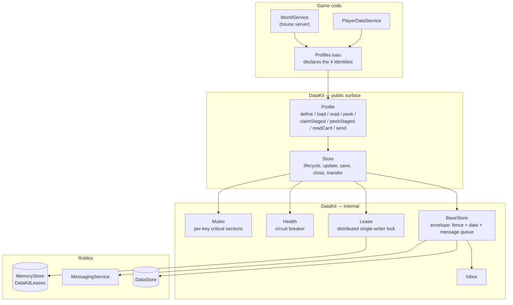
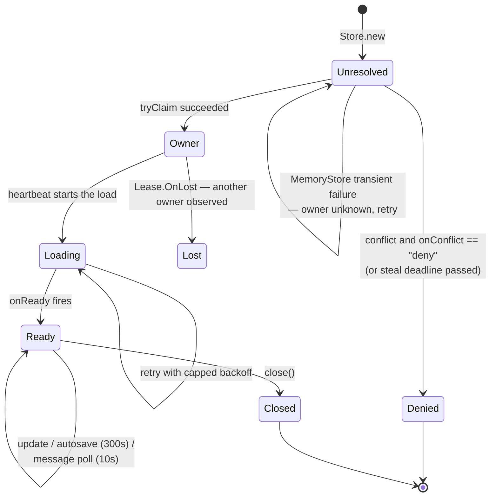

# Persistence

All durable state in Voz Hispana goes through **`DataKit`**, a package vendored at
`Core/ServerStorage/DataKit` (its own documentation describes it as installed with wally,
reached as `ServerStorage.Packages.DataKit`). It is the only layer that talks to
`DataStoreService`, and it is thoroughly documented in-source — this page explains what
the game does with it, and the API reference carries the details.

**FACT.** `DataStoreService` is referenced by 4 files, and two of them are `DataKit`'s own
adapters. The two outside it are `GlobalDataStore/init.luau` and
`WorldSystem/GiftInbox.luau`.

## The four identities

**FACT.** `Core/ServerStorage/WorldSystem/Profiles.luau` declares every profile the game
uses:

| Profile | Identity key | `onConflict` | Notes |
|---|---|---|---|
| `WorldsPlayer` | `tostring(userId)` | default (`"steal"`) | Player data. Template in `PlayerSchema.luau`. `maxMessages = 2000`, and an `onMessage` handler. |
| `World` | `"{userId}_{roomName}"` | `"deny"` | A house. Declares a `card` projection: `{ name, ownerId, serverType }`. |
| `Event` | event id | `"deny"` | Scheduled events. |
| `ReferralCode` | the code, upper-cased | `"deny"` | Maps an invite code to its owner. |

### Why the conflict policies differ

**FACT.** This is stated directly in `Store`'s class documentation, and the choice is
load-bearing:

| Policy | Meaning | Used for |
|---|---|---|
| `"steal"` | Wait for the current owner to release, or for its lease TTL to expire after a crash, then claim. Gives up after `stealTimeout` (150 s) if the owner is still alive. | **Identities that move.** A player hopping servers: the old session is dead, taking over is safe. |
| `"deny"` | Yield immediately, fire `onDenied` with the owner and its metadata, never load. | **Shared live places.** A hosted world with players inside is not stolen — the challenger *converges*, teleporting its players to the real owner. |

That is why `Profiles.World` uses `"deny"`, and why `PlayerWorld_Init` has a
`convergeToOwner` path. See [Reserved servers](./reserved-servers.md).

## The stack



## Single-writer by default

**FACT.** `Store.new` claims a [`Lease`](/api/Lease) on `"{Name}/{id}"` **before** loading,
unless `singleWriter = false`. The namespace prefix means two different profiles with the
same id do not share a lock.



**FACT.** The lease is more than a lock: its value is `{ owner, meta }`, and the `meta`
travels and expires with it. A house publishes
`{ placeId, jobId, accessCode }` there, which is how a lobby learns how to reach it —
`Lease.peek` is a directory lookup with no side effects.

**FACT — retry policy.** `_resolveOwnership` distinguishes three outcomes and treats them
differently. `owner == nil` means MemoryStore failed and says nothing about ownership, so
it is retried, never treated as a conflict. This is the same principle as
[`ServerPresence`](/api/ServerPresence)'s throttle handling.

## The durable envelope

**FACT.** `BaseStore` does not write raw data. It writes an envelope with three keys:

| Key | Purpose |
|---|---|
| `__dkFence` | A monotonic fence number, the durable guard against a stale writer committing |
| `__dkData` | The actual profile data |
| `__dkMsgs` | `{ seq, list }` — the message queue for this identity |

**FACT.** A record written before messages existed simply has no `__dkMsgs` and is read as
an empty queue, so there is no data migration. The source says so explicitly.

**INFERENCE.** The fence is what makes the lease safe rather than merely convenient. A
server that lost its lease during a MemoryStore outage cannot silently overwrite the new
owner's work, because the commit is fenced at the DataStore level. `Lease.start`'s
documentation relies on this: it re-claims an expired key "without interrupting the
session (writes stay protected by the durable fence)".

## Writing to an identity you do not own

**FACT.** `Store.send(name, id, message)` appends a message to the target identity's
queue **whether or not it is loaded anywhere**, including for a player who has never
joined. The consumer declares `onMessage(data, message)` in its profile options; returning
the data consumes the message in the same write that persists the mutation, and returning
`nil` leaves it for the next cycle.

**FACT.** The handler contract is documented and non-obvious:

> `onMessage` puede correr más de una vez sobre el mismo mensaje si falla un save … así que
> todo lo de aquí tiene que ser idempotente.

`Profiles.luau` honours this. `applyReferralCompleted` does not delete a completed
referral, it marks it `paid = true`, so a re-run adds nothing:

```lua
-- La red de seguridad contra el doble conteo: si esta entrada ya se cobro, no
-- se vuelve a sumar pase lo que pase.
if typeof(entry) == "table" and entry.paid then
    return data
end
```

**INFERENCE.** This is the mechanism behind cross-server effects on offline players:
referral credit, gifts, and the `paintSold` notification all arrive as messages rather
than as direct writes to someone else's record.

Message handling costs one MemoryStore read per live identity per `messagePoll`
(10 s default) — the source flags this and says to raise the interval when a server holds
many identities with handlers.

## Cards

**FACT.** A profile may declare a `card`: a projection into a separate, smaller DataStore
that can be read **without** loading the identity or taking its lock. `Profiles.World`
declares one:

```lua
card = {
    project = function(data)
        return {
            name = data.settings.Name,
            ownerId = data.settings.OwnerId,
            serverType = data.settings.ServerType,
        }
    end,
}
```

**INFERENCE.** This is what makes a house browser affordable. Listing 50 houses needs 50
card reads, not 50 full loads with 50 lease claims.

## When saves happen

**FACT.**

| Trigger | Mechanism |
|---|---|
| Autosave | `Store._heartbeat`, every `autosaveInterval` (300 s default). A failed autosave retries in 30 s rather than waiting a full interval. |
| After consuming a message | Saved immediately, so a crash cannot re-deliver a message that was already applied only in cache. |
| `store:close()` | Explicit. `WorldService.destroy()` calls it. |
| Server shutdown | `game:BindToClose` — 8 files bind it. |

**FACT.** `Store.save` takes a snapshot and clears the dirty flag **before** the async
write, so an `update` arriving mid-save is not lost. Concurrent saves are serialised
through a waiter queue.

**FACT.** `Store.transfer` moves value between two stores and guarantees the **source**
persists before the destination on every save and close. The source states the property
plainly: a crash mid-transfer can lose the value (recoverable) but can never duplicate it.

## Failure handling

**FACT.** [`Health`](/api/Health) is a per-store circuit breaker: 5 failures within a
sliding 120-second window flip the store to *critical*, exposed as
`Store.isCriticalState()` / `Store.onCriticalToggle()` and reflected in
`Store.canWrite()`.

**FACT — a limitation the source states about itself:**

> Sin scheduler propio, esto solo corre cuando algo lo dispara (isCritical o
> recordFailure) — por eso una ventana ya vencida puede seguir "activa" hasta la próxima
> llamada.

That is: a store that goes quiet after failing stays marked critical until something asks
again. Documented, deliberate, and worth knowing before reading `isCriticalState` as
live truth.

## Other persistence outside DataKit

**FACT.** Two modules use `DataStoreService` directly and are **not yet analysed**:

| Module | Note |
|---|---|
| `Core/ServerStorage/GlobalDataStore/init.luau` | 335 lines. Ships with `ReadMe.server.luau` and `Testeo_GlobalDataStore.luau`. |
| `Core/ServerStorage/WorldSystem/GiftInbox.luau` | 2.4 KB. Named like an inbox, but distinct from `DataKit.Inbox`. |

Whether these duplicate `DataKit`'s guarantees, or exist for a case it does not cover, is
an open question for Phase 3.

## Related implementation

| Concern | Code |
|---|---|
| Profile declarations | `Core/ServerStorage/WorldSystem/Profiles.luau` |
| Player data template | `Core/ServerStorage/WorldSystem/PlayerSchema.luau` |
| House store wrapper | `PlayerHouses/ServerScriptService/WorldService.luau` |
| Player data service | `Core/ServerStorage/WorldSystem/PlayerDataService.luau` |
| Replication to client | `Core/ServerStorage/WorldSystem/PlayerDataReplicator.luau` |
| The package itself | `Core/ServerStorage/DataKit/` — [`Store`](/api/Store), [`Profile`](/api/Profile), [`Lease`](/api/Lease), [`Health`](/api/Health), [`Mutex`](/api/Mutex) |
