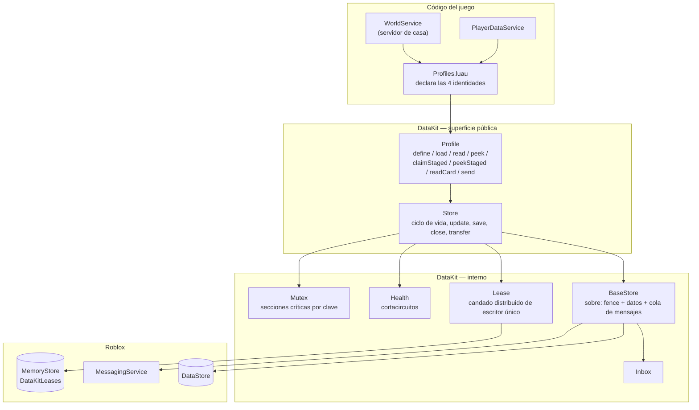
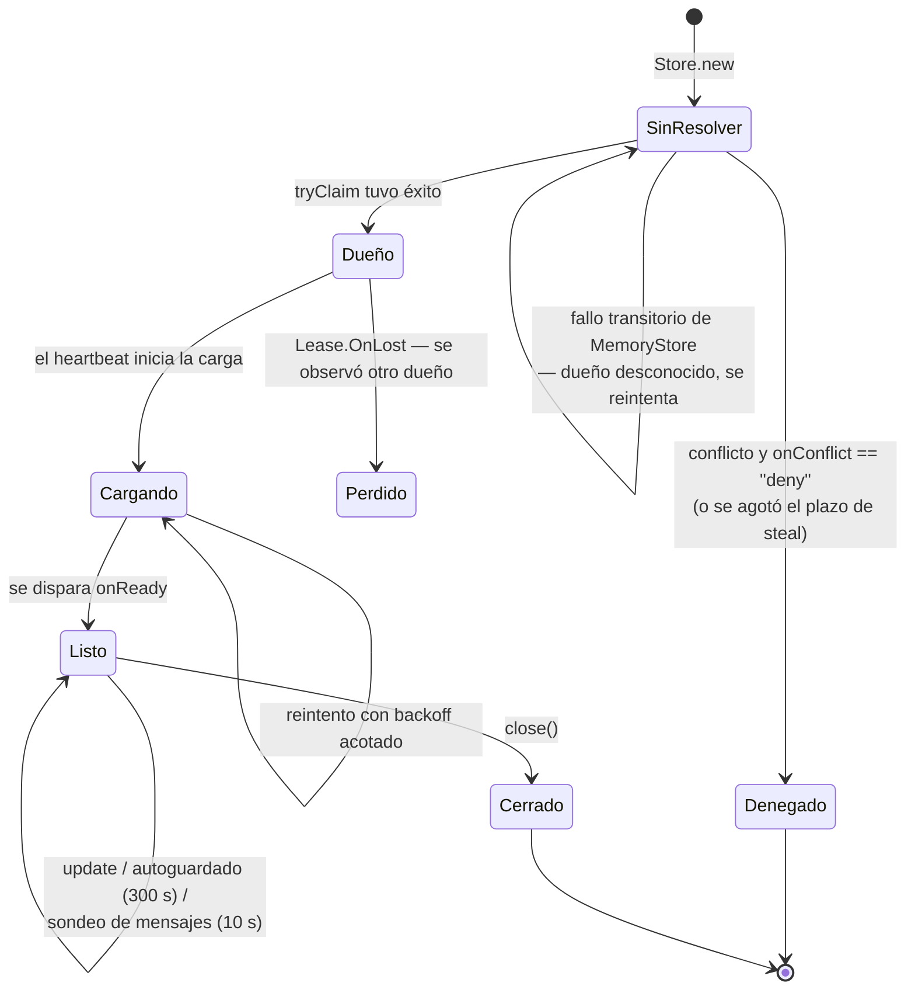

# Persistencia

Todo el estado duradero de Voz Hispana pasa por **`DataKit`**, un paquete vendorizado en
`Core/ServerStorage/DataKit` (su propia documentación lo describe como instalado con
wally, accesible como `ServerStorage.Packages.DataKit`). Es la única capa que habla con
`DataStoreService`, y está documentado a fondo dentro del propio código — esta página
explica qué hace el juego con él, y la referencia de API lleva los detalles.

**HECHO.** `DataStoreService` lo referencian 4 archivos, y dos de ellos son los propios
adaptadores de `DataKit`. Los dos de fuera son `GlobalDataStore/init.luau` y
`WorldSystem/GiftInbox.luau`.

## Las cuatro identidades

**HECHO.** `Core/ServerStorage/WorldSystem/Profiles.luau` declara todos los perfiles que
usa el juego:

| Perfil | Clave de identidad | `onConflict` | Notas |
|---|---|---|---|
| `WorldsPlayer` | `tostring(userId)` | por defecto (`"steal"`) | Datos del jugador. Plantilla en `PlayerSchema.luau`. `maxMessages = 2000`, y un manejador `onMessage`. |
| `World` | `"{userId}_{roomName}"` | `"deny"` | Una casa. Declara una proyección `card`: `{ name, ownerId, serverType }`. |
| `Event` | id del evento | `"deny"` | Eventos programados. |
| `ReferralCode` | el código, en mayúsculas | `"deny"` | Asocia un código de invitación con su dueño. |

### Por qué difieren las políticas de conflicto

**HECHO.** Esto lo dice directamente la documentación de clase de `Store`, y la elección
es determinante:

| Política | Significado | Se usa para |
|---|---|---|
| `"steal"` | Esperar a que el dueño actual suelte, o a que su TTL de lease expire tras un crash, y entonces reclamar. Se rinde tras `stealTimeout` (150 s) si el dueño sigue vivo. | **Identidades que se mueven.** Un jugador saltando de servidor: la sesión vieja está muerta, tomar el relevo es seguro. |
| `"deny"` | Ceder de inmediato, disparar `onDenied` con el dueño y su metadata, y no cargar nunca. | **Lugares vivos compartidos.** Un mundo hosteado con jugadores dentro no se roba: el aspirante *converge*, teletransportando a sus jugadores al dueño real. |

Por eso `Profiles.World` usa `"deny"`, y por eso `PlayerWorld_Init` tiene una ruta
`convergeToOwner`. Ver [Servidores reservados](./reserved-servers.md).

## La pila



## Escritor único por defecto

**HECHO.** `Store.new` reclama un [`Lease`](/api/Lease) sobre `"{Name}/{id}"` **antes** de
cargar, salvo que `singleWriter = false`. El prefijo de espacio de nombres hace que dos
perfiles distintos con el mismo id no compartan candado.



**HECHO.** El lease es más que un candado: su valor es `{ owner, meta }`, y la `meta`
viaja y expira con él. Una casa publica ahí `{ placeId, jobId, accessCode }`, que es como
un lobby averigua cómo llegar a ella — `Lease.peek` es una consulta de directorio sin
efectos secundarios.

**HECHO — política de reintentos.** `_resolveOwnership` distingue tres resultados y los
trata distinto. `owner == nil` significa que MemoryStore falló y no dice nada sobre la
propiedad, así que se reintenta y nunca se trata como conflicto. Es el mismo principio que
el manejo de throttling de [`ServerPresence`](/api/ServerPresence).

## El sobre durable

**HECHO.** `BaseStore` no escribe datos en crudo. Escribe un sobre con tres claves:

| Clave | Propósito |
|---|---|
| `__dkFence` | Un número de valla monótono, la protección durable contra un escritor obsoleto que quiera confirmar |
| `__dkData` | Los datos reales del perfil |
| `__dkMsgs` | `{ seq, list }` — la cola de mensajes de esta identidad |

**HECHO.** Un registro escrito antes de que existieran los mensajes simplemente no tiene
`__dkMsgs` y se lee como cola vacía, así que no hay migración de datos. El código lo dice
explícitamente.

**INFERENCIA.** La valla es lo que hace que el lease sea seguro y no solo cómodo. Un
servidor que perdió su lease durante una caída de MemoryStore no puede sobrescribir en
silencio el trabajo del nuevo dueño, porque la confirmación va vallada a nivel de
DataStore. La documentación de `Lease.start` se apoya en esto: vuelve a reclamar una clave
expirada «sin interrumpir la sesión (las escrituras quedan protegidas por el fence
durable)».

## Escribir en una identidad que no posees

**HECHO.** `Store.send(name, id, message)` añade un mensaje a la cola de la identidad
destino **esté cargada donde sea o no lo esté**, incluso para un jugador que nunca ha
entrado. El consumidor declara `onMessage(data, message)` en las opciones de su perfil;
devolver los datos consume el mensaje en la misma escritura que persiste la mutación, y
devolver `nil` lo deja para el ciclo siguiente.

**HECHO.** El contrato del manejador está documentado y no es obvio:

> `onMessage` puede correr más de una vez sobre el mismo mensaje si falla un save … así que
> todo lo de aquí tiene que ser idempotente.

`Profiles.luau` lo respeta. `applyReferralCompleted` no borra una invitación completada,
la marca como `paid = true`, de modo que una repetición no suma nada:

```lua
-- La red de seguridad contra el doble conteo: si esta entrada ya se cobro, no
-- se vuelve a sumar pase lo que pase.
if typeof(entry) == "table" and entry.paid then
    return data
end
```

**INFERENCIA.** Este es el mecanismo detrás de los efectos entre servidores sobre
jugadores desconectados: el crédito por invitación, los regalos y el aviso de
`paintSold` llegan como mensajes en vez de como escrituras directas sobre el registro de
otro.

Manejar mensajes cuesta una lectura de MemoryStore por identidad viva y por
`messagePoll` (10 s por defecto) — el código lo señala y dice que se suba el intervalo
cuando un servidor sostenga muchas identidades con manejador.

## Tarjetas

**HECHO.** Un perfil puede declarar una `card`: una proyección hacia un DataStore aparte,
más pequeño, que se puede leer **sin** cargar la identidad ni tomar su candado.
`Profiles.World` declara una:

```lua
card = {
    project = function(data)
        return {
            name = data.settings.Name,
            ownerId = data.settings.OwnerId,
            serverType = data.settings.ServerType,
        }
    end,
}
```

**INFERENCIA.** Esto es lo que hace asequible un navegador de casas. Listar 50 casas
cuesta 50 lecturas de tarjeta, no 50 cargas completas con 50 reclamaciones de lease.

## Cuándo se guarda

**HECHO.**

| Disparador | Mecanismo |
|---|---|
| Autoguardado | `Store._heartbeat`, cada `autosaveInterval` (300 s por defecto). Un autoguardado fallido reintenta a los 30 s en vez de esperar un intervalo entero. |
| Tras consumir un mensaje | Se guarda de inmediato, para que un crash no pueda reentregar un mensaje que ya se aplicó solo en caché. |
| `store:close()` | Explícito. `WorldService.destroy()` lo llama. |
| Apagado del servidor | `game:BindToClose` — lo enganchan 8 archivos. |

**HECHO.** `Store.save` toma una instantánea y limpia el flag de sucio **antes** de la
escritura asíncrona, de forma que un `update` que llegue a mitad del guardado no se
pierde. Los guardados concurrentes se serializan con una cola de esperadores.

**HECHO.** `Store.transfer` mueve valor entre dos stores y garantiza que el **origen**
persiste antes que el destino en cada guardado y cierre. El código enuncia la propiedad
sin rodeos: un crash a mitad de transferencia puede perder el valor (recuperable) pero
nunca puede duplicarlo.

## Manejo de fallos

**HECHO.** [`Health`](/api/Health) es un cortacircuitos por store: 5 fallos dentro de una
ventana deslizante de 120 segundos marcan el store como *crítico*, algo expuesto en
`Store.isCriticalState()` / `Store.onCriticalToggle()` y reflejado en `Store.canWrite()`.

**HECHO — una limitación que el propio código declara sobre sí mismo:**

> Sin scheduler propio, esto solo corre cuando algo lo dispara (isCritical o
> recordFailure) — por eso una ventana ya vencida puede seguir "activa" hasta la próxima
> llamada.

Es decir: un store que se queda en silencio tras fallar sigue marcado como crítico hasta
que algo vuelva a preguntar. Documentado, deliberado, y conviene saberlo antes de leer
`isCriticalState` como verdad en vivo.

## Otra persistencia fuera de DataKit

**HECHO.** Dos módulos usan `DataStoreService` directamente y **aún no están
analizados**:

| Módulo | Nota |
|---|---|
| `Core/ServerStorage/GlobalDataStore/init.luau` | 335 líneas. Viene con `ReadMe.server.luau` y `Testeo_GlobalDataStore.luau`. |
| `Core/ServerStorage/WorldSystem/GiftInbox.luau` | 2,4 KB. Se llama como un buzón, pero es distinto de `DataKit.Inbox`. |

Si duplican las garantías de `DataKit`, o si existen para un caso que este no cubre, es
una pregunta abierta para la Fase 3.

## Implementación relacionada

| Aspecto | Código |
|---|---|
| Declaración de perfiles | `Core/ServerStorage/WorldSystem/Profiles.luau` |
| Plantilla de datos del jugador | `Core/ServerStorage/WorldSystem/PlayerSchema.luau` |
| Envoltorio del store de casa | `PlayerHouses/ServerScriptService/WorldService.luau` |
| Servicio de datos del jugador | `Core/ServerStorage/WorldSystem/PlayerDataService.luau` |
| Replicación al cliente | `Core/ServerStorage/WorldSystem/PlayerDataReplicator.luau` |
| El paquete en sí | `Core/ServerStorage/DataKit/` — [`Store`](/api/Store), [`Profile`](/api/Profile), [`Lease`](/api/Lease), [`Health`](/api/Health), [`Mutex`](/api/Mutex) |
