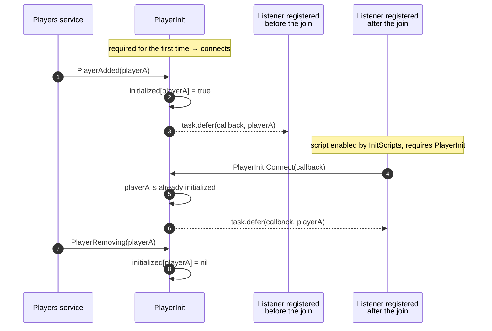
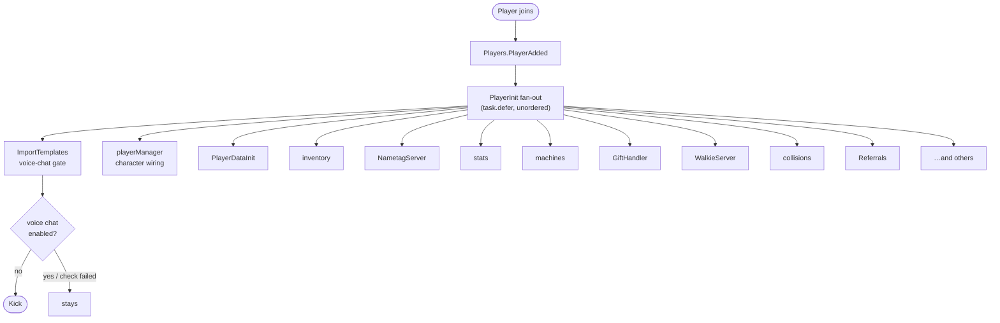
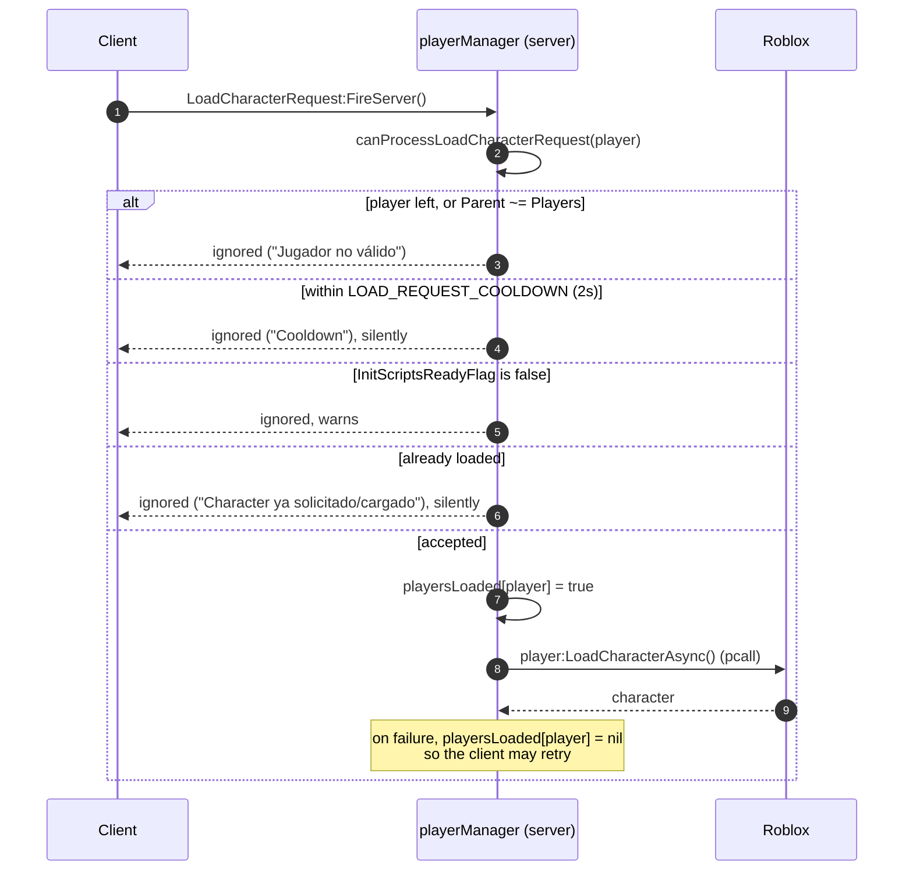
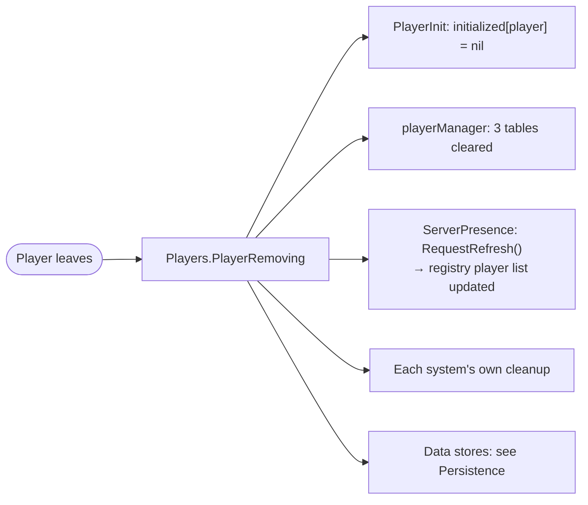

# Player lifecycle

## Why `Players.PlayerAdded` is not used directly

**FACT.** Most systems in Voz Hispana do **not** connect to `Players.PlayerAdded`. They
register with [`PlayerInit`](/api/PlayerInit) instead:

```lua
local PlayerInit = require(ReplicatedStorage:WaitForChild("PlayerInit"))
PlayerInit.Connect(OnPlayerAdded)
```

19 scripts in the repository do this.

The reason is in the module's own header comment: template scripts are imported by
`InsertService` and enabled afterwards, so a script that connects to `Players.PlayerAdded`
in its first line may already have missed the players who joined while the import was
running. `PlayerInit` connects once, from the moment it is first required, records which
players it has announced, and **replays** that announcement to every listener registered
later.



### Guarantees it does and does not give

| | |
|---|---|
| **Does** | Each listener runs at most once per player, per join. |
| **Does** | A listener registered late still sees players who joined earlier. |
| **Does** | One listener raising an error cannot break the others — each call is `task.defer`red and `pcall`ed. |
| **Does** | `Connect` returns a disposer that deactivates the listener. |
| **Does not** | Guarantee any ordering between listeners. Every call is deferred, so all listeners for a player are queued and run in an unspecified interleaving. |
| **Does not** | Filter to the local player on the client. `Players.PlayerAdded` fires for *all* players on the client too, and consumers such as `Client/PlayerManager` filter for `Players.LocalPlayer` themselves. |
| **Does not** | Provide a "player removing" fan-out. Only `PlayerAdded` is replayed; cleanup is each system's own `Players.PlayerRemoving` connection. |

## Join flow

There is no central "player loader". Systems initialise **independently and
concurrently**, each from its own `PlayerInit.Connect` callback.



**INFERENCE — this is worth stating plainly:** there is **no bootstrap that orders player
initialization**. There is no `PlayerReady` signal, no dependency declaration, and no
barrier between "data loaded" and "systems started". If two systems both need player data,
each obtains it itself. Any ordering that holds in practice is a consequence of `task.defer`
scheduling and of how long each system's own async work takes — not of a guarantee in the
source.

This is a real architectural property of the project, not a gap in this documentation.

### Related implementation

| Concern | Script |
|---|---|
| Voice-chat entry requirement | `ServerScriptService/ImportTemplates.server.luau`, `onPlayerAdded` |
| Character loading and respawn | `Core/…/ServerScripts/playerManager.server.luau` |
| Player data | `Core/…/ServerScripts/PlayerDataInit.server.luau`, `Core/ServerStorage/WorldSystem/PlayerDataService.luau` |
| Data replication to client | `Core/ServerStorage/WorldSystem/PlayerDataReplicator.luau` |

## The voice-chat gate

**FACT.** The first thing `ImportTemplates.server.luau` does, before importing anything,
is register the game's admission rule:

```lua
local success, isVoiceEnabled = pcall(function()
    return VoiceChatService:IsVoiceEnabledForUserIdAsync(player.UserId)
end)

if success then
    if not isVoiceEnabled then
        player:Kick("Este juego es exclusivo para usuarios con Chat de Voz. …")
    end
else
    warn("No se pudo verificar el estado del chat de voz de " .. player.Name)
end
```

Voz Hispana is voice-chat-only by design. Note the third branch: when the Roblox call
*errors*, the player is not kicked. The source comment marks this as an open decision.
Recorded as [BUG-CANDIDATE-001](../testing/verification-plan.md#bug-candidate-001).

## Character request handshake

**FACT.** Characters are **not** auto-loaded on join in the normal path. The client asks
for one, over the `Player/LoadCharacterRequest` `RemoteEvent`, and
`playerManager.server.luau` decides.



**FACT — the server-side validations that exist:**

| Check | Effect |
|---|---|
| `player.Parent ~= Players` | Rejected. Guards a request racing the player's departure. |
| `os.clock() - lastRequest < 2` | Rejected. Rate-limits remote spam, and the timestamp is recorded **before** the other checks, so a rejected request still consumes the cooldown. |
| `not InitScriptsReadyFlag.Value` | Rejected. No character before template scripts are enabled. |
| `playersLoaded[player]` | Rejected. One character per player per session, unless a `LoadCharacterAsync` failure clears the flag. |

**INFERENCE.** This is the only remote in the reviewed bootstrap path that is
rate-limited, and the ordering of the cooldown write is deliberate: it cannot be bypassed
by sending requests that fail a later check.

**UNKNOWN.** Which client script fires `LoadCharacterRequest`. No `.luau` in this
repository fires it, so the sender is inside one of the binary `.rbxm` files (most
likely `StarterPlayerScripts.rbxm` or a `StarterGui` UI). See
[Client lifecycle](./client-lifecycle.md).

## Leave flow

**FACT.** There is no central teardown either. Each system cleans up in its own
`Players.PlayerRemoving` connection. In `playerManager`:

```lua
Players.PlayerRemoving:Connect(function(player)
    playersLoaded[player] = nil
    lastLoadRequestAt[player] = nil
    respawning[player] = nil
end)
```

and in `PlayerInit`, `initialized[player] = nil`.



**INFERENCE.** Because per-player state lives in plain Lua tables keyed by the `Player`
instance in each system independently, a system that forgets its own `PlayerRemoving`
cleanup leaks that player's entry for the life of the server. Whether any system does is
a per-script question, answered during the per-script review.

## Welcome notification

**FACT.** `playerManager.OnPlayerAdded` reads `player:GetJoinData()` and treats
`SourcePlaceId ~= nil` as "arrived by teleport from another place". A player who did
**not** arrive by teleport gets a beta-warning notification 3 seconds after their
character exists, via `Player/ShowNotification`.

**INFERENCE.** This is how the game avoids re-greeting a player every time they walk
between the lobby and their house, since inter-place travel is routine here.

**FACT.** The same handler sets an idempotence attribute, `PlayerManagerLoaded`, and
returns early if it is already set — a second-layer guard on top of `PlayerInit`'s own
`initialized` map. It also sets `player.DevEnableMouseLock = false`.
