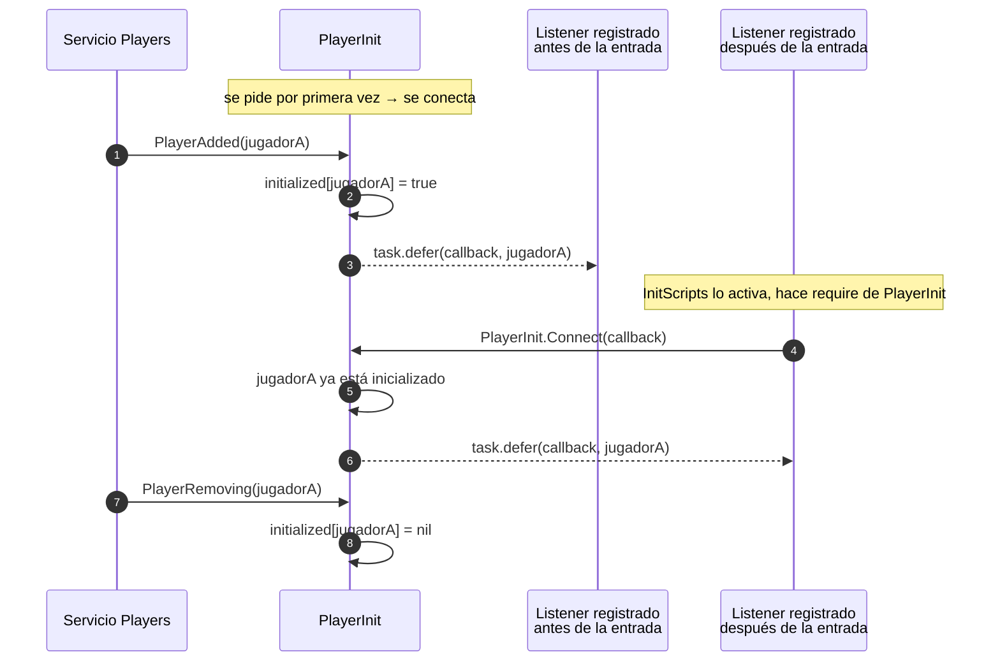
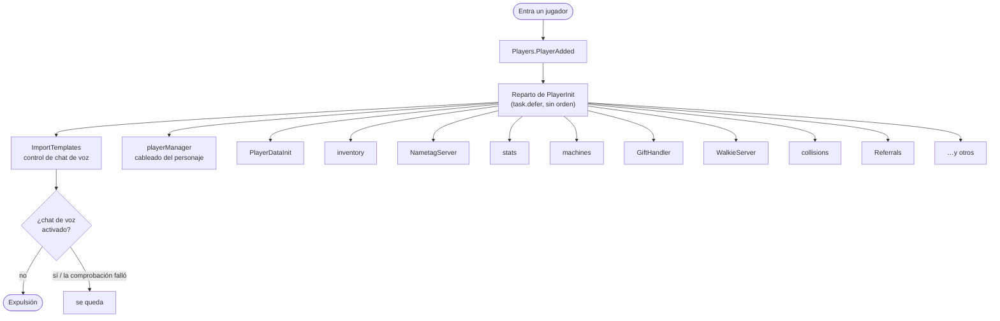
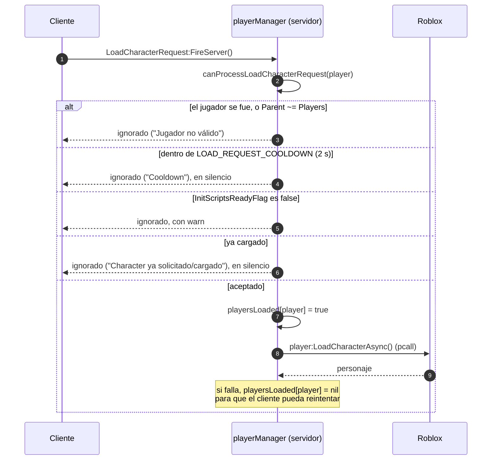
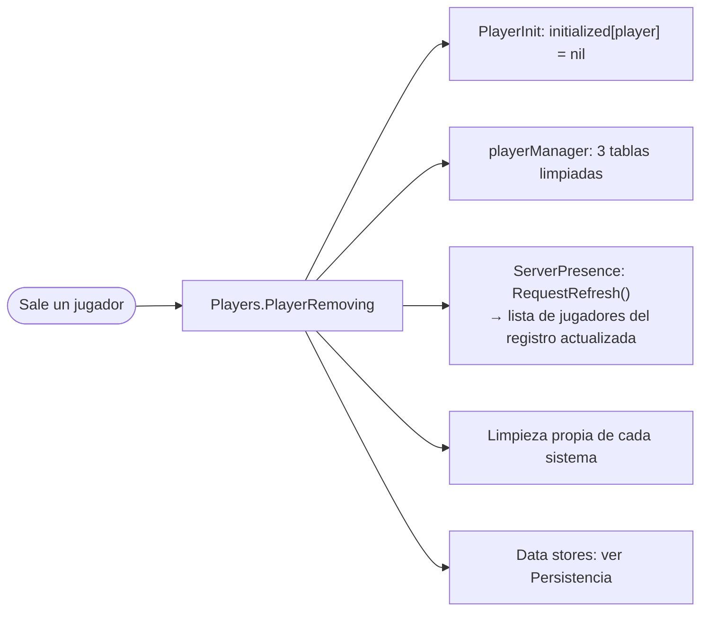

# Ciclo de vida del jugador

## Por qué no se usa `Players.PlayerAdded` directamente

**HECHO.** La mayoría de los sistemas de Voz Hispana **no** se conectan a
`Players.PlayerAdded`. Se registran en [`PlayerInit`](/api/PlayerInit):

```lua
local PlayerInit = require(ReplicatedStorage:WaitForChild("PlayerInit"))
PlayerInit.Connect(OnPlayerAdded)
```

19 scripts del repositorio lo hacen así.

La razón está en el comentario de cabecera del propio módulo: los scripts de plantilla se
importan con `InsertService` y se activan después, así que un script que se conecte a
`Players.PlayerAdded` en su primera línea puede haberse perdido ya a los jugadores que
entraron mientras corría la importación. `PlayerInit` se conecta una sola vez, desde el
momento en que se le pide por primera vez, registra a qué jugadores ya ha anunciado, y
**reproduce** ese anuncio para los listeners que se registren más tarde.



### Qué garantiza y qué no

| | |
|---|---|
| **Garantiza** | Cada listener corre como mucho una vez por jugador y por entrada. |
| **Garantiza** | Un listener registrado tarde sigue viendo a los jugadores que entraron antes. |
| **Garantiza** | Un listener que lance error no puede romper a los demás: cada llamada va con `task.defer` y `pcall`. |
| **Garantiza** | `Connect` devuelve un desactivador del listener. |
| **No garantiza** | Ningún orden entre listeners. Toda llamada es diferida, así que todos los listeners de un jugador se encolan y corren en un entrelazado no especificado. |
| **No garantiza** | Filtrar al jugador local en el cliente. En el cliente `Players.PlayerAdded` también dispara para *todos* los jugadores, y consumidores como `Client/PlayerManager` filtran por `Players.LocalPlayer` ellos mismos. |
| **No garantiza** | Un reparto de «jugador saliendo». Solo se reproduce `PlayerAdded`; la limpieza es la conexión `Players.PlayerRemoving` propia de cada sistema. |

## Flujo de entrada

No hay un «cargador de jugador» central. Los sistemas se inicializan **de forma
independiente y concurrente**, cada uno desde su propio callback de `PlayerInit.Connect`.



**INFERENCIA — conviene decirlo sin rodeos:** **no hay ningún bootstrap que ordene la
inicialización del jugador**. No hay señal `PlayerReady`, ni declaración de dependencias,
ni barrera entre «datos cargados» y «sistemas arrancados». Si dos sistemas necesitan los
datos del jugador, cada uno los obtiene por su cuenta. Cualquier orden que se cumpla en
la práctica es consecuencia de la planificación de `task.defer` y de cuánto tarde el
trabajo asíncrono de cada sistema, no de una garantía del código.

Esto es una propiedad arquitectónica real del proyecto, no un hueco de esta
documentación.

### Implementación relacionada

| Aspecto | Script |
|---|---|
| Requisito de entrada por chat de voz | `ServerScriptService/ImportTemplates.server.luau`, `onPlayerAdded` |
| Carga del personaje y respawn | `Core/…/ServerScripts/playerManager.server.luau` |
| Datos del jugador | `Core/…/ServerScripts/PlayerDataInit.server.luau`, `Core/ServerStorage/WorldSystem/PlayerDataService.luau` |
| Replicación de datos al cliente | `Core/ServerStorage/WorldSystem/PlayerDataReplicator.luau` |

## El control de chat de voz

**HECHO.** Lo primero que hace `ImportTemplates.server.luau`, antes de importar nada, es
registrar la regla de admisión del juego:

```lua
local success, isVoiceEnabled = pcall(function()
    return VoiceChatService:IsVoiceEnabledForUserIdAsync(player.UserId)
end)

if success then
    if not isVoiceEnabled then
        player:Kick("Este juego es exclusivo para usuarios con Chat de Voz. …")
    end
else
    warn("No se pudo verificar el estado del chat de voz de " .. player.Name)
end
```

Voz Hispana es exclusivo de chat de voz por diseño. Nótese la tercera rama: cuando la
llamada a Roblox *da error*, no se expulsa al jugador. El comentario del código marca
esto como una decisión abierta. Registrado como
[BUG-CANDIDATE-001](../testing/verification-plan.md#bug-candidate-001).

## Handshake de solicitud de personaje

**HECHO.** Los personajes **no** se cargan automáticamente al entrar por la vía normal.
El cliente pide uno, por el `RemoteEvent` `Player/LoadCharacterRequest`, y
`playerManager.server.luau` decide.



**HECHO — las validaciones del servidor que existen:**

| Comprobación | Efecto |
|---|---|
| `player.Parent ~= Players` | Rechazado. Protege de una petición que carrera con la salida del jugador. |
| `os.clock() - lastRequest < 2` | Rechazado. Limita el spam del remote, y la marca de tiempo se registra **antes** que las demás comprobaciones, así que una petición rechazada también consume el cooldown. |
| `not InitScriptsReadyFlag.Value` | Rechazado. No hay personaje antes de que los scripts de plantilla estén activados. |
| `playersLoaded[player]` | Rechazado. Un personaje por jugador y sesión, salvo que un fallo de `LoadCharacterAsync` limpie el flag. |

**INFERENCIA.** Es el único remote de la ruta de arranque revisada que tiene límite de
frecuencia, y el orden de escritura del cooldown es deliberado: no se puede saltar
enviando peticiones que fallen una comprobación posterior.

**DESCONOCIDO.** Qué script de cliente dispara `LoadCharacterRequest`. Ningún `.luau` de
este repositorio lo dispara, así que el emisor está dentro de uno de los `.rbxm` binarios
(lo más probable, `StarterPlayerScripts.rbxm` o una UI de `StarterGui`). Ver
[Ciclo de vida del cliente](./client-lifecycle.md).

## Flujo de salida

**HECHO.** Tampoco hay desmontaje central. Cada sistema limpia en su propia conexión
`Players.PlayerRemoving`. En `playerManager`:

```lua
Players.PlayerRemoving:Connect(function(player)
    playersLoaded[player] = nil
    lastLoadRequestAt[player] = nil
    respawning[player] = nil
end)
```

y en `PlayerInit`, `initialized[player] = nil`.



**INFERENCIA.** Como el estado por jugador vive en tablas Lua planas indexadas por la
instancia `Player` en cada sistema de forma independiente, un sistema que olvide su
propia limpieza en `PlayerRemoving` filtra la entrada de ese jugador durante toda la vida
del servidor. Si algún sistema lo hace es una pregunta por script, que se responde en la
revisión por script.

## Notificación de bienvenida

**HECHO.** `playerManager.OnPlayerAdded` lee `player:GetJoinData()` y trata
`SourcePlaceId ~= nil` como «llegó por teleport desde otro place». A un jugador que **no**
llegó por teleport se le muestra un aviso de beta 3 segundos después de que exista su
personaje, vía `Player/ShowNotification`.

**INFERENCIA.** Así es como el juego evita volver a saludar al jugador cada vez que va del
lobby a su casa, ya que el viaje entre places es rutinario aquí.

**HECHO.** El mismo handler pone un atributo de idempotencia, `PlayerManagerLoaded`, y
retorna pronto si ya está puesto — una segunda capa de guarda sobre el mapa `initialized`
del propio `PlayerInit`. También pone `player.DevEnableMouseLock = false`.
