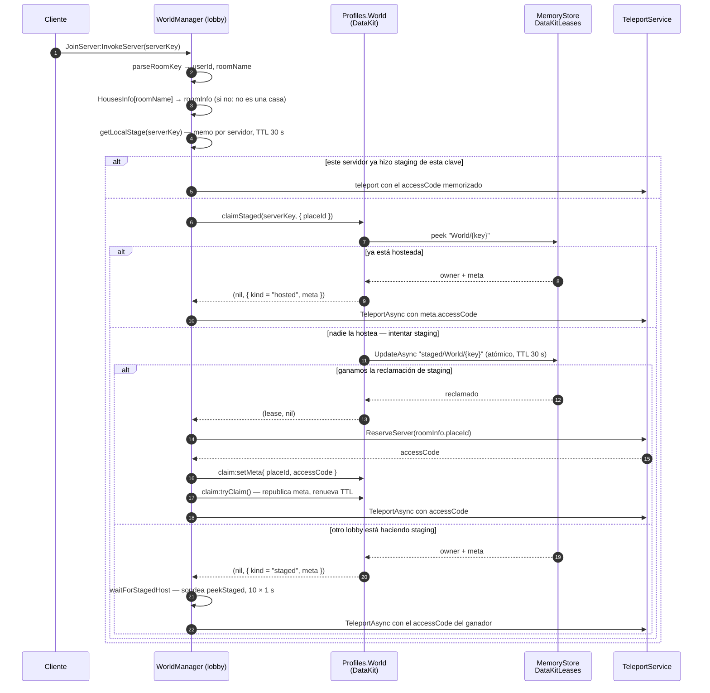
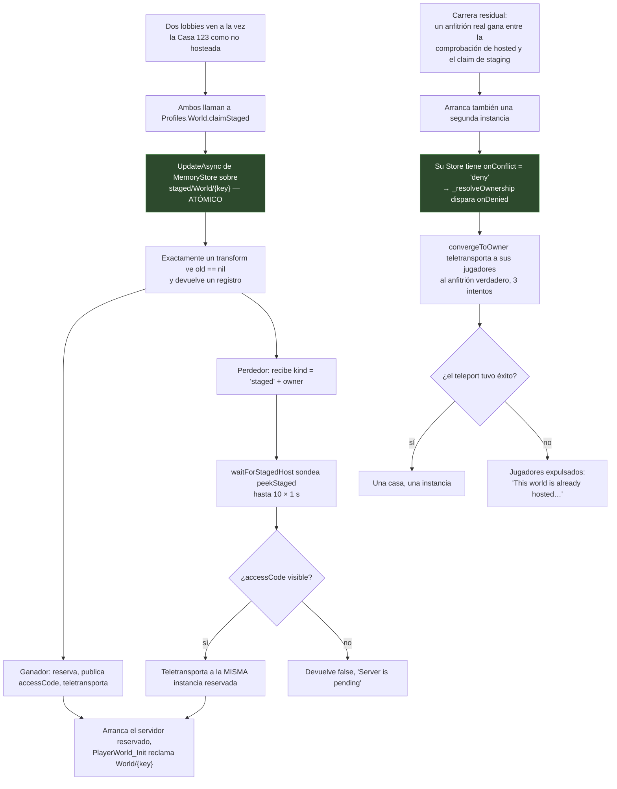

# Servidores reservados

Voz Hispana es un juego de varios places. Además de los places públicos, corre
**servidores reservados**: instancias privadas de servidor de Roblox a las que se llega
con un `ReservedServerAccessCode` en vez de con un `JobId`. Dos cosas los usan: las
**casas de jugador** y los **eventos**.

Esta página cubre el mecanismo. La *entidad* casa —propiedad, persistencia, permisos—
está en [Casas](../systems/housing/overview.md).

## Las tres identidades

Todo gira alrededor de la **clave de servidor**, una cadena cuya *forma* determina cómo se
alcanza el servidor.

| Forma de la clave | La produce | `hostingType` | Cómo entra un jugador |
|---|---|---|---|
| `"{PlaceId}_{JobId}"` | `PublicServerInit` | `"default"` | `TeleportOptions.ServerInstanceId = jobId` |
| `"{UserId}_{roomName}"` | El cliente que la pide, resuelta por `WorldManager` | `"room"` | `TeleportOptions.ReservedServerAccessCode` |
| clave del evento | `EventService` | `"event"` | `TeleportOptions.ReservedServerAccessCode` |

**HECHO.** `WorldManager.parseRoomKey` es lo que las discrimina:

```lua
local userIdStr, roomName = serverKey:match("^(%d+)_(.+)$")
```

Si la clave casa como `dígitos_nombre` **y** `roomName` es una clave de
`ReplicatedStorage.HousesInfo`, es una casa. `HousesInfo` declara hoy `defaultRoom`,
`playaRoom` y `VistaLujosaRoom`. La clave de un servidor público también casa con
`^(%d+)_(.+)$` —un `PlaceId` seguido de un `JobId`—, así que el discriminador real es la
búsqueda en `HousesInfo`, no el patrón.

## Dos registros, no uno

Este es el hecho estructural más importante sobre los servidores reservados, y es fácil
pasarlo por alto: **hay dos registros independientes respaldados por MemoryStore**,
escritos por capas distintas, con vidas y propósitos distintos.

| | **Directorio de presencia** | **Directorio de leases** |
|---|---|---|
| Nombre del mapa | `UserServerRegistry_Test` | `DataKitLeases` |
| Lo escribe | [`ServerPresence`](/api/ServerPresence) | `DataKit.Lease` |
| Clave | la clave de servidor | `World/{serverKey}`, o `staged/World/{serverKey}` |
| TTL | 120 s | 120 s (30 s para el staging) |
| Refresco | heartbeat de 30 s | heartbeat de 30 s |
| Propósito | *«qué servidores existen y quién está dentro»* — la lista navegable | *«quién posee este mundo ahora mismo y cómo llego»* |
| Contenido | jugadores, conteos, nombre, `placeId`, `jobId`, `accessCode`, `status` | `{ owner = jobId, meta = { placeId, jobId, accessCode } }` |

**INFERENCIA.** El directorio de leases es la autoridad sobre *la alcanzabilidad de una
casa*; el de presencia lo es sobre *navegar*. Las decisiones de reserva leen el de leases,
nunca el de presencia — `WorldManager.hostWorld` no llama jamás a
`ServerPresence.SafeGet`, y `JoinServerFunc` solo cae al directorio de presencia cuando la
clave **no** es una casa.

## Entrar en una casa



### Por qué `ReserveServer` se llama fuera del transform

**HECHO.** La documentación de `DataKit.Store.claimStaged` lo dice explícitamente:

> llama `TeleportService:ReserveServer` AHORA (fuera de todo transform — reservar dentro
> de un `UpdateAsync` era el bug del sistema viejo)

La reclamación de staging es un `UpdateAsync` de MemoryStore cuyo transform solo decide la
propiedad. La llamada web real a `ReserveServer` ocurre **después** de que el transform
retorne, y el código resultante se publica con `setMeta` + `tryClaim` (que republica la
meta y renueva el TTL, porque reservar puede haber tardado).

**INFERENCIA.** Por eso el TTL de staging es corto (30 s) pero renovable: está dimensionado
para cubrir una ida y vuelta de `ReserveServer` más un teleport, no una sesión entera.

## Concurrencia: dos jugadores abriendo la misma casa a la vez

Este es el escenario alrededor del cual está construido el diseño, y la respuesta es:
**está protegido, en dos capas.**



### Capa 1 — reclamación de staging atómica

**HECHO.** `Lease.tryClaim` es un único `UpdateAsync` de MemoryStore cuyo transform solo
escribe si la clave está libre o ya es nuestra:

```lua
local ok, result = pcall(self._map.UpdateAsync, self._map, self.Id, function(old: Record?): Record?
    if old == nil or old.owner == self.ServerId then
        return { owner = self.ServerId, meta = self._meta }
    end
    return nil
end, self._ttl)
```

`UpdateAsync` sobre un hash map de MemoryStore es un compare-and-set: devolver `nil` desde
el transform aborta la escritura. Exactamente uno de dos llamantes concurrentes puede
ganar.

### Capa 2 — denegar y converger

**HECHO.** La propia documentación de `DataKit` afirma que la capa 1 no basta por sí sola,
y nombra la ventana residual:

> La ventana entre el chequeo de "hosted" y el claim de staging no es atómica; si un host
> gana justo en medio, la instancia reservada se auto-deniega al cargar (`onConflict deny`)
> y converge por teleport — el mecanismo existente absorbe la carrera.

**HECHO.** `Profiles.World` está definido con `onConflict = "deny"`. Cuando una segunda
instancia de casa arranca y encuentra el lease ya tomado, `Store._resolveOwnership`
dispara `onDenied(owner, ownerMeta)`. `PlayerWorld_Init` lo maneja limpiando su presencia
y llamando a `convergeToOwner`, que teletransporta a todos al `accessCode` del anfitrión
real (3 intentos, con 0,5 s entre ellos) y solo los expulsa con un mensaje explicativo si
eso falla. También conecta `Players.PlayerAdded` para reenviar igualmente a quien llegue
después a la instancia condenada.

**Valoración — INFERENCIA, declarada como tal:** el escenario de doble reserva del
enunciado *sí* está atendido. La reclamación de staging atómica evita el caso común, y la
ruta de denegar-y-converger absorbe la estrecha ventana residual. Lo que la lectura
estática no puede establecer es si la *convergencia* siempre tiene éxito bajo carga; eso
es una pregunta de ejecución, registrada como
[BUG-CANDIDATE-004](../testing/verification-plan.md#bug-candidate-004), con un plan de
prueba multijugador.

### El memo por servidor

**HECHO.** `WorldManager` mantiene además `localStages`, una tabla Lua plana con un
`LOCAL_STAGE_TTL` de 30 segundos, indexada por clave de servidor. Cortocircuita peticiones
repetidas **desde el mismo servidor de lobby** antes de cualquier llamada a MemoryStore. Es
una optimización de coste dentro de un servidor, no un candado distribuido; quien arbitra
de verdad es la reclamación en MemoryStore.

**OBSERVACIÓN.** `localStages[serverKey] = { expires = … }` se escribe *antes* de
`claimStaged` y se deja con `meta = nil` mientras el staging está en vuelo. Una segunda
petición que llegue en esa ventana toma la rama `localStage.meta == nil` y sondea
`waitForStagedHost` en vez de competir. Las entradas se limpian en las rutas de fallo y al
expirar, pero no hay barrido periódico, así que una clave cuya petición nunca retorne
conserva su entrada hasta que pasen 30 s de reloj — acotado, y por construcción no es una
fuga.

## Llegar a una casa que ya no tiene servidor

**HECHO.** El registro del lease vive en MemoryStore con un TTL de 120 s, refrescado cada
30 s por el heartbeat del servidor de casa que lo posee. Cuando ese servidor muere:

- **Apagado ordenado** — `BindToClose` → `presence:Cleanup()` → `OnCleanup` →
  `WorldService.destroy()` → `store:close()`, que libera el lease.
- **Muerte abrupta** — no corre nada. El lease no se libera, pero tampoco se refresca, así
  que MemoryStore lo hace expirar solo en 120 s.

**INFERENCIA.** Esta es la respuesta a *«¿cómo se detecta una referencia obsoleta a un
servidor?»*: no se detecta, se **impide que persista**. El sistema no guarda un mapeo
permanente `HouseId → ReservedServerCode` que pudiera quedarse obsoleto. El mapeo *es* el
lease, y la vigencia del lease es su TTL. El propio comentario de `Lease` declara la
intención:

> El TTL da la liveness: si el dueño deja de refrescar (crash), la key expira sola y otro
> server puede reclamarla —sin chequeos de tiempo cross-server—.

**TEORÍA — requiere verificación de ciclo de vida.** Dentro de la ventana entre la muerte
de un servidor y la expiración de su lease (hasta 120 s), `claimStaged` sigue reportando
`kind = "hosted"` con el `accessCode` del servidor muerto. Un jugador sería teletransportado
con un `ReservedServerAccessCode` de una instancia que ya no existe.

El comportamiento documentado por Roblox es que teletransportar con un código de acceso
reservado cuya instancia se ha apagado **arranca una instancia nueva** con ese mismo
código, lo que haría esto inocuo: la nueva instancia arranca, encuentra el lease expirado
o expirando, y lo reclama. Ese comportamiento no lo establece el código de este
repositorio, así que queda registrado en vez de afirmado:
[BUG-CANDIDATE-005](../testing/verification-plan.md#bug-candidate-005).

## Manejo del teleport

**OBSERVACIÓN.** En Studio, `reserveAccessCode` devuelve un `HttpService:GenerateGUID`
fabricado en vez de reservar, y `safeTeleport` se salta el teleport — pero la escritura de
staging que hay entre medias *no* es consciente de Studio y llega igualmente al MemoryStore
compartido. Registrado como
[BUG-CANDIDATE-006](../testing/verification-plan.md#bug-candidate-006).

**HECHO.** `WorldManager.safeTeleport` reintenta `TeleportService:TeleportAsync` hasta
`ATTEMPT_LIMIT = 3` veces con `RETRY_DELAY = 0,5` s entre intentos, cada uno dentro de un
`pcall`, y devuelve `(false, "TeleportFailed: …")` si todos fallan. En Studio se salta el
teleport por completo y avisa.

**HECHO.** El `TeleportData` que se envía a una casa es exactamente:

```lua
{ key = serverKey, placeId = meta.placeId, accessCode = meta.accessCode }
```

y el lado receptor lo lee en `PlayerWorld_Init.extractPayload` vía
`player:GetJoinData().TeleportData`, exigiendo que `tpData.key` sea una cadena. En Studio
sustituye por `("%i_defaultRoom"):format(player.UserId)`.

**HECHO.** `JoinWorldFunc` —viajar a un place *público*— traduce una cadena suministrada
por el cliente a través de una tabla del lado servidor y rechaza cualquier cosa que no
esté en ella:

```lua
local PlaceKeyToPlaceId: {[string]: number} = {
    ["karaoke"] = 129043234524029,
    ["lobby"] = 94068794823958,
    ["plsDonate"] = 82871403803520,
    ["arcadeClub"] = 83856919904540
}
```

**INFERENCIA — seguridad.** El cliente nunca suministra un `PlaceId` ni un `accessCode`.
Suministra una clave; el servidor la resuelve. Para los eventos el código lo declara como
regla: *«El code sale del registro de MemoryStore, nunca del cliente.»* El único valor que
el cliente sí controla es `serverKey` en `JoinServer`, y lo que eso puede direccionar está
acotado por `HousesInfo` y por lo que exista en los registros.

**OBSERVACIÓN — conviene verificarlo, no es una acusación de defecto.** `JoinServerFunc`
no comprueba que el jugador *que pide* tenga permiso para entrar en la casa antes de
teletransportarlo. La comprobación de permisos (`canHostWorld`) corre en el **servidor de
casa**, contra el primer jugador que llega. A un jugador teletransportado a una casa en la
que no puede entrar se le rechaza en el destino, no en el origen. Es un diseño coherente
—el destino es el único sitio que tiene cargados los datos del mundo—, pero la
consecuencia visible para el usuario es distinta (un teleport y luego una expulsión, en
vez de un rechazo), y los permisos para los jugadores *que no son el primero* son una
cuestión aparte que se examina en
[Casas → Permisos](../systems/housing/permissions.md).

## Implementación relacionada

| Paso | Código |
|---|---|
| Análisis de la clave | `WorldManager.server.luau`, `parseRoomKey`; `PlayerWorld_Init`, `parseRoomKey` |
| Reclamación de staging | `DataKit/Store.luau`, `Store.claimStaged`; `DataKit/Lease.luau`, `Lease.tryClaim` |
| Reserva | `WorldManager.server.luau`, `reserveAccessCode` |
| Teleport con reintentos | `WorldManager.server.luau`, `safeTeleport`, `teleportToHost` |
| Sondeo del lobby perdedor | `WorldManager.server.luau`, `waitForStagedHost` |
| Arranque en destino | `PlayerWorld_Init.lua.server.luau`, `init` |
| Denegar + converger | `PlayerWorld_Init.lua.server.luau`, `convergeToOwner`; `DataKit/Store.luau`, `Store._resolveOwnership` |
| Viaje a place público | `WorldManager.server.luau`, `JoinWorldFunc.OnServerInvoke` |
