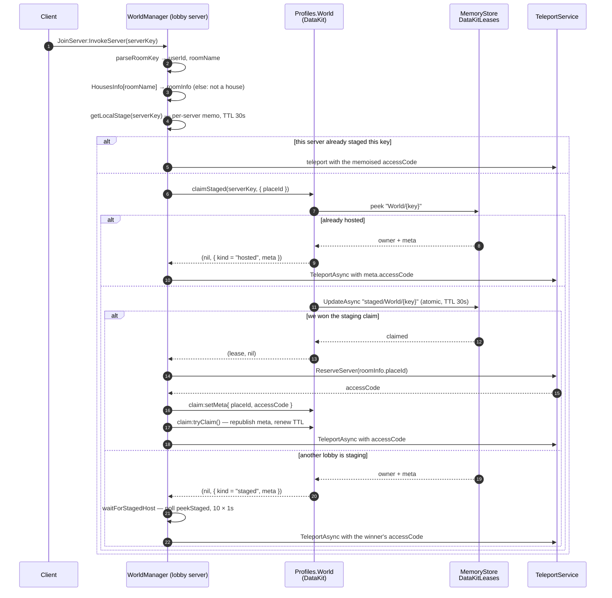
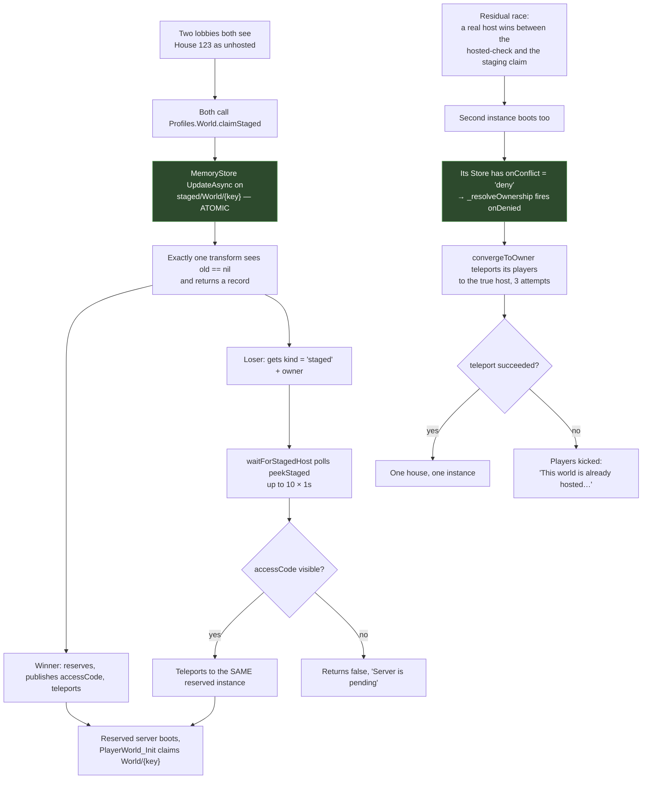

# Reserved servers

Voz Hispana is a multi-place game. Besides the public places, it runs **reserved
servers** — private Roblox server instances reached with a
`ReservedServerAccessCode` rather than a `JobId`. Two things use them: **player houses**
and **events**.

This page covers the mechanism. The house *entity* — ownership, persistence, permissions —
is covered under **Systems → Housing**.

## The three identities

Everything hinges on the **server key**, a string whose *shape* determines how a server
is reached.

| Key shape | Produced by | `hostingType` | How a player enters |
|---|---|---|---|
| `"{PlaceId}_{JobId}"` | `PublicServerInit` | `"default"` | `TeleportOptions.ServerInstanceId = jobId` |
| `"{UserId}_{roomName}"` | The requesting client, resolved by `WorldManager` | `"room"` | `TeleportOptions.ReservedServerAccessCode` |
| event key | `EventService` | `"event"` | `TeleportOptions.ReservedServerAccessCode` |

**FACT.** `WorldManager.parseRoomKey` is what discriminates them:

```lua
local userIdStr, roomName = serverKey:match("^(%d+)_(.+)$")
```

If the key parses as `digits_name` **and** `roomName` is a key in
`ReplicatedStorage.HousesInfo`, it is a house. `HousesInfo` currently declares
`defaultRoom`, `playaRoom` and `VistaLujosaRoom`. A public server's key also matches
`^(%d+)_(.+)$` — a `PlaceId` followed by a `JobId` — so the `HousesInfo` lookup, not the
pattern, is the real discriminator.

## Two registries, not one

This is the single most important structural fact about reserved servers here, and it is
easy to miss: **there are two independent MemoryStore-backed registries**, written by
different layers, with different lifetimes and different purposes.

| | **Presence directory** | **Lease directory** |
|---|---|---|
| Map name | `UserServerRegistry_Test` | `DataKitLeases` |
| Written by | [`ServerPresence`](/api/ServerPresence) | `DataKit.Lease` |
| Key | the server key | `World/{serverKey}`, or `staged/World/{serverKey}` |
| TTL | 120 s | 120 s (30 s for staging) |
| Refresh | 30 s heartbeat | 30 s heartbeat |
| Purpose | *"what servers exist and who is in them"* — the browsable list | *"who owns this world's data right now, and how do I reach them"* |
| Payload | players, counts, name, `placeId`, `jobId`, `accessCode`, `status` | `{ owner = jobId, meta = { placeId, jobId, accessCode } }` |

**INFERENCE.** The lease directory is authoritative for *reachability of a house*; the
presence directory is authoritative for *browsing*. Reservation decisions read the lease
directory, never the presence directory — `WorldManager.hostWorld` never calls
`ServerPresence.SafeGet`, and `JoinServerFunc` only falls through to the presence
directory when the key is **not** a house.

## Entering a house



### Why `ReserveServer` is called outside the transform

**FACT.** The `DataKit.Store.claimStaged` documentation states this explicitly:

> llama `TeleportService:ReserveServer` AHORA (fuera de todo transform — reservar dentro
> de un `UpdateAsync` era el bug del sistema viejo)

The staging claim is a `MemoryStore UpdateAsync` whose transform only decides ownership.
The actual `ReserveServer` web call happens **after** the transform returns, then the
resulting code is published with `setMeta` + `tryClaim` (which republishes the meta and
renews the TTL, because reserving may have taken a while).

**INFERENCE.** This is why the staging TTL is short (30 s) but renewable: it is sized to
cover one `ReserveServer` round-trip plus a teleport, not a whole session.

## Concurrency: two players opening the same house at once

This is the scenario the design is explicitly built around, and the answer is: **it is
guarded, in two layers.**



### Layer 1 — atomic staging claim

**FACT.** `Lease.tryClaim` is a single `MemoryStore UpdateAsync` whose transform only
writes when the key is free or already ours:

```lua
local ok, result = pcall(self._map.UpdateAsync, self._map, self.Id, function(old: Record?): Record?
    if old == nil or old.owner == self.ServerId then
        return { owner = self.ServerId, meta = self._meta }
    end
    return nil
end, self._ttl)
```

`UpdateAsync` on a MemoryStore hash map is a compare-and-set: returning `nil` from the
transform aborts the write. Exactly one of two concurrent callers can win.

### Layer 2 — deny-and-converge

**FACT.** `DataKit`'s own documentation states that layer 1 is not sufficient on its own,
and names the residual window:

> La ventana entre el chequeo de "hosted" y el claim de staging no es atómica; si un host
> gana justo en medio, la instancia reservada se auto-deniega al cargar (`onConflict deny`)
> y converge por teleport — el mecanismo existente absorbe la carrera.

**FACT.** `Profiles.World` is defined with `onConflict = "deny"`. When a second house
instance boots and finds the lease already held, `Store._resolveOwnership` fires
`onDenied(owner, ownerMeta)`. `PlayerWorld_Init` handles it by cleaning up its presence
and calling `convergeToOwner`, which teleports everyone to the real host's `accessCode`
(3 attempts, 0.5 s apart) and kicks them with an explanatory message only if that fails.
It also connects `Players.PlayerAdded` so that anyone arriving at the doomed instance
afterwards is forwarded too.

**Assessment — INFERENCE, stated as such:** the double-reservation scenario in the
project brief *is* addressed. The atomic staging claim prevents the common case, and the
deny-and-converge path absorbs the narrow residual window. What static reading cannot
establish is whether the *convergence* itself always succeeds under load — that is a
runtime question, recorded as
[BUG-CANDIDATE-004](../testing/verification-plan.md#bug-candidate-004), with a
multiplayer test plan.

### The per-server memo

**FACT.** `WorldManager` also keeps `localStages`, a plain Lua table with a 30-second
`LOCAL_STAGE_TTL`, keyed by server key. It short-circuits repeated requests **from the
same lobby server** before any MemoryStore call. It is a cost optimisation inside one
server, not a distributed lock; the MemoryStore claim is what actually arbitrates.

**OBSERVATION.** `localStages[serverKey] = { expires = … }` is written *before*
`claimStaged` and left in place with `meta = nil` while staging is in flight. A second
request arriving in that window takes the `localStage.meta == nil` branch and polls
`waitForStagedHost` instead of racing. Entries are cleared on the failure paths and on
expiry, but there is no periodic sweep, so a key whose request never returns keeps its
entry until 30 s of wall-clock have passed — bounded, and by construction not a leak.

## Reaching a house that no longer has a server

**FACT.** The lease record lives in MemoryStore with a 120 s TTL, refreshed every 30 s by
the owning house server's heartbeat. When that server dies:

- **Graceful shutdown** — `BindToClose` → `presence:Cleanup()` → `OnCleanup` →
  `WorldService.destroy()` → `store:close()`, which releases the lease.
- **Abrupt death** — nothing runs. The lease is not released, but it is also not
  refreshed, so MemoryStore expires it within 120 s on its own.

**INFERENCE.** This is the answer to *"how is a stale server reference detected?"*: it is
not detected, it is **prevented from persisting**. The system does not store a permanent
`HouseId → ReservedServerCode` mapping that could go stale. The mapping *is* the lease,
and the lease's liveness is its TTL. `Lease`'s own comment states the intent:

> El TTL da la liveness: si el dueño deja de refrescar (crash), la key expira sola y otro
> server puede reclamarla —sin chequeos de tiempo cross-server—.

**THEORY — requires lifecycle verification.** Inside the window between a server's death
and its lease expiring (up to 120 s), `claimStaged` still reports `kind = "hosted"` with
the dead server's `accessCode`. A player would be teleported with a
`ReservedServerAccessCode` for an instance that no longer exists.

Roblox's documented behaviour is that teleporting with a reserved access code whose
instance has shut down **starts a new instance** with that same code, which would make
this benign — the new instance boots, finds the lease expired or expiring, and claims it.
That behaviour is not established by this repository's source, so it is recorded rather
than asserted: [BUG-CANDIDATE-005](../testing/verification-plan.md#bug-candidate-005).

## Teleport handling

**OBSERVATION.** In Studio, `reserveAccessCode` returns a fabricated
`HttpService:GenerateGUID` instead of reserving, and `safeTeleport` skips the teleport —
but the staging write between them is *not* Studio-aware and still reaches the shared
MemoryStore. Recorded as
[BUG-CANDIDATE-006](../testing/verification-plan.md#bug-candidate-006).

**FACT.** `WorldManager.safeTeleport` retries `TeleportService:TeleportAsync` up to
`ATTEMPT_LIMIT = 3` times with `RETRY_DELAY = 0.5` s between attempts, each inside a
`pcall`, and returns `(false, "TeleportFailed: …")` if all fail. In Studio it skips the
teleport entirely and warns.

**FACT.** The `TeleportData` payload sent to a house is exactly:

```lua
{ key = serverKey, placeId = meta.placeId, accessCode = meta.accessCode }
```

and the receiving side reads it in `PlayerWorld_Init.extractPayload` via
`player:GetJoinData().TeleportData`, requiring `tpData.key` to be a string. In Studio it
substitutes `("%i_defaultRoom"):format(player.UserId)`.

**FACT.** `JoinWorldFunc` — travel to a *public* place — maps a client-supplied string
key through a server-side table and refuses anything not in it:

```lua
local PlaceKeyToPlaceId: {[string]: number} = {
    ["karaoke"] = 129043234524029,
    ["lobby"] = 94068794823958,
    ["plsDonate"] = 82871403803520,
    ["arcadeClub"] = 83856919904540
}
```

**INFERENCE — security.** The client never supplies a `PlaceId` or an `accessCode`.
It supplies a key; the server resolves it. For events the source states this as a rule:
*"El code sale del registro de MemoryStore, nunca del cliente."* The one value the client
does control is `serverKey` in `JoinServer`, and what that can address is bounded by
`HousesInfo` and by what exists in the registries.

**OBSERVATION — worth verifying, not a defect claim.** `JoinServerFunc` does not check
that the *requesting* player is allowed into the house before teleporting them. The
permission check (`canHostWorld`) runs on the **house server**, against the first player
to arrive. A player teleported into a house they may not enter is therefore rejected at
the destination rather than at the source. That is a coherent design — the destination is
the only place that has the world data loaded — but the user-visible consequence differs
(a teleport then a kick, rather than a refusal), and permissions for *non-first* players
are a separate question examined under **Systems → Housing**.

## Related implementation

| Step | Code |
|---|---|
| Key parsing | `WorldManager.server.luau`, `parseRoomKey`; `PlayerWorld_Init`, `parseRoomKey` |
| Staging claim | `DataKit/Store.luau`, `Store.claimStaged`; `DataKit/Lease.luau`, `Lease.tryClaim` |
| Reservation | `WorldManager.server.luau`, `reserveAccessCode` |
| Teleport with retry | `WorldManager.server.luau`, `safeTeleport`, `teleportToHost` |
| Losing-lobby poll | `WorldManager.server.luau`, `waitForStagedHost` |
| Destination bootstrap | `PlayerWorld_Init.lua.server.luau`, `init` |
| Deny + converge | `PlayerWorld_Init.lua.server.luau`, `convergeToOwner`; `DataKit/Store.luau`, `Store._resolveOwnership` |
| Public-place travel | `WorldManager.server.luau`, `JoinWorldFunc.OnServerInvoke` |
