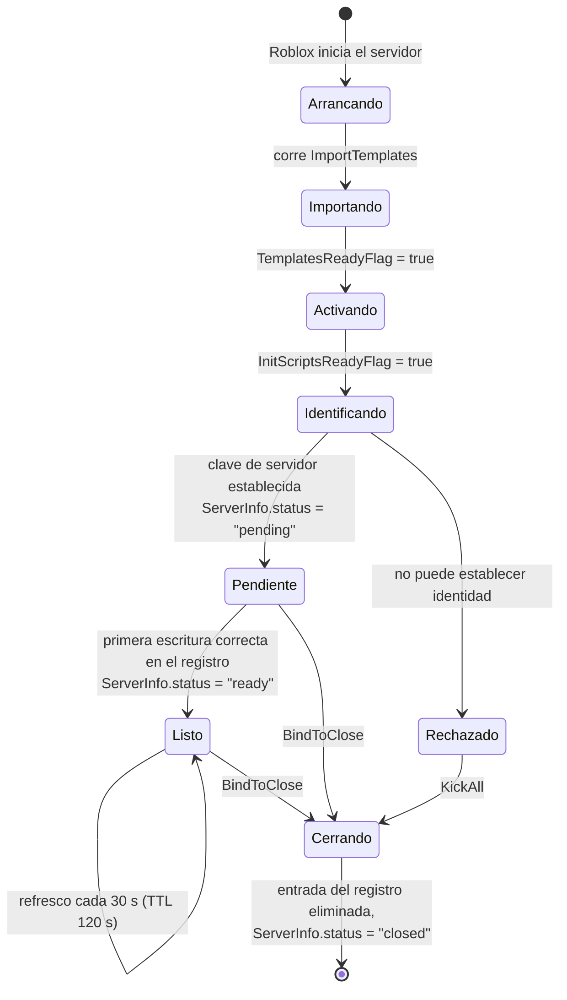
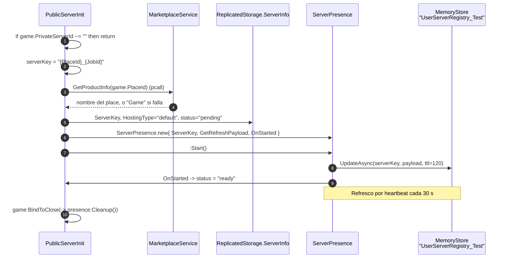
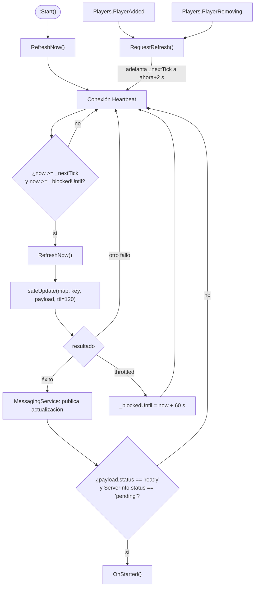

# Ciclo de vida del servidor

**No hay un único ciclo de vida de servidor en Voz Hispana.** Hay tres, porque hay tres
tipos de place, y cuál corre un servidor lo decide lo que hay en su DataModel una vez
termina la [importación de plantillas](./initialization.md).

| Tipo de servidor | Lo decide | Script del ciclo de vida |
|---|---|---|
| **Place público** (lobby, karaoke, arcade, plsDonate) | `game.PrivateServerId == ""` | `GameWorlds/ServerScriptService/ServerScripts/PublicServerInit.lua.server.luau` |
| **Casa de jugador** (servidor reservado) | `TeleportData.key` en el primer jugador que entra | `PlayerHouses/ServerScriptService/PlayerWorld_Init.lua.server.luau` |
| **Servidor de evento** (servidor reservado) | Entrada del registro con `hostingType == "event"` | `Core/ServerStorage/WorldSystem/EventService.luau` |

Los tres convergen en un componente compartido, [`ServerPresence`](/api/ServerPresence),
que anuncia el servidor en un registro respaldado por MemoryStore para que otros
servidores puedan encontrarlo y teletransportar hacia él.

## Forma común



**HECHO.** `ServerInfo` es una instancia `Configuration` en `ReplicatedStorage` cuyo
atributo `status` recorre `pending → ready → closed`, y que además lleva el atributo
`ServerKey`. Es la declaración visible para el cliente de en qué punto del ciclo está
este servidor.

## Places públicos

**HECHO.** `PublicServerInit.lua.server.luau` tiene 68 líneas y hace exactamente una
cosa: registrar el servidor en el directorio vivo.



Dos hechos que conviene destacar:

- **La guarda es lo primero que corre.** `if game.PrivateServerId ~= "" then return end`
  significa que este script no hace absolutamente nada en un servidor reservado. Un
  servidor de casa y uno público pueden así distribuir la misma plantilla `GameWorlds`
  sin conflicto.
- **La clave de servidor es `"{PlaceId}_{JobId}"`.** Es una *forma de clave distinta* de
  la que usan las casas (`"{UserId}_{roomName}"`), y esa diferencia es como `WorldManager`
  las distingue. Ver [Servidores reservados](./reserved-servers.md).

## Casas de jugador

Cubierto en profundidad en [Casas](../systems/housing/overview.md). En términos de ciclo
de vida:

**HECHO.** `PlayerWorld_Init.lua.server.luau` no arranca al iniciar el servidor. Arranca
cuando llega el *primer jugador*, porque la identidad de la casa viaja en el
`TeleportData` de ese jugador:

```lua
Players.PlayerAdded:Once(onPlayerAdded)
```

`:Once`, no `:Connect`. Junto con las guardas `booting`/`presence` de `onPlayerAdded`, un
servidor de casa se inicializa a partir de exactamente un jugador, una sola vez.

**INFERENCIA.** Un servidor de casa reservado al que nadie llega nunca se inicializa,
nunca reclama un lease y nunca se registra. Queda inerte hasta que Roblox lo recupera.

## Servidores de evento

**HECHO.** `EventService.luau` es el único otro módulo que llama a
`TeleportService:ReserveServer`. Los eventos se registran con `hostingType = "event"` y
se entra por el `accessCode` guardado, nunca por `jobId` —
`WorldManager.JoinServerFunc` trata ese caso explícitamente:

```lua
-- El evento corre en un servidor reservado: hay que entrar con su accessCode,
-- no por jobId. El code sale del registro de MemoryStore, nunca del cliente.
if hostingType == "event" then
    return teleportToHost(player, serverKey, { placeId = entry.placeId, accessCode = entry.code })
end
```

## Presencia: cómo un servidor sigue siendo localizable

**HECHO.** [`ServerPresence`](/api/ServerPresence) mantiene una entrada en el hash map de
MemoryStore `UserServerRegistry_Test`, con la clave del servidor.

| Constante | Valor | Significado |
|---|---|---|
| `ACTIVE_TTL` | 120 s | Vida de la entrada del registro |
| `UPDATE_INTERVAL` | 30 s | Cadencia normal de refresco |
| `REFRESH_DEBOUNCE` | 2 s | Ventana de agrupación para refrescos por entrada/salida de jugadores |
| `THROTTLE_COOLDOWN` | 60 s | Pausa cuando MemoryStore reporta throttling |
| `MAX_RETRIES` | 6 | Presupuesto de reintentos para un fallo que no sea throttle |
| `RETRY_BASE_WAIT` | 0,25 s | Base del backoff exponencial |



### El throttling se trata distinto que el fallo

**HECHO.** `isThrottled()` busca `RequestThrottled` o `TotalRequestsOverLimit` en el texto
del error, y en ese caso el código deja de reintentar del todo durante 60 s. El
comentario del código lo razona sin rodeos: un throttle es la cuota de MemoryStore del
universo agotándose, y reintentar lo prolonga. 60 s queda holgadamente por debajo del TTL
de 120 s, así que la entrada no llega a expirar durante un cooldown.

La misma distinción aparece en `Lease`, dentro de `DataKit`. Es un patrón deliberado y
aplicado con coherencia en todo el código, no un truco local.

## Apagado

**HECHO.** Tanto `PublicServerInit` como `PlayerWorld_Init` enganchan la limpieza a
`game:BindToClose`. `ServerPresence.Cleanup` hace, en este orden:

1. desconectar la conexión de heartbeat;
2. desconectar las conexiones `PlayerAdded` / `PlayerRemoving`;
3. ejecutar el callback `OnCleanup` del llamante, si lo hay;
4. `RemoveAsync` de la entrada del registro (con reintentos y manejo de throttle);
5. publicar `UserServerRegistryClosed` por `MessagingService`;
6. poner `ServerInfo.status = "closed"`.

El paso 2 es determinante, y el código dice por qué:

```lua
-- Guardadas para poder soltarlas en Cleanup. Si sobreviven al cierre, el jugador que sale
-- reescribe la key que Cleanup acaba de borrar, y el servidor muerto se queda anunciado
-- en el directorio hasta que expira su TTL.
```

Es decir: sin desconectar primero, un `PlayerRemoving` disparado durante el apagado
recrearía la entrada que el paso 4 acaba de borrar, y un servidor muerto seguiría
anunciado hasta 120 s.

### Qué pasa si `BindToClose` no llega a completarse

**TEORÍA — requiere verificación en ejecución.** Roblox da a `BindToClose` una ventana
acotada (documentada por Roblox como 30 segundos). `Cleanup` hace un `RemoveAsync` con
hasta 6 reintentos y backoff exponencial, y luego una publicación por `MessagingService`.
Si el proceso muere antes —o si MemoryStore está haciendo throttling, en cuyo caso
`safeRemove` abandona la eliminación por diseño— la entrada del registro sobrevive hasta
que expira su TTL de 120 s.

El TTL es lo que acota el daño: una entrada obsoleta no puede sobrevivirlo. Si dentro de
esa ventana una entrada obsoleta provoca un fallo visible para el usuario depende de cómo
maneje el consumidor un teleport a un `jobId` muerto, lo cual es una propiedad de
ejecución. Registrado como
[BUG-CANDIDATE-002](../testing/verification-plan.md#bug-candidate-002).

## Trabajo periódico y de larga duración

**HECHO.** El trabajo recurrente del lado servidor que se establece en el arranque:

| Trabajo | Mecanismo | Cadencia |
|---|---|---|
| Refresco del TTL del registro | `RunService.Heartbeat` en `ServerPresence` | 30 s (2 s cuando hay debounce) |
| Keepalive del lease | `RunService.Heartbeat` en `DataKit.Lease` | 30 s (TTL 120 s) |
| Autoguardado del Store | `Store._heartbeat` | 300 s por defecto |
| Sondeo de mensajes del Store | `Store._pollMessages` | 10 s por defecto, solo si el perfil declara `onMessage` |
| Resolución de propiedad | `Store._resolveOwnership` | como mucho cada 3 s hasta resolverse |

Todos van dirigidos por heartbeat con su propia aritmética de plazos, en vez de por
bucles `task.wait`, así que ninguno acumula deriva ni sobrevive a un `Disconnect`.
