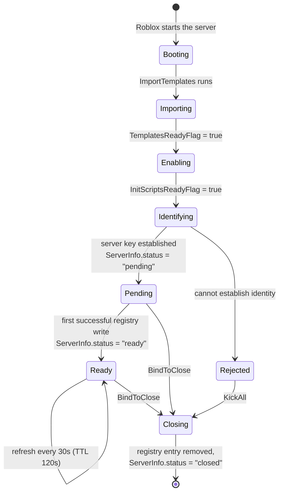
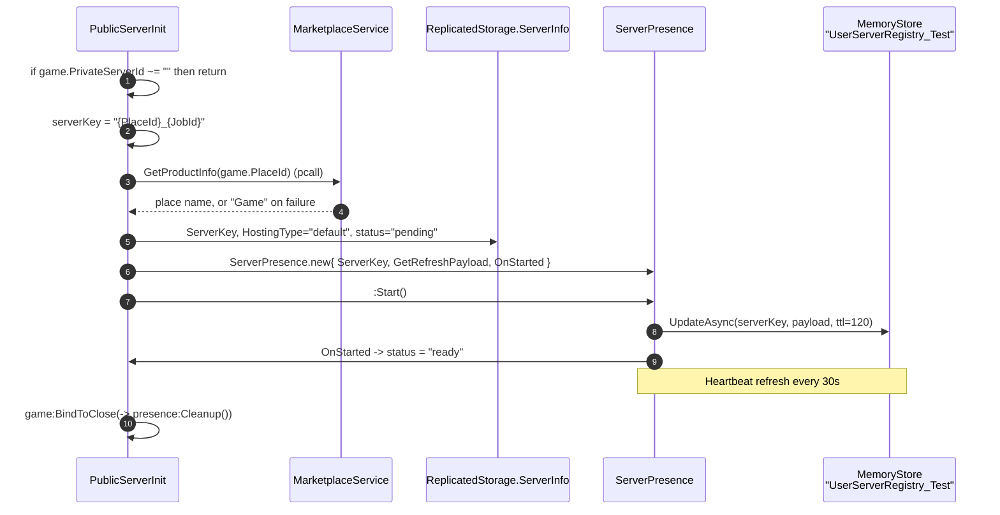
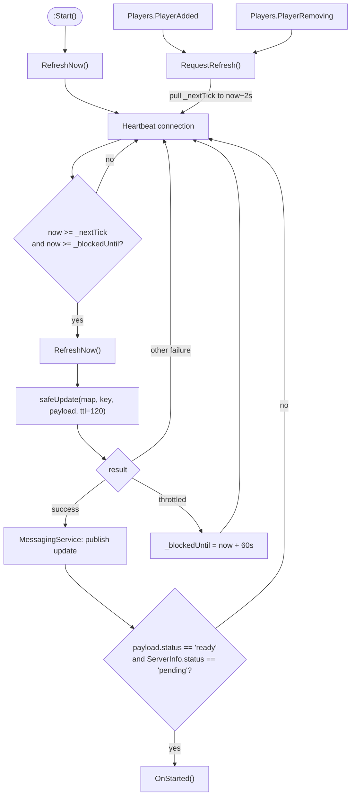

# Server lifecycle

There is **no single server lifecycle in Voz Hispana.** There are three, because there
are three kinds of place, and which one a server runs is decided by what is present in
its DataModel after the [template import](./initialization.md) finishes.

| Server kind | Decided by | Lifecycle script |
|---|---|---|
| **Public place** (lobby, karaoke, arcade, plsDonate) | `game.PrivateServerId == ""` | `GameWorlds/ServerScriptService/ServerScripts/PublicServerInit.lua.server.luau` |
| **Player house** (reserved server) | `TeleportData.key` present on the first joining player | `PlayerHouses/ServerScriptService/PlayerWorld_Init.lua.server.luau` |
| **Event server** (reserved server) | Registry entry with `hostingType == "event"` | `Core/ServerStorage/WorldSystem/EventService.luau` |

All three converge on one shared component,
[`ServerPresence`](/api/ServerPresence), which announces the server to a
MemoryStore-backed registry so that other servers can find and teleport into it.

## Common shape



**FACT.** `ServerInfo` is a `Configuration` instance in `ReplicatedStorage` whose
`status` attribute moves `pending → ready → closed`, and which also carries the
`ServerKey` attribute. It is the client-visible statement of where this server is in its
lifecycle.

## Public places

**FACT.** `PublicServerInit.lua.server.luau` is 68 lines and does exactly one thing:
register the server in the live directory.



Two facts worth pulling out:

- **The guard is the first thing that runs.** `if game.PrivateServerId ~= "" then return end`
  means this script does nothing at all in a reserved server. A house server and a
  public server can therefore ship the same `GameWorlds` template without conflict.
- **The server key is `"{PlaceId}_{JobId}"`.** This is a *different key shape* from the
  one houses use (`"{UserId}_{roomName}"`), and that difference is how
  `WorldManager` tells the two apart. See [Reserved servers](./reserved-servers.md).

## Player houses

Covered in depth under [Housing](../systems/housing/overview.md). In lifecycle terms:

**FACT.** `PlayerWorld_Init.lua.server.luau` does not start on server start. It starts
when the *first player arrives*, because the house's identity travels in that player's
`TeleportData`:

```lua
Players.PlayerAdded:Once(onPlayerAdded)
```

`:Once` — not `:Connect`. Combined with the `booting`/`presence` guards in
`onPlayerAdded`, a house server initialises from exactly one player, once.

**INFERENCE.** A reserved house server that nobody ever joins never initialises,
never claims a lease, and never registers itself. It is inert until Roblox reclaims it.

## Event servers

**FACT.** `EventService.luau` is the only other module that calls
`TeleportService:ReserveServer`. Events are registered with `hostingType = "event"` and
are joined through the stored `accessCode`, never by `jobId` —
`WorldManager.JoinServerFunc` handles that case explicitly:

```lua
-- El evento corre en un servidor reservado: hay que entrar con su accessCode,
-- no por jobId. El code sale del registro de MemoryStore, nunca del cliente.
if hostingType == "event" then
    return teleportToHost(player, serverKey, { placeId = entry.placeId, accessCode = entry.code })
end
```

## Presence: how a server stays discoverable

**FACT.** [`ServerPresence`](/api/ServerPresence) maintains one entry in the MemoryStore
hash map `UserServerRegistry_Test`, keyed by the server key.

| Constant | Value | Meaning |
|---|---|---|
| `ACTIVE_TTL` | 120 s | Lifetime of the registry entry |
| `UPDATE_INTERVAL` | 30 s | Normal refresh cadence |
| `REFRESH_DEBOUNCE` | 2 s | Coalescing window for player join/leave triggered refreshes |
| `THROTTLE_COOLDOWN` | 60 s | Pause after MemoryStore reports throttling |
| `MAX_RETRIES` | 6 | Retry budget for a non-throttle failure |
| `RETRY_BASE_WAIT` | 0.25 s | Base of the exponential backoff |



### Throttling is treated differently from failure

**FACT.** `isThrottled()` matches `RequestThrottled` or `TotalRequestsOverLimit` in the
error text, and the code stops retrying entirely for 60 s in that case. The source
comment states the reasoning plainly: a throttle is the universe's MemoryStore quota
being exhausted, and retrying prolongs it. 60 s is comfortably under the 120 s TTL, so
the entry does not expire during a cooldown.

The same distinction appears in `Lease`, in `DataKit`. It is a deliberate,
consistently-applied pattern across the codebase, not a local trick.

## Shutdown

**FACT.** Both `PublicServerInit` and `PlayerWorld_Init` bind cleanup to
`game:BindToClose`. `ServerPresence.Cleanup` performs, in order:

1. disconnect the heartbeat connection;
2. disconnect the `PlayerAdded` / `PlayerRemoving` connections;
3. run the caller's `OnCleanup` callback, if any;
4. `RemoveAsync` the registry entry (with retry/throttle handling);
5. publish `UserServerRegistryClosed` over `MessagingService`;
6. set `ServerInfo.status = "closed"`.

Step 2 is load-bearing, and the source says why:

```lua
-- Guardadas para poder soltarlas en Cleanup. Si sobreviven al cierre, el jugador que sale
-- reescribe la key que Cleanup acaba de borrar, y el servidor muerto se queda anunciado
-- en el directorio hasta que expira su TTL.
```

That is: without disconnecting first, a `PlayerRemoving` firing during shutdown would
re-create the entry that step 4 just deleted, and a dead server would stay advertised for
up to 120 s.

### What happens if `BindToClose` does not complete

**THEORY — requires runtime verification.** Roblox gives `BindToClose` a bounded window
(documented by Roblox as 30 seconds). `Cleanup` performs a `RemoveAsync` with up to 6
retries and exponential backoff, then a `MessagingService` publish. If the process dies
first — or if MemoryStore is throttling, in which case `safeRemove` abandons the removal
by design — the registry entry survives until its 120 s TTL expires.

The TTL is what bounds the damage: a stale entry cannot outlive it. Whether a stale
entry inside that window causes a user-visible failure depends on how the consumer
handles a teleport to a dead `jobId`, which is a runtime property.
Recorded as [BUG-CANDIDATE-002](../testing/verification-plan.md#bug-candidate-002).

## Periodic and long-lived work

**FACT.** The recurring server-side work established at boot:

| Work | Mechanism | Cadence |
|---|---|---|
| Registry TTL refresh | `RunService.Heartbeat` in `ServerPresence` | 30 s (2 s when debounced) |
| Lease keepalive | `RunService.Heartbeat` in `DataKit.Lease` | 30 s (TTL 120 s) |
| Store autosave | `Store._heartbeat` | 300 s default |
| Store message polling | `Store._pollMessages` | 10 s default, only when a profile declares `onMessage` |
| Ownership resolution | `Store._resolveOwnership` | at most every 3 s until resolved |

All of them are heartbeat-driven with their own deadline arithmetic rather than
`task.wait` loops, so none of them accumulate drift or survive a `Disconnect`.
