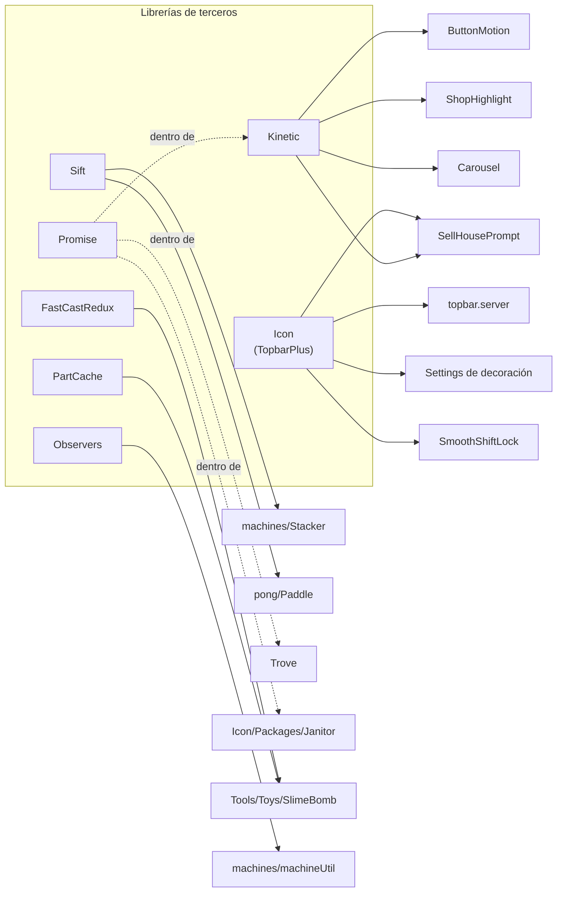

# Librerías de terceros

Nueve librerías que no escribió este proyecto, **160 archivos y 20 347 líneas**: el 25 % de
todo el código Luau del repositorio.

(El inventario marca 169 archivos como frontera. Los otros 9 son el interior de
[DataKit](./datakit.md) que no se abrió; sus clases principales sí se leyeron y figuran
aparte.)

Esta página documenta su **frontera**: qué son, de dónde vienen, quién las usa aquí y para
qué. No su interior. Es la misma decisión que con [DataKit](./datakit.md), y por la misma
razón: tienen su documentación aguas arriba, y reescribirla peor no ayuda a nadie.

Lo que sí hace falta —y no está en ningún otro sitio— es **el mapa de qué depende de qué en
este repositorio**. Eso es lo que hay aquí.

## El censo

| Librería | Archivos | Líneas | Qué es | Consumidores aquí |
|---|---|---|---|---|
| [`Sift`](https://csqrl.github.io/sift/) | 101 | 3 607 | Manipulación inmutable de arrays, diccionarios y conjuntos | 3 |
| [`Icon` (TopbarPlus v3)](https://1foreverhd.github.io/TopbarPlus/) | 21 | 5 523 | La barra superior: iconos, temas, widgets | 12 |
| `Kinetic` | 20 | 4 137 | Animación por muelles y transiciones | 4 |
| [`Promise`](https://eryn.io/roblox-lua-promise/) | 2 | 3 910 | Promesas al estilo A+ | 4 (todos indirectos) |
| [`Trove`](https://sleitnick.github.io/RbxUtil/api/Trove) | 1 | 612 | Contenedor de limpieza | 16 |
| [`Signal`](https://github.com/stravant/goodsignal) | 1 | 432 | Señal *batched yield-safe*, MIT | 14 |
| [`FastCastRedux`](https://etithespirit.github.io/FastCastAPIDocs) | 6 | 1 280 | Proyectiles por *raycast* en vez de por física | 1 |
| [`Observers`](https://sleitnick.github.io/RbxObservers/) | 6 | 549 | Observadores de etiqueta, atributo, propiedad y jugador | 1 |
| `PartCache` | 2 | 297 | Reserva de piezas precreadas, para no crearlas en caliente | 3 |

`Spring.luau` (31 líneas) y `lerp.luau` (5) también vienen de fuera, pero se leyeron enteros
y figuran como **Analizado** en el inventario: decir «no se lee por dentro» de cinco líneas
sería falso. Están en el [catálogo de utilidades](../systems/shared-utilities.md#de-terceros-no-del-proyecto).

**HECHO.** Los recuentos de consumidores salen de buscar cada nombre en los 552 `.luau`.
Como en el [catálogo de utilidades](../systems/shared-utilities.md#cómo-se-leyó-esto), **son
un suelo**: hay 320 `.rbxm` cuyo código va comprimido y `grep` no lo ve.

## Quién usa qué

**HECHO — y esto merece un párrafo.** `Promise` (3 910 líneas, la segunda librería más
grande) **no la requiere directamente ningún código de juego**. Sus cuatro consumidores son
`Trove`, el `Janitor` que `Icon` trae dentro, y dos archivos de `Kinetic`. Es una dependencia
de dependencias, no una decisión de este proyecto.

**HECHO.** `FastCastRedux` (1 280 líneas) y `PartCache` (297) las usa **un solo archivo**:
`Assets/Tools/Toys/SlimeBomb/Script.server.luau`. Mil seiscientas líneas de librería para una
bomba de babas.

Eso no es una crítica —son librerías buenas y el que las trajo hizo lo correcto al no
reescribirlas— pero es el tipo de dato que hace falta antes de decidir qué se poda si algún
día importa el tamaño del place.

**HECHO.** `Icon` es la más usada, con 12 consumidores, y la única presente en la ruta que ve
todo jugador nada más entrar: la barra superior. Ver
[Cliente — interfaz](../systems/client-ui.md#la-barra-superior).

## Por qué no se documentan por dentro

Tres razones, en orden de peso:

1. **Tienen documentación propia y mejor.** Los enlaces de la tabla llevan a ella. Copiar
   aquí una versión resumida solo crearía una segunda fuente que envejece sola.
2. **No es donde están las preguntas de este proyecto.** Este sitio existe para explicar
   cómo funciona *este juego* y dónde puede fallar. Un fallo en `Sift.Array.At` sería un
   fallo de `Sift`, y se arreglaría actualizando `Sift`.
3. **Su superficie de ataque es indirecta.** Ninguna de las siete abre un `RemoteEvent`, lee
   un `DataStore` ni toca `leaderstats`. Lo que llega del cliente pasa siempre antes por
   código de este repositorio, que es donde se comprueba —o no—.

**Lo que sí se hace**, y está en el resto del sitio: allí donde una librería aparece en un
camino que sí importa, se nombra. `Trove` en la limpieza de las máquinas,
`Icon` en la barra superior, `Sift` en el estado de `Stacker` y `Pong`.

## Lo que sí conviene saber de cada una

**HECHO.** Sin entrar en su interior, hay cuatro cosas de su presencia aquí que cambian cómo
se lee el resto del repositorio:

| Hecho | Por qué importa |
|---|---|
| `Trove` y `Janitor` **coexisten** | Son dos librerías de limpieza con el mismo propósito. `Trove` es del proyecto; `Janitor` viene dentro de `Icon`. No es un conflicto —cada una limpia lo suyo— pero quien busque «cómo se limpia aquí» va a encontrar dos respuestas |
| `Signal` (de `Shared/`) y `Client/Event.luau` **también coexisten** | Tres implementaciones de señal en total contando la de `DataKit`. Ver [Utilidades compartidas](../systems/shared-utilities.md) |
| Ninguna está fijada a una versión en ningún manifiesto | **No hay `wally.toml` en el repositorio.** Las siete están copiadas al árbol, y `DataKit` también. Actualizar cualquiera de ellas es un copiar y pegar manual, y no hay forma de saber desde aquí qué versión es cada una salvo por lo que digan sus propios comentarios — que en `FastCastRedux` avisa de que suele estar desfasado |
| `Icon` es `--!nonstrict` y `FastCastRedux` es `--!nocheck` | Quedan fuera del análisis de tipos de Luau. Es decisión de sus autores, y significa que un error de tipos en esos 6 800 líneas no lo va a encontrar la herramienta |

**HECHO.** Lo único que gestiona versiones en este repositorio es `rokit.toml`, y lo que
gestiona son **herramientas** —Rojo 7.7.0—, no librerías de Luau. No existe `wally.toml` ni
carpeta `Packages/`.

**Qué significa en la práctica:** si mañana sale un parche de seguridad de `Icon`, no hay
comando que lo traiga. Alguien tiene que ir al repositorio de arriba, comparar a mano y
pegar. Y como no está escrito en ninguna parte qué versión hay aquí, ese alguien tendrá que
empezar por averiguarlo.

## Qué queda por leer

**Nada, a propósito.** Las siete librerías quedan marcadas como frontera documentada:
su papel y sus consumidores están arriba, su interior no se leerá.

Si alguna vez hace falta abrir una, será por una de estas dos razones, y conviene decirlo
ahora para que quien lo haga sepa que no está rompiendo una regla:

- Un candidato a bug apunta dentro de ella y hay que confirmarlo.
- Se plantea actualizarla o quitarla, y hace falta saber qué se rompe.

## Implementación relacionada

| Librería | Ruta |
|---|---|
| `Sift` | `Core/ReplicatedStorage/Shared/Sift/` |
| `Icon` | `Core/ReplicatedStorage/Shared/Icon/` |
| `Kinetic` | `Core/ReplicatedStorage/Kinetic/` |
| `Promise` | `Core/ReplicatedStorage/Shared/Promise/` |
| `FastCastRedux` | `Core/ReplicatedStorage/Shared/FastCastRedux/` |
| `Observers` | `Core/ReplicatedStorage/Shared/Observers/` |
| `PartCache` | `Core/ReplicatedStorage/Shared/PartCache/` |
| `DataKit` (aparte) | `Core/ServerStorage/DataKit/` — ver [DataKit](./datakit.md) |
