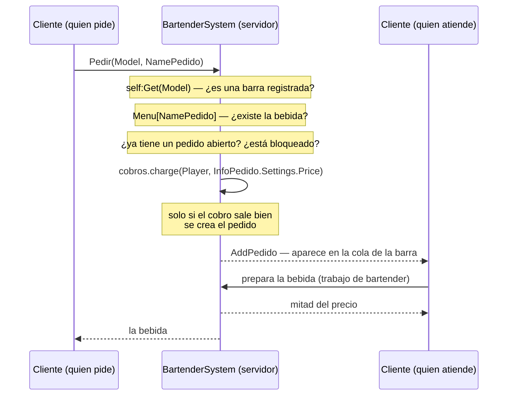

# Barra, NPC y diálogos

Tres sistemas que comparten forma: entidades del mundo etiquetadas con
`CollectionService`, una clase por entidad, y el mismo idioma de doble contexto que usan
[Tiendas](./stores.md) y [Karaoke](./karaoke.md).

| Sistema | Archivos | Líneas | Etiqueta |
|---|---|---|---|
| Barra de bartender | `Shared/BartenderSystem/` | 843 | `BarraBartender` |
| NPC personalizables | `Shared/NPC_Custom/` | 483 | — |
| Diálogos | `Shared/DialogModule/` | 405 | — |

## La barra

**HECHO.** Es la contraparte del [trabajo de bartender](./jobs.md): un jugador pide una
bebida, otro —el que está trabajando— la prepara, y quien la prepara cobra la mitad del
precio.

Cinco remotes en `Events/BartenderSystem`, y el despacho lo hace `actionBarras(action, …)`
con la acción **fijada en el sitio de la conexión**:

```lua
self.Events:WaitForChild("Pedir").OnServerEvent:Connect(function(...) self:actionBarras("pedir", ...) end)
self.Events:WaitForChild("ClosePedido").OnServerEvent:Connect(function(...) self:actionBarras("close", ...) end)
```

**Registrado como correcto.** La cadena de acción **no viaja en la carga útil**: cada remote
está atado a una acción concreta, igual que en los
[televisores de karaoke](./karaoke.md#despacho-por-nombre-de-remote) y al contrario que en
[Trabajos](./jobs.md), donde sí la manda el cliente y hace falta lista blanca.

### Pedir una bebida

```lua
local InfoPedido = self.boliche.Menu[NamePedido]
if not InfoPedido then return end
...
elseif not self.boliche.Pedidos[Player] and not self.UserBlockPedidos[Player] then
	if cobros.charge(Player, InfoPedido.Settings.Price, true) then
		local list = table.clone(InfoPedido)
		list.Stack = nil
		self.Pedidos[Player] = list
		self.boliche.Pedidos[Player] = self
		self.AddPedido:Fire(Player)
	else
		warn("no hay plata")
	end
```

**Registrado como correcto**, en cuatro puntos a la vez:

| Control | Cómo |
|---|---|
| El producto tiene que existir | `Menu[NamePedido]` es una búsqueda en tabla: un nombre inventado devuelve `nil` y corta |
| El precio no lo pone el cliente | Sale de `InfoPedido.Settings.Price` |
| **Se cobra antes de crear el pedido** | Al revés que [BUG-CANDIDATE-008](../testing/verification-plan.md#bug-candidate-008) |
| Un pedido a la vez por jugador | `not self.boliche.Pedidos[Player]`, más una lista de bloqueados |

El recorrido completo de un pedido, con quién decide cada cosa:



**HECHO.** `ChangeStack`, pese al nombre, **no acepta existencias del cliente**: cuando el
servidor lo recibe responde con la lista actual y nada más. La rama que aplica valores es la
del cliente, sobre lo que le mandó el servidor.

**OBSERVACIÓN.** El modelo de la barra viene del cliente y se resuelve con `self:Get(Model)`
contra las barras registradas, así que tiene que ser una barra real — pero **no se comprueba
la distancia**. Entra dentro de
[BUG-CANDIDATE-025](../testing/verification-plan.md#bug-candidate-025).

**HECHO.** Al salir un jugador se limpian sus dos rastros: `RemoveDrops(player)` y el cierre
de su pedido en curso.

## Los NPC

**HECHO.** `NPC_Custom` es una clase por NPC con acciones declaradas aparte
(`Actions.luau`) y ajustes de personalización (`CustomizeSettings.luau`). No declara
remotes propios: quien lo conecta con el jugador es el interactuable `NpcDialog`, que
**sí** valida —tipo, `IsA("Model")` y etiqueta— según la
[matriz de Interactuables](./interactables.md#la-matriz-de-validación).

## Los diálogos

**HECHO.** `DialogModule` es interfaz de cliente. Su única salida al servidor es avisar de
que se entra y se sale de un diálogo:

```lua
EventFocus:FireServer(self.npc, true)   -- al abrir
EventFocus:FireServer(self.npc, false)  -- al cerrar
```

Ese remote es `Interactable/FocusNpcDialog`, uno de los ocho que **sí** comprueban la
etiqueta del modelo.

**HECHO.** Los textos de diálogo salen de datos del juego, no de los jugadores: no hay
ninguna entrada de texto libre en este módulo, y por tanto tampoco hace falta filtrado.
Es distinto del caso de [Karaoke](./karaoke.md#el-filtrado-de-texto), donde el contenido sí
lo escriben los jugadores.

## Controles que sí sujetan

| Control | Cómo |
|---|---|
| **La acción de la barra no la elige el cliente** | Cada remote está atado a una acción fija en el sitio de la conexión |
| **Una bebida inexistente no se puede pedir** | `Menu[NamePedido]` corta si no está |
| **Se cobra antes de registrar el pedido** | `cobros.charge` y solo entonces se crea |
| **Un jugador no acumula pedidos** | Uno por jugador, más lista de bloqueados |
| **`ChangeStack` no acepta existencias del cliente** | En el servidor solo responde con las actuales |
| **Salir limpia pedidos y objetos soltados** | `PlayerRemoving` → `RemoveDrops` y cierre del pedido |

## Qué queda por leer

| Archivo | Líneas | Estado |
|---|---|---|
| `BartenderSystem/init.luau` | 233 | Leído |
| `BartenderSystem/Instance/init.luau` | 549 | **En parte** — `Pedir`, `ClosePedido` y la superficie de red; no la coreografía de preparar la bebida |
| `BartenderSystem/Instance/ActionsBartender.luau` | 61 | **Pendiente** |
| `NPC_Custom/` (5 archivos) | 483 | **En parte** — su forma y que no tiene remotes propios |
| `DialogModule/init.luau` | 405 | **En parte** — su salida al servidor y que no maneja texto de jugadores |

## Implementación relacionada

| Aspecto | Código |
|---|---|
| Despacho de la barra | `Shared/BartenderSystem/init.luau`, `actionBarras`, `init` |
| Pedido y cobro | `BartenderSystem/Instance/init.luau`, `Pedir`, `ClosePedido` |
| Pago al bartender | `Shared/JobSystem/Bartender.luau` — ver [Trabajos](./jobs.md) |
| NPC | `Shared/NPC_Custom/`; el interactuable `NpcDialog` |
| Diálogos | `Shared/DialogModule/init.luau` |
