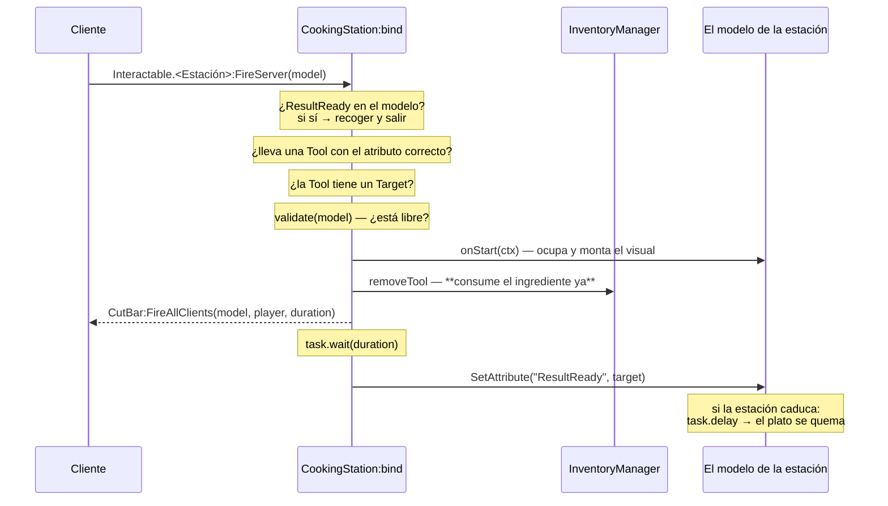

# Cocina

Cuatro estaciones que comparten una clase base —batidora, microondas, horno y fogón— más la
tabla de cortar, que va por su cuenta. 832 líneas de servidor y 642 de cliente.

El [barrido](./survey.md) las había mirado solo por sus `bind`. Esta página las lee.

## La clase base

**HECHO.** `CookingStation.luau` (269) hace todo el trabajo y las cuatro estaciones son
subclases de veinte a doscientas líneas que rellenan cinco huecos:

| Método | Qué decide |
|---|---|
| `matchAttribute(tool)` | Qué atributo de la herramienta acepta esta estación (`Blendable`, `Fryable`…) |
| `validate(model)` | Si la estación está libre |
| `onStart(ctx)` | El montaje visual; devuelve una función de limpieza |
| `onCancel(ctx)` | Deshacer si se interrumpe |
| `onExpire(model)` | Qué pasa si el resultado se deja demasiado tiempo |

**Registrado como correcto — el reparto.** Todo lo que toca inventario, red y tiempos vive
en la base, una sola vez. Una estación nueva no puede olvidarse de una comprobación porque no
es suya. Es lo contrario de lo que pasa en
[Interactuables](./interactables.md#la-matriz-de-validación), donde cada autor resuelve la
validación por su cuenta o no la resuelve.

## El ciclo de una receta



**Registrado como correcto**, en tres puntos:

| Control | Cómo |
|---|---|
| **El ingrediente se consume antes de esperar** | `ctx.removeTool()` justo tras `onStart`, no al terminar. Al revés que [BUG-CANDIDATE-008](../testing/verification-plan.md#bug-candidate-008) |
| **El resultado no lo elige el cliente** | Sale de `tool.Target`, un `ObjectValue` del propio objeto, no de la carga útil |
| **Ocupar la estación es atómico** | `validate(model)` y `onStart` no ceden entre medias, así que dos llamadas simultáneas no pasan las dos |

Ese tercer punto no es casualidad: `Blender:validate` mira `Active` y `onStart` lo pone;
`Stove:validate` mira `Occupant` y `onStart` lo asigna. En los cuatro casos la comprobación y
la marca están pegadas.

**HECHO.** `Microwave:validate` va un paso más allá y lleva su razón escrita:

```lua
-- Evita usar el microondas mientras cocina o mientras hay un resultado pendiente.
return not model:GetAttribute("Active") and not model:GetAttribute("ResultReady")
```

## Recoger el plato

**HECHO.** Lo primero que hace el manejador, antes que ninguna otra comprobación:

```lua
local resultReady = model:GetAttribute("ResultReady")
if resultReady then
	model:SetAttribute("ResultReady", nil)
	...
	InventoryManager.addItem(player, resultReady)
	InventoryManager.equipTool(player, resultReady)
	return
end
```

`model` viene del cliente. No se comprueba etiqueta, ni tipo, ni distancia, ni **quién
cocinó**. Queda registrado como
[BUG-CANDIDATE-050](../testing/verification-plan.md#bug-candidate-050).

## Observaciones registradas

**OBSERVACIÓN — el ingrediente no vuelve si se interrumpe.** `ctx.removeTool()` se ejecuta al
empezar, y `onCancel` —que corre al morir el jugador o al salir— deshace el visual y libera la
estación, pero **no devuelve la herramienta**. Morir mientras se cocina cuesta el ingrediente.

Es defendible como diseño: consumir por adelantado es lo correcto para que no se pueda cocinar
dos veces con lo mismo. Pero la devolución al cancelar no está escrita en ninguna parte, así
que no se puede saber si se decidió o se olvidó. Se anota como observación, no como candidato.

**OBSERVACIÓN — `CutBar` se difunde a todos.** `progressBarRemote:FireAllClients(model, player, duration)`
manda la barra de progreso a todo el servidor, no a quien está cerca. Con muchas estaciones a
la vez es tráfico que casi nadie usa. Es lo mismo que hacen las máquinas con `fireExcept`, y
no tiene consecuencia de corrección.

**HECHO.** La caducidad está bien pensada: `activeExpirations[model]` guarda el hilo, se
cancela si se recoge a tiempo, y `onExpire` deja que cada estación decida qué es «quemado».
`Stove` pinta la comida de negro y le quita la textura, que es más trabajo del que hacía falta.

## La tabla de cortar

**HECHO.** `CuttingBoard.server.luau` (113) **no** hereda de `CookingStation`: tiene sus
propios tres remotes —`StartCut`, `CancellCut`, `EndCut`— y su propia máquina de estados. Es
la excepción del grupo, y por tanto la que no hereda ninguna de las garantías de arriba.

## Qué queda por leer

| Archivo | Líneas | Estado |
|---|---|---|
| `CookingStation.luau` | 269 | **Leído** |
| `Blender`, `Oven`, `Stove` | 218 | **Leídos** |
| `Microwave.server.luau` | 232 | En parte — `validate` y la forma; su coreografía no |
| `CuttingBoard.server.luau` | 113 | En parte — su superficie de red |
| `Client/cooking/` (7 archivos) | 642 | **Superficie** — interfaz, sin autoridad |

## Implementación relacionada

| Aspecto | Código |
|---|---|
| Clase base y ciclo | `ServerScripts/cooking/CookingStation.luau`, `bind` |
| Las cuatro estaciones | `ServerScripts/cooking/interactables/` |
| Tabla de cortar | `ServerScripts/cooking/interactables/CuttingBoard.server.luau` |
| Inventario | `ServerScripts/inventory/InventoryManager` — ver [Inventario](./inventory.md) |
