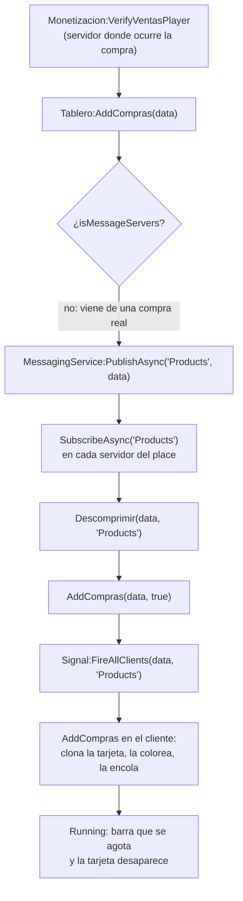

# Place de donaciones — teletipo y tabla global

`Shared/ComprasTablero/` (406 líneas) es lo que hace que el place de donaciones se sienta
vivo: el teletipo de compras recientes **de todos los servidores a la vez** y las dos tablas
globales de mayores compradores y mayores vendedores.

Es un segundo place, distinto del principal. Ver
[Tiendas](./stores.md#un-módulo-dos-juegos-dos-contextos) para la otra mitad —los puestos que se
reclaman— y [Cuadros](./paint.md) para lo que se vende en ellos.

## Está apagado en todas partes menos ahí

**HECHO.** Tres puertas independientes, todas contra el mismo id:

```lua
self.PlaceId_PlsDonate = 82871403803520
function module:Works()
	if game.PlaceId ~= self.PlaceId_PlsDonate then return end
```

`Works`, `UpdateLeaderboards` y `CreateRunning` comprueban cada una por su cuenta. En el
place principal el módulo se carga, se construye y no conecta nada.

**Registrado como correcto.** Que cada método vuelva a comprobarlo en vez de fiarse de que
`Works` no corrió es lo que hace que una llamada suelta desde fuera no despierte el sistema.

## El teletipo

**HECHO.** Recorrido de una compra hasta la pantalla de otro jugador en otro servidor:



**HECHO.** El origen es siempre servidor. `AddCompras` se llama desde
`Data/Main/init.server.luau`, dentro de `Monetizacion:VerifyVentasPlayer`, con los datos de
una venta ya consumada. **No hay ningún remote por el que un cliente pueda inyectar una
entrada en el teletipo.** El único remote del módulo es `Signal`, y va del servidor al
cliente.

**HECHO.** El color y la duración de la tarjeta salen del precio, con cuatro tramos en
`Settings.luau`:

| Precio en Robux | Color | Duración |
|---|---|---|
| > 100 000 | magenta | 60 s |
| > 10 000 | cian | 30 s |
| > 1 000 | naranja | 15 s |
| resto | verde | — (`TimeLife` solo tiene tres entradas) |

**OBSERVACIÓN.** `Settings.Colors` tiene cuatro tramos y `Settings.TimeLife` tres. Para el
tramo verde, `self.Settings.TimeLife[4]` es `nil`, y `CreateRunning` lo trata así:

```lua
local ElapsedTime = Gui.Life and (tick()-Gui.Start)/Gui.Life or 1
```

Con `Life` nulo, `ElapsedTime` vale 1, la barra se oculta (`Gui.Bar.Visible = ElapsedTime < 1`)
y la tarjeta **se queda sin caducar**. Las donaciones pequeñas permanecen hasta que las
empuja el tope de 100. Cuadra con lo que se esperaría de un teletipo —lo grande destaca y
se va, lo pequeño hace fondo— así que se anota como asimetría deliberada aparente, no como
candidato a bug.

## Las tablas globales

**HECHO.** Se apoyan en [`GlobalDataStore`](./global-storage.md), con dos claves
(`TopBuyers`, `TopSellers`) y el `UserId` como campo.

```lua
self.GlobalData:SetData("TopSellers", tostring(Player.UserId), self:GetStat(Data,"Sell"))
self.GlobalData:SetData("TopBuyers",  tostring(Player.UserId), self:GetStat(Data,"Buy"))
```

**HECHO.** Dos ritmos distintos, y conviene no confundirlos:

| Ritmo | Qué hace | Dónde |
|---|---|---|
| 40 s por jugador | Tope a cuántas veces se escribe el total de **un** jugador | `SaveChangePlayer`, `self.UpdateUpdatePlayer[Player]` |
| 3 min por servidor | Relee las dos tablas y las difunde a todos | El bucle de `UpdateLeaderboards` |

**HECHO.** El bucle se arranca perezosamente —`self.SpawnUpdateLeaderboard = … or task.spawn(…)`—
y `Data/Main` lo cancela explícitamente al apagar:

```lua
if Tablero.SpawnUpdateLeaderboard then
	task.cancel(Tablero.SpawnUpdateLeaderboard)
	Tablero.SpawnUpdateLeaderboard = nil
```

**Registrado como correcto.** Es limpieza explícita de un hilo de fondo, que es justo lo que
falta en varios de los sitios recogidos en el [plan de verificación](../testing/verification-plan.md).

## Lo que sí sujeta

| Control | Cómo |
|---|---|
| **El teletipo no acepta entradas del cliente** | `AddCompras` solo se llama desde el servidor, tras una venta consumada; el remote `Signal` va servidor → cliente |
| **Nada de esto corre fuera del place de donaciones** | Tres comprobaciones independientes contra `game.PlaceId` |
| **Los totales de la tabla no los manda el cliente** | Salen del perfil del jugador, no de un remote — aunque hoy esa ruta no llega a ejecutarse: ver [BUG-CANDIDATE-040](../testing/verification-plan.md#bug-candidate-040) |
| **Escribir el total de un jugador está limitado a una vez cada 40 s** | `UpdateUpdatePlayer` |
| **El hilo de fondo se cancela al apagar** | `task.cancel` en `Data/Main` |
| **Un nombre que no se puede resolver no rompe la tabla** | `pcall` alrededor de `GetNameFromUserIdAsync`, con `"Unknown"` de reserva |

## Lo que no sujeta

**OBSERVACIÓN.** `LeaderSignal.OnServerEvent` está conectado directamente a
`UpdateLeaderboards`, y el cliente lo dispara al entrar (`self.LeaderSignal:FireServer()`).
No hay límite de frecuencia: un cliente que lo dispare en bucle provoca un
`FireClient` con las dos tablas completas por cada disparo. El servidor no relee
`GlobalDataStore` en esa ruta —devuelve `self.LeaderActual`, ya en memoria— así que el coste
es de ancho de banda, no de cuota de DataStore. Entra en la misma familia que
[BUG-CANDIDATE-030](../testing/verification-plan.md#bug-candidate-030): un remote sin límite
de ritmo cuyo trabajo por llamada es pequeño.

**HECHO — y esto es lo grave.** `SaveChangePlayer` llama a un método que **no existe**:

```lua
Data = typeof(Data)=='table' and Data
    or (self.DataBase.Bye(Player) or {SaveAllStats = function() return {} end}):SaveAllStats()
```

`self.DataBase` es `PlayerDataReplicator`, inyectado por `Data/Main`. Su superficie pública
es `hydrate`, `markReady`, `setExitSequence`, `flush`, `finalize`, `DataComplete` y
`KaraokeFactory`. **No tiene `Bye`.** Ni `SaveAllStats` existe en ninguna parte del
repositorio salvo en el respaldo escrito ahí mismo, en esa línea.

El respaldo no salva nada: `A.Bye(Player) or B` evalúa `A.Bye(Player)` **primero**, y llamar
a `nil` lanza antes de que el `or` llegue a mirar la alternativa. El `or` protege contra que
`Bye` devuelva `nil`, no contra que `Bye` no exista.

Y el bucle de 3 minutos que lo llama no tiene `pcall`. Consecuencia en cadena, registrada
como [BUG-CANDIDATE-040](../testing/verification-plan.md#bug-candidate-040):

| Paso | Qué pasa |
|---|---|
| Primer jugador con datos cargados | `SaveChangePlayer` lanza |
| El `task.spawn` sin `pcall` | muere en la primera vuelta |
| `self.SpawnUpdateLeaderboard` | sigue apuntando al hilo muerto, así que la guarda perezosa impide rearrancarlo |
| `GetLeaderboard` | nunca llega a ejecutarse |
| `self.LeaderActual` | se queda en `nil` |
| El cliente | recibe `{}` y muestra el cartel de «no hay jugadores» |

**Las dos tablas globales están vacías, siempre.** Y como el escritor y el lector son el
mismo bucle, ni siquiera hay datos viejos que mostrar: las claves `RatingBuyers` y
`RatingSellers` de `GlobalDataStore` **no las escribe nadie más en todo el repositorio**.

**OBSERVACIÓN.** Aguas abajo del mismo bucle hay una segunda fragilidad que hoy nunca se
alcanza: `GetLeaderboard` llama a `GetUserThumbnailAsync` **fuera** del `pcall` que sí
envuelve a `GetNameFromUserIdAsync`. Si el fallo de `Bye` se arreglara, ese sería el
siguiente en matar el mismo hilo de la misma manera.


## El catálogo: `ShopInfo`

**HECHO.** `ReplicatedStorage/ShopInfo.luau` (228 líneas) es la declaración única de qué se
vende por Robux: 18 entradas, 4 gamepasses y 14 productos de desarrollador.

| Campo | Para qué |
|---|---|
| `Type` | `"GamePass"` o `"DevProduct"` |
| `MainId` | El id de la compra para uno mismo |
| `GiftProductId` | El id de la compra para regalar |
| `Giftable` | Si la interfaz ofrece regalarlo |
| `ToolName` | Solo gamepasses: la herramienta que concede |
| `Currency` / `Amount` | Solo paquetes de moneda |

**HECHO.** Dos entradas —`cofre` y `StartPack`— tienen `MainId = PENDIENTE_DE_CREAR_EN_ROBLOX`,
que es `0`. **Los tres consumidores lo filtran**:

| Consumidor | Guarda |
|---|---|
| `GamePassService` | `if id and id > 0 then` antes de añadir a `shopPassIds` |
| `GamePassRewards` | `if id and id > 0 and typeof(info.ToolName) == "string"` |
| `GiftHandler` | `isConfigured(id)` = `(tonumber(id) or 0) > 0`, en los tres sitios |

**Registrado como correcto.** El centinela está bien elegido —`0` no es un id válido de
Roblox— y **ningún consumidor lo indexa sin comprobarlo**. Sin esa guarda, las dos entradas
sin configurar colisionarían en la clave `0` del índice `ProductItems` de `GiftHandler` y
una taparía a la otra. Que no ocurra es deliberado, no suerte: el comentario del propio
`GiftHandler` razona el caso vecino (`IsGiftProduct = itemInfo.Type == "GamePass" and giftProductId ~= mainId`).

**HECHO.** En 5 de las 18 entradas `MainId == GiftProductId` —los paquetes de moneda y de
gemas, y los de spins—. Para un `DevProduct` eso es correcto: regalar 150 monedas y
comprarlas para uno mismo **es** el mismo producto, y lo que distingue un caso del otro es
el destinatario que `GiftHandler` guarda antes de lanzar la petición de compra. Ver
[Monetización](./monetization.md) para esa ruta y su `ProcessReceipt`.

## Qué queda por leer

| Archivo | Estado |
|---|---|
| `ComprasTablero/init.luau` | Leído — la red, los ritmos y la interfaz |
| `ComprasTablero/Settings.luau` | Leído |
| `ShopInfo.luau` | Leído — es una tabla de datos |
| `Shared/Running` (la lista de tareas por fotograma) | **Pendiente** — la usa `CreateRunning` |

## Implementación relacionada

| Aspecto | Código |
|---|---|
| Teletipo | `Shared/ComprasTablero/init.luau`, `AddCompras`, `Descomprimir`, `SuscribeCall` |
| Origen de una entrada | `Data/Main/init.server.luau`, `Monetizacion:VerifyVentasPlayer` |
| Tablas globales | `ComprasTablero`, `SaveChangePlayer`, `GetLeaderboard`, `UpdateLeaderboards` |
| Almacén | `ServerStorage/GlobalDataStore` — ver [Almacenamiento global](./global-storage.md) |
| Colores y duraciones | `Shared/ComprasTablero/Settings.luau` |
| Catálogo | `ReplicatedStorage/ShopInfo.luau` |
