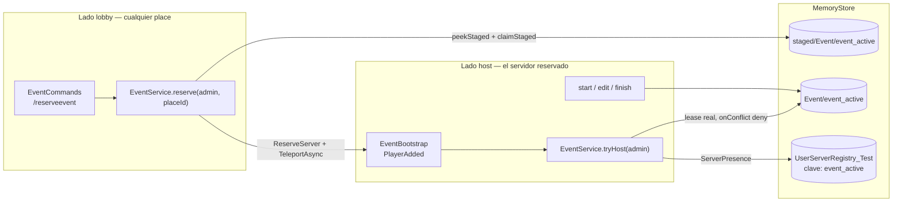

# Eventos

Un **evento** es una sesión temporal en un servidor reservado, abierta por un
administrador, visible para todos en el lobby mientras dure, y que se limpia sola cuando
su servidor muere. Solo puede haber **uno a la vez** en todo el universo.

Es el tercer usuario de `TeleportService:ReserveServer`, junto con las
[casas](./housing/overview.md) y —indirectamente— los places públicos. Comparte casi toda
la maquinaria de [servidores reservados](../architecture/reserved-servers.md), así que esta
página se centra en lo que hace distinto.

## Componentes

| Componente | Ruta | Papel |
|---|---|---|
| `EventService` | `Core/ServerStorage/WorldSystem/EventService.luau` | Todo el sistema: reserva, arranque, comandos del host, apagado |
| `EventBootstrap` | `Core/…/ServerScripts/EventBootstrap.server.luau` | Arranca el evento cuando llega el admin al servidor reservado |
| `EventCommands` | `Core/…/ServerScripts/EventCommands.server.luau` | Comandos de chat, restringidos a administradores |
| `Profiles.Event` | `Core/ServerStorage/WorldSystem/Profiles.luau` | El perfil `Event`, con `onConflict = "deny"` |
| `ServerDirectory` | `Core/…/ServerScripts/ServerDirectory.server.luau` | Sirve `GetActiveEvent` a los clientes |

**HECHO.** `EventService` vive en `Core`, así que **existe en todos los places**. Lo que
determina si hace algo es qué mitad de su API se llama.

## La identidad singleton

**HECHO.** El evento no tiene id: usa una clave fija.

```lua
local EVENT_KEY = "event_active"
```

**INFERENCIA — y esto es todo el mecanismo de «un solo evento a la vez».** El código lo
declara en su propia cabecera: como la identidad es fija, una segunda reserva encuentra la
identidad ocupada y falla. No hay contador, ni bloqueo aparte, ni comprobación explícita de
«¿ya hay evento?». La unicidad es una consecuencia de reutilizar la misma clave sobre el
mismo mecanismo de lease que usan las casas.

## Las dos mitades



### Lado lobby — `reserve()`

**HECHO.** El orden es exactamente el mismo que en las casas —reclamar staging, reservar
fuera del transform, republicar meta, teletransportar— con una diferencia importante al
principio:

```lua
-- claimStaged solo detecta conflictos entre servers distintos: el lease es
-- idempotente para el mismo serverId, así que dos reservas desde este mismo lobby
-- ganarían las dos. Chequear el staging a mano cubre ese caso.
local stager = Profiles.Event.peekStaged(EVENT_KEY)
if stager then
    return false, "Ya hay una reserva de evento en curso. …"
end
```

**Esto es un hallazgo que merece destacarse.** `Lease.tryClaim` escribe cuando la clave
está libre **o ya es nuestra** (`old.owner == self.ServerId`). Es decir, es idempotente
por servidor: dos llamadas desde el mismo servidor ganan las dos. `EventService` cierra ese
hueco con una comprobación previa de `peekStaged`.

**INFERENCIA — el mismo hueco, dos soluciones distintas.** `WorldManager.hostWorld` tiene
exactamente el mismo problema y lo resuelve de otra forma: con `localStages`, una tabla
Lua en memoria con TTL de 30 s que corta las peticiones repetidas del mismo servidor antes
de tocar MemoryStore. Las dos funcionan; ninguna es obviamente mejor. `EventService` gasta
una lectura de MemoryStore y siempre acierta; `WorldManager` no gasta nada pero depende de
que su memo no se haya limpiado. Vale la pena saber que existen las dos, porque quien lea
una y luego la otra pensará que a una le falta algo.

**HECHO.** Los mensajes de error distinguen los tres casos que `claimStaged` puede
devolver, y se muestran al admin tal cual:

| Situación | Mensaje |
|---|---|
| Reserva en curso desde este mismo lobby | *«Ya hay una reserva de evento en curso…»* |
| `kind == "hosted"` | *«Ya hay un evento activo. Usa /endevent para terminarlo primero.»* |
| `kind == "staged"` | *«Otro admin está reservando un evento en este momento.»* |
| MemoryStore falló | *«No se pudo reservar el servidor, intenta de nuevo.»* |

**HECHO.** Si el teleport falla después de reservar, se deshace todo:
`clearStudioPending()` y `claim:release()`, para que el turno quede libre de inmediato en
vez de esperar al TTL de staging.

### Lado host — `tryHost()`

**HECHO.** `EventBootstrap` corre en todos los places, pero solo hace algo si el jugador
que llega trae `TeleportData` de evento. `tryHost` exige que `tpData.eventKey == EVENT_KEY`.

**HECHO.** Si el `accessCode` no viene en el `TeleportData`, lo busca en el staging:

```lua
-- El ganador del staging ya publicó el código; preferilo al de TeleportData.
```

**HECHO.** Toma el lease real con `Profiles.Event.load`, que tiene `onConflict = "deny"`, y
ante una denegación cierra y expulsa:

```lua
store:onDenied():Connect(function()
    EventService.shutdown()
    ServerPresence.KickAll("Este evento ya está siendo hosteado en otro servidor.")
end)
```

**INFERENCIA — diferencia con las casas.** Un servidor de casa denegado intenta
`convergeToOwner`: teletransporta a sus jugadores al anfitrión real. Un servidor de evento
denegado simplemente expulsa. Es coherente: solo puede haber un evento, así que el segundo
servidor no tiene a dónde converger que no sea el primero, y el admin puede volver a
entrar por la vía normal.

**HECHO.** El evento arranca **invisible**:

```lua
-- Un evento recién reservado arranca sin iniciar: /startevent lo revela.
store:update(function(data)
    data.started = false
    data.hostId = player.UserId
    return data
end)
```

## Ciclo de vida

```mermaid
stateDiagram-v2
    [*] --> Ninguno: no hay evento
    Ninguno --> Reservando: /reserveevent → EventService.reserve
    Reservando --> Ninguno: falla ReserveServer o el teleport<br/>(claim:release)
    Reservando --> Reservado: código publicado, admin teletransportado

    Reservado --> Hosteando: llega el admin → EventBootstrap → tryHost
    Reservado --> Ninguno: nadie llega; el TTL del staging expira
    Hosteando --> Ninguno: onDenied → shutdown + KickAll

    Hosteando --> Iniciado: /startevent → started = true<br/>visible en GetActiveEvent
    Iniciado --> Iniciado: /editevent cambia nombre, descripción, imagen

    Iniciado --> Terminando: /endevent → finish()
    Hosteando --> Terminando: /endevent
    Terminando --> Ninguno: todos al lobby, lease y presencia liberados
    Hosteando --> Ninguno: BindToClose → shutdown
    Iniciado --> Ninguno: BindToClose → shutdown

    note right of Hosteando
        El evento existe pero no aparece en
        el lobby: buildPayload solo reporta
        status "ready" cuando started es true.
    end note
```



**HECHO.** El evento vive mientras viva su servidor. La cabecera lo dice: si se vacía, los
TTL de la presencia y del lease expiran y el evento se limpia solo. No hay ningún
temporizador ni proceso de barrido.

## Terminar un evento

**HECHO.** `finish()` hace algo que ninguna otra parte del código hace, y el comentario
explica por qué:

```lua
-- Este servidor ya no está en el directorio, pero un teleport en vuelo puede seguir
-- aterrizando gente: la mandamos al lobby también, o se quedarían encerrados.
if not strandedConn then
    strandedConn = Players.PlayerAdded:Connect(function(late: Player)
        safeTeleport(LOBBY_PLACE_ID, { late }, Instance.new("TeleportOptions"))
    end)
end
```

**INFERENCIA.** Es la contrapartida de `convergeToOwner` en las casas: ambas reconocen que
cerrar un servidor reservado no detiene los teleports que ya salieron, y ambas dejan una
conexión `PlayerAdded` para redirigir a los rezagados.

**HECHO.** Si el retorno al lobby falla, `finish` devuelve un error explícito **aunque el
evento sí se cerró**, para que el admin sepa que hay gente atrapada:

```lua
return false, "Evento cerrado, pero no pude devolver a los jugadores al lobby: " .. tostring(err)
```

**OBSERVACIÓN.** Es un uso poco habitual del valor de retorno —`false` no significa «no se
hizo nada», sino «se hizo a medias»— pero el mensaje lo aclara. Se anota porque un
consumidor que solo mire el booleano podría reintentar `finish` sobre un evento ya cerrado.

## El puente de Studio

**HECHO.** Como en Studio el teleport es una operación vacía, el evento no podría
probarse. `EventService` resuelve eso con una entrada de MemoryStore aparte:

| Constante | Valor |
|---|---|
| `STUDIO_PENDING_MAP` | `"EventStudioPending"` |
| `STUDIO_PENDING_KEY` | `"pending"` |
| `STUDIO_PENDING_TTL` | 3600 s |

El código explica la intención:

```lua
-- Puente de Studio: como ahí el teleport es no-op, `reserve()` deja la reserva anotada
-- con TTL largo y la place reservada la levanta al darle Play. Es el equivalente a lo que
-- hacen las casas en PlayerWorld_Init, pero sin inventar datos: usa la reserva de verdad.
```

**INFERENCIA — y es un contraste importante con
[BUG-CANDIDATE-006](../testing/verification-plan.md#bug-candidate-006).** Las casas
resuelven el mismo problema fabricando un `accessCode` falso con
`HttpService:GenerateGUID`, que es justo lo que hace peligroso escribirlo en el registro
compartido. `EventService` **no inventa nada**: reserva de verdad, y solo anota aparte que
hay una reserva esperando a que alguien le dé Play. Es la misma necesidad resuelta sin el
riesgo, y por eso vale la pena señalarlo: existe un patrón mejor dentro del propio
repositorio.

**HECHO.** La reserva pendiente se consume al hostear (`clearStudioPending()`), con un
comentario que dice por qué: si vuelves a darle Play sin reservar de nuevo, esa place no
debe autoproclamarse host otra vez.

## Cómo lo ven los jugadores

**HECHO.** El cliente pregunta por `WorldSystem/GetActiveEvent`, servido por
`ServerDirectory.getActiveEvent`, que **deliberadamente no expone `code` ni `jobId`**:

```lua
-- Deliberadamente NO expone `code` ni `jobId`: el accessCode del servidor reservado se
-- resuelve server-side en JoinServer y nunca viaja al cliente.
```

**HECHO.** Para entrar, el cliente llama a `JoinServer` con la clave del evento, y
`WorldManager` reconoce `hostingType == "event"` y usa el `accessCode` del registro. Ver
[Servidores reservados](../architecture/reserved-servers.md).

**HECHO.** `ServerDirectory` optimiza la consulta del evento de forma explícita, y el
comentario documenta el coste que evitaba:

> Este resync era un fullSync(), y ahí estaba la fuga de cuota: ListItemsAsync recorre las
> 21 particiones del HashMap aunque no haya un solo dato, así que preguntar "¿hay evento?"
> costaba 21 unidades. Y como casi nunca hay evento, se preguntaba cada 10 s. El evento
> vive bajo una key fija: leerla directamente cuesta 1.

## Autorización

**HECHO.** `EventCommands` restringe todos los comandos a administradores:

```lua
if not Admins:IsRole(player, "Admins") then
```

con rechazo **en silencio**, para que un comando desconocido y uno sin permiso sean
indistinguibles desde fuera. Ver
[BUG-CANDIDATE-017](../testing/verification-plan.md#bug-candidate-017) para la ventana de
caché de `RoleService`.

## Implementación relacionada

| Aspecto | Código |
|---|---|
| Reserva | `EventService.luau`, `reserve`, `reserveAccessCode`, `teleportToEvent` |
| Arranque en el reservado | `EventBootstrap.server.luau`; `EventService.tryHost` |
| Contenido del directorio | `EventService.luau`, `buildPayload` |
| Comandos del host | `EventService.luau`, `start`, `edit`, `finish`, `shutdown` |
| Puente de Studio | `EventService.luau`, `setStudioPending`, `peekStudioPending`, `studioTeleportData` |
| Consulta desde el lobby | `ServerDirectory.server.luau`, `getActiveEvent`, `findEventInCache` |
| Autorización | `EventCommands.server.luau`; `RoleService/init.luau` |
