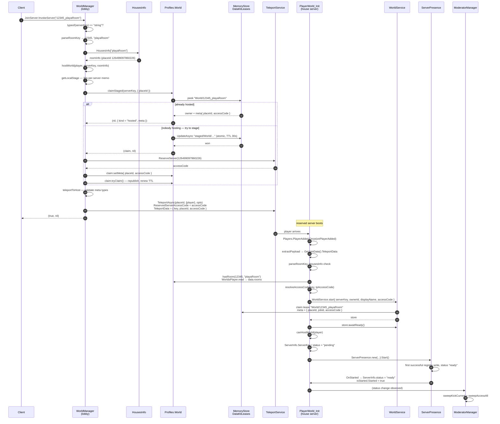

# Entering a house

This page traces one player from "I want to go to this house" to "I am standing in it",
and names the script and function behind every step.

The generic reservation mechanism — the two registries, the atomic staging claim, the
concurrency guarantees — is in
[Architecture → Reserved servers](../../architecture/reserved-servers.md). This page is the
housing-specific path through it.

## Full path



## Step by step

### 1. The client asks

**FACT.** The only thing a client sends is a `serverKey` string. It never sends a
`placeId` and never sends an `accessCode`.

### 2. `WorldManager` classifies the key

**FACT.** `JoinServerFunc.OnServerInvoke` decides what kind of destination this is:

```lua
local _userId, roomName = parseRoomKey(serverKey)
local roomInfo = roomName and HousesInfo[roomName]

if roomInfo then
    return hostWorld(player, serverKey, roomInfo)
end
```

If the key does not resolve to a room in `HousesInfo`, it falls through to the presence
directory and is treated as a public server or an event — see
[Architecture → Reserved servers](../../architecture/reserved-servers.md).

### 3. Stage, reserve, publish

**FACT.** `hostWorld` runs the three-way decision described in the sequence above. The
critical ordering, and the reason for it, is stated in `DataKit`'s own source: the
`ReserveServer` call happens **outside** the MemoryStore transform, because doing it inside
was the bug in the previous system.

### 4. Teleport

**FACT.** `teleportToHost` validates the host metadata before trusting it:

```lua
if typeof(meta) ~= "table" or typeof(meta.placeId) ~= "number" or typeof(meta.accessCode) ~= "string" then
    return false, "Malformed host metadata"
end
```

and then builds the options:

```lua
local teleportOptions = Instance.new("TeleportOptions")
teleportOptions.ReservedServerAccessCode = meta.accessCode
teleportOptions:SetTeleportData({ key = serverKey, placeId = meta.placeId, accessCode = meta.accessCode })
```

**FACT.** `safeTeleport` retries `TeleportAsync` up to 3 times, 0.5 s apart, each in a
`pcall`.

### 5. The house server boots

**FACT.** `PlayerWorld_Init` initialises from the **first** player only:

```lua
for _, player in Players:GetPlayers() do
    task.spawn(onPlayerAdded, player)
end

Players.PlayerAdded:Once(onPlayerAdded)
```

and `onPlayerAdded` guards against double initialisation:

```lua
if booting or presence then
    return
end
```

**INFERENCE.** The loop over `Players:GetPlayers()` handles the case where a player is
already present by the time the script is enabled — which is likely in a reserved server,
since the server exists *because* someone is teleporting into it.

### 6. Ownership is verified at the destination

**FACT.** Before doing anything else, the house server checks that the user named in the
key actually owns the room:

```lua
local function hasRoom(userId: number, roomName: string): (boolean, boolean)
    local data, ok = Profiles.WorldsPlayer.read(tostring(userId))
    if not ok then
        return false, false
    end
    local rooms = (data and data.rooms) or {}
    return true, table.find(rooms, roomName) ~= nil
end
```

The two return values are distinguished deliberately: *"the read failed"* and *"the read
succeeded and they do not own it"* produce different messages.

**INFERENCE — this is the real authorisation boundary for opening a house.** A forged
`serverKey` naming someone else's room reaches the destination and is rejected there, with
everyone kicked. It cannot create or open a house that does not belong to the named owner.

### 7. Presence and readiness

**FACT.** The house publishes itself with `hostingType = "room"` and a payload that
includes its own `accessCode`:

```lua
info.code = WorldService.getAccessCode()
info.players = playerList
info.playerCount = #playerList
info.maxPlayers = Players.MaxPlayers
info.hostingType = "room"
info.placeId = game.PlaceId
info.jobId = game.JobId
info.name = data.settings.Name
info.ownerId = data.settings.OwnerId
info.serverType = data.settings.ServerType
info.status = "ready"
```

**FACT — `code` never reaches a client.** `ServerDirectory.toPublicEntry` builds the
client-facing shape field by field and does not include `code` or `jobId`. The source
states the rule for events in the same terms, and `getActiveEvent` repeats it:

```lua
-- Deliberadamente NO expone `code` ni `jobId`: el accessCode del servidor reservado se
-- resuelve server-side en JoinServer y nunca viaja al cliente.
```

### 8. Everyone else

**FACT.** Only the first player goes through `canHostWorld`. Every player — including that
first one — is then continuously governed by `ModeratorManager`. See
[Permissions](./permissions.md).

## Guests and non-owners

**FACT.** There is no separate guest entry path. A guest uses the same
`JoinServer(serverKey)` call with the owner's key. Two outcomes follow from the state of
the lease:

| State | What happens |
|---|---|
| The house is **already hosted** | `claimStaged` returns `kind = "hosted"`; the guest is teleported into the **existing** instance with the owner's `accessCode`. |
| The house is **closed** | The guest stages and reserves it themselves, and `PlayerWorld_Init` boots with the *guest* as `hostPlayer`. `canHostWorld` then decides whether that is allowed. |

**INFERENCE — a guest can open someone else's house.** `hasRoom` checks that the *owner*
named in the key owns the room; it does not require the arriving player to be the owner.
`canHostWorld` is what gates it: the owner always passes, a banned player is refused, and
on a `private` house a non-owner needs a role of at least `guest` (46) or must be a Roblox
friend of the owner. On a `public` house, **any** player may open it.

That is a coherent design for a social game — public houses are meant to be visitable
whether or not the owner is online — but it is worth stating explicitly, because it means
a house can be running with its owner absent. See [Permissions](./permissions.md).

## Related implementation

| Step | Code |
|---|---|
| 1–2 classify | `WorldManager.server.luau`, `JoinServerFunc.OnServerInvoke`, `parseRoomKey` |
| 3 stage / reserve | `WorldManager.server.luau`, `hostWorld`, `reserveAccessCode`, `waitForStagedHost`; [`Store.claimStaged`](/api/Store) |
| 4 teleport | `WorldManager.server.luau`, `teleportToHost`, `safeTeleport` |
| 5 boot | `PlayerWorld_Init.lua.server.luau`, `onPlayerAdded`, `extractPayload`, `init` |
| 6 ownership | `PlayerWorld_Init.lua.server.luau`, `hasRoom` |
| 7 presence | `PlayerWorld_Init.lua.server.luau`, `getHouseRefreshPayload`, `onHouseStarted`; [`ServerPresence`](/api/ServerPresence) |
| 8 access control | `ModeratorManager.server.luau`, `canPlayerEnter` |
