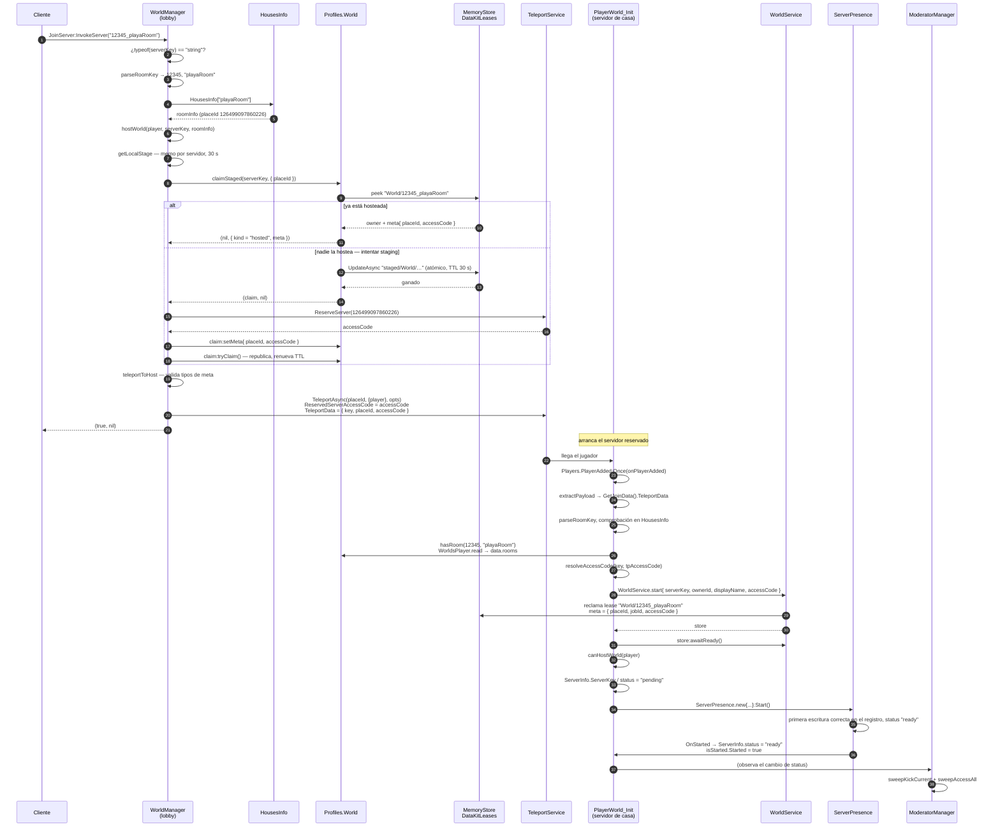

# Entrar en una casa

Esta página sigue a un jugador desde «quiero ir a esta casa» hasta «estoy dentro», y
nombra el script y la función detrás de cada paso.

El mecanismo genérico de reserva —los dos registros, la reclamación de staging atómica,
las garantías de concurrencia— está en
[Arquitectura → Servidores reservados](../../architecture/reserved-servers.md). Esta
página es el camino específico de las casas a través de él.

## Camino completo



## Paso a paso

### 1. El cliente pide

**HECHO.** Lo único que envía el cliente es una cadena `serverKey`. Nunca envía un
`placeId` ni un `accessCode`.

### 2. `WorldManager` clasifica la clave

**HECHO.** `JoinServerFunc.OnServerInvoke` decide qué tipo de destino es:

```lua
local _userId, roomName = parseRoomKey(serverKey)
local roomInfo = roomName and HousesInfo[roomName]

if roomInfo then
    return hostWorld(player, serverKey, roomInfo)
end
```

Si la clave no resuelve a una room de `HousesInfo`, cae al directorio de presencia y se
trata como servidor público o evento — ver
[Arquitectura → Servidores reservados](../../architecture/reserved-servers.md).

### 3. Staging, reserva y publicación

**HECHO.** `hostWorld` ejecuta la decisión a tres bandas descrita en la secuencia de
arriba. El orden crítico, y su razón, están enunciados en el propio código de `DataKit`:
la llamada a `ReserveServer` ocurre **fuera** del transform de MemoryStore, porque hacerlo
dentro era el bug del sistema anterior.

### 4. Teleport

**HECHO.** `teleportToHost` valida la metadata del anfitrión antes de fiarse de ella:

```lua
if typeof(meta) ~= "table" or typeof(meta.placeId) ~= "number" or typeof(meta.accessCode) ~= "string" then
    return false, "Malformed host metadata"
end
```

y entonces construye las opciones:

```lua
local teleportOptions = Instance.new("TeleportOptions")
teleportOptions.ReservedServerAccessCode = meta.accessCode
teleportOptions:SetTeleportData({ key = serverKey, placeId = meta.placeId, accessCode = meta.accessCode })
```

**HECHO.** `safeTeleport` reintenta `TeleportAsync` hasta 3 veces, con 0,5 s entre
intentos, cada uno dentro de un `pcall`.

### 5. Arranca el servidor de casa

**HECHO.** `PlayerWorld_Init` se inicializa a partir del **primer** jugador y solo de él:

```lua
for _, player in Players:GetPlayers() do
    task.spawn(onPlayerAdded, player)
end

Players.PlayerAdded:Once(onPlayerAdded)
```

y `onPlayerAdded` protege contra doble inicialización:

```lua
if booting or presence then
    return
end
```

**INFERENCIA.** El bucle sobre `Players:GetPlayers()` cubre el caso en que ya haya un
jugador presente cuando el script se activa — algo probable en un servidor reservado, ya
que el servidor existe *porque* alguien se está teletransportando a él.

### 6. La propiedad se verifica en el destino

**HECHO.** Antes de nada, el servidor de casa comprueba que el usuario nombrado en la clave
posee realmente la room:

```lua
local function hasRoom(userId: number, roomName: string): (boolean, boolean)
    local data, ok = Profiles.WorldsPlayer.read(tostring(userId))
    if not ok then
        return false, false
    end
    local rooms = (data and data.rooms) or {}
    return true, table.find(rooms, roomName) ~= nil
end
```

Los dos valores de retorno se distinguen a propósito: *«la lectura falló»* y *«la lectura
funcionó y no la posee»* producen mensajes distintos.

**INFERENCIA — esta es la frontera de autorización real para abrir una casa.** Una
`serverKey` falsificada que nombre la room de otra persona llega al destino y se rechaza
allí, expulsando a todos. No puede crear ni abrir una casa que no pertenezca al dueño
nombrado.

### 7. Presencia y disponibilidad

**HECHO.** La casa se publica con `hostingType = "room"` y un contenido que incluye su
propio `accessCode`:

```lua
info.code = WorldService.getAccessCode()
info.players = playerList
info.playerCount = #playerList
info.maxPlayers = Players.MaxPlayers
info.hostingType = "room"
info.placeId = game.PlaceId
info.jobId = game.JobId
info.name = data.settings.Name
info.ownerId = data.settings.OwnerId
info.serverType = data.settings.ServerType
info.status = "ready"
```

**HECHO — el `code` nunca llega a un cliente.** `ServerDirectory.toPublicEntry` construye
la forma que ve el cliente campo a campo y no incluye `code` ni `jobId`. El código enuncia
la regla en los mismos términos para los eventos, y `getActiveEvent` la repite:

```lua
-- Deliberadamente NO expone `code` ni `jobId`: el accessCode del servidor reservado se
-- resuelve server-side en JoinServer y nunca viaja al cliente.
```

### 8. Todos los demás

**HECHO.** Solo el primer jugador pasa por `canHostWorld`. Después, todos los jugadores
—incluido ese primero— quedan bajo el control continuo de `ModeratorManager`. Ver
[Permisos](./permissions.md).

## Invitados y no propietarios

**HECHO.** No hay una ruta de entrada separada para invitados. Un invitado usa la misma
llamada `JoinServer(serverKey)` con la clave del dueño. Del estado del lease se derivan dos
desenlaces:

| Estado | Qué ocurre |
|---|---|
| La casa **ya está hosteada** | `claimStaged` devuelve `kind = "hosted"`; al invitado se le teletransporta a la instancia **existente** con el `accessCode` del dueño. |
| La casa está **cerrada** | El invitado hace el staging y la reserva él mismo, y `PlayerWorld_Init` arranca con el *invitado* como `hostPlayer`. `canHostWorld` decide entonces si eso está permitido. |

**INFERENCIA — un invitado puede abrir la casa de otro.** `hasRoom` comprueba que el
*dueño* nombrado en la clave posee la room; no exige que el jugador que llega sea el dueño.
`canHostWorld` es lo que lo controla: el dueño siempre pasa, un jugador baneado se rechaza,
y en una casa `private` un no-dueño necesita rol de al menos `guest` (46) o ser amigo de
Roblox del dueño. En una casa `public`, **cualquier** jugador puede abrirla.

Es un diseño coherente para un juego social —las casas públicas están pensadas para
visitarse esté o no el dueño conectado—, pero conviene decirlo explícitamente, porque
implica que una casa puede estar funcionando con su dueño ausente. Ver
[Permisos](./permissions.md).

## Implementación relacionada

| Paso | Código |
|---|---|
| 1–2 clasificar | `WorldManager.server.luau`, `JoinServerFunc.OnServerInvoke`, `parseRoomKey` |
| 3 staging / reserva | `WorldManager.server.luau`, `hostWorld`, `reserveAccessCode`, `waitForStagedHost`; [`Store.claimStaged`](/api/Store) |
| 4 teleport | `WorldManager.server.luau`, `teleportToHost`, `safeTeleport` |
| 5 arranque | `PlayerWorld_Init.lua.server.luau`, `onPlayerAdded`, `extractPayload`, `init` |
| 6 propiedad | `PlayerWorld_Init.lua.server.luau`, `hasRoom` |
| 7 presencia | `PlayerWorld_Init.lua.server.luau`, `getHouseRefreshPayload`, `onHouseStarted`; [`ServerPresence`](/api/ServerPresence) |
| 8 control de acceso | `ModeratorManager.server.luau`, `canPlayerEnter` |
