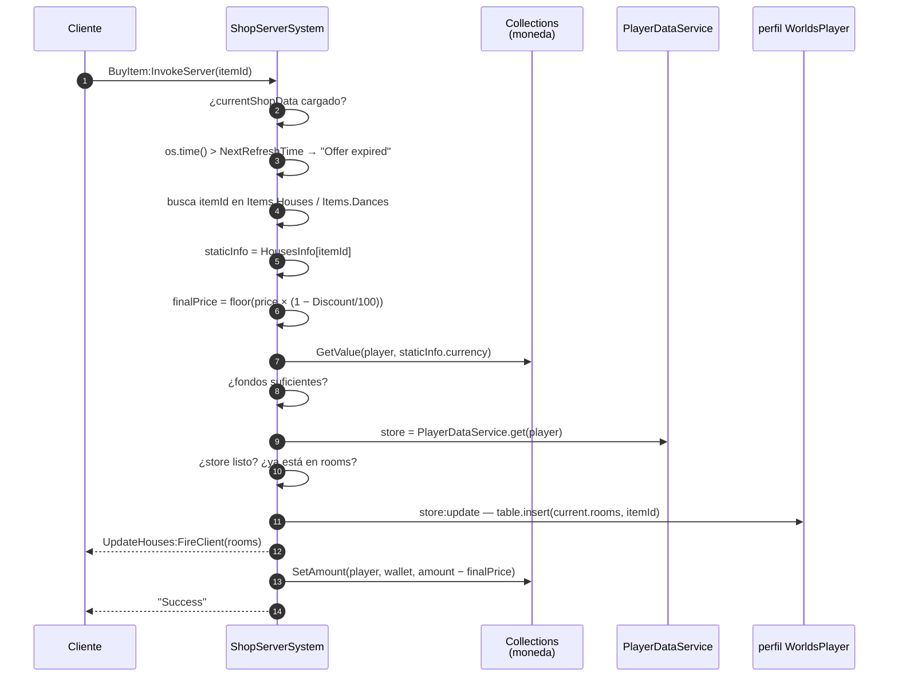
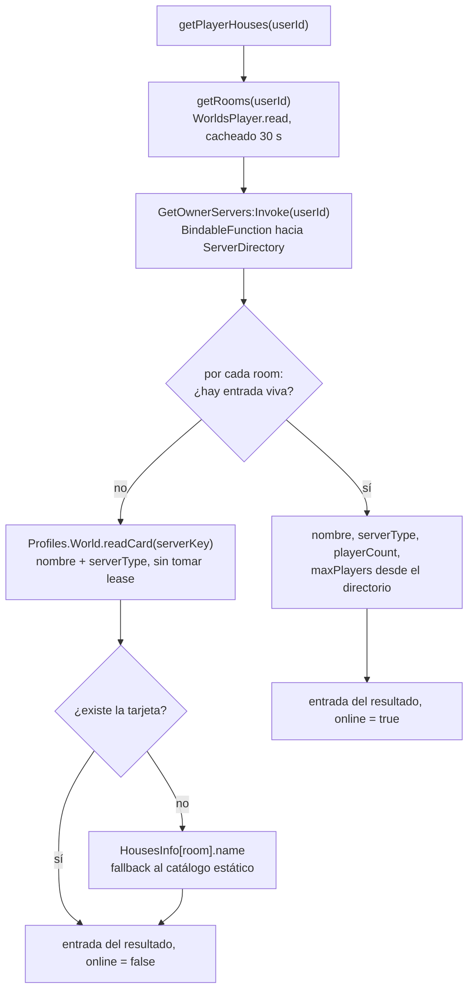

# Identidad y propiedad de una casa

## Qué identifica a una casa

**HECHO.** Una casa no tiene un id propio. Su identidad es una **cadena compuesta**:

```
"{ownerUserId}_{roomName}"
```

por ejemplo `"12345678_playaRoom"`. Esa única cadena se usa como:

- clave del perfil `World`, y por tanto también clave del DataStore y de la `WorldCard`;
- clave en `DataKitLeases`, como `World/{key}` y `staged/World/{key}`;
- clave del directorio de presencia en `UserServerRegistry_Test`;
- campo `key` del `TeleportData` enviado al servidor de casa;
- atributo `ServerKey` de `ReplicatedStorage.ServerInfo` dentro de la casa.

**HECHO.** Se analiza con el mismo patrón en ambos sentidos, en `WorldManager` y en
`PlayerWorld_Init`:

```lua
local userIdStr, roomName = serverKey:match("^(%d+)_(.+)$")
```

**INFERENCIA — consecuencias de esta elección.** Se derivan tres directamente:

1. **La propiedad está horneada en la identidad.** El dueño no puede cambiar; una casa
   transferida sería otra casa.
2. **Un jugador tiene como mucho una casa por diseño de room.** Poseer `playaRoom` dos
   veces no es expresable.
3. **El id del dueño es público.** Cualquier cliente que tenga una `serverKey` puede leer
   el `UserId` del dueño a partir de ella. Esto se usa a propósito:
   `ServerDirectory.isServerOwner` autoriza `GetPlayerHouseServers` exactamente con ese
   análisis.

## El catálogo de rooms

**HECHO.** `Core/ReplicatedStorage/HousesInfo.luau` es el catálogo de diseños de room. Es
una tabla plana, replicada a los clientes, indexada por nombre de room:

| Room | `placeId` | Nombre visible | Precio | En venta | Peso de rareza |
|---|---|---|---|---|---|
| `defaultRoom` | `126499097860226` | Casita a las afueras | 0 Coins | no | 0 |
| `playaRoom` | `126499097860226` | Casa de Playa xd | 4 000 Coins | sí | 50 |
| `VistaLujosaRoom` | `80492586639096` | Casa Vista Lujosa | 8 000 Coins | sí | 80 |

**HECHO.** `defaultRoom` y `playaRoom` comparten el mismo `placeId`. Dos casas distintas,
dos perfiles `World` distintos, dos servidores reservados distintos — pero el mismo
*place*.

**INFERENCIA.** El `placeId` selecciona la geometría del mapa, no la casa. La
individualidad de una casa viene enteramente de su perfil `World`, que el servidor
reservado carga al arrancar usando la `key` de su `TeleportData`.

**HECHO.** `HousesInfo` es además la lista blanca de autorización. `WorldManager` solo
trata una clave como casa si `HousesInfo[roomName]` existe, y `PlayerWorld_Init` rechaza
el arranque de plano si no:

```lua
if not HousesInfo[roomName] then
    onFailedServer(("[Error] Unknown room %s."):format(roomName))
    return
end
```

## Propiedad: `rooms` y `slots`

**HECHO.** La propiedad vive en el perfil **del jugador**, no en el de la casa.
`Core/ServerStorage/WorldSystem/PlayerSchema.luau` declara:

```lua
PlayerSchema.Template = {
    rooms = { "defaultRoom" },
    slots = 2,
    favorites = {},
    …
}
```

| Campo | Significado |
|---|---|
| `rooms` | Un array con los nombres de room que este jugador posee. Todo jugador nuevo empieza con `defaultRoom`. |
| `slots` | Cuántas casas puede tener **abiertas** — una capacidad aparte, que se compra por separado. Los jugadores nuevos empiezan con 2. |
| `favorites` | Mundos de otros jugadores que el jugador ha marcado como favoritos. |

**HECHO.** `GeneralConfiguration` limita y pone precio a los espacios:

```lua
MaxRooms = 6,
HouseSlots = {
    Currency = "Gems",
    Prices = { [3] = 150, [4] = 300, [5] = 600, [6] = 1200 },
},
```

Los espacios 1 y 2 vienen con el perfil; del 3 al 6 se compran, a precio creciente, en
Gems.

**DESCONOCIDO.** Nada del código revisado *impone* `slots` como límite de cuántas casas
pueden estar abiertas a la vez. `slots` se lee, se vende y se replica, pero no se encontró
ninguna comprobación que lo contraste contra las casas abiertas. Si esa validación existe
en otro sitio (posiblemente en una UI de cliente, posiblemente en ninguna parte) no está
establecido. Registrado como **U-007** en `DOCS_PROGRESS.md`.

## Comprar un diseño de casa

**HECHO.** Las casas las vende `ShopServerSystem.ProcessPurchase`, al que se llega por el
`RemoteFunction` `WorldSystem/BuyItem`. La tienda es una **lista rotatoria de ofertas**
(`currentShopData`) sincronizada entre servidores con `MessagingService` y refrescada
según un `NextRefreshTime`.



**HECHO — las comprobaciones del servidor que existen:**

| Comprobación | Cadena de fallo |
|---|---|
| Datos de tienda cargados | `"Error: Store loading..."` |
| Oferta no caducada | `"Offer expired"` |
| `itemId` presente en la lista de ofertas actual | `"Item currently unavailable"` |
| `itemId` presente en `HousesInfo` / `DancesInfo` | `"Static data error"` |
| Existe el monedero de esa moneda | `"Error: currency not found"` |
| Fondos suficientes | `"Insufficient Funds"` |
| Datos del jugador cargados | `"Error: Player data not loaded"` |
| No poseído ya | `"Error: Already owned"` |

**INFERENCIA — seguridad.** El precio nunca se toma del cliente. El cliente envía un id de
artículo; el servidor busca la oferta, lee el precio estático de `HousesInfo` y aplica el
descuento que guarda el servidor. Un cliente no puede fijar un precio ni comprar un
artículo fuera de la rotación vigente.

**OBSERVACIÓN — la concesión ocurre antes del cobro.** `store:update` inserta la room,
después se dispara `UpdateHouses:FireClient`, y solo entonces `collections.SetAmount`
descuenta la moneda. Si el descuento falla o el servidor muere entre medias, el jugador se
queda una casa por la que no se le cobró. Registrado como
[BUG-CANDIDATE-008](../../testing/verification-plan.md#bug-candidate-008).

**HECHO.** En Studio la compra es gratis: la comprobación de fondos es
`or RunService:IsStudio()`, y ambas llamadas a `SetAmount` van envueltas en
`if not RunService:IsStudio()`.

## Comprar un espacio

**HECHO.** Los espacios se venden aparte, en `PlayerDataReplicator.buySlot`, a través del
`RemoteFunction` `WorldSystem/BuySlot`. Lleva una guarda explícita contra reentrada, y el
código dice por qué:

```lua
-- Una compra a la vez por jugador: dos invokes simultáneos leerían el mismo
-- `slots` y cobrarían dos veces por el mismo espacio.
local buying: { [Player]: boolean } = {}
```

La guarda se pone antes de cualquier llamada que ceda el hilo, se quita después, y también
se limpia en `PlayerRemoving`.

**INFERENCIA.** A diferencia de la compra de casa de arriba, `buySlot` también descuenta
**después** de actualizar —`store:update` y luego `collections.SetAmount`—, así que aplica
la misma observación de orden. La cubre el mismo bug candidate.

## Listar las casas de un jugador

**HECHO.** `WorldsBrowser.getPlayerHouses(userId)` compone cada casa desde hasta cuatro
fuentes, en un orden de frescura documentado:



**HECHO.** La lista de rooms se cachea `ROOMS_CACHE_TTL = 30` segundos por usuario; el
conteo de jugadores en vivo deliberadamente **no** se cachea. El código lo explica: el
conteo es el valor que un jugador espera ver cambiar al volver a buscar.

**OBSERVACIÓN.** Una casa comprada en los últimos 30 segundos puede faltar en un resultado
de navegador servido por un servidor que ya tenía cacheada la lista de rooms de ese
usuario. Es una obsolescencia acotada y que se cura sola, y se registra aquí solo para que
el comportamiento no se confunda con una compra perdida.

**HECHO.** `GetOwnerServers` es un `BindableFunction` en `ServerStorage.WorldSystem`, no un
remote. El código lo llama *«seam server-a-server»*: el conteo de jugadores en vivo solo
existe en la caché en memoria de `ServerDirectory`, y `WorldsBrowser` lo necesita.

## Implementación relacionada

| Aspecto | Código |
|---|---|
| Análisis de la clave | `WorldManager.server.luau` / `PlayerWorld_Init`, `parseRoomKey` |
| Catálogo | `Core/ReplicatedStorage/HousesInfo.luau` |
| Plantilla de propiedad | `Core/ServerStorage/WorldSystem/PlayerSchema.luau` |
| Precios de espacios | `Core/ReplicatedStorage/GeneralConfiguration.luau` |
| Compra de casa | `ShopServerSystem.server.luau`, `ProcessPurchase` |
| Compra de espacio | `PlayerDataReplicator.server.luau`, `buySlot` |
| Verificación de propiedad al arrancar | `PlayerWorld_Init.lua.server.luau`, `hasRoom` |
| Composición del navegador | `WorldsBrowser.server.luau`, `getPlayerHouses`, `getRooms` |
| Seam del directorio vivo | `ServerDirectory.server.luau`, `getOwnerServers` |
