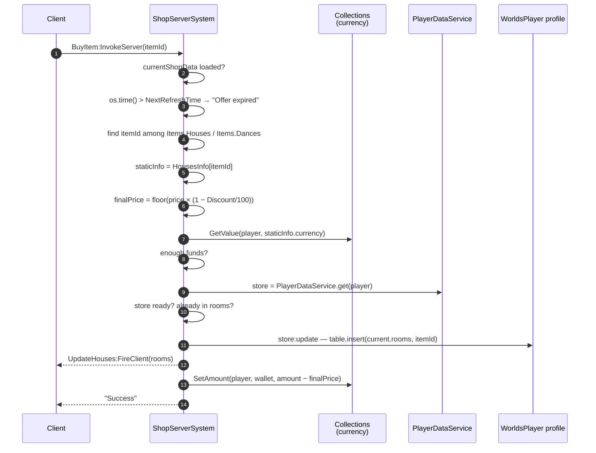
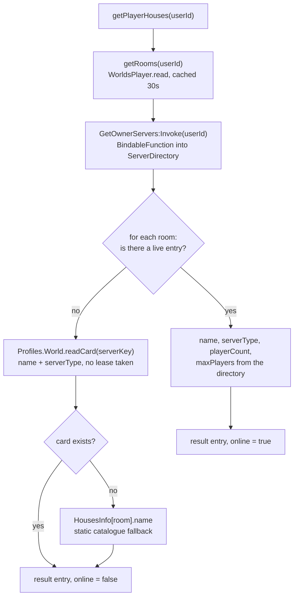

# House identity and ownership

## What identifies a house

**FACT.** A house has no dedicated id. Its identity is a **composite string**:

```
"{ownerUserId}_{roomName}"
```

for example `"12345678_playaRoom"`. This one string is used as:

- the `World` profile key, so also the DataStore key and the `WorldCard` key;
- the `DataKitLeases` key, as `World/{key}` and `staged/World/{key}`;
- the presence-directory key in `UserServerRegistry_Test`;
- the `key` field of the `TeleportData` sent to the house server;
- the `ServerKey` attribute on `ReplicatedStorage.ServerInfo` inside the house.

**FACT.** It is parsed with the same pattern in both directions, in `WorldManager` and in
`PlayerWorld_Init`:

```lua
local userIdStr, roomName = serverKey:match("^(%d+)_(.+)$")
```

**INFERENCE — consequences of this choice.** Three follow directly:

1. **Ownership is baked into the identity.** The owner cannot change; a transferred house
   would be a different house.
2. **A player has at most one house per room design.** Owning `playaRoom` twice is not
   expressible.
3. **The owner's id is public.** Any client holding a `serverKey` can read the owner's
   `UserId` from it. This is used deliberately —
   `ServerDirectory.isServerOwner` authorises `GetPlayerHouseServers` by exactly this
   parse.

## The room catalogue

**FACT.** `Core/ReplicatedStorage/HousesInfo.luau` is the catalogue of room designs. It
is a plain table, replicated to clients, keyed by room name:

| Room | `placeId` | Display name | Price | For sale | Rarity weight |
|---|---|---|---|---|---|
| `defaultRoom` | `126499097860226` | Casita a las afueras | 0 Coins | no | 0 |
| `playaRoom` | `126499097860226` | Casa de Playa xd | 4 000 Coins | yes | 50 |
| `VistaLujosaRoom` | `80492586639096` | Casa Vista Lujosa | 8 000 Coins | yes | 80 |

**FACT.** `defaultRoom` and `playaRoom` share the same `placeId`. Two different houses,
two different `World` profiles, two different reserved servers — but the same *place*.

**INFERENCE.** `placeId` selects the map geometry, not the house. The house's individuality
comes entirely from its `World` profile, which the reserved server loads at boot using the
`key` in its `TeleportData`.

**FACT.** `HousesInfo` is also the authorisation whitelist. `WorldManager` only treats a
key as a house if `HousesInfo[roomName]` exists, and `PlayerWorld_Init` rejects the boot
outright if it does not:

```lua
if not HousesInfo[roomName] then
    onFailedServer(("[Error] Unknown room %s."):format(roomName))
    return
end
```

## Ownership: `rooms` and `slots`

**FACT.** Ownership lives on the **player's** profile, not the house's.
`Core/ServerStorage/WorldSystem/PlayerSchema.luau` declares:

```lua
PlayerSchema.Template = {
    rooms = { "defaultRoom" },
    slots = 2,
    favorites = {},
    …
}
```

| Field | Meaning |
|---|---|
| `rooms` | An array of room names this player owns. Every new player starts owning `defaultRoom`. |
| `slots` | How many houses the player may have **open** — a separate, separately-purchased capacity. New players start with 2. |
| `favorites` | Other players' worlds the player has favourited. |

**FACT.** `GeneralConfiguration` caps and prices slots:

```lua
MaxRooms = 6,
HouseSlots = {
    Currency = "Gems",
    Prices = { [3] = 150, [4] = 300, [5] = 600, [6] = 1200 },
},
```

Slots 1 and 2 come with the profile; slots 3 to 6 are bought, at rising prices, in Gems.

**UNKNOWN.** Nothing in the reviewed source *enforces* `slots` as a limit on how many
houses may be open at once. `slots` is read, sold and replicated, but no check comparing it
against open houses was found. Whether the enforcement exists elsewhere (possibly in a
client UI, possibly not at all) is not established. Recorded as **U-007** in
`DOCS_PROGRESS.md`.

## Buying a house design

**FACT.** Houses are sold by `ShopServerSystem.ProcessPurchase`, reached through the
`WorldSystem/BuyItem` `RemoteFunction`. The shop is a **rotating offer list**
(`currentShopData`) synchronised across servers with `MessagingService` and refreshed on a
`NextRefreshTime`.



**FACT — the server-side checks that exist:**

| Check | Failure string |
|---|---|
| Shop data loaded | `"Error: Store loading..."` |
| Offer not expired | `"Offer expired"` |
| `itemId` present in the current offer list | `"Item currently unavailable"` |
| `itemId` present in `HousesInfo` / `DancesInfo` | `"Static data error"` |
| Currency wallet exists | `"Error: currency not found"` |
| Enough funds | `"Insufficient Funds"` |
| Player data loaded | `"Error: Player data not loaded"` |
| Not already owned | `"Error: Already owned"` |

**INFERENCE — security.** The price is never taken from the client. The client sends an
item id; the server finds the offer, reads the static price from `HousesInfo`, and applies
the server-held discount. A client cannot name a price or buy an item outside the current
rotation.

**OBSERVATION — the grant happens before the charge.** `store:update` inserts the room,
then `UpdateHouses:FireClient` fires, and only then does `collections.SetAmount` deduct the
currency. If the deduction fails or the server dies between them, the player keeps a house
they were not charged for. Recorded as
[BUG-CANDIDATE-008](../../testing/verification-plan.md#bug-candidate-008).

**FACT.** In Studio the purchase is free: the funds check is `or RunService:IsStudio()`,
and both `SetAmount` calls are wrapped in `if not RunService:IsStudio()`.

## Buying a slot

**FACT.** Slots are sold separately, by `PlayerDataReplicator.buySlot` through the
`WorldSystem/BuySlot` `RemoteFunction`. It carries an explicit re-entrancy guard, and the
source states why:

```lua
-- Una compra a la vez por jugador: dos invokes simultáneos leerían el mismo
-- `slots` y cobrarían dos veces por el mismo espacio.
local buying: { [Player]: boolean } = {}
```

The guard is set before any yielding call and cleared afterwards, and also cleared on
`PlayerRemoving`.

**INFERENCE.** Unlike the house purchase above, `buySlot` deducts **after** updating too —
`store:update` then `collections.SetAmount` — so the same ordering observation applies. It
is covered by the same bug candidate.

## Listing a player's houses

**FACT.** `WorldsBrowser.getPlayerHouses(userId)` assembles each house from up to four
sources, in a documented order of freshness:



**FACT.** The room list is cached for `ROOMS_CACHE_TTL = 30` seconds per user; the live
player count deliberately is **not** cached. The source explains: the count is the value a
player expects to change when they search again.

**OBSERVATION.** A house bought in the last 30 seconds may be missing from a browser
result served by a server that already cached that user's room list. It is a bounded,
self-healing staleness, and it is recorded here only so the behaviour is not mistaken for
a lost purchase.

**FACT.** `GetOwnerServers` is a `BindableFunction` in `ServerStorage.WorldSystem`, not a
remote. The source calls it a *"seam server-a-server"*: the live player count exists only
in `ServerDirectory`'s in-memory cache, and `WorldsBrowser` needs it.

## Related implementation

| Concern | Code |
|---|---|
| Key parsing | `WorldManager.server.luau` / `PlayerWorld_Init`, `parseRoomKey` |
| Catalogue | `Core/ReplicatedStorage/HousesInfo.luau` |
| Ownership template | `Core/ServerStorage/WorldSystem/PlayerSchema.luau` |
| Slot pricing | `Core/ReplicatedStorage/GeneralConfiguration.luau` |
| House purchase | `ShopServerSystem.server.luau`, `ProcessPurchase` |
| Slot purchase | `PlayerDataReplicator.server.luau`, `buySlot` |
| Ownership verification at boot | `PlayerWorld_Init.lua.server.luau`, `hasRoom` |
| Browser assembly | `WorldsBrowser.server.luau`, `getPlayerHouses`, `getRooms` |
| Live directory seam | `ServerDirectory.server.luau`, `getOwnerServers` |
