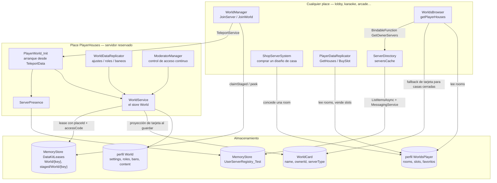

# Casas — resumen

:::tip Una casa no es un servidor de casa

La distinción más importante de este sistema. Una **casa** es un registro persistente que
puede vivir meses. Un **servidor de casa** es una instancia de servidor reservado de
Roblox que puede vivir minutos. Tienen identidades distintas, almacenamiento distinto,
vidas distintas y modos de fallo distintos.

| | Casa | Servidor de casa |
|---|---|---|
| Qué es | Un perfil `World` en un DataStore | Una instancia de servidor reservado de Roblox |
| Identidad | `"{ownerUserId}_{roomName}"` | Un `ReservedServerAccessCode` |
| Vida | Indefinida | Del primer teleport a la salida del último jugador |
| Dónde vive | DataStore, vía `DataKit` | Infraestructura de Roblox |
| Quién puede escribirla | Exactamente un servidor, garantizado por un lease distribuido | — |
| Desaparece cuando | Nunca (nada la borra) | Roblox recupera la instancia |

Las páginas de esta sección mantienen ambas cosas separadas a propósito. Cuando una
página dice «la casa», habla del registro; cuando dice «el servidor de casa», habla de la
instancia.

:::

## Qué hace el sistema

Un jugador posee una o más **rooms** (diseños de casa). Cada room que posee es una casa
distinta, con su propio nombre, ajuste de privacidad, lista de roles, lista de baneos y
contenido. Abrir una casa reserva un servidor de Roblox en el place donde vive el diseño
de esa room, y teletransporta al jugador allí. Otros jugadores pueden encontrar esa casa
desde un navegador y entrar si los permisos lo permiten.

## Componentes

| Componente | Ruta | Corre en | Papel |
|---|---|---|---|
| `WorldManager` | `Core/…/ServerScripts/WorldManager.server.luau` | Cualquier place | Resuelve `JoinServer` / `JoinWorld`; hace staging, reserva y teletransporta |
| `ServerPresence` | `Core/ServerStorage/WorldSystem/ServerPresence.luau` | Cualquier place | Publica este servidor en el directorio navegable |
| `ServerDirectory` | `Core/…/ServerScripts/ServerDirectory.server.luau` | Cualquier place | Mantiene una caché del directorio; sirve consultas de amigos, más jugados, casas propias y evento activo |
| `WorldsBrowser` | `Core/…/ServerScripts/WorldsBrowser.server.luau` | Cualquier place | Búsqueda de jugadores, y «qué casas tiene este usuario» |
| `ShopServerSystem` | `Core/…/ServerScripts/ShopServerSystem.server.luau` | Cualquier place | Vende diseños de casa desde una tienda rotatoria |
| `PlayerDataReplicator` | `Core/…/ServerScripts/PlayerDataReplicator.server.luau` | Cualquier place | Sirve `GetHouses`, `GetSlots`; vende **espacios** de casa |
| `Profiles` | `Core/ServerStorage/WorldSystem/Profiles.luau` | Cualquier place | Declara los perfiles `World` y `WorldsPlayer` |
| `PlayerWorld_Init` | `PlayerHouses/ServerScriptService/PlayerWorld_Init.lua.server.luau` | **Solo place de casa** | Arranca el servidor de casa a partir del `TeleportData` |
| `WorldService` | `PlayerHouses/ServerScriptService/WorldService.luau` | **Solo place de casa** | Envoltorio singleton sobre el `Store` de la casa |
| `WorldDataReplicator` | `PlayerHouses/ServerScriptService/WorldDataReplicator.server.luau` | **Solo place de casa** | Remotes de administración; replica ajustes/roles/baneos a jugadores privilegiados |
| `ModeratorManager` | `PlayerHouses/ServerScriptService/ModeratorManager.server.luau` | **Solo place de casa** | Aplica baneos y privacidad a *todos* los jugadores, de forma continua |
| `HousesInfo` | `Core/ReplicatedStorage/HousesInfo.luau` | Compartido | El catálogo: nombre de room → `placeId`, nombre visible, precio |
| `RolesInfo` | `PlayerHouses/ReplicatedStorage/RolesInfo.luau` | Compartido | La escala de roles |

## Arquitectura

## Las dos mitades

**INFERENCIA.** El sistema se parte limpiamente por una línea: *qué se puede responder sin
cargar la casa*, y *qué no*.

| Respondible desde cualquier sitio | Solo en el servidor de casa |
|---|---|
| Qué rooms posee un jugador (`WorldsPlayer.rooms`) | El nombre, roles, baneos y contenido actuales de la casa |
| Si una casa está abierta ahora y cuán llena (directorio de presencia) | Cambiar cualquiera de esas cosas |
| El nombre y la privacidad de una casa cerrada (la proyección `WorldCard`) | Aplicar baneos y privacidad a quienes están dentro |
| Cómo llegar a una casa abierta (la `meta` del lease) | |

La `WorldCard` es lo que hace asequible un navegador: listar las seis casas de un jugador
cuesta seis lecturas pequeñas de tarjeta, no seis cargas completas de perfil con seis
reclamaciones de lease.

## A dónde ir ahora

| Pregunta | Página |
|---|---|
| ¿Cómo se identifica, se compra y se posee una casa? | [Identidad y propiedad](./identity.md) |
| ¿Qué se guarda, dónde, y cuándo se escribe? | [Persistencia](./persistence.md) |
| ¿Qué pasa desde que el jugador pulsa entrar hasta que el servidor está listo? | [Flujo de entrada](./entry-flow.md) |
| ¿Qué pasa mientras corre, y cuando sale el último jugador? | [Ciclo de vida del servidor](./server-lifecycle.md) |
| ¿Quién puede entrar, y quién puede administrar? | [Permisos](./permissions.md) |
| ¿Qué pasa cuando algo falla? | [Manejo de errores](./error-handling.md) |
| El mecanismo de reserva en general | [Arquitectura → Servidores reservados](../../architecture/reserved-servers.md) |
