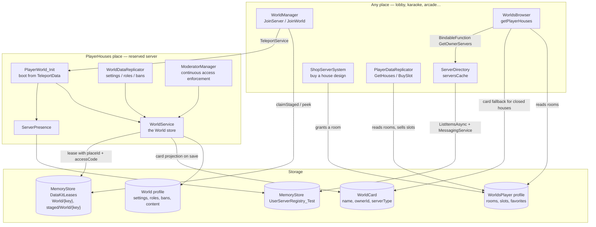

# Housing — overview

:::tip A house is not a house server

The single most important distinction in this system. A **house** is a persistent record
that can live for months. A **house server** is a reserved Roblox server instance that may
live for minutes. They have different identities, different storage, different lifetimes
and different failure modes.

| | House | House server |
|---|---|---|
| What it is | A `World` profile in a DataStore | A reserved Roblox server instance |
| Identity | `"{ownerUserId}_{roomName}"` | A `ReservedServerAccessCode` |
| Lifetime | Indefinite | From first teleport to last player leaving |
| Where it lives | DataStore, via `DataKit` | Roblox infrastructure |
| Who can write it | Exactly one server, enforced by a distributed lease | — |
| Disappears when | Never (nothing deletes it) | Roblox reclaims the instance |

The pages in this section keep the two apart deliberately. When a page says "the house",
it means the record; when it says "the house server", it means the instance.

:::

## What the system does

A player owns one or more **rooms** (house designs). Each room the player owns is a
distinct house with its own name, privacy setting, role list, ban list and contents.
Opening a house reserves a Roblox server on the place that room's design lives on, and
teleports the player there. Other players can find that house through a browser and join
it if the permissions allow.

## Components

| Component | Path | Runs on | Role |
|---|---|---|---|
| `WorldManager` | `Core/…/ServerScripts/WorldManager.server.luau` | Any place | Resolves `JoinServer` / `JoinWorld`; stages, reserves and teleports |
| `ServerPresence` | `Core/ServerStorage/WorldSystem/ServerPresence.luau` | Any place | Publishes this server to the browsable directory |
| `ServerDirectory` | `Core/…/ServerScripts/ServerDirectory.server.luau` | Any place | Maintains a cache of the directory; serves friend / most-played / own-house / active-event queries |
| `WorldsBrowser` | `Core/…/ServerScripts/WorldsBrowser.server.luau` | Any place | Player search, and "which houses does this user have" |
| `ShopServerSystem` | `Core/…/ServerScripts/ShopServerSystem.server.luau` | Any place | Sells house designs from a rotating shop |
| `PlayerDataReplicator` | `Core/…/ServerScripts/PlayerDataReplicator.server.luau` | Any place | Serves `GetHouses`, `GetSlots`; sells house **slots** |
| `Profiles` | `Core/ServerStorage/WorldSystem/Profiles.luau` | Any place | Declares the `World` and `WorldsPlayer` profiles |
| `PlayerWorld_Init` | `PlayerHouses/ServerScriptService/PlayerWorld_Init.lua.server.luau` | **House place only** | Boots the house server from `TeleportData` |
| `WorldService` | `PlayerHouses/ServerScriptService/WorldService.luau` | **House place only** | Singleton wrapper over the house's `Store` |
| `WorldDataReplicator` | `PlayerHouses/ServerScriptService/WorldDataReplicator.server.luau` | **House place only** | Administration remotes; replicates settings/roles/bans to privileged players |
| `ModeratorManager` | `PlayerHouses/ServerScriptService/ModeratorManager.server.luau` | **House place only** | Enforces bans and privacy for *every* player, continuously |
| `HousesInfo` | `Core/ReplicatedStorage/HousesInfo.luau` | Shared | The catalogue: room name → `placeId`, display name, price |
| `RolesInfo` | `PlayerHouses/ReplicatedStorage/RolesInfo.luau` | Shared | The role ladder |

## Architecture

## The two halves

**INFERENCE.** The system splits cleanly along one line: *what can be answered without
loading the house*, and *what cannot*.

| Answerable anywhere | Only on the house server |
|---|---|
| Which rooms does a player own (`WorldsPlayer.rooms`) | The house's current name, roles, bans, contents |
| Is a house open right now, and how full (presence directory) | Changing any of those |
| A closed house's name and privacy (the `WorldCard` projection) | Enforcing bans and privacy on players inside |
| How to reach an open house (the lease's `meta`) | |

The `WorldCard` is what makes a browser affordable: listing a player's six houses costs
six small card reads, not six full profile loads with six lease claims.

## Where to go next

| Question | Page |
|---|---|
| How is a house identified, bought and owned? | [Identity and ownership](./identity.md) |
| What is stored, where, and when is it written? | [Persistence](./persistence.md) |
| What happens from "player clicks join" to "house server ready"? | [Entry flow](./entry-flow.md) |
| What happens while it runs, and when the last player leaves? | [Server lifecycle](./server-lifecycle.md) |
| Who can enter, and who can administer? | [Permissions](./permissions.md) |
| What happens when something fails? | [Error handling](./error-handling.md) |
| The reservation mechanism in general | [Architecture → Reserved servers](../../architecture/reserved-servers.md) |
