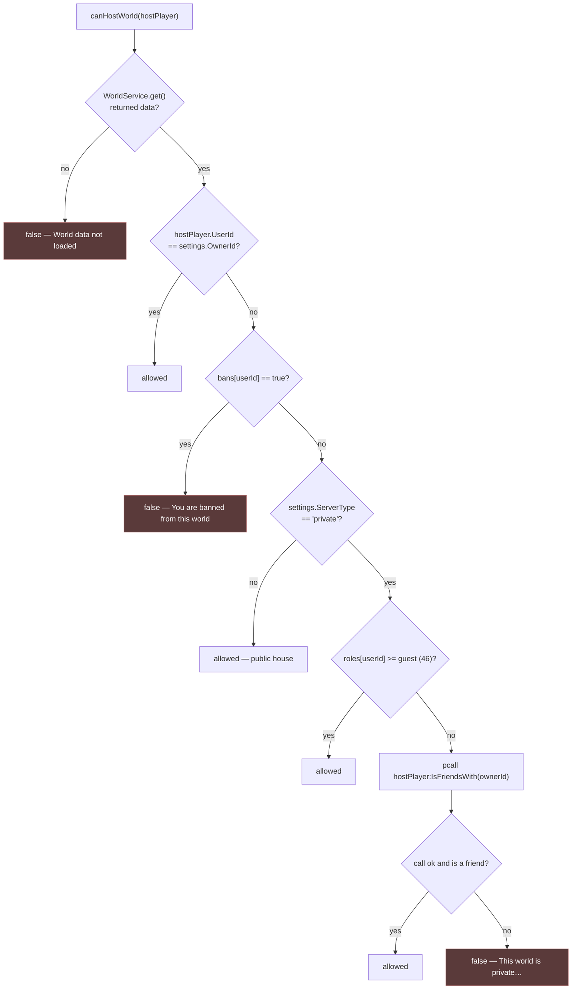
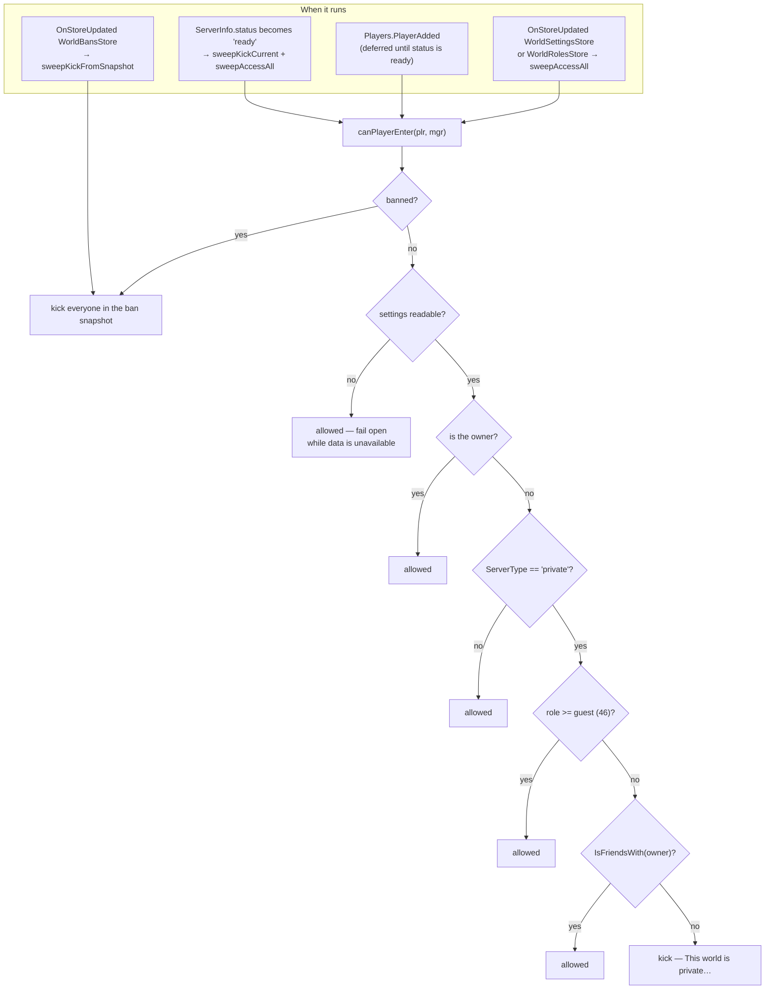

# House permissions

Three separate checks govern a house, at three different moments, in two different scripts.
Confusing them is easy, so this page names each one and what it actually gates.

| Check | Where | When | Gates |
|---|---|---|---|
| `hasRoom` | `PlayerWorld_Init` | Once, at boot | *May this house exist?* — does the owner named in the key own that room |
| `canHostWorld` | `PlayerWorld_Init` | Once, at boot | *May **this** player open it?* — the first arrival only |
| `canPlayerEnter` | `ModeratorManager` | Continuously | *May this player remain?* — every player, re-evaluated on every change |
| `canModerate` | `WorldDataReplicator` | Per request | *May this player change settings, roles or bans?* |

## The role ladder

**FACT.** `PlayerHouses/ReplicatedStorage/RolesInfo.luau`:

```lua
local RolesInfo = {
    owner     = 51,
    coOwner   = 50,
    admin     = 49,
    moderator = 48,
    designer  = 47,
    guest     = 46
}
```

**FACT.** `owner` is never stored in the `roles` table. It is derived from
`settings.OwnerId`, in both scripts that need it:

```lua
local function roleFor(data: any, userId: number): number
    local role = data.roles[tostring(userId)] or 0
    if data.settings.OwnerId == userId then
        role = OWNER_ROLE      -- 51
    end
    return role
end
```

A player with no entry has role `0`.

## Who may open the house

**FACT.** `canHostWorld` runs once, against the first player to arrive:



**FACT.** A refusal calls `onFailedServer`, which warns and then
`ServerPresence.KickAll`s — everyone present is ejected, not just the refused player. At
that moment the first player *is* everyone present, so the effect is the same.

**FACT.** The `IsFriendsWith` call is wrapped in `pcall`, and the failure is treated as
"not a friend": `if not ok or not isFriend then` refuse. This gate **fails closed** —
unlike the voice-chat gate in
[BUG-CANDIDATE-001](../../testing/verification-plan.md#bug-candidate-001), which fails open.

## Who may remain

**FACT.** `ModeratorManager.canPlayerEnter` applies the same policy to **every** player, and
re-applies it whenever the house's data changes:



**FACT.** Every kick goes through a `pcall`-wrapped helper, so a failed kick warns rather
than raising.

**INFERENCE — the two checks are deliberately redundant.** `canHostWorld` decides whether
the house opens at all; `canPlayerEnter` polices everyone continuously afterwards. The first
player is covered by both, because `onReady` runs `sweepAccessAll` over all present players
as soon as the server reports ready.

**FACT — bans take effect immediately.** `SetBan` does not kick. The kick comes from the
`WorldBansStore` signal that the write produces, via `sweepKickFromSnapshot`. So banning
someone who is currently inside ejects them without any extra code path, and the same
mechanism ejects them if a *different* server writes the ban.

**FACT — flipping a house to private ejects strangers.** `togglePrivacity` writes
`settings`, which fires `WorldSettingsStore`, which runs `sweepAccessAll`, which
re-evaluates everyone against the new privacy setting.

## Who may administer

**FACT.** `WorldDataReplicator.canModerate` gates every administrative remote:

```lua
local function canModerate(data: any, player: Player): boolean
    if data.settings.OwnerId == player.UserId then
        return true
    end
    return roleFor(data, player.UserId) > RolesInfo["moderator"]
end
```

**OBSERVATION — the comparison is strictly greater than.** `RolesInfo.moderator` is 48, so
a player whose role is exactly `moderator` returns `48 > 48` → `false` and **cannot
moderate**. The effective administrative set is `admin` (49), `coOwner` (50) and the owner.

The function is named `canModerate` and the role is named `moderator`, so either the
comparison or the name is wrong. Which one is a product decision, not something static
reading can settle. Recorded as
[BUG-CANDIDATE-011](../../testing/verification-plan.md#bug-candidate-011).

Note the contrast: the *entry* check uses `>=` (`role >= RolesInfo["guest"]`), so `guest`
itself does pass there. The two comparisons are inconsistent with each other.

### The administrative remotes

**FACT.** All are `RemoteFunction`s in `PlayerHouses`' `Events/WorldSystem` folder:

| Remote | Requires | Extra validation |
|---|---|---|
| `GetUserRol(userId?)` | — | Defaults to the caller; returns `OWNER_ROLE` for the owner |
| `GetRoles()` | — | Returns the whole roles table |
| `GetWorldSettings()` | — | Returns the whole settings table |
| `GetBans()` | — | Returns `{}` if `bans` is not a table |
| `SetWorldName(rawName)` | `canModerate` | Sanitised — see below |
| `SetBan(targetUserId, shouldBan)` | `canModerate` | Type-checks both arguments; **refuses to ban the owner** |
| `SetUserRole(targetUserId, roleName)` | `canModerate` | Type-checks; refuses to edit the owner; `roleName` must be `"none"` or a key of `RolesInfo` |
| `togglePrivacity()` | `canModerate` | Flips `public` ↔ `private` |

**OBSERVATION — the four read remotes have no permission check at all.** `GetRoles`,
`GetWorldSettings`, `GetBans` and `GetUserRol` return the house's full roles table, settings
and ban list to **any** player who can invoke them from inside the house.

This is a low-severity information exposure: everything returned is about a house the caller
is standing in, and the ban list is a set of user ids. It is recorded because the *push*
path is restricted while the *pull* path is not — `pushStore` sends these same payloads only
to players with `role >= moderator` or the owner, which shows the intent was to restrict
them. Recorded as
[BUG-CANDIDATE-012](../../testing/verification-plan.md#bug-candidate-012).

**FACT — role escalation is not prevented.** `SetUserRole` checks that the caller can
moderate and that the target is not the owner. It does **not** check that the caller's role
outranks the role being assigned. An `admin` (49) can therefore grant `coOwner` (50) to
another player, or to themselves. Whether that is intended is a product question; it is
noted here as a property of the code, and folded into
[BUG-CANDIDATE-011](../../testing/verification-plan.md#bug-candidate-011).

### Name sanitisation

**FACT.** `SetWorldName` is the most thoroughly validated remote in the reviewed source:

1. `tostring(rawName or "")` — accepts anything, coerces it;
2. `gsub("[%c%z]", "")` — strips control characters and nulls;
3. trims leading and trailing whitespace, collapses runs of whitespace to one space;
4. truncates to 40 characters using `utf8.offset`, so a multi-byte character is never cut
   in half;
5. falls back to `"Room"` if the result is empty;
6. runs `TextService:FilterStringAsync(proposed, player.UserId)` followed by
   `GetNonChatStringForBroadcastAsync()`, inside a `pcall`;
7. keeps the filtered result only if the call succeeded and returned a non-empty string.

**OBSERVATION.** Step 7 means a `FilterStringAsync` failure falls back to the
*unfiltered* (but otherwise sanitised) name. That is a fail-open on text filtering, and it
is the same class of decision as
[BUG-CANDIDATE-001](../../testing/verification-plan.md#bug-candidate-001). It is recorded
here rather than as its own candidate because the sanitisation in steps 1–5 still applies
and the exposure is limited to a house name.

## Replication of privileged data

**FACT.** `pushStore` sends `settings`, `roles` and `bans` only to players who pass the
role bar:

```lua
if role >= RolesInfo["moderator"] or data.settings.OwnerId == plr.UserId then
```

**OBSERVATION.** This uses `>=`, so a `moderator` **does** receive the replicated data —
while `canModerate` uses `>` and denies them the ability to act on it. A moderator can see
the roles and bans UI and cannot use it. This is the clearest single piece of evidence that
the `>` in `canModerate` is unintentional, and it is the reason
[BUG-CANDIDATE-011](../../testing/verification-plan.md#bug-candidate-011) is classified
`Likely Bug` rather than `Observation`.

**FACT.** The owner's own entry is synthesised into the payload rather than stored:

```lua
if storeName == "WorldRolesStore" and data.settings.OwnerId == plr.UserId then
    payload = table.clone(payload)
    payload[tostring(plr.UserId)] = OWNER_ROLE
end
```

`table.clone` is used so the store's live table is not mutated.

## Related implementation

| Concern | Code |
|---|---|
| Role ladder | `PlayerHouses/ReplicatedStorage/RolesInfo.luau` |
| Open-the-house gate | `PlayerWorld_Init.lua.server.luau`, `canHostWorld` |
| Ownership of the room | `PlayerWorld_Init.lua.server.luau`, `hasRoom` |
| Continuous enforcement | `ModeratorManager.server.luau`, `canPlayerEnter`, `sweepAccessAll`, `sweepKickFromSnapshot` |
| Administrative gate | `WorldDataReplicator.server.luau`, `canModerate`, `roleFor` |
| Name sanitisation | `WorldDataReplicator.server.luau`, `SetWorldNameRF.OnServerInvoke` |
| Privileged replication | `WorldDataReplicator.server.luau`, `pushStore` |
