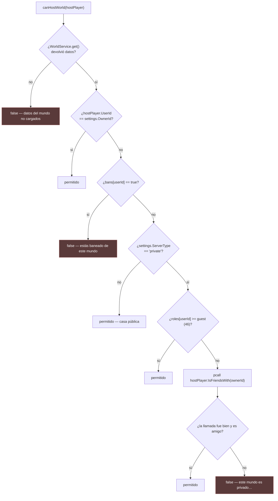
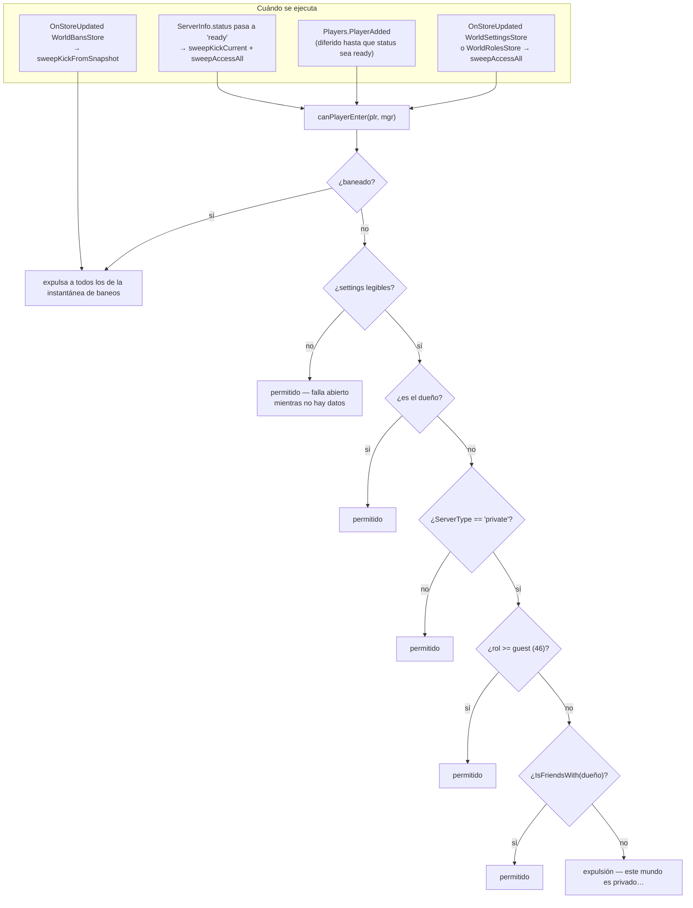

# Permisos de una casa

Tres comprobaciones distintas gobiernan una casa, en tres momentos distintos, repartidas en
dos scripts. Confundirlas es fácil, así que esta página nombra cada una y qué controla de
verdad.

| Comprobación | Dónde | Cuándo | Controla |
|---|---|---|---|
| `hasRoom` | `PlayerWorld_Init` | Una vez, al arrancar | *¿Puede existir esta casa?* — si el dueño nombrado en la clave posee esa room |
| `canHostWorld` | `PlayerWorld_Init` | Una vez, al arrancar | *¿Puede **este** jugador abrirla?* — solo el primero que llega |
| `canPlayerEnter` | `ModeratorManager` | De forma continua | *¿Puede este jugador quedarse?* — todos, reevaluado en cada cambio |
| `canModerate` | `WorldDataReplicator` | Por petición | *¿Puede este jugador cambiar ajustes, roles o baneos?* |

## La escala de roles

**HECHO.** `PlayerHouses/ReplicatedStorage/RolesInfo.luau`:

```lua
local RolesInfo = {
    owner     = 51,
    coOwner   = 50,
    admin     = 49,
    moderator = 48,
    designer  = 47,
    guest     = 46
}
```

**HECHO.** `owner` nunca se guarda en la tabla `roles`. Se deriva de `settings.OwnerId`, en
los dos scripts que lo necesitan:

```lua
local function roleFor(data: any, userId: number): number
    local role = data.roles[tostring(userId)] or 0
    if data.settings.OwnerId == userId then
        role = OWNER_ROLE      -- 51
    end
    return role
end
```

Un jugador sin entrada tiene rol `0`.

## Quién puede abrir la casa

**HECHO.** `canHostWorld` corre una vez, contra el primer jugador que llega:



**HECHO.** Un rechazo llama a `onFailedServer`, que avisa y después hace
`ServerPresence.KickAll` — se expulsa a todos los presentes, no solo al jugador rechazado.
En ese momento el primer jugador *es* todo el mundo presente, así que el efecto es el
mismo.

**HECHO.** La llamada a `IsFriendsWith` va envuelta en `pcall`, y el fallo se trata como
«no es amigo»: `if not ok or not isFriend then` rechazar. Esta puerta **falla cerrada** —a
diferencia de la de chat de voz de
[BUG-CANDIDATE-001](../../testing/verification-plan.md#bug-candidate-001), que falla
abierta.

## Quién puede quedarse

**HECHO.** `ModeratorManager.canPlayerEnter` aplica la misma política a **todos** los
jugadores, y la vuelve a aplicar cada vez que cambian los datos de la casa:



**HECHO.** Toda expulsión pasa por un helper envuelto en `pcall`, así que una expulsión
fallida avisa en vez de lanzar error.

**INFERENCIA — las dos comprobaciones son redundantes a propósito.** `canHostWorld` decide
si la casa se abre siquiera; `canPlayerEnter` vigila a todo el mundo de forma continua
después. El primer jugador queda cubierto por ambas, porque `onReady` ejecuta
`sweepAccessAll` sobre todos los presentes en cuanto el servidor se reporta listo.

**HECHO — los baneos surten efecto de inmediato.** `SetBan` no expulsa. La expulsión viene
de la señal `WorldBansStore` que produce la escritura, vía `sweepKickFromSnapshot`. Así,
banear a alguien que está dentro lo echa sin ninguna ruta de código adicional, y el mismo
mecanismo lo echa si el baneo lo escribe un servidor *distinto*.

**HECHO — pasar una casa a privada echa a los extraños.** `togglePrivacity` escribe
`settings`, lo que dispara `WorldSettingsStore`, que ejecuta `sweepAccessAll`, que
reevalúa a todo el mundo contra el nuevo ajuste de privacidad.

## Quién puede administrar

**HECHO.** `WorldDataReplicator.canModerate` controla todos los remotes administrativos:

```lua
local function canModerate(data: any, player: Player): boolean
    if data.settings.OwnerId == player.UserId then
        return true
    end
    return roleFor(data, player.UserId) > RolesInfo["moderator"]
end
```

**OBSERVACIÓN — la comparación es estrictamente «mayor que».** `RolesInfo.moderator` vale
48, así que un jugador cuyo rol sea exactamente `moderator` evalúa `48 > 48` → `false` y
**no puede moderar**. El conjunto administrativo efectivo es `admin` (49), `coOwner` (50) y
el dueño.

La función se llama `canModerate` y el rol se llama `moderator`, así que o la comparación o
el nombre están mal. Cuál de los dos es una decisión de producto, no algo que la lectura
estática pueda resolver. Registrado como
[BUG-CANDIDATE-011](../../testing/verification-plan.md#bug-candidate-011).

Nótese el contraste: la comprobación de *entrada* usa `>=` (`role >= RolesInfo["guest"]`),
así que `guest` sí pasa allí. Las dos comparaciones son inconsistentes entre sí.

### Los remotes administrativos

**HECHO.** Todos son `RemoteFunction` de la carpeta `Events/WorldSystem` de
`PlayerHouses`:

| Remote | Requiere | Validación adicional |
|---|---|---|
| `GetUserRol(userId?)` | — | Por defecto el llamante; devuelve `OWNER_ROLE` para el dueño |
| `GetRoles()` | — | Devuelve la tabla de roles entera |
| `GetWorldSettings()` | — | Devuelve la tabla de ajustes entera |
| `GetBans()` | — | Devuelve `{}` si `bans` no es una tabla |
| `SetWorldName(rawName)` | `canModerate` | Saneado — ver más abajo |
| `SetBan(targetUserId, shouldBan)` | `canModerate` | Comprueba el tipo de ambos argumentos; **se niega a banear al dueño** |
| `SetUserRole(targetUserId, roleName)` | `canModerate` | Comprueba tipos; se niega a editar al dueño; `roleName` debe ser `"none"` o una clave de `RolesInfo` |
| `togglePrivacity()` | `canModerate` | Alterna `public` ↔ `private` |

**OBSERVACIÓN — los cuatro remotes de lectura no tienen ninguna comprobación de
permisos.** `GetRoles`, `GetWorldSettings`, `GetBans` y `GetUserRol` devuelven la tabla
completa de roles, los ajustes y la lista de baneos de la casa a **cualquier** jugador que
pueda invocarlos desde dentro.

Es una exposición de información de baja gravedad: todo lo devuelto es sobre una casa en la
que el llamante está de pie, y la lista de baneos es un conjunto de ids de usuario. Se
registra porque la ruta de *envío* sí está restringida mientras que la de *consulta* no:
`pushStore` manda exactamente estos mismos contenidos solo a jugadores con
`role >= moderator` o al dueño, lo que demuestra que la intención era restringirlos.
Registrado como
[BUG-CANDIDATE-012](../../testing/verification-plan.md#bug-candidate-012).

**HECHO — no se impide la escalada de roles.** `SetUserRole` comprueba que el llamante
pueda moderar y que el objetivo no sea el dueño. **No** comprueba que el rol del llamante
supere al rol que se está asignando. Un `admin` (49) puede por tanto conceder `coOwner`
(50) a otro jugador, o a sí mismo. Si eso es intencionado es una cuestión de producto; se
anota aquí como propiedad del código, y se integra en
[BUG-CANDIDATE-011](../../testing/verification-plan.md#bug-candidate-011).

### Saneado del nombre

**HECHO.** `SetWorldName` es el remote más concienzudamente validado del código revisado:

1. `tostring(rawName or "")` — acepta cualquier cosa y la convierte;
2. `gsub("[%c%z]", "")` — quita caracteres de control y nulos;
3. recorta espacios al principio y al final, y colapsa secuencias de espacios en uno;
4. trunca a 40 caracteres usando `utf8.offset`, de modo que nunca parte por la mitad un
   carácter multibyte;
5. cae a `"Room"` si el resultado queda vacío;
6. ejecuta `TextService:FilterStringAsync(proposed, player.UserId)` seguido de
   `GetNonChatStringForBroadcastAsync()`, dentro de un `pcall`;
7. conserva el resultado filtrado solo si la llamada fue bien y devolvió una cadena no
   vacía.

**OBSERVACIÓN.** El paso 7 implica que un fallo de `FilterStringAsync` cae al nombre *sin
filtrar* (aunque sí saneado). Es un fallo abierto en el filtrado de texto, de la misma
clase que
[BUG-CANDIDATE-001](../../testing/verification-plan.md#bug-candidate-001). Se registra
aquí en vez de como candidato propio porque el saneado de los pasos 1–5 sigue
aplicándose y la exposición se limita al nombre de una casa.

## Replicación de datos privilegiados

**HECHO.** `pushStore` envía `settings`, `roles` y `bans` solo a los jugadores que superan
el listón de rol:

```lua
if role >= RolesInfo["moderator"] or data.settings.OwnerId == plr.UserId then
```

**OBSERVACIÓN.** Esto usa `>=`, así que un `moderator` **sí** recibe los datos replicados
— mientras que `canModerate` usa `>` y le niega la capacidad de actuar sobre ellos. Un
moderador puede ver la interfaz de roles y baneos y no puede usarla. Es la prueba más
clara de que el `>` de `canModerate` no es intencionado, y la razón de que
[BUG-CANDIDATE-011](../../testing/verification-plan.md#bug-candidate-011) esté clasificado
como `Likely Bug` y no como `Observation`.

**HECHO.** La entrada del propio dueño se sintetiza en el contenido en vez de guardarse:

```lua
if storeName == "WorldRolesStore" and data.settings.OwnerId == plr.UserId then
    payload = table.clone(payload)
    payload[tostring(plr.UserId)] = OWNER_ROLE
end
```

Se usa `table.clone` para no mutar la tabla viva del store.

## Implementación relacionada

| Aspecto | Código |
|---|---|
| Escala de roles | `PlayerHouses/ReplicatedStorage/RolesInfo.luau` |
| Puerta de apertura de la casa | `PlayerWorld_Init.lua.server.luau`, `canHostWorld` |
| Propiedad de la room | `PlayerWorld_Init.lua.server.luau`, `hasRoom` |
| Control continuo | `ModeratorManager.server.luau`, `canPlayerEnter`, `sweepAccessAll`, `sweepKickFromSnapshot` |
| Puerta administrativa | `WorldDataReplicator.server.luau`, `canModerate`, `roleFor` |
| Saneado del nombre | `WorldDataReplicator.server.luau`, `SetWorldNameRF.OnServerInvoke` |
| Replicación privilegiada | `WorldDataReplicator.server.luau`, `pushStore` |
