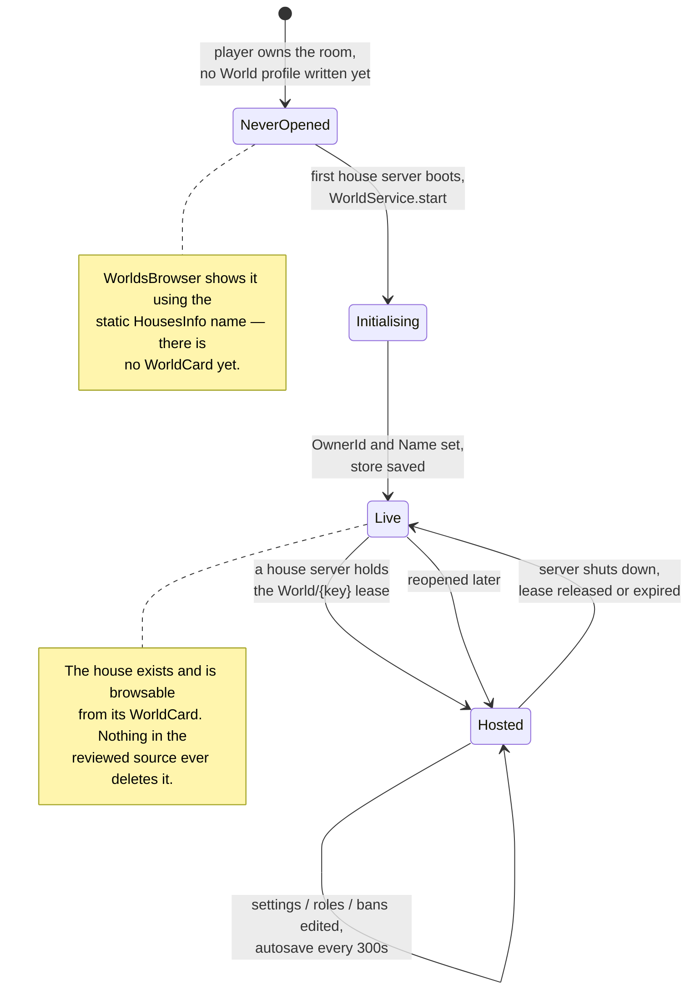

# House persistence

## What is stored, and where

**FACT.** A house's durable state is a `World` profile, declared in
`Core/ServerStorage/WorldSystem/Profiles.luau`:

```lua
Profiles.World = DataKit.Profile.define("World", {
    settings = {
        OwnerId = 0,
        Name = "Room",
        ServerType = "public",
    },
    roles = {},
    bans = {},
    content = {},
}, {
    onConflict = "deny",
    card = {
        project = function(data)
            return {
                name = data.settings.Name,
                ownerId = data.settings.OwnerId,
                serverType = data.settings.ServerType,
            }
        end,
    },
})
```

| Section | Shape | Written by |
|---|---|---|
| `settings` | `{ OwnerId: number, Name: string, ServerType: "public" \| "private" }` | `WorldService.start` (first boot), `WorldDataReplicator` (`SetWorldName`, `togglePrivacity`) |
| `roles` | `{ [userIdString]: number }` | `WorldDataReplicator` (`SetUserRole`) |
| `bans` | `{ [userIdString]: true }` | `WorldDataReplicator` (`SetBan`) |
| `content` | `{}` in the template | **UNKNOWN** — no writer found in the reviewed source |

**UNKNOWN.** `content` is declared and never touched by any script read so far. The
`BuildingSystem` template is the obvious candidate — it has a construction UI and
furniture placement — but that has not been analysed, so no claim is made here.

## Four storage locations

**FACT.** A single house touches four distinct stores:

| Store | Backend | Key | Contents | Lifetime |
|---|---|---|---|---|
| `World` profile | DataStore | `{userId}_{room}` | `settings`, `roles`, `bans`, `content` | Permanent |
| `WorldCard` | DataStore | same | `{ name, ownerId, serverType }` | Permanent, rewritten on save |
| `DataKitLeases` | MemoryStore | `World/{key}` | `{ owner = jobId, meta = { placeId, jobId, accessCode } }` | 120 s TTL, refreshed every 30 s |
| `UserServerRegistry_Test` | MemoryStore | `{key}` | Player list, counts, name, `placeId`, `jobId`, `accessCode`, `status` | 120 s TTL, refreshed every 30 s |

**INFERENCE.** The two DataStore entries are the house; the two MemoryStore entries are
the *server currently hosting* it. Nothing durable ever points at a server — which is
exactly why a stale server reference cannot outlive its TTL. See
[Architecture → Reserved servers](../../architecture/reserved-servers.md).

## First boot: how a house comes into existence

**FACT.** There is no "create house" operation. A house's `World` profile is created
implicitly, by `DataKit` reconciling the template over an empty load. `WorldService.start`
then fills in the two fields the template cannot know:

```lua
store:update(function(data)
    if data.settings.OwnerId == 0 then
        data.settings.OwnerId = config.ownerId
        data.settings.Name = config.displayName
    end
    return data
end)
```

**FACT.** The `OwnerId == 0` guard makes this a one-time initialisation: on every later
boot the fields are already set and the update is a no-op.

**FACT.** `displayName` comes from `PlayerWorld_Init.getRoomDisplayName`:

```lua
local success, playerName = pcall(function()
    return Players:GetNameFromUserIdAsync(ownerId)
end)
if success then
    return ("%s's %s"):format(playerName, HousesInfo[roomName].name)
else
    return "default Name"
end
```

**OBSERVATION.** If `GetNameFromUserIdAsync` fails on the house's **very first** boot, the
house is permanently named `"default Name"` — the `OwnerId == 0` guard means the
initialisation never runs again, so a later successful lookup cannot correct it. The owner
can still rename it through `SetWorldName`. Recorded as
[BUG-CANDIDATE-009](../../testing/verification-plan.md#bug-candidate-009).



## The card

**FACT.** The `WorldCard` projection lets a lobby show a **closed** house's real name and
privacy without loading the profile or taking its lease. `WorldsBrowser` uses exactly this
fallback:

```lua
local card = Profiles.World.readCard(serverKey)
name = card and card.name
serverType = card and card.serverType
```

**INFERENCE.** The card is written by `DataKit` when the store saves
(`_syncProjections` runs after a successful save). So a card reflects the house as of its
last save, not as of now — for a house that is currently hosted, the browser prefers the
live directory entry anyway, so the staleness only ever applies to closed houses whose
name changed in the final moments before shutdown.

## When a house is saved

**FACT.**

| Trigger | Path |
|---|---|
| Autosave | `Store._heartbeat`, every 300 s by default |
| Any administrative edit | `WorldService.update` → `store:update` marks dirty; persisted by the next save |
| Graceful shutdown | `BindToClose` → `presence:Cleanup()` → `OnCleanup` → `WorldService.destroy()` → `store:close()` |
| Denied host | `onDenied` → `presence:Cleanup()` → same chain |

**FACT.** `WorldService.destroy` is idempotent:

```lua
function WorldService.destroy()
    if WorldService.IsDestroyed then return end
    WorldService.IsDestroyed = true
    local store = currentStore
    if store then store:close() end
end
```

**FACT.** `PlayerWorld_Init`'s `BindToClose` covers both the initialised and
uninitialised cases:

```lua
game:BindToClose(function()
    if presence then
        presence:Cleanup()
    else
        WorldService.destroy()
    end
end)
```

**INFERENCE.** The `else` branch matters for a server that reserved and booted but never
reached `presence` — for example one denied during `awaitReady`. It still closes the store
rather than leaving the lease to expire.

## Change replication

**FACT.** `WorldService` does not push raw store changes. It diffs by section and fires
only what actually changed:

```lua
local function fireChangedSections(data: any)
    for storeName, section in SECTION_BY_STORE do
        local value = data[section]
        if not deepEquals(lastSections[section], value) then
            lastSections[section] = deepCopy(value)
            WorldService.OnStoreUpdated:Fire(storeName, deepCopy(value))
        end
    end
end
```

with the mapping:

| Signal name | Section |
|---|---|
| `WorldSettingsStore` | `settings` |
| `WorldRolesStore` | `roles` |
| `WorldBansStore` | `bans` |
| `WorldContentStore` | `content` |

Two consumers subscribe: `WorldDataReplicator` (replicates to privileged clients) and
`ModeratorManager` (re-evaluates who may stay). See [Permissions](./permissions.md).

**FACT.** Every value crossing this boundary is `deepCopy`ed — both into `lastSections`
and into the fired payload — so a consumer cannot mutate the store's live data by holding
onto what it received. `WorldService.get()` likewise returns a `deepCopy`.

## Concurrency

**FACT.** `Profiles.World` uses `onConflict = "deny"`, which means: never steal a live
house from another server. Combined with the `DataKit` lease, exactly one server may write
a house at a time, and a challenger converges to the owner rather than fighting it.

This is covered in full, with the two-layer guard against simultaneous opens, in
[Architecture → Reserved servers](../../architecture/reserved-servers.md).

## What is never deleted

**FACT.** No code in the reviewed source deletes a `World` profile or a `WorldCard`.
Selling, abandoning or resetting a house is not expressible.

**INFERENCE.** A house record therefore persists for the lifetime of the DataStore, whether
or not the owner still owns the room. If a room were ever removed from a player's `rooms`,
the house's data would remain and would be reachable again the moment the room was
re-acquired — with its old name, roles and bans intact. No code path removes entries from
`rooms` either, so this is currently unreachable; it is recorded as a property of the
design, not as a defect.

## Related implementation

| Concern | Code |
|---|---|
| Profile declaration | `Core/ServerStorage/WorldSystem/Profiles.luau`, `Profiles.World` |
| Store wrapper | `PlayerHouses/ServerScriptService/WorldService.luau` |
| First-boot initialisation | `WorldService.start` |
| Section diffing | `WorldService`, `fireChangedSections` |
| Card projection | `Profiles.World`'s `card.project`; `DataKit/Store.luau`, `readCard` |
| Save / close | [`Store`](/api/Store) — `save`, `close`, `_heartbeat` |
| Lease | [`Lease`](/api/Lease) |
