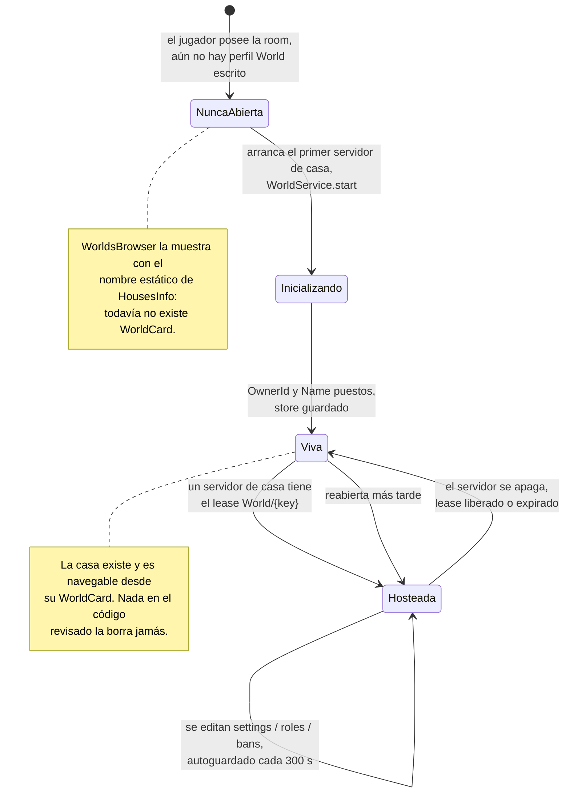

# Persistencia de una casa

## Qué se guarda, y dónde

**HECHO.** El estado duradero de una casa es un perfil `World`, declarado en
`Core/ServerStorage/WorldSystem/Profiles.luau`:

```lua
Profiles.World = DataKit.Profile.define("World", {
    settings = {
        OwnerId = 0,
        Name = "Room",
        ServerType = "public",
    },
    roles = {},
    bans = {},
    content = {},
}, {
    onConflict = "deny",
    card = {
        project = function(data)
            return {
                name = data.settings.Name,
                ownerId = data.settings.OwnerId,
                serverType = data.settings.ServerType,
            }
        end,
    },
})
```

| Sección | Forma | La escribe |
|---|---|---|
| `settings` | `{ OwnerId: number, Name: string, ServerType: "public" \| "private" }` | `WorldService.start` (primer arranque), `WorldDataReplicator` (`SetWorldName`, `togglePrivacity`) |
| `roles` | `{ [userIdString]: number }` | `WorldDataReplicator` (`SetUserRole`) |
| `bans` | `{ [userIdString]: true }` | `WorldDataReplicator` (`SetBan`) |
| `content` | `{}` en la plantilla | **DESCONOCIDO** — no se ha encontrado ningún escritor en el código revisado |

**DESCONOCIDO.** `content` está declarado y ningún script leído hasta ahora lo toca. La
plantilla `BuildingSystem` es la candidata obvia —tiene UI de construcción y colocación de
muebles—, pero no está analizada, así que aquí no se afirma nada.

## Cuatro ubicaciones de almacenamiento

**HECHO.** Una sola casa toca cuatro almacenes distintos:

| Almacén | Backend | Clave | Contenido | Vida |
|---|---|---|---|---|
| perfil `World` | DataStore | `{userId}_{room}` | `settings`, `roles`, `bans`, `content` | Permanente |
| `WorldCard` | DataStore | la misma | `{ name, ownerId, serverType }` | Permanente, reescrita al guardar |
| `DataKitLeases` | MemoryStore | `World/{key}` | `{ owner = jobId, meta = { placeId, jobId, accessCode } }` | TTL 120 s, refrescado cada 30 s |
| `UserServerRegistry_Test` | MemoryStore | `{key}` | Lista de jugadores, conteos, nombre, `placeId`, `jobId`, `accessCode`, `status` | TTL 120 s, refrescado cada 30 s |

**INFERENCIA.** Las dos entradas de DataStore son la casa; las dos de MemoryStore son *el
servidor que la aloja ahora*. Nada duradero apunta jamás a un servidor — que es
exactamente por lo que una referencia obsoleta a un servidor no puede sobrevivir a su TTL.
Ver [Arquitectura → Servidores reservados](../../architecture/reserved-servers.md).

## Primer arranque: cómo llega a existir una casa

**HECHO.** No hay operación de «crear casa». El perfil `World` de una casa se crea
implícitamente, cuando `DataKit` reconcilia la plantilla sobre una carga vacía.
`WorldService.start` rellena entonces los dos campos que la plantilla no puede conocer:

```lua
store:update(function(data)
    if data.settings.OwnerId == 0 then
        data.settings.OwnerId = config.ownerId
        data.settings.Name = config.displayName
    end
    return data
end)
```

**HECHO.** La guarda `OwnerId == 0` convierte esto en una inicialización de una sola vez:
en cada arranque posterior los campos ya están puestos y el update no hace nada.

**HECHO.** `displayName` viene de `PlayerWorld_Init.getRoomDisplayName`:

```lua
local success, playerName = pcall(function()
    return Players:GetNameFromUserIdAsync(ownerId)
end)
if success then
    return ("%s's %s"):format(playerName, HousesInfo[roomName].name)
else
    return "default Name"
end
```

**OBSERVACIÓN.** Si `GetNameFromUserIdAsync` falla en el **primerísimo** arranque de la
casa, la casa se llama permanentemente `"default Name"` — la guarda `OwnerId == 0` hace que
la inicialización no vuelva a correr, así que una búsqueda posterior con éxito no puede
corregirlo. El dueño todavía puede renombrarla con `SetWorldName`. Registrado como
[BUG-CANDIDATE-009](../../testing/verification-plan.md#bug-candidate-009).



## La tarjeta

**HECHO.** La proyección `WorldCard` permite a un lobby mostrar el nombre real y la
privacidad de una casa **cerrada** sin cargar el perfil ni tomar su lease.
`WorldsBrowser` usa exactamente ese fallback:

```lua
local card = Profiles.World.readCard(serverKey)
name = card and card.name
serverType = card and card.serverType
```

**INFERENCIA.** La tarjeta la escribe `DataKit` cuando el store guarda
(`_syncProjections` corre tras un guardado con éxito). Así que una tarjeta refleja la casa
tal como estaba en su último guardado, no ahora mismo — para una casa que esté hosteada el
navegador prefiere de todos modos la entrada del directorio vivo, así que la obsolescencia
solo aplica a casas cerradas cuyo nombre cambió en los últimos instantes antes del apagado.

## Cuándo se guarda una casa

**HECHO.**

| Disparador | Ruta |
|---|---|
| Autoguardado | `Store._heartbeat`, cada 300 s por defecto |
| Cualquier edición administrativa | `WorldService.update` → `store:update` marca sucio; se persiste en el siguiente guardado |
| Apagado ordenado | `BindToClose` → `presence:Cleanup()` → `OnCleanup` → `WorldService.destroy()` → `store:close()` |
| Anfitrión denegado | `onDenied` → `presence:Cleanup()` → la misma cadena |

**HECHO.** `WorldService.destroy` es idempotente:

```lua
function WorldService.destroy()
    if WorldService.IsDestroyed then return end
    WorldService.IsDestroyed = true
    local store = currentStore
    if store then store:close() end
end
```

**HECHO.** El `BindToClose` de `PlayerWorld_Init` cubre tanto el caso inicializado como el
no inicializado:

```lua
game:BindToClose(function()
    if presence then
        presence:Cleanup()
    else
        WorldService.destroy()
    end
end)
```

**INFERENCIA.** La rama `else` importa para un servidor que reservó y arrancó pero nunca
llegó a tener `presence` — por ejemplo uno denegado durante `awaitReady`. Aun así cierra el
store en vez de dejar que el lease expire.

## Replicación de cambios

**HECHO.** `WorldService` no propaga cambios en crudo del store. Hace diff por sección y
dispara solo lo que realmente cambió:

```lua
local function fireChangedSections(data: any)
    for storeName, section in SECTION_BY_STORE do
        local value = data[section]
        if not deepEquals(lastSections[section], value) then
            lastSections[section] = deepCopy(value)
            WorldService.OnStoreUpdated:Fire(storeName, deepCopy(value))
        end
    end
end
```

con el mapeo:

| Nombre de la señal | Sección |
|---|---|
| `WorldSettingsStore` | `settings` |
| `WorldRolesStore` | `roles` |
| `WorldBansStore` | `bans` |
| `WorldContentStore` | `content` |

Se suscriben dos consumidores: `WorldDataReplicator` (replica a clientes privilegiados) y
`ModeratorManager` (reevalúa quién puede quedarse). Ver [Permisos](./permissions.md).

**HECHO.** Todo valor que cruza esta frontera pasa por `deepCopy` —tanto al entrar en
`lastSections` como en el contenido disparado—, así que un consumidor no puede mutar los
datos vivos del store guardándose lo que recibió. `WorldService.get()` también devuelve un
`deepCopy`.

## Concurrencia

**HECHO.** `Profiles.World` usa `onConflict = "deny"`, que significa: no robar nunca una
casa viva a otro servidor. Junto con el lease de `DataKit`, exactamente un servidor puede
escribir una casa a la vez, y un aspirante converge hacia el dueño en vez de pelearse con
él.

Está cubierto por completo, con la protección de dos capas contra aperturas simultáneas,
en [Arquitectura → Servidores reservados](../../architecture/reserved-servers.md).

## Lo que nunca se borra

**HECHO.** Ningún código del árbol revisado borra un perfil `World` ni una `WorldCard`.
Vender, abandonar o resetear una casa no es expresable.

**INFERENCIA.** Un registro de casa persiste por tanto durante toda la vida del DataStore,
siga o no el dueño poseyendo la room. Si alguna vez se quitara una room de los `rooms` de
un jugador, los datos de la casa seguirían ahí y volverían a ser alcanzables en cuanto la
room se readquiriese — con su nombre, roles y baneos antiguos intactos. Tampoco hay
ninguna ruta de código que quite entradas de `rooms`, así que esto es hoy inalcanzable; se
registra como propiedad del diseño, no como defecto.

## Implementación relacionada

| Aspecto | Código |
|---|---|
| Declaración del perfil | `Core/ServerStorage/WorldSystem/Profiles.luau`, `Profiles.World` |
| Envoltorio del store | `PlayerHouses/ServerScriptService/WorldService.luau` |
| Inicialización de primer arranque | `WorldService.start` |
| Diff por secciones | `WorldService`, `fireChangedSections` |
| Proyección de tarjeta | `card.project` de `Profiles.World`; `DataKit/Store.luau`, `readCard` |
| Guardar / cerrar | [`Store`](/api/Store) — `save`, `close`, `_heartbeat` |
| Lease | [`Lease`](/api/Lease) |
