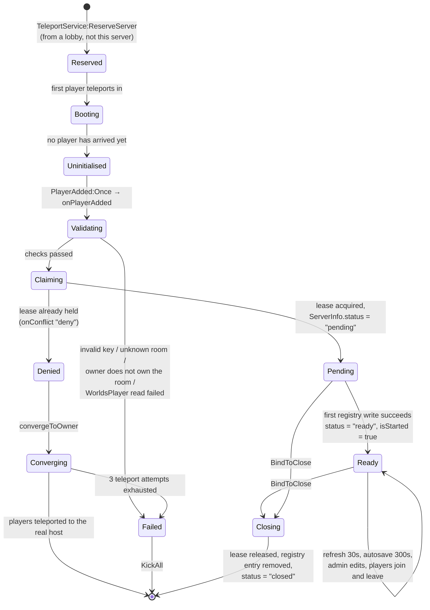
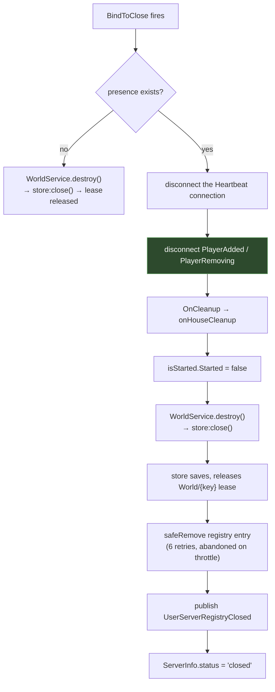

# House server lifecycle

The life of the **reserved server instance**, from the reservation that creates it to the
shutdown that removes it from the directory. For the persistent house record, see
[Persistence](./persistence.md).

## States



## Reserved but never joined

**FACT.** `PlayerWorld_Init` does nothing at server start. Its only entry points are the
loop over already-present players and `Players.PlayerAdded:Once`.

**INFERENCE.** A reserved server that boots and receives nobody — because the teleport
failed after the reservation succeeded, say — never initialises, never claims a lease,
never registers, and never saves. It is inert until Roblox reclaims it. The staging lease
that produced its `accessCode` expires 30 seconds after its last renewal, so the house
returns to "closed" and can be opened again cleanly.

## Ready

**FACT.** Two attributes mark readiness, and they are set together in `onHouseStarted`:

```lua
local function onHouseStarted()
    ServerInfoConfiguration:SetAttribute("status", "ready")
    isStarted:SetAttribute("Started", true)
    warn("Player World Started: ", ServerInfoConfiguration:GetAttribute("ServerKey"))
end
```

`OnStarted` is invoked by `ServerPresence.RefreshNow` only on the **first** successful
registry write, and only while `ServerInfo.status` still reads `"pending"` — so it fires
exactly once.

**FACT.** Both `ReplicatedStorage.ServerInfo` and `ReplicatedStorage.isStarted` are
replicated `Configuration` instances, so clients can observe readiness without a remote.

### Who waits on `status == "ready"`

**FACT.** Two server scripts gate themselves on it, and they do it differently:

| Script | Pattern |
|---|---|
| `ModeratorManager` | Checks the **current value first**, and only if it is not yet `"ready"` connects to `GetAttributeChangedSignal` |
| `WorldDataReplicator` | Connects to `GetAttributeChangedSignal` **only** — it never checks the current value |

**OBSERVATION.** The asymmetry is visible in the same template, between two files, one of
which handles the already-ready case and one of which does not. If `WorldDataReplicator` is
enabled after the status attribute has already become `"ready"`, its
`replicationWired` block never runs: no initial push of settings/roles/bans to privileged
clients, and no subscription to `WorldService.OnStoreUpdated`.

Whether that ordering can actually occur depends on the enable sweep in
[`InitScripts`](../../architecture/initialization.md) racing the first player's arrival —
and in a reserved house server the first player is arriving *as the server boots*, which is
precisely when the window is widest. Recorded as
[BUG-CANDIDATE-010](../../testing/verification-plan.md#bug-candidate-010).

## While running

**FACT.** The recurring work in a live house server:

| Work | Mechanism | Cadence |
|---|---|---|
| Registry refresh | `ServerPresence` on `Heartbeat` | 30 s, or 2 s after a player joins/leaves |
| Lease keepalive | `DataKit.Lease` on `Heartbeat` | 30 s (TTL 120 s) |
| Store autosave | `Store._heartbeat` | 300 s |
| Access re-evaluation | `WorldService.OnStoreUpdated` → `ModeratorManager` | On every settings/roles/bans change |
| Privileged replication | `WorldService.OnStoreUpdated` → `WorldDataReplicator.pushStore` | On every settings/roles/bans change |

**FACT.** The registry payload is rebuilt from scratch on every refresh by
`getHouseRefreshPayload`, so the advertised name, privacy, player list and count follow the
live store rather than a cached copy. If `WorldService.get()` returns `nil` — the store is
not ready — it returns the previous payload unchanged.

## A player leaves

**FACT.** `ServerPresence` connects `Players.PlayerRemoving` to `RequestRefresh`, which
pulls the next registry write forward to 2 seconds out. The departure therefore reaches the
directory within about 2 seconds rather than up to 30.

**FACT.** Nothing else in the housing path runs on `PlayerRemoving`. The house's state is
not per-player, so there is nothing per-player to tear down.

## The last player leaves

This is the case the brief asks about specifically, and the answer is: **nothing housing-specific
happens.**

**FACT.** There is no "last player" handler anywhere in the housing source. No
`#Players:GetPlayers() == 0` check, no idle timer, no explicit shutdown.

**INFERENCE.** The sequence is therefore:

1. The last player leaves. `RequestRefresh` fires; the registry entry is rewritten with an
   empty player list and `playerCount = 0`.
2. The server keeps running, refreshing its lease and its registry entry, holding the
   house's data, for as long as Roblox keeps it alive.
3. Roblox eventually shuts down the empty server on its own schedule.
4. `BindToClose` runs, and the shutdown path below executes.

**INFERENCE — a consequence worth naming.** Between steps 1 and 3 the house is still
*hosted*: it holds the lease, and it is still in the directory with a player count of zero.
A player rejoining in that window is teleported into the same still-running instance,
which is the desired outcome. The empty server is not a leak — it is what makes an instant
rejoin work.

**UNKNOWN.** How long Roblox keeps an empty reserved server alive. That is Roblox
infrastructure behaviour, not a property of this code, and it determines the size of the
window above.

## Shutdown

**FACT.**

```lua
game:BindToClose(function()
    if presence then
        presence:Cleanup()
    else
        WorldService.destroy()
    end
end)
```

`presence:Cleanup()` performs, in order:



**FACT — step D is load-bearing**, and the source says why:

```lua
-- Guardadas para poder soltarlas en Cleanup. Si sobreviven al cierre, el jugador que sale
-- reescribe la key que Cleanup acaba de borrar, y el servidor muerto se queda anunciado
-- en el directorio hasta que expira su TTL.
```

Without disconnecting first, the `PlayerRemoving` events fired as the server empties during
shutdown would request a refresh that rewrites the entry deleted in step I.

**FACT.** The order also matters for the lease: `OnCleanup` closes the store (releasing
`World/{key}`) **before** the registry entry is removed. So the house becomes re-openable
slightly before it stops being advertised, rather than the other way round.

## After an abrupt death

**FACT.** If the process dies without `BindToClose` completing:

| Entry | What happens |
|---|---|
| `DataKitLeases` → `World/{key}` | Not released. Expires on its own within 120 s. |
| `UserServerRegistry_Test` → `{key}` | Not removed. Expires on its own within 120 s. |
| `World` profile | Loses any changes since the last save — at most one 300-second autosave interval. |
| `WorldCard` | Same. |

**INFERENCE.** The TTLs are the recovery mechanism. Nothing needs to detect the death or
clean up after it; both entries are self-expiring, and the fence in the durable envelope
prevents a resurrected writer from clobbering a newer owner. See
[Architecture → Persistence](../../architecture/persistence.md).

**THEORY.** Within that window the house still reports as hosted, and a joining player is
sent to a dead `accessCode`. Recorded as
[BUG-CANDIDATE-005](../../testing/verification-plan.md#bug-candidate-005).

## Reopening

**FACT.** There is no reopen path distinct from the open path. A closed house is one whose
`World/{key}` lease is absent, so `claimStaged` finds nothing hosted, stages, reserves a
fresh server, and boots it. The new server loads the same `World` profile by the same key,
and `WorldService.start`'s `OwnerId == 0` guard means it does **not** re-initialise the
name.

**INFERENCE — this is why there is no stale-reference detection.** There is no stored
mapping to invalidate. Reachability *is* the lease, and liveness *is* its TTL.

## Related implementation

| Concern | Code |
|---|---|
| Boot | `PlayerWorld_Init.lua.server.luau`, `onPlayerAdded`, `init` |
| Readiness | `PlayerWorld_Init`, `onHouseStarted`; [`ServerPresence:RefreshNow`](/api/ServerPresence) |
| Payload | `PlayerWorld_Init`, `getHouseRefreshPayload` |
| Cleanup | `PlayerWorld_Init`, `onHouseCleanup`; [`ServerPresence:Cleanup`](/api/ServerPresence) |
| Store close | `WorldService.luau`, `destroy`; [`Store.close`](/api/Store) |
| Deny / converge | `PlayerWorld_Init`, `convergeToOwner`; [`Store`](/api/Store) `_resolveOwnership` |
