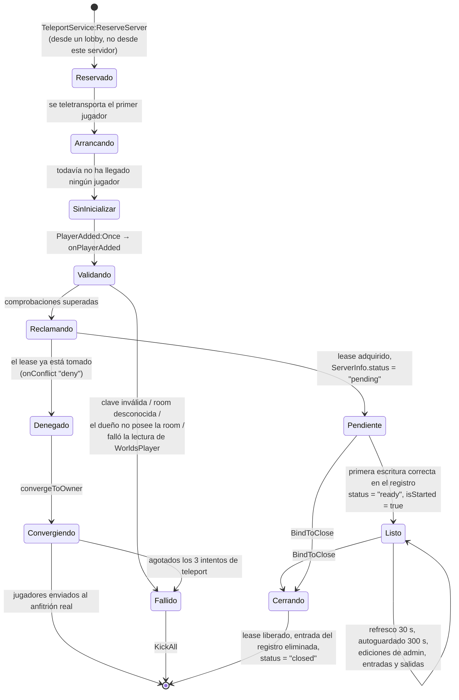
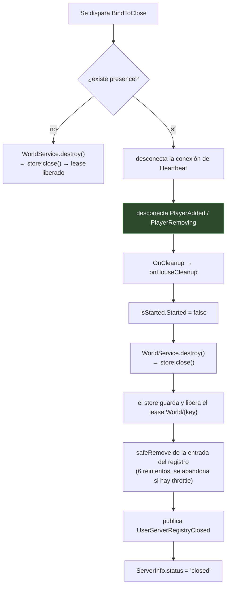

# Ciclo de vida del servidor de casa

La vida de la **instancia de servidor reservado**, desde la reserva que la crea hasta el
apagado que la quita del directorio. Para el registro persistente de la casa, ver
[Persistencia](./persistence.md).

## Estados



## Reservado pero sin nadie que entre

**HECHO.** `PlayerWorld_Init` no hace nada al arrancar el servidor. Sus únicos puntos de
entrada son el bucle sobre los jugadores ya presentes y `Players.PlayerAdded:Once`.

**INFERENCIA.** Un servidor reservado que arranca y al que no llega nadie —porque el
teleport falló después de que la reserva tuviera éxito, por ejemplo— nunca se inicializa,
nunca reclama un lease, nunca se registra y nunca guarda. Queda inerte hasta que Roblox lo
recupera. El lease de staging que produjo su `accessCode` expira 30 segundos después de su
última renovación, así que la casa vuelve a estar «cerrada» y se puede abrir de nuevo
limpiamente.

## Listo

**HECHO.** Dos atributos marcan la disponibilidad, y se ponen juntos en `onHouseStarted`:

```lua
local function onHouseStarted()
    ServerInfoConfiguration:SetAttribute("status", "ready")
    isStarted:SetAttribute("Started", true)
    warn("Player World Started: ", ServerInfoConfiguration:GetAttribute("ServerKey"))
end
```

`ServerPresence.RefreshNow` invoca `OnStarted` solo en la **primera** escritura correcta en
el registro, y solo mientras `ServerInfo.status` siga valiendo `"pending"` — así que se
dispara exactamente una vez.

**HECHO.** Tanto `ReplicatedStorage.ServerInfo` como `ReplicatedStorage.isStarted` son
instancias `Configuration` replicadas, así que los clientes pueden observar la
disponibilidad sin un remote.

### Quién espera a `status == "ready"`

**HECHO.** Dos scripts de servidor se controlan con eso, y lo hacen de forma distinta:

| Script | Patrón |
|---|---|
| `ModeratorManager` | Comprueba **primero el valor actual**, y solo si aún no es `"ready"` se conecta a `GetAttributeChangedSignal` |
| `WorldDataReplicator` | Se conecta **solo** a `GetAttributeChangedSignal` — nunca comprueba el valor actual |

**OBSERVACIÓN.** La asimetría se ve en la misma plantilla, entre dos archivos, uno de los
cuales maneja el caso «ya está listo» y el otro no. Si `WorldDataReplicator` se activa
después de que el atributo ya haya pasado a `"ready"`, su bloque `replicationWired` no
corre nunca: ni el envío inicial de ajustes/roles/baneos a los clientes privilegiados, ni
la suscripción a `WorldService.OnStoreUpdated` que los mantiene al día.

Que ese orden pueda darse depende de que el barrido de activación de
[`InitScripts`](../../architecture/initialization.md) compita con la llegada del primer
jugador — y en un servidor de casa reservado el primer jugador está llegando *mientras el
servidor arranca*, que es justo cuando la ventana es más ancha. Registrado como
[BUG-CANDIDATE-010](../../testing/verification-plan.md#bug-candidate-010).

## Mientras corre

**HECHO.** El trabajo recurrente en un servidor de casa vivo:

| Trabajo | Mecanismo | Cadencia |
|---|---|---|
| Refresco del registro | `ServerPresence` sobre `Heartbeat` | 30 s, o 2 s tras una entrada/salida |
| Keepalive del lease | `DataKit.Lease` sobre `Heartbeat` | 30 s (TTL 120 s) |
| Autoguardado del store | `Store._heartbeat` | 300 s |
| Reevaluación de acceso | `WorldService.OnStoreUpdated` → `ModeratorManager` | En cada cambio de settings/roles/bans |
| Replicación privilegiada | `WorldService.OnStoreUpdated` → `WorldDataReplicator.pushStore` | En cada cambio de settings/roles/bans |

**HECHO.** El contenido del registro se reconstruye desde cero en cada refresco con
`getHouseRefreshPayload`, así que el nombre, la privacidad, la lista de jugadores y el
conteo anunciados siguen al store vivo en vez de a una copia cacheada. Si
`WorldService.get()` devuelve `nil` —el store no está listo— devuelve el contenido anterior
sin cambios.

## Sale un jugador

**HECHO.** `ServerPresence` conecta `Players.PlayerRemoving` a `RequestRefresh`, que
adelanta la siguiente escritura al registro a 2 segundos vista. Así la salida llega al
directorio en unos 2 segundos en vez de en hasta 30.

**HECHO.** Nada más en la ruta de casas corre en `PlayerRemoving`. El estado de la casa no
es por jugador, así que no hay nada por jugador que desmontar.

## Sale el último jugador

Este es el caso por el que el enunciado pregunta específicamente, y la respuesta es: **no
pasa nada específico de las casas.**

**HECHO.** No hay ningún manejador de «último jugador» en el código de casas. Ni una
comprobación `#Players:GetPlayers() == 0`, ni un temporizador de inactividad, ni un apagado
explícito.

**INFERENCIA.** La secuencia es por tanto:

1. Sale el último jugador. Se dispara `RequestRefresh`; la entrada del registro se
   reescribe con lista de jugadores vacía y `playerCount = 0`.
2. El servidor sigue corriendo, refrescando su lease y su entrada del registro, y
   sosteniendo los datos de la casa, mientras Roblox lo mantenga vivo.
3. Roblox acaba apagando el servidor vacío según su propio criterio.
4. Corre `BindToClose`, y se ejecuta la ruta de apagado de más abajo.

**INFERENCIA — una consecuencia que conviene nombrar.** Entre los pasos 1 y 3 la casa
sigue *hosteada*: mantiene el lease, y sigue en el directorio con cero jugadores. Un
jugador que vuelva a entrar en esa ventana se teletransporta a la misma instancia todavía
en marcha, que es el resultado deseado. El servidor vacío no es una fuga: es lo que hace
que volver a entrar sea instantáneo.

**DESCONOCIDO.** Cuánto tiempo mantiene Roblox vivo un servidor reservado vacío. Eso es
comportamiento de la infraestructura de Roblox, no una propiedad de este código, y
determina el tamaño de la ventana anterior.

## Apagado

**HECHO.**

```lua
game:BindToClose(function()
    if presence then
        presence:Cleanup()
    else
        WorldService.destroy()
    end
end)
```

`presence:Cleanup()` hace, en este orden:



**HECHO — el paso D es determinante**, y el código dice por qué:

```lua
-- Guardadas para poder soltarlas en Cleanup. Si sobreviven al cierre, el jugador que sale
-- reescribe la key que Cleanup acaba de borrar, y el servidor muerto se queda anunciado
-- en el directorio hasta que expira su TTL.
```

Sin desconectar primero, los `PlayerRemoving` que se disparan mientras el servidor se vacía
durante el apagado pedirían un refresco que reescribiría la entrada borrada en el paso I.

**HECHO.** El orden importa también para el lease: `OnCleanup` cierra el store (liberando
`World/{key}`) **antes** de que se elimine la entrada del registro. Así, la casa pasa a ser
reabrible un poco antes de dejar de estar anunciada, y no al revés.

## Tras una muerte abrupta

**HECHO.** Si el proceso muere sin que `BindToClose` llegue a completarse:

| Entrada | Qué ocurre |
|---|---|
| `DataKitLeases` → `World/{key}` | No se libera. Expira sola en 120 s. |
| `UserServerRegistry_Test` → `{key}` | No se elimina. Expira sola en 120 s. |
| perfil `World` | Pierde los cambios desde el último guardado — como mucho un intervalo de autoguardado de 300 s. |
| `WorldCard` | Lo mismo. |

**INFERENCIA.** Los TTL son el mecanismo de recuperación. Nada necesita detectar la muerte
ni limpiar después; ambas entradas expiran solas, y la valla del sobre durable impide que
un escritor resucitado pise a un dueño más nuevo. Ver
[Arquitectura → Persistencia](../../architecture/persistence.md).

**TEORÍA.** Dentro de esa ventana la casa sigue reportando estar hosteada, y a un jugador
que entre se le envía a un `accessCode` muerto. Registrado como
[BUG-CANDIDATE-005](../../testing/verification-plan.md#bug-candidate-005).

## Reapertura

**HECHO.** No hay una ruta de reapertura distinta de la de apertura. Una casa cerrada es
aquella cuyo lease `World/{key}` no existe, así que `claimStaged` no encuentra nada
hosteado, hace staging, reserva un servidor nuevo y lo arranca. El servidor nuevo carga el
mismo perfil `World` con la misma clave, y la guarda `OwnerId == 0` de `WorldService.start`
hace que **no** se reinicialice el nombre.

**INFERENCIA — por esto no hay detección de referencias obsoletas.** No hay ningún mapeo
guardado que invalidar. La alcanzabilidad *es* el lease, y la vigencia *es* su TTL.

## Implementación relacionada

| Aspecto | Código |
|---|---|
| Arranque | `PlayerWorld_Init.lua.server.luau`, `onPlayerAdded`, `init` |
| Disponibilidad | `PlayerWorld_Init`, `onHouseStarted`; [`ServerPresence:RefreshNow`](/api/ServerPresence) |
| Contenido del registro | `PlayerWorld_Init`, `getHouseRefreshPayload` |
| Limpieza | `PlayerWorld_Init`, `onHouseCleanup`; [`ServerPresence:Cleanup`](/api/ServerPresence) |
| Cierre del store | `WorldService.luau`, `destroy`; [`Store.close`](/api/Store) |
| Denegar / converger | `PlayerWorld_Init`, `convergeToOwner`; [`Store`](/api/Store) `_resolveOwnership` |
