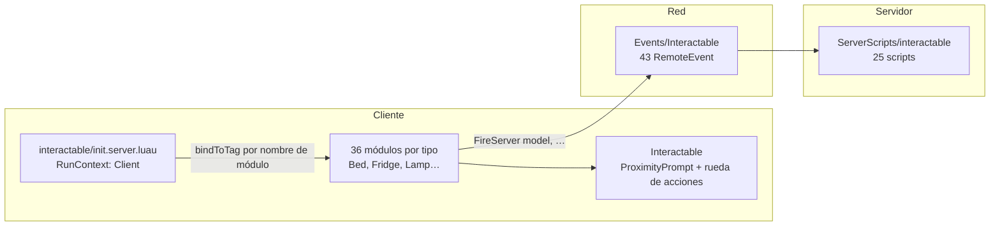

# Interactuables

Es el sistema más grande del repositorio: **77 archivos, ~8 000 líneas, 43 `RemoteEvent`
propios**, y el módulo `Interactable` es el que más consumidores tiene de todo el proyecto.
Todo lo que un jugador puede *usar* —una cama, una nevera, una ducha, una lámpara, una
puerta, un tocadiscos— pasa por aquí.

También es donde mejor se ve un patrón que esta documentación ha ido encontrando en otros
sitios: **el framework es de cliente, y cada tipo decide por su cuenta cuánto comprueba el
servidor.**

## La forma del sistema



**HECHO.** El registrador son veinte líneas, y no tiene lista de tipos: **el nombre del
módulo es la etiqueta de `CollectionService`**.

```lua
for _, child in script:GetChildren() do
	if not child:IsA("ModuleScript") then continue end
	local module = require(child)
	bindToTag(child.Name, function(instance)
		local object = module.new(instance)
		return typeof(object.onDestroy) == "function" and function() object:onDestroy() end
	end)
end
```

Añadir un interactuable nuevo es dejar un `ModuleScript` en esa carpeta y etiquetar el
modelo con el mismo nombre. No hay registro central que actualizar, ni nada que revisar.

:::note Un `.server.luau` que corre en el cliente

`interactable/init.server.luau` tiene un `init.meta.json` con
`RunContext: "Client", Disabled: true`. Corre en el **cliente**, pese al sufijo. Es el
ejemplo más claro de la regla que explica
[Inicialización](../architecture/initialization.md): en este repositorio el nombre del
archivo no dice de qué lado corre un script. Hay que mirar el `.meta.json`.

:::

## Qué hace la clase base

**HECHO.** `Interactable` monta, por cada modelo etiquetado, un `ProximityPrompt` de estilo
`Custom`, un `ClickDetector` con `MaxActivationDistance = 0` —desactivado a propósito,
porque el juego usa el suyo— y una **rueda de acciones** con páginas.

```lua
local MAX_INTERACTION_DISTANCE = 18
local LINE_OF_SIGHT_INTERVAL = .05
local LINE_OF_SIGHT_MARGIN = 5
```

Distancia máxima, comprobación de línea de visión cada 50 ms, y un margen. La rueda se
recalcula cuando el jugador equipa o desequipa una `Tool`, así que las acciones que ofrece
dependen de lo que lleve en la mano.

**Todo eso es del lado cliente.** `activeInteractables` es una tabla de claves débiles del
cliente; `player` es `players.LocalPlayer`. El servidor no ejecuta nada de esta clase.

## La matriz de validación

Aquí está el hallazgo principal. Estos son los 25 scripts de servidor y lo que comprueba
cada uno antes de actuar sobre el `model` que le manda el cliente:

| Script | ¿Comprueba el tipo del modelo? | ¿La etiqueta? | ¿La distancia? |
|---|---|---|---|
| `Fridge` | Sí | Sí (`HasTag "Fridge"`) | **Sí** |
| `Tijeras` | Sí | — | **Sí** (`MAX_DISTANCE`) |
| `Bed/Bed` | — | — | **Sí** (20) |
| `DoubleBed` | — | — | **Sí** (20) |
| `Pee` | Sí | Sí | — |
| `NpcDialog` | Sí | Sí | — |
| `Paint` | Sí | Sí | — |
| `CuadrosPaint` | Sí | Sí | — *(el cuerpo está vacío)* |
| `Lamp` | — | Sí | — |
| `Toilet` | — | — | — |
| `Shower` | — | — | — |
| `Washbasin` (×2) | — | — | — |
| `Bath` | — | — | — |
| `Treadmill` | — | — | — |
| `Weight` | — | — | — |
| `Seat` | — | — | — |
| `DiscoBall` | — | — | — |
| `SmokeMachine` | — | — | — |
| `BarraBartender` | — | — | — |
| `ClassicDoor` | — | — | — |
| `Display` | — | — | — |
| `MusicPlayer` | — | — | — |
| `Bin` | *(no recibe modelo)* | — | — |

**HECHO.** Cuatro de veinticinco comprueban la distancia. Ocho comprueban la etiqueta. La
mayoría toma la `Instance` que le da el cliente y opera sobre ella.

**INFERENCIA.** No es un olvido puntual: es que **la validación no está en el framework**.
`Interactable` monta el prompt y aplica la distancia en el cliente, pero no ofrece nada
—ni una función auxiliar, ni un envoltorio de remote— que un script de servidor pueda
llamar para comprobar lo mismo. Cada autor lo resuelve o no lo resuelve. `Fridge` es el que
mejor lo hace, y su comprobación está escrita a mano dentro del propio archivo.

Ver [BUG-CANDIDATE-025](../testing/verification-plan.md#bug-candidate-025).

## Lo que hay detrás de las filas vacías

**HECHO.** Una fila sin marcas en la matriz no dice qué se puede hacer con ella. Leídos los
25 scripts enteros, las filas vacías se reparten en tres grupos muy distintos:

| Grupo | Scripts | Qué se puede hacer |
|---|---|---|
| **Mueven al personaje** | `Bath`, `Toilet`, `Shower`, `Washbasin` | Llegar a donde esté el objeto — [048](../testing/verification-plan.md#bug-candidate-048) |
| **Conceden estadística** | los cuatro de arriba, más `Weight` y `Treadmill` | Rellenar `hygiene`, `bladder` y `physic` sin moverse — [049](../testing/verification-plan.md#bug-candidate-049) |
| **Cambian el estado de un objeto ajeno** | `Lamp`, `ClassicDoor`, `DiscoBall`, `SmokeMachine`, `Display`, `Seat` | Encender, abrir, apagar a distancia — el caso que ya cubre la [025](../testing/verification-plan.md#bug-candidate-025) |

### Mover, no solo actuar

**HECHO.** `Bath` toma el modelo del cliente y hace esto:

```lua
local seat = model:FindFirstChildOfClass("Seat")
if seat.Occupant then return end
...
seat:Sit(humanoid)
```

`Seat:Sit` **teletransporta**. `Toilet` hace lo mismo; `Shower` y `Washbasin` usan
`character:PivotTo(playerPart:GetPivot())`.

**Lo que acota la superficie** es que el cliente no puede inventarse la `Instance`: solo puede
nombrar objetos que el servidor ya conoce. Un modelo sin la forma esperada hace que el
manejador lance —`seat.Occupant` sobre `nil`— y la llamada muere ahí. **Falla cerrado**, y hoy
eso es lo único que limita el destino.

Pero `Bath` y `Toilet` aceptan **cualquier modelo con un hijo `Seat`**, y `Seat` es de las
clases más comunes que hay en un mapa.

**HECHO.** De los cuatro, tres devuelven al personaje a donde estaba. `Washbasin` **no**:
espera dos segundos, concede la higiene y suelta al ocupante, sin ningún `PivotTo` de vuelta.

### El que no recibe modelo

**HECHO.** `Weight.server.luau` no tiene segundo parámetro:

```lua
remotes.Interactable.Weight.OnServerEvent:Connect(function(player)
	...
	track:Play()
	track.Stopped:Wait()
	stats:increment("physic", 10)
end)
```

Ni pesas, ni sitio, ni antirrebote. Estar vivo es todo lo que hace falta.

### Lo que sí sujeta

**Registrado como correcto**, porque es lo que mantiene esto en Media y no más arriba:

| Control | Dónde |
|---|---|
| `Stats:increment` corta en 100 | `stats/Stats.luau` — el techo es «lleno», no hay valores absurdos |
| Las estadísticas no se persisten | Son atributos del jugador; no están en `PlayerSchema` |
| Un modelo de forma equivocada lanza | Los manejadores mueren sin efecto |
| `getAliveHumanoid` en cinco de ellos | Un personaje muerto o ausente no pasa |
| `Toilet` comprueba el ocupante **dos veces** | Antes y después del `task.wait(0.5)` de la bisagra, con este comentario: «a previous that requested the toiled before can be the occupant while we wait for the hinge» |

Esa última fila merece leerse: es exactamente la clase de condición de carrera que el resto
del repositorio no siempre contempla, y aquí está vista, comentada y cerrada.

## El caso peor: `MusicPlayer`

**HECHO.** Diecisiete líneas, y todo lo que decide viene del cliente:

```lua
remotes.Interactable.MusicPlayer.OnServerEvent:Connect(function(player, model, id)
	local character = player.Character
	local humanoid = character and character:FindFirstChildOfClass("Humanoid")
	if not humanoid then return end

	local emitter = model.Emitter.Sound
	emitter.SoundId = id
	emitter:Play()
	print("aaa", id)
end)
```

Lo único que comprueba es que el jugador tenga `Humanoid`, lo cual no dice nada sobre el
modelo ni sobre el audio. Ver
[BUG-CANDIDATE-024](../testing/verification-plan.md#bug-candidate-024).

**OBSERVACIÓN.** El `print("aaa", id)` es de depuración y sigue ahí. Aparece en el registro
del servidor cada vez que alguien pone música.

## Cosas que sí están bien resueltas

| Control | Cómo |
|---|---|
| **`Fridge` es el modelo a imitar** | Comprueba que sea una `Model`, que tenga la etiqueta `Fridge`, y la distancia entre el `HumanoidRootPart` y el pivote del modelo. Los tres, antes de tocar nada |
| **`Bin` no acepta modelo** | Actúa sobre la `Tool` que el jugador lleva equipada, y solo si tiene el atributo `Kitchen` |
| **La limpieza está resuelta en el framework** | `bindToTag` guarda el retorno de cada `binding` y lo invoca cuando la etiqueta se quita, así que cada tipo puede devolver su propio destructor |
| **`Shower` y `Washbasin` liberan al morir** | `humanoid.Died:Once` limpia el `Occupant`, de modo que morir dentro no bloquea el objeto para siempre |
| **La rueda reacciona a las herramientas** | `Interactable` reconstruye la rueda al equipar o desequipar una `Tool`, así que las acciones ofrecidas dependen del contexto real |

## Puntos de verificación

| Aspecto | Entrada |
|---|---|
| `MusicPlayer` acepta un `SoundId` y un modelo cualesquiera y lo reproduce | [BUG-CANDIDATE-024](../testing/verification-plan.md#bug-candidate-024) |
| La distancia de interacción solo la comprueba el cliente, y 21 de 25 manejadores no la reevalúan | [BUG-CANDIDATE-025](../testing/verification-plan.md#bug-candidate-025) |

## Observaciones registradas, que no son defectos

| Observación | Detalle |
|---|---|
| El cuerpo del manejador de `CuadrosPaint` está vacío | Valida el modelo y luego no hace nada. El remote existe, se conecta y no tiene efecto |
| `print("aaa", id)` en `MusicPlayer` | Depuración olvidada |
| Hay 43 remotes bajo `Events/Interactable` y 25 scripts de servidor | Los que sobran los sirven la cocina (`Oven`, `Stove`, `Microwave`, `Blender`, `CuttingBoard`…) y las herramientas, que son otros sistemas |
| Existe un módulo llamado `test.luau` en la carpeta de interactuables | Como el registrador usa el nombre del módulo como etiqueta, `test` es una etiqueta viva |
| `interactable/init.server.luau` corre en el cliente | `RunContext: "Client"` en su `.meta.json` |

## Qué queda por leer

Se ha leído la **estructura**: el registrador, la clase base, `bindToTag`, y los 25 scripts
de servidor en lo que respecta a su validación de entrada. **No** se han leído en
profundidad los 36 módulos de cliente por tipo ni la lógica interna de cada script de
servidor.

Es una elección deliberada: la pregunta que este sistema tenía que responder era cómo se
registra un interactuable y en quién confía el servidor. Documentar los 36 tipos uno a uno
sería un catálogo, no una explicación.

## Implementación relacionada

| Aspecto | Código |
|---|---|
| Registro por etiqueta | `Client/interactable/init.server.luau`, `Shared/bindToTag.luau` |
| Clase base | `Client/interactable/Interactable/init.luau` |
| Rueda de acciones y prompt | `Interactable/ActionWheel/`, `Interactable/CustomPrompt/` |
| Manejadores de servidor | `ServerScripts/interactable/` — 25 scripts |
| Remotes | `ReplicatedStorage/Events/Interactable/` — 43 `RemoteEvent` |
