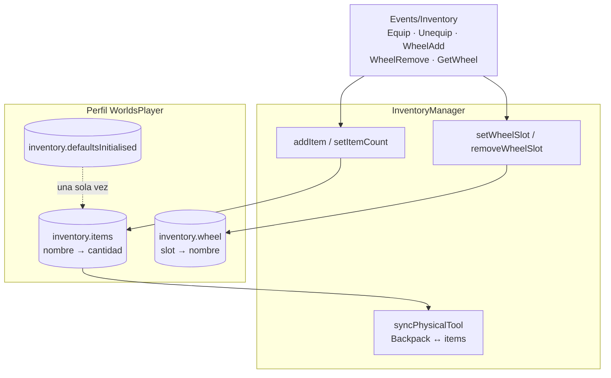

# Inventario y herramientas

Dos capas que conviene no confundir:

| Capa | Dónde | Qué hace |
|---|---|---|
| **Inventario** | `ServerScripts/inventory/InventoryManager` | Qué herramientas posee un jugador, cuántas, y qué hay en cada uno de los 8 huecos de la rueda. Se persiste. |
| **Herramientas** | `ServerScripts/ToolsServer.server.luau` | Qué hace cada herramienta cuando se usa. No persiste nada. |

La primera es, con diferencia, **el código mejor validado del repositorio**. La segunda es
lo contrario. Las dos están a un directorio de distancia.

## El inventario



**HECHO.** El inventario vive en el perfil, bajo `inventory`, con tres claves: `items`
(nombre → cantidad), `wheel` (slot → nombre) y `defaultsInitialised`.

### El equipamiento por defecto solo ocurre una vez

**HECHO.** Y el código explica por qué, en un comentario propio:

```lua
local function ensureDefaultInventory(inventory)
	-- Solo se ejecuta una vez en toda la vida de los datos del jugador.
	-- Es importante NO comprobar simplemente si el inventario está vacío,
	-- porque un jugador podría gastar/quitar todos sus objetos legítimamente.
	if inventory.defaultsInitialised then
		return
	end
```

Es una decisión correcta y bien razonada. También significa que **`DefaultTools` no es una
lista viva**: cambiarla no afecta a nadie que ya haya entrado alguna vez. Eso importa por
[BUG-CANDIDATE-026](../testing/verification-plan.md#bug-candidate-026).

### La validación de entrada, que aquí sí está

**Registrado como correcto, y como referencia para el resto del proyecto.** Los cinco
remotes de inventario validan antes de tocar nada:

```lua
inventoryRemotes.WheelAdd.OnServerEvent:Connect(function(player, index, id)
	if typeof(index) ~= "number" or index % 1 ~= 0 then return end
	if index <= 0 or index > WHEEL_SLOTS then return end
	if typeof(id) ~= "string" then return end
	InventoryManager.setWheelSlot(player, index, id)
end)
```

Tipo, entereza, rango y tipo del identificador. Y `setWheelSlot` **vuelve a validarlo todo**
por su cuenta, más la propiedad:

```lua
if not InventoryManager.hasTool(player, id) then return false end
```

| Comprobación | Dónde |
|---|---|
| El nombre corresponde a una `Tool` real de `Assets/Tools` | `getToolAsset`, invocado por `addItem` y `setItemCount` |
| La cantidad es un entero no negativo | `setItemCount` |
| El jugador posee lo que quiere poner en la rueda | `setWheelSlot`, vía `hasTool` |
| Un objeto que llega a cero desaparece también de la rueda | `setItemCount`, bucle sobre `inventory.wheel` |
| Lo que se devuelve al cliente se vuelve a filtrar | `getWheelData` reconfirma rango y propiedad de cada slot |
| El guardado de la rueda no satura el DataStore | `queueWheelSave`, debounce de 30 s con limpieza en `PlayerRemoving` |
| Morir desequipa | `humanoid.Died` → `unequipTool` |

**Es el único sistema leído hasta ahora que valida en las dos capas**: en el manejador del
remote y otra vez dentro del gestor. Compárese con la
[matriz de Interactuables](./interactables.md#la-matriz-de-validación).

## Las herramientas

**HECHO.** `ToolsServer.server.luau` son 988 líneas y ocho manejadores de remote. El rigor
varía enormemente **dentro del mismo archivo**:

| Remote | ¿Comprueba que la `Tool` sea del jugador? | Notas |
|---|---|---|
| `Cannon` | **Sí** — `IsA("Tool")` y `tool.Parent ~= character` | Además tiene cooldown de 5 s vía `CooldownManager` |
| `GloveGun` | **Sí** — las dos mismas comprobaciones | |
| `Minimizate` / `Maximizate` | Actúa sobre el propio personaje | No comprueba que el jugador tenga la poción |
| `Ballon` | Comprueba la forma del objeto, no su propiedad | `tool:FindFirstChild("Handle")` y `Handle.BallonMesh` |
| `EquipTool` | — | Reproduce el `EquipSound` de lo que le manden |
| `Fly` | — | Activa partículas y reproduce sonidos que le manden |
| `EquipToolAccesory` | — | **Reparenta la `Instance` que le manden** |

Ver [BUG-CANDIDATE-027](../testing/verification-plan.md#bug-candidate-027).

**OBSERVACIÓN.** `Minimizate` y `Maximizate` no comprueban que el jugador tenga
`MiniPotion` o `BigPotion`. Hoy da igual, porque las dos están en `DefaultTools` y las tiene
todo el mundo; pasaría a importar en cuanto se vendieran. Lo que sí comprueban es el estado
actual (`SizeState`), así que no se pueden encadenar más allá de `Small` / `Normal` / `Big`.

**OBSERVACIÓN.** Quedan dos `print` de depuración —«Transformando al jugador de … a estado:
…»— en las rutas de encoger y crecer.

## Controles que sí sujetan

| Control | Cómo |
|---|---|
| **Un objeto que no existe no se puede conceder** | `getToolAsset` busca la `Tool` en `Assets/Tools` antes de `addItem` y `setItemCount`; un nombre inventado devuelve `false` |
| **La rueda no puede apuntar a lo que no tienes** | `setWheelSlot` exige `hasTool`, y `getWheelData` lo vuelve a filtrar al leer |
| **Un objeto no puede estar en dos slots** | `setWheelSlot` limpia tanto el slot destino como cualquier otro slot que ya tuviera ese objeto |
| **`Cannon` no se puede disparar con la herramienta de otro** | `tool.Parent ~= character` corta antes de nada, y hay cooldown de 5 s |
| **Los objetos por defecto no se re-conceden** | La bandera `defaultsInitialised` impide devolver a un jugador lo que ha gastado |
| **El guardado de la rueda está amortiguado** | 30 s de debounce, y se cancela si el jugador se va |

## Puntos de verificación

| Aspecto | Entrada |
|---|---|
| El globo nunca se concede a nadie | [BUG-CANDIDATE-026](../testing/verification-plan.md#bug-candidate-026) |
| `ToolsServer` reparenta y manipula `Instance` arbitrarias del cliente | [BUG-CANDIDATE-027](../testing/verification-plan.md#bug-candidate-027) |

## Qué queda por leer

| Archivo | Líneas | Estado |
|---|---|---|
| `inventory/init.server.luau`, `InventoryManager/init.luau`, `DefaultTools.luau` | 706 | Leídos |
| `ToolsServer.server.luau` | 988 | **En parte** — los ocho manejadores y su validación; no la mecánica del cañón ni del guante |
| `ToolPlacementServer.server.luau` | 880 | **Pendiente** |
| `Client/inventory/` (4 archivos) | 908 | **Pendiente** — la rueda y la lista son interfaz |
| `Shared/ToolUseManagge.luau` | 108 | **Pendiente** — lo instancia `Data.Main` por jugador (`list.Agarre`) |

## Implementación relacionada

| Aspecto | Código |
|---|---|
| Remotes de inventario | `ServerScripts/inventory/init.server.luau` |
| Estado y persistencia | `inventory/InventoryManager/init.luau` |
| Objetos iniciales | `inventory/InventoryManager/DefaultTools.luau` |
| Sincronía con la mochila | `InventoryManager`, `syncPhysicalTool`, `normalizePhysicalTool`, `clearManagedPhysicalTools` |
| Comportamiento de cada herramienta | `ServerScripts/ToolsServer.server.luau` |
| Cooldowns | `Shared/Cooldown/CooldownManager` |
