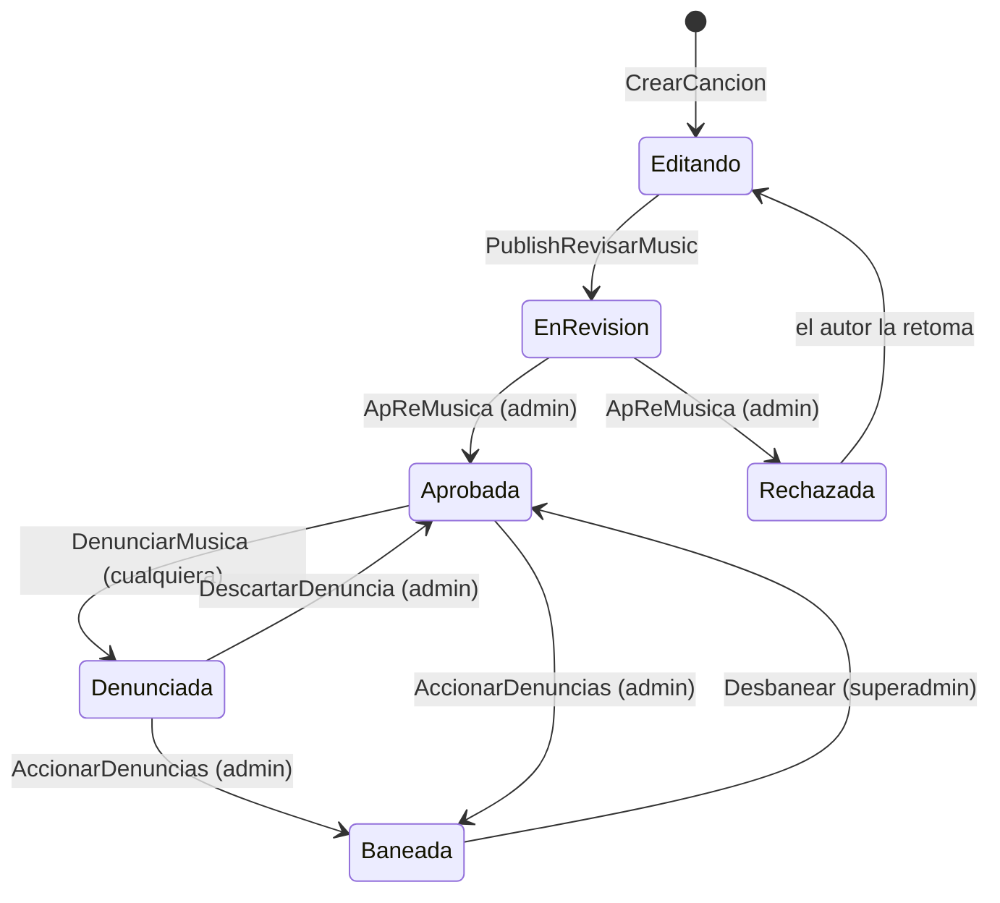

# Karaoke

Es el único sistema del juego con **moderación humana propia**: los jugadores crean
canciones con su letra sincronizada, esas canciones entran en una cola de revisión, y un
grupo de administradores las aprueba, rechaza o banea. Hay denuncias, desbaneos y un buzón
de mensajes para el autor.

También es, con diferencia, **el sistema con la postura de seguridad más estricta** del
repositorio: no se limita a rechazar a quien no es administrador, lo **expulsa**.

## Las tres piezas

| Módulo | Líneas | Papel |
|---|---|---|
| `Karaoke/init.luau` | 177 | Fachada: resuelve quién es administrador y reparte eventos |
| `Karaoke/RevisarCanciones` | 1 111 | La cola de moderación: revisar, aprobar, rechazar, banear, denunciar |
| `Karaoke/CrearCancion` | 869 | El editor: crear una canción y sincronizar su letra |
| `Karaoke/KaraokeTV` | 950 | Los televisores del mundo que reproducen lo aprobado |

`Data.Main` las cablea entre sí y las conecta con el sistema de comandos:

```lua
Karaoke.KaraokeDS = GlobalDataStore
PlayerDataReplicator.KaraokeFactory = Karaoke.CrearCancion
Commands.AdminPanel = Karaoke
Karaoke.Commands = Commands
```

## Quién es administrador

**HECHO.** Por rango de grupo de Roblox, vía `RoleService`:

```lua
function module:IsAdmin(Player: Player, SuperAdmin)
	...
	return self.RoleService:IsRole(Player, SuperAdmin and "KaraokeSuperAdmin" or "KaraokeAdmins")
```

Dos niveles: `KaraokeAdmins` y `KaraokeSuperAdmin`. El segundo hace falta para tocar baneos.

**HECHO.** Y el rechazo no es silencioso:

```lua
function module:IntenteSerAdmin(Player: Player)
	...
	Player:Kick('You do not have the administrator role. If you continue trying to gain
	             administrator access, you may be banned.')
```

**Registrado como correcto.** Casi todos los manejadores de `RevisarCanciones` terminan en
`IntenteSerAdmin` cuando el llamante no cumple, así que intentar usar un remote de
moderación cuesta la sesión. Es la postura más dura que hay en el proyecto y contrasta con
los comandos de administración de eventos, que rechazan en silencio para no revelar que el
comando existe. Las dos decisiones son defendibles; conviene saber que conviven.

## La cola de moderación



**HECHO.** Los datos viven en `GlobalDataStore`, que llama a `DataStoreService` **fuera de
DataKit** (ver **U-008**), con claves por categoría: `RevisionRating`, `DenunciasRating`,
`BaneosRating`, `Letras`. La sincronización entre servidores es por `MessagingService`
(`SuscribeAsync` / `PublishAsync` / `ReciveAsync`).

**HECHO.** `AdminsActive` es la lista de administradores presentes en **este** servidor. La
mantienen `AdminAdded` y `AdminRemoved`, que `Data.Main` invoca al entrar y salir cada
jugador.

## Dónde se rompe el patrón

**HECHO.** Tres de los cargadores comprueban que **haya** un administrador conectado, no
que **quien llama** lo sea:

```lua
function module:CargarMusicasServer(Page, Player: Player)
	if IsClient then
		...
	elseif #self.AdminsActive > 0 and typeof(Page) == 'number' then
		local Data, NewData = self.DataStore:GetData('RevisionRating', true, self.SongPorPagina, Page)
```

`#self.AdminsActive > 0` es «hay algún moderador en la sala». No mira a `Player`.
Ver [BUG-CANDIDATE-028](../testing/verification-plan.md#bug-candidate-028), que también
explica por qué la consecuencia es menor de lo que parece.

## El filtrado de texto

**HECHO.** En `RevisarCanciones` y `CrearCancion` no aparece ninguna llamada a
`TextService`: ni `FilterStringAsync` ni `GetNonChatStringForBroadcastAsync`. Las letras que
escriben los jugadores no pasan por el filtro de Roblox en el código revisado.

**INFERENCIA.** Es coherente con el diseño: este sistema sustituye el filtro automático por
**revisión humana**, que es más estricta en intención y por eso existe la cola. La pregunta
que la lectura estática no puede responder es si la letra llega a mostrarse en algún
`TextLabel` **antes** de aprobarse —al autor mientras la edita, o a un administrador mientras
la revisa—, porque ahí el filtro sí sería exigible. La interfaz vive en archivos `.rbxm`,
que son binarios.

**DESCONOCIDO**, y se deja anotado en vez de rellenarlo.

## Los televisores

`KaraokeTV/` (950 líneas) es la otra mitad del sistema: los televisores del mundo donde
suena lo que la moderación aprobó. Un jugador **reclama** un televisor, encola canciones, y
quien esté cerca las escucha.

### Despacho por nombre de remote

**HECHO.** Los siete remotes de `Televisiones/Instance` se conectan en bucle, y **el nombre
del remote es la clave del método**:

```lua
for _, Remotes in Events:WaitForChild('Instance'):GetChildren() do
	if Remotes:IsA('RemoteEvent') then
		local EventActive = IsClient and Remotes.OnClientEvent or Remotes.OnServerEvent
		table.insert(self.actives, EventActive:Connect(function(...) FuncionesTV[Remotes.Name](self, ...) end))
```

Se parece al despacho por nombre de [Trabajos](./jobs.md), pero es **seguro por
construcción y no por lista blanca**: aquí la clave es el nombre de la `Instance` que recibió
el evento, no una cadena que mande el cliente. El cliente elige a qué remote dispara, y cada
remote está atado a un método fijo.

**OBSERVACIÓN.** El precio es que añadir un remote a esa carpeta sin escribir el método del
mismo nombre en `FunctActionsTV` produce un error al dispararlo, no al arrancar.

Y hay un segundo precio, más caro:
[BUG-CANDIDATE-034](../testing/verification-plan.md#bug-candidate-034).

### El salto de canción está bien resuelto

**Registrado como correcto.** `Skip` no lo decide quien lo pulsa:

```lua
local IsListening = table.find(Television.listening, Player)
if IsListening and typeof(Player) == 'Instance' and Player:IsA('Player') then
	local indexSkip = table.find(Television.skips, Player)
	if indexSkip then
		table.remove(Television.skips, indexSkip)
	else
		table.insert(Television.skips, Player)
		if Player == Television.Owner or #Television.skips >= #Television.listening - (Television.Owner and 1 or 0) then
			Television:Reproducir()
		end
	end
end
```

Hay que **estar escuchando** para votar, el voto se puede retirar, y la canción salta si el
dueño lo pide o si vota la mayoría de los oyentes descontando al dueño. Es una votación, no
un botón.

### Qué puede registrarse como televisor

**HECHO.** `TV.new` exige estructura, no etiqueta:

```lua
local Screen = typeof(Model) == 'Instance' and Model:IsA('Model')
	and Model:FindFirstChild('Screen')
	and Model:FindFirstChild('Screen'):FindFirstChildOfClass('SurfaceGui')
if Screen then
```

**OBSERVACIÓN.** Todos los manejadores hacen `if not Television then Television = self:Added(Model) end`
**antes** de comprobar el lado, así que un cliente que dispare `listening` con un modelo
suyo puede provocar que el servidor lo registre como televisor — siempre que tenga esa
estructura `Screen`/`SurfaceGui`. El efecto es un `TVAdded` a todos los clientes. La
estructura exigida lo acota bastante; se registra por completitud.

**OBSERVACIÓN.** `maxDistance = 50` y el método `TV:Distance` existen y están bien escritos
—incluso contemplan zonas con `listening` propio—, pero **ninguno de los manejadores de
remote leídos los consulta**. Reclamar un televisor con `SetOwner` no comprueba distancia.

## La búsqueda de canciones

`ServerStorage/BusquedaMusicas.luau` (455 líneas) es el buscador: mantiene un índice de
palabras clave por canción y lo consulta a través de
[`GlobalDataStore`](./global-storage.md).

**HECHO.** Todo su trabajo pesado está encolado, con tres colas que declaran su propio
presupuesto:

| Cola | `MaxLoads` | `TimeExhauste` | Para qué |
|---|---|---|---|
| `module.Guardado` | 15 | 60 s | Guardar las palabras clave de una canción |
| `module.cache` | 40 | 60 s | Precargar canciones a la caché por sección |
| `GlobalDataStore.DataPalabras` | 20 | 60 s | Resolver una palabra buscada contra el índice |

La convención del repositorio es que el intervalo entre operaciones es
`TimeExhauste / MaxLoads` — «tantas cargas como mucho por tantos segundos». Once líneas en
cinco archivos la escriben así.

Una no: [BUG-CANDIDATE-035](../testing/verification-plan.md#bug-candidate-035).

**HECHO.** Una palabra ya resuelta se cachea `UpdateSuccess = 120` segundos, y
`ClearCache` descarta lo que lleve más de `HoltToClean = 600` sin usarse. Eso es lo que
mantiene la cola vacía en condiciones normales.

## Controles que sí sujetan

| Control | Cómo |
|---|---|
| **Los remotes de moderación expulsan al intruso** | Casi todos los manejadores terminan en `IntenteSerAdmin`, que llama a `Player:Kick` con un aviso explícito |
| **Los baneos exigen un nivel superior** | `IsAdmin(Player, true)` comprueba `KaraokeSuperAdmin`, y las rutas de baneo y desbaneo lo piden |
| **La difusión a administradores está filtrada** | `FireOnlyAdmins` recorre `AdminsActive`; `FireNoAdmins` hace lo contrario. Nada se envía a todos indiscriminadamente |
| **`ObtenerMusica` revalida por página** | La página 2 (baneos) exige superadministrador, incluso en la ruta de difusión |
| **`ViewLyric` está cerrada** | Comprueba `IsAdmin` antes de leer la letra del DataStore, y expulsa si no |
| **El rol se resuelve contra un grupo de Roblox** | No hay lista de UserIds en el código; `RoleService` consulta `GroupService` y falla cerrado |
| **Saltar una canción es una votación** | Hay que estar escuchando para votar, el voto se retira, y salta con el dueño o con la mayoría de oyentes |
| **No cualquier modelo es un televisor** | `TV.new` exige un hijo `Screen` con un `SurfaceGui` dentro |
| **El despacho por nombre no lo elige el cliente** | La clave es el nombre de la `Instance` que recibió el evento, no una cadena de la carga útil |

## Puntos de verificación

| Aspecto | Entrada |
|---|---|
| Tres cargadores comprueban que haya un admin conectado, no que quien llama lo sea | [BUG-CANDIDATE-028](../testing/verification-plan.md#bug-candidate-028) |
| El rol de administrador se cachea 50 segundos | [BUG-CANDIDATE-017](../testing/verification-plan.md#bug-candidate-017) |
| Un `RemoteFunction` en la carpeta de televisores nunca se ataría | [BUG-CANDIDATE-034](../testing/verification-plan.md#bug-candidate-034) |
| El limitador de ritmo de la búsqueda está invertido: nueve veces el presupuesto declarado | [BUG-CANDIDATE-035](../testing/verification-plan.md#bug-candidate-035) |

## Observaciones registradas, que no son defectos

| Observación | Detalle |
|---|---|
| `Karaoke:GetAdmin` es código muerto | Recorre `self.Admins`, que nadie asigna en el módulo `Karaoke` — solo en sus submódulos, y apuntando de vuelta a `Karaoke`. Si se llamara, fallaría al iterar `nil`; y con una tabla vacía se llamaría a sí misma sin condición de parada. No hay ninguna llamada en todo `src/` |
| Dentro de `IsAdmin` queda comentado el mecanismo anterior | Una tabla `self.Admins[UserId]`, sustituida por `RoleService`. `GetAdmin` es lo que quedó sin migrar |
| `AdminsActive` es por servidor, no global | Un administrador en otro servidor no cuenta. Es lo que hace que el fallo de BUG-CANDIDATE-028 dependa de quién esté conectado |
| Hay dos remotes duplicados en la carpeta | `CargarMusicas` y `ObtenerMusicas` aparecen dos veces en el listado de `.model.json` |

## Qué queda por leer

| Archivo | Líneas | Estado |
|---|---|---|
| `Karaoke/init.luau` | 177 | Leído |
| `RevisarCanciones/init.luau` | 1 111 | **En parte** — el modelo de administración, los manejadores de remote y sus guardas; no la mecánica de paginación ni el buzón |
| `CrearCancion/init.luau` | 869 | **En parte** — la superficie pública y la ausencia de filtrado de texto |
| `KaraokeTV/` (3 archivos) | 950 | **En parte** — el registro de televisores, el despacho de remotes y sus guardas; no la sincronización de letra ni la cola |
| `ServerStorage/BusquedaMusicas.luau` | 455 | **En parte** — las colas, su ritmo y la búsqueda por palabra clave; no el guardado de palabras ni la caché por sección |

## Implementación relacionada

| Aspecto | Código |
|---|---|
| Resolución de rol | `Karaoke/init.luau`, `IsAdmin`, `IntenteSerAdmin`; `ServerStorage/RoleService` |
| Cola de revisión | `RevisarCanciones/init.luau`, `PublishRevisarMusic`, `AprovarRechazarMusicaAction` |
| Denuncias y baneos | `RevisarCanciones/init.luau`, `Denunciar`, `ActionSongDenunce`, `Desbanear` |
| Sincronía entre servidores | `RevisarCanciones/init.luau`, `SuscribeAsync`, `PublishAsync`, `ReciveAsync` |
| Almacenamiento | `ServerStorage/GlobalDataStore` — fuera de DataKit; ver [Persistencia fuera de DataKit](./global-storage.md) |
| Búsqueda por palabra clave | `ServerStorage/BusquedaMusicas.luau`, `SearchPalabrasClaves`, `GuardarPalabrasClaves` |
| Editor de canciones | `CrearCancion/init.luau` |
| Televisores | `KaraokeTV/init.luau`, `Works`, `Added`; `KaraokeTV/FunctActionsTV.luau` |
| Un televisor concreto | `KaraokeTV/TV/init.luau`, `module.new`, `Distance` |
