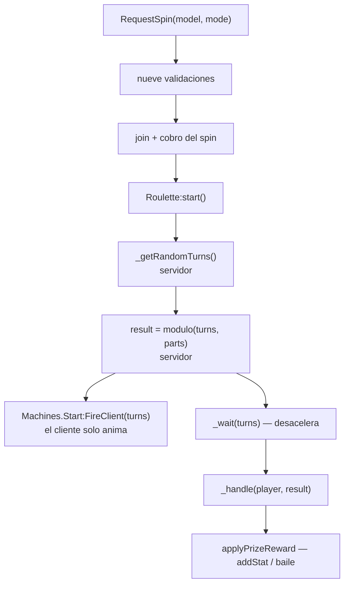

# Máquinas de arcade

Seis máquinas jugables: ruleta, torre (`Stacker`), baloncesto, `PopTheLock`, máquina de
peluches y `Pong`. 1 332 líneas de servidor, 2 039 de cliente y 964 de simulación
compartida.

La [página de barrido](./survey.md) las dio por vistas de pasada. Esta las mira de verdad,
porque la pregunta que tenían abierta —**quién decide si has ganado**— resulta que se
responde distinto en cada una.

| Máquina | Servidor | Cliente | Quién decide el resultado |
|---|---|---|---|
| `Roulette` | 177 | 163 | **El servidor**, entero |
| `Pong` | 388 + 849 compartidas | 184 | **El servidor** — simula la pelota |
| `Basketball` | 92 | 308 | El cliente avisa de cada canasta; el servidor cuenta y **topa** |
| `Stacker` | 50 | 451 | El cliente — pero el manejador es un stub |
| `PopTheLock` | 55 | 307 | El cliente, **incluidos los tickets** — stub |
| `ToyMachine` | 158 | 161 | **El cliente — y aquí el manejador sí entrega** |

## La estructura

**HECHO.** `bindToTag("Machine", …)` sobre el modelo, y **el nombre del modelo elige la
clase**:

```lua
bindToTag("Machine", function(model: Model)
	local machine = MachineFactory.create(model.Name, model)
	machine:onStop(function(player) machineByPlayer[player] = nil end)
	machineByModel[model] = machine
end)
```

Es la misma idea que en [Interactuables](./interactable-types.md), con una diferencia: allí
la etiqueta es el nombre del archivo, aquí la etiqueta es siempre `Machine` y lo que
selecciona es el **nombre del modelo**.

Las seis clases **componen** `Machine`, no heredan de él: cada una guarda un `self._machine`
y reexpone `join`, `start`, `stop` y `onStop`. Eso permite que `Basketball` y `Roulette`
metan su propio trabajo en `start` sin tocar la base.

### La guarda que sostiene todo esto

**HECHO.** `Machine:bind` es donde se comprueba quién puede hablar:

```lua
function Machine:bind<T...>(remote: RemoteEvent, callback: (Player, T...) -> ())
	remote.OnServerEvent:Connect(function(player, model, ...)
		if model == self.model and table.find(self._players, player) then
			callback(player, ...)
		end
	end)
end
```

**Registrado como correcto**, y es la mejor guarda de este tipo en todo el repositorio: quien
llama tiene que ser un jugador **registrado en esta máquina concreta**. No basta con estar
cerca, ni con nombrar una máquina válida. Compárese con
[BUG-CANDIDATE-025](../testing/verification-plan.md#bug-candidate-025), donde la distancia
solo la comprueba el cliente.

Todo lo que sigue pasa por esta guarda. Lo que un jugador puede falsear es el **contenido**
de sus mensajes, nunca el hecho de estar jugando.

## Dos formas de entrar, escritas con doce meses de diferencia

**HECHO.** Hay dos remotes de entrada, y se nota cuál es el nuevo.

### `Machines.Request` — el viejo

```lua
local price = model:GetAttribute("Price") or 0
local coins = tonumber(player.leaderstats.Coins.Value)
if coins < price then return false end

local machine = machineByModel[model]
if not machine or not machine:join(player) then return false end
machineByPlayer[player] = machine

-- TODO: integrate with the actual currency service
player.leaderstats.Coins.Value = tostring(coins - price)
```

**Registrado como correcto** en el orden: comprueba, entra, y **solo entonces cobra**. Al
revés que [BUG-CANDIDATE-008](../testing/verification-plan.md#bug-candidate-008).

**OBSERVACIÓN.** El `TODO` está en el archivo, no lo pone esta página: la moneda se escribe
directamente en `leaderstats` sin pasar por `Collections`. Persiste igual —el esquema del
jugador guarda `leaderstats`, ver [Datos del jugador](./player-data.md)— pero se salta la
contabilidad del servicio de moneda. Es la misma vía que usa la ruleta en `addStat`.

**OBSERVACIÓN.** `player.leaderstats.Coins.Value` se indexa sin comprobar. Si `leaderstats`
todavía no existe, el `OnServerInvoke` lanza y la invocación falla en el cliente. **Falla
cerrado**: no se cobra ni se entra.

### `Roulette/RequestSpin` — el nuevo

**HECHO.** La ruleta se sacó de `Machines.Request` (`if model.Name == "Roulette" then return
false end`) y tiene el suyo, con nueve comprobaciones y códigos de error nombrados:

| Comprobación | Código |
|---|---|
| El modelo es un `Model` | `BAD_MODEL` |
| Se llama `Roulette` | `NOT_ROULETTE` |
| No estás ya en otra máquina | `IN_MACHINE` |
| Tienes personaje | `NO_CHAR` |
| Estás vivo | `DEAD` |
| La máquina existe | `NO_MACHINE` |
| **No la está usando otro** | `BUSY` |
| Tienes un spin, o no estás en enfriamiento | `NO_SPINS`, `FREE_COOLDOWN` |
| El modo es `Paid` o `Free`, no otra cosa | `BAD_MODE` |

**Registrado como correcto, y con nota alta.** El orden está pensado y comentado en el
propio archivo: valida sin cobrar, **entra**, y solo cuando el `join` ha salido bien cobra el
spin o arranca el enfriamiento. Y aún contempla el caso límite —que los spins cambien entre
la validación y el cobro— con una devolución explícita:

```lua
if spins < 1 then
	machine:stop()
	machineByPlayer[player] = nil
	return false, "NO_SPINS"
end
```

Este es el patrón que el resto del repositorio no siempre sigue. Vale la pena leerlo al lado
de la [008](../testing/verification-plan.md#bug-candidate-008) y de la
[019](../testing/verification-plan.md#bug-candidate-019).

## La ruleta

**HECHO.** El resultado no lo toca el cliente en ningún punto:



El cliente recibe `turns` para poder animar la rueda hasta donde ya se decidió. Aunque
mintiera sobre lo que muestra, el premio ya está calculado.

**HECHO.** 16 casillas. `applyPrizeReward` sabe hacer dos cosas: sumar a `leaderstats`
cualquier campo numérico de `reward`, y entregar un baile que el jugador no tenga —con un
respaldo de `+2 Spins` si ya los tiene todos, para que el premio no salga vacío. Ese respaldo
es un detalle de cuidado.

**Pero dos cosas no cuadran**, y quedan registradas como
[BUG-CANDIDATE-044](../testing/verification-plan.md#bug-candidate-044): la casilla 11 no
entrega nada, y el reparto está sesgado hacia la casilla 1.

## La máquina de peluches

**HECHO.** Es la única de las seis cuyo manejador de premio **no es un stub**:

```lua
self._machine:bind(remotes.Machines.ToyPress, function(player, inGreenZone, hookPos)
	self.model.Hook:PivotTo(CFrame.new(hookPos))
	if inGreenZone then
		self._trove:Add(task.spawn(function() self:_handleGreenZone(player) end))
	else
		self:stop()
	end
end)
```

Y al final de esa coreografía:

```lua
function ToyMachine:_handle(player: Player, toyName: string)
	InventoryManager.addItem(player, toyName)
```

`inGreenZone` **lo manda el cliente**. Queda registrado como
[BUG-CANDIDATE-043](../testing/verification-plan.md#bug-candidate-043).

**Lo que sí sujeta:** el peluche lo elige el servidor de una lista fija de cinco
(`_getRandomToy`), así que no se puede pedir un objeto concreto. Lo que se puede es ganar
siempre.

## Las otras cuatro

**HECHO.** `Stacker`, `PopTheLock`, `Basketball` y `Pong` terminan todas igual:

```lua
function Stacker:_handle(player: Player)      warn(`[stacker] player({player})`) end
function PopTheLock:_handle(player, tickets)  warn(`[pop the lock] player({player}) tickets({tickets})`) end
function Basketball:_handle(player, score)    warn(`[basketball] player({player}) score({score})`) end
function Pong:_handle(player: Player)         warn(`[pong] player({player})`) end
```

Cuatro `warn` y ningún premio. Eso es lo que registra
[BUG-CANDIDATE-016](../testing/verification-plan.md#bug-candidate-016) y **lo que hoy lo
mantiene latente**. Con el detalle de que las cuatro no están igual de expuestas:

| Máquina | Qué llega del cliente | Qué pasaría si `_handle` entregara |
|---|---|---|
| `PopTheLock` | `tickets`, un número sin tope ni validación | El peor caso: el cliente elige cuánto cobra |
| `Stacker` | `success`, un booleano | Ganar siempre |
| `Basketball` | Una señal `BasketScore` por canasta | Ganar el máximo — el servidor **cuenta y topa** con `math.min(self._score + 1, MAX_SCORE)`, así que 20 es 20 |
| `Pong` | Solo entrada de pala y disparo | Nada: **el servidor simula la pelota** y cuenta los puntos |

**Registrado como correcto — `Pong`.** El bucle de física corre en el servidor
(`_handleServerTick` sobre pelota y palas, a través de un `NetworkTimer` de 60 tics), y el
tanteo lo lleva `self._scores`. El cliente manda entrada, no resultado. De las seis, es la
que mejor resiste.

**Registrado como correcto — el tope de `Basketball`.** `math.min(self._score + 1, MAX_SCORE)`
con `MAX_SCORE = TIMER_DURATION / 3` acota el daño a lo que sería una partida perfecta,
aunque el cliente dispare la señal en bucle. Es una guarda pequeña que hace mucho.

## Observaciones registradas

**OBSERVACIÓN.** `oldPong.luau` (114 líneas) requiere `script.Parent.MultiplayerMachine`,
que **no existe** en esa carpeta, y **nada requiere `oldPong`**. Es una versión anterior que
quedó en el árbol; si alguien la requiriera, lanzaría al cargar. No se borra: este proyecto
documenta.

**OBSERVACIÓN.** Si un modelo etiquetado `Machine` se llama algo que no está en
`MachineFactory`, `create` devuelve `nil` y la línea siguiente —`machine:onStop(…)`— lanza
sobre `nil`. La protección es que los nombres los pone quien construye el mapa, no un
jugador.

**OBSERVACIÓN.** `Machines.Start.OnServerEvent` no valida nada: busca la máquina del jugador
y la arranca. No hace falta más —si no estás en ninguna, `machineByPlayer[player]` es `nil` y
no pasa nada— pero conviene saber que un jugador puede arrancar su máquina cuando quiera,
sin esperar a la interfaz.

## Qué queda por leer

| Archivo | Líneas | Estado |
|---|---|---|
| `Machine`, `MachineFactory`, `init.server` | 298 | **Leídos** |
| `Roulette`, `roulettePrizes`, `rouletteUtil` | 292 | **Leídos** |
| `ToyMachine`, `Stacker`, `PopTheLock`, `Basketball` | 355 | **Leídos** |
| `Pong.luau` (servidor) | 388 | En parte — la superficie de red, el tanteo y quién simula |
| `Shared/pong/` (`Ball`, `Paddle`, `createPongSession`, `Input`) | 849 | **Pendiente** — física de la pelota |
| `Client/machines/` (16 archivos) | 2 039 | **Superficie** — animación e interfaz, sin autoridad |
| `oldPong.luau` | 114 | Leído lo justo para constatar que está roto y no se usa |

## Implementación relacionada

| Aspecto | Código |
|---|---|
| Base y guarda de remotes | `ServerScripts/machines/Machine.luau`, `bind` |
| Selección por nombre de modelo | `machines/MachineFactory.luau`; `init.server.luau`, `bindToTag("Machine", …)` |
| Entrada y cobro (viejo) | `machines/init.server.luau`, `Machines.Request` |
| Entrada y cobro (ruleta) | `machines/init.server.luau`, `requestSpinRF` |
| Premios de la ruleta | `Shared/machines/roulettePrizes.luau`; `Roulette.luau`, `applyPrizeReward` |
| Entrega de peluche | `machines/ToyMachine.luau`, `_handle` → `InventoryManager.addItem` |
| Simulación de `Pong` | `Shared/pong/` |
