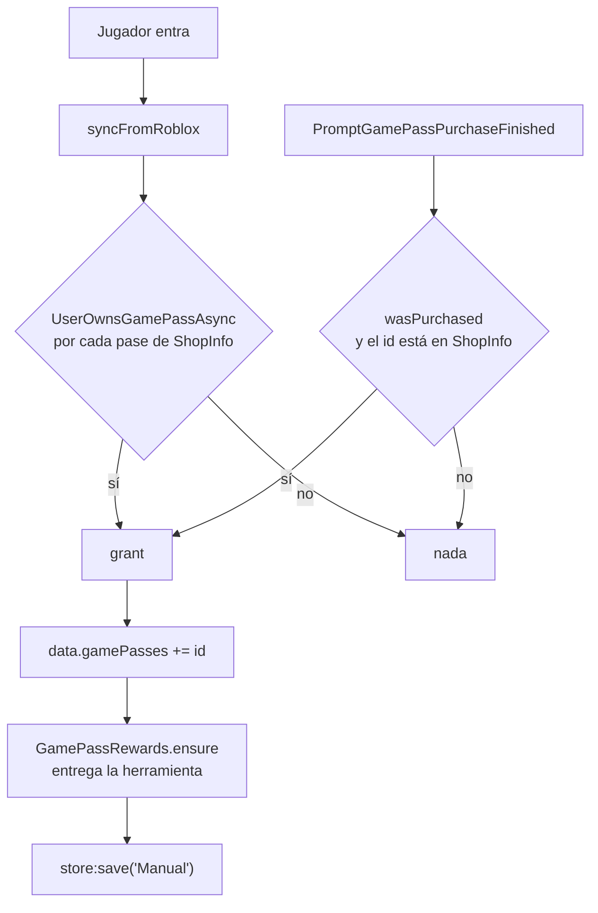

# Monetización

Todo lo que se paga con Robux pasa por aquí. Hay **dos sistemas de gamepass distintos**,
escritos por manos distintas, que no se conocen entre sí, y un tercer camino para vender
artículos del catálogo de Roblox creados por los propios jugadores.

## Los dos sistemas de gamepass

**HECHO.** Coexisten y no comparten ni datos ni identificadores.

| | `Shared/Monetization` | `WorldSystem/GamePassService` |
|---|---|---|
| Dónde vive | `ReplicatedStorage` — se carga en cliente y servidor | `ServerStorage` — solo servidor |
| Qué pases conoce | Tres, escritos a fuego: `Premium`, `Material`, `Vip` | Los que `ShopInfo` declare con `Type == "GamePass"` |
| Dónde guarda la propiedad | `Gamepass[n].Owner[userId]`, una tabla **en memoria** que se borra al salir | `data.gamePasses` en el perfil, **persistido** |
| Cómo la averigua | `UserOwnsGamePassAsync` la primera vez que se pregunta | `syncFromRoblox` recorre todos los pases de la tienda al entrar |
| Superficie remota | Cinco `RemoteEvent` en `Events/Monetization` | **Ninguna** |
| Qué concede | Beneficios en ejecución (`Beneficios.lua`), materiales de decoración | Herramientas de inventario vía `GamePassRewards` |

**INFERENCIA.** Parecen dos generaciones del mismo problema. `GamePassService` es
claramente el más nuevo: tipado, sin remotes, con datos declarados fuera del código y
persistencia real. `Shared/Monetization` sigue vivo porque lo consumen la tienda de
materiales (`ChangeDesing` pregunta `IsGamepassOwner`) y los puestos del place de
donaciones.

**Consecuencia práctica.** Un pase declarado en `ShopInfo` **no** lo ve
`Monetization:SearchGamePass`, y uno de los tres literales de `Monetization` **no** llega a
`data.gamePasses`. Quien añada un pase nuevo tiene que saber en cuál de los dos lo pone, y
nada en el código lo dice.

## `GamePassService` — el camino cerrado

**HECHO.** No tiene remotes. Solo se le llega por dos caminos, y los dos verifican contra
Roblox antes de conceder:



**HECHO.** `grant` es idempotente por partida doble: comprueba `table.find` antes de
insertar, y aun así vuelve a llamar a `GamePassRewards.ensure`, que decide por sí mismo si
hacía falta entregar algo. Devuelve el resultado de `store:save("Manual")`, así que quien
llame sabe si quedó persistido.

**Registrado como correcto.** El identificador que llega de `PromptGamePassPurchaseFinished`
se contrasta contra `shopPassIds` antes de conceder nada. El evento lo dispara Roblox, no un
remote, y el filtro impide que un pase ajeno al juego active una concesión.

## `Shared/Monetization` — el camino abierto

**HECHO.** Este sí expone remotes. `Works()` conecta cinco en el servidor:

| Remote | Manejador | Entrada del cliente |
|---|---|---|
| `Gamepass` | responde con `VerifyGamepass(Player)` | ninguna |
| `ProductsPlayer` | `GetProductPlayer` | ninguna |
| `PromptBulkPurchaseFinished` | `UnmarkPrompt` | ninguna |
| `AddedProductPlayer` | `AddedProductPlayer` | **`ProductId` e `InfoType`** |
| `PurchaseProduct` | *(solo servidor → cliente)* | — |

Cuatro de los cinco ignoran lo que manda el cliente y trabajan solo con `Player`. El quinto
no: ver [BUG-CANDIDATE-022](../testing/verification-plan.md#bug-candidate-022).

### El registro de prompts

**HECHO.** `MarkPrompt` / `UnmarkPrompt` implementan un candado de un solo prompt por
jugador, y el motivo está escrito en el propio código:

```lua
--ESTO SE ESTA USANDO PARA CANCELAR ALGUNA ACCION CASO QUE SE HAYAN MEZCLADOS LOS
--PROMPTSPURCHASES Y ASI MEJORAR LA SEGURIDAD EN CIERRES DE PROMPTS DE ROBLOX
```

`MarkAdded:decition(id, was, infoType)` compara el prompt que se cerró con el que se abrió,
y si no coinciden reporta `"Closed"` en vez de `"Success"`:

```lua
function module:decition(id, was, infoType)
	if infoType ~= self.InfoType or id ~= self.id then
		self:cancel("Closed")
	else
		self:cancel(was and "Success" or "Cancel")
	end
end
```

**Registrado como correcto.** Es exactamente la protección que hace falta cuando varios
`Prompt*PurchaseFinished` distintos pueden llegar entrelazados: sin ella, cerrar un prompt
podría dar por buena la compra de otro. Los seis eventos `Prompt*Finished` de Roblox están
conectados, no solo los dos que el juego usa.

### Cómo se cobra una venta de cuadro

**HECHO.** El camino completo, desde `Stores/Compras.luau` hasta el pago:

1. `Compras:Comprar(Player)` toma `self.ProductActive` —**estado de servidor**— y lee su
   precio con `GetProductInfo`. El cliente no interviene en el importe.
2. `Monetizacion:MarkPrompt` reserva el candado; si ya había uno, la compra no arranca.
3. Se abre el prompt de Roblox y se guarda el proceso en `ProcesosVentas[UserId]`.
4. Roblox dispara `Prompt*PurchaseFinished`; `UnmarkPrompt` resuelve el candado.
5. `Monetizacion:VerifyVentasPlayer` —que **define `Data.Main`**, no este módulo— acredita a
   comprador y vendedor y registra la venta en `Tablero`.

**OBSERVACIÓN.** El paso 5 vive en `Data/Main/init.server.luau`. `Shared/Monetization` lo
llama sin declararlo: es otra inyección de las que describe
[Data.Main](./session-orchestrator.md#por-qué-este-archivo-importa-más-de-lo-que-parece).

## El proxy y su secreto

**HECHO.** `Monetization/MainModule.luau` habla con un proxy autoalojado para listar los
artículos del catálogo que ha creado un jugador:

```lua
local url = MY_PROXY_URL .. '/catalog/v1/search/items/details?Category=3&CreatorName=' .. plrId.Name
local headers = { ["My-Secret"] = MY_SECRET_KEY }
```

Este archivo está bajo **`ReplicatedStorage`**, y ahí está el problema: la constante viaja a
la máquina de cada jugador junto con el resto del contenido replicado. Es la misma pareja
IP + secreto que usan otros tres archivos del repositorio.
Ver [BUG-CANDIDATE-014](../testing/verification-plan.md#bug-candidate-014), que esta lectura
amplió de un archivo a cuatro.

**OBSERVACIÓN.** `getItems` nombra `errormsg` a la segunda salida de `pcall`, que en el
camino de éxito es el **valor devuelto**, no un error:

```lua
local success, errormsg = pcall(function() ... return http:JSONDecode(response).data end)
...
return typeof(errormsg) == 'table' and errormsg or filteredItems
```

Funciona —devuelve los datos cuando los hay y una tabla vacía cuando no—, pero se lee al
revés de lo que hace. `filteredItems` nunca llega a llenarse.

## Puntos de verificación

| Aspecto | Entrada |
|---|---|
| `AddedProductPlayer` acepta un id de asset del cliente sin comprobar propiedad | [BUG-CANDIDATE-022](../testing/verification-plan.md#bug-candidate-022) |
| El secreto del proxy está en un módulo replicado al cliente | [BUG-CANDIDATE-014](../testing/verification-plan.md#bug-candidate-014) |

## Controles que sí sujetan

| Control | Cómo |
|---|---|
| **El importe de una compra nunca viene del cliente** | `Compras.Comprar` usa `self.ProductActive` y `GetProductInfo`; `GamePassService` no acepta ninguna entrada remota |
| **Un pase solo se concede si Roblox lo confirma** | `syncFromRoblox` llama a `UserOwnsGamePassAsync`; la ruta de compra exige `wasPurchased` **y** que el id esté en `ShopInfo` |
| **Los prompts entrelazados no se confunden** | `MarkAdded:decition` compara id e `InfoType` del prompt cerrado contra el abierto |
| **Un jugador no puede tener dos compras abiertas** | `MarkPrompt` devuelve `nil` si ya hay un prompt registrado para ese jugador |
| **La caché de propiedad se limpia al salir** | `PlayerRemoving` borra `Gamepass[n].Owner[userId]` y cancela la tarea de carga pendiente |
| **Conceder un pase es idempotente** | `grant` comprueba `table.find` antes de insertar, y `GamePassRewards.ensure` vuelve a decidir por su cuenta |

## Qué queda por leer

| Archivo | Estado |
|---|---|
| `Shared/Monetization/init.luau`, `MainModule`, `MarkAdded`, `Beneficios` | Leídos |
| `WorldSystem/GamePassService/init.luau` | Leído |
| `GamePassService/GamePassRewards.luau` | **En parte** — `ensure`; falta `ensureAll` |
| `ShopInfo.luau` | **Pendiente** — la declaración de la tienda que alimenta a `GamePassService` |
| `ServerScripts/inventory/InventoryManager` | **Pendiente** — quien entrega las herramientas |

## Implementación relacionada

| Aspecto | Código |
|---|---|
| Pases persistidos | `WorldSystem/GamePassService/init.luau`, `grant`, `syncFromRoblox` |
| Recompensas de pase | `GamePassService/GamePassRewards.luau`, `ensure` |
| Pases en memoria | `Shared/Monetization/init.luau`, `IsGamepassOwner`, `VerifyGamepass` |
| Candado de prompts | `Shared/Monetization/MarkAdded.luau` |
| Catálogo del jugador | `Shared/Monetization/MainModule.luau`, `getItems`, `loadItems` |
| Acreditación de una venta | `Data/Main/init.server.luau`, `Monetizacion:VerifyVentasPlayer` |
