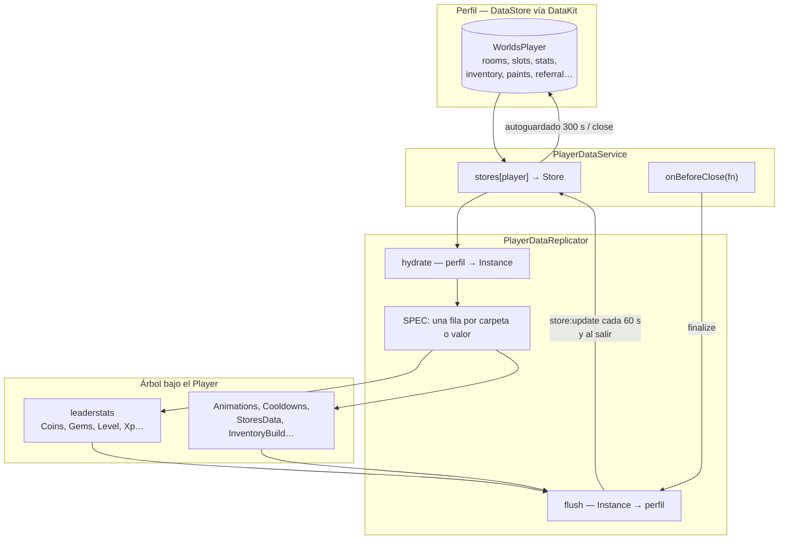
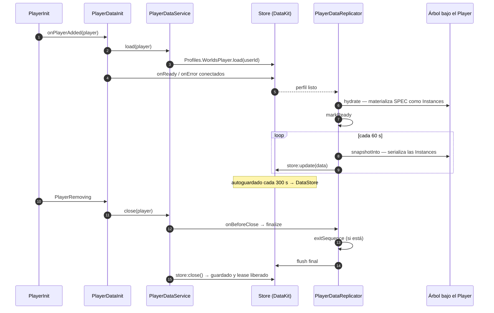

# Datos del jugador

Todo lo que un jugador conserva entre sesiones vive en un único perfil `WorldsPlayer`.
Este sistema es el puente entre ese perfil —una tabla en un DataStore— y el árbol de
`ValueBase` que cuelga del `Player` y que el cliente puede leer directamente.

Entender **este puente** es necesario para entender la economía, porque la moneda no vive
en el perfil: vive en una `Instance`, y llega al perfil por volcados periódicos.

## Componentes

| Componente | Ruta | Papel |
|---|---|---|
| `PlayerSchema` | `Core/ServerStorage/WorldSystem/PlayerSchema.luau` | La plantilla del perfil: qué claves existen y con qué valor arrancan |
| `PlayerDataService` | `Core/ServerStorage/WorldSystem/PlayerDataService.luau` | Registro de `Store` por jugador; carga, acceso y cierre |
| `PlayerDataReplicator` | `Core/ServerStorage/WorldSystem/PlayerDataReplicator.luau` | El puente bidireccional perfil ↔ `Instance`, dirigido por una tabla `SPEC` |
| `PlayerDataInit` | `Core/…/ServerScripts/PlayerDataInit.server.luau` | Engancha carga y cierre al ciclo de vida del jugador |
| `PlayerDataReplicator` (script) | `Core/…/ServerScripts/PlayerDataReplicator.server.luau` | Sirve `GetHouses`, `GetSlots`, `GetFavoriteWorlds`, `BuySlot` |
| `Collections` | `Core/ReplicatedStorage/Client/EconomySystem/Collections.luau` | Lectura y escritura de moneda sobre esas `Instance` |

## Arquitectura



## El detalle que más consecuencias tiene

**HECHO.** Hay **dos escalones** entre cambiar una moneda y que quede guardada:

1. `Collections.SetAmount` escribe `value.Value` en una `Instance` bajo el jugador.
   **Esto no toca el perfil.**
2. `PlayerDataReplicator.flush` serializa esas `Instance` y las mete en el perfil con
   `store:update`. Corre **cada `FLUSH_INTERVAL = 60` segundos** y en `finalize`.
3. `Store` persiste el perfil en el DataStore en su autoguardado —**cada 300 segundos por
   defecto**— o al cerrarse.

**INFERENCIA.** Un cambio de moneda tarda por tanto hasta 60 segundos en llegar siquiera a
la copia en memoria del perfil, y hasta 300 más en llegar al DataStore. En cambio, algo
escrito con `store:update` directamente —como añadir una room al comprar una casa— está en
la copia en memoria del perfil **de inmediato**.

Esa asimetría es la que convierte
[BUG-CANDIDATE-008](../testing/verification-plan.md#bug-candidate-008) en una ventana real y
no en una hipótesis sobre un error improbable.

## La tabla `SPEC`

**HECHO.** Todo el mapeo está en una tabla declarativa. La cabecera del archivo documenta
sus columnas:

| Columna | Significado |
|---|---|
| `key` / `path` | Dónde vive el dato en el perfil (`path` para claves anidadas) |
| `instance` | Nombre del `Folder` o `ValueBase` que cuelga del `Player` |
| `kind` | `"folder"` \| `"record"` \| `"scalar"` |
| `merge` | `"byName"` reconcilia la lista contra el default por `Name` |
| `coerce` | Normaliza el `Value` antes de crear la `Instance` |
| `load` | Reemplaza por completo la materialización genérica |
| `afterLoad` | Corre tras crear la `Instance`; lo que devuelva va al estado |
| `beforeSave` | Transforma lo serializado antes de escribirlo al perfil |
| `stateKey` | Clave bajo la que se guarda el resultado en `DataComplete` |

Filas destacadas:

| Clave del perfil | `Instance` | `kind` |
|---|---|---|
| `stats` | `leaderstats` | `folder` |
| `animations` | `Animations` | `folder` |
| `cooldowns` | `Cooldowns` | `folder` |
| `storesData` | `StoresData` | `folder` |
| `inventoryBuild` | `InventoryBuild` | `folder` |
| `inventoryProducts` | `InventoryItemsProucts` | `folder` |
| `stylesSalas` | `stylesSalas` | `folder` |
| `questData` | `QuestData` | `record` |
| `guide` | `GuideService` | `record` |
| `lastPaint` | `LastPaint` | `record` |
| `paints.marcos` | `MarcosPaint` | `folder` (ruta anidada) |
| `materials` | `Materials` | `scalar` |
| `favoriteNightclub` | `FavoriteNightclub` | `scalar` |

**INFERENCIA.** `rooms`, `slots` y `favorites` **no** están en `SPEC`. No se materializan
como `Instance`: se leen y escriben directamente sobre el perfil, y viajan al cliente por
remotes (`GetHouses`, `GetSlots`, `UpdateHouses`, `UpdateSlots`). Por eso la propiedad de
casas y la moneda se comportan de forma distinta ante un fallo.

## Reglas de guardado que el código declara sobre sí mismo

**HECHO.** `snapshotInto` no borra lo guardado cuando falta una `Instance`:

```lua
-- Una Instance ausente no borra lo guardado: puede que otro sistema la
-- haya quitado o que nunca se llegara a crear.
if serialized ~= nil then
```

**HECHO.** Un escalar en `false` se trata explícitamente, porque el chequeo genérico lo
perdería:

```lua
-- Sin el chequeo explicito, un escalar en false se perderia.
```

**HECHO.** `flush` se niega a escribir si el store no puede escribir:

```lua
if not store or not store:canWrite() then
    return false
end
```

`canWrite` es falso cuando el store está denegado o en estado crítico según
[`Health`](/api/Health). **INFERENCIA:** ante una racha de fallos de DataStore, el sistema
deja de volcar en vez de insistir, y los datos del jugador se quedan solo en las
`Instance` hasta que el circuito se recupere.

## Ciclo de vida



**HECHO.** `PlayerDataService.close` está protegido contra reentrada con un mapa
`closing`, y ejecuta los callbacks `onBeforeClose` **antes** de quitar el store del
registro, para que `finalize` todavía pueda encontrarlo.

**HECHO.** `finalize` usa un `BindableEvent` como cerrojo, y el código explica por qué en
un comentario propio: si se vuelve a entrar mientras corre la secuencia de salida, la
segunda llamada espera al `Event` en vez de reescribir datos a medias.

```lua
tracked[player] = bin.Event --// Agregado para evitar que se vuelva a sobreescribir un nuevo dato mientras se realiza el "ExitSequence"
```

**HECHO.** `game:BindToClose` llama a `PlayerDataService.closeAll()`, que copia primero la
lista de jugadores y luego cierra, para no mutar la tabla mientras la recorre.

## Estado compartido

**HECHO.** `PlayerDataReplicator.DataComplete` es un registro de estado por jugador, y su
nombre está congelado a propósito:

```lua
-- Registro de estado por jugador. Conserva el nombre `DataComplete` porque
-- RevisarCanciones y ComprasTablero lo leen por inyeccion (.DataBase.DataComplete).
```

**OBSERVACIÓN.** Es un acoplamiento por nombre entre tres sistemas, documentado pero
frágil: renombrar ese campo rompería dos consumidores que no lo mencionan en su propio
código de forma buscable.

## Puntos de verificación

| Aspecto | Entrada |
|---|---|
| La concesión de una compra persiste por una ruta distinta que el cobro | [BUG-CANDIDATE-008](../testing/verification-plan.md#bug-candidate-008) |
| Los remotes de `Collections` están a un booleano de permitir escritura arbitraria | [BUG-CANDIDATE-015](../testing/verification-plan.md#bug-candidate-015) |

## Implementación relacionada

| Aspecto | Código |
|---|---|
| Plantilla del perfil | `PlayerSchema.luau` |
| Registro de stores | `PlayerDataService.luau`, `load`, `get`, `close`, `closeAll` |
| Mapeo perfil ↔ Instance | `PlayerDataReplicator.luau`, `SPEC`, `hydrate`, `applyEntry` |
| Volcado | `PlayerDataReplicator.luau`, `snapshotInto`, `flush`, `finalize` |
| Enganche al ciclo de vida | `PlayerDataInit.server.luau` |
| Remotes de casas y espacios | `PlayerDataReplicator.server.luau` |
| Moneda | `Client/EconomySystem/Collections.luau` |
