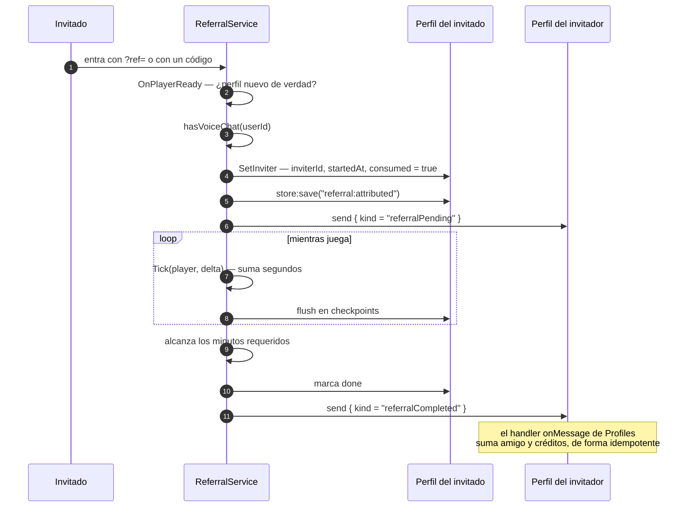

# Invitaciones

Sistema de «invita a un amigo»: un jugador comparte un enlace o un código, quien entra por
él queda atribuido, y cuando cumple unos minutos de juego el invitador suma un amigo y
puede reclamar recompensas.

`ReferralService.luau` tiene **1 243 líneas**, el módulo propio más grande del repositorio,
y está muy comentado en el propio código. Esta página resume su forma y destaca lo que
importa para el resto del sistema.

## Componentes

| Componente | Ruta | Papel |
|---|---|---|
| `ReferralService` | `Core/ServerStorage/WorldSystem/ReferralService.luau` | Toda la lógica |
| `ReferralConfig` | `Core/ReplicatedStorage/Shared/Referrals/ReferralConfig.luau` | Todo lo ajustable: minutos, ventana, recompensas, límites |
| `ReferralShared` | `Core/ReplicatedStorage/Shared/Referrals/ReferralShared.luau` | Cálculos que comparten cliente y servidor |
| `ReferralMain` | `Core/…/ServerScripts/Referrals/ReferralMain.server.luau` | Enganche al ciclo de vida y remotes |
| `ReferralCommands` | `Core/…/ServerScripts/Referrals/ReferralCommands.server.luau` | Comandos de administración |
| `ReferralClient` | `Core/…/Client/ReferralClient/ReferralClient.server.luau` | La tablet |
| `Profiles.ReferralCode` | `Core/ServerStorage/WorldSystem/Profiles.luau` | Registro de códigos manuales |

**HECHO.** El módulo declara en su cabecera que no hay números sueltos: todo lo ajustable
está en `ReferralConfig`.

## El recorrido de una invitación

**HECHO.** La cabecera del archivo lo enumera, y el código lo cumple:



**HECHO — el mensaje llega esté el invitador conectado o no.** `send` escribe en la cola
durable del perfil destino; ver [Persistencia](../architecture/persistence.md). El
invitador no tiene que estar en el juego, ni siquiera en el mismo servidor.

## Cómo se defiende de abusos

`SetInviter` es la función mejor defendida del código revisado. **HECHO**, cada
comprobación en orden:

| Comprobación | Motivo |
|---|---|
| `ReferralConfig.Enabled` | Interruptor global |
| `inviterId <= 0` | Entrada basura |
| `inviterId == player.UserId` | **No puedes invitarte a ti mismo** |
| `referral.consumed` | Una invitación por cuenta, para siempre |
| `referral.inviterId > 0` | Ya tiene invitación en curso |
| `attributing[player]` | Guarda de reentrada |
| `hasVoiceChat(player.UserId)` | Al que echan por no tener micro no cuenta |
| `player.Parent ~= Players` | Se fue mientras comprobábamos la voz |
| Re-lectura de `inviterId` | **Alguien pudo atribuirlo mientras esperábamos a Roblox** |

**INFERENCIA — las dos últimas son las que distinguen este código.** La comprobación de
chat de voz cede el hilo, y el autor lo sabe: la guarda `attributing` existe para eso, y su
comentario lo dice —*«un link y un codigo metidos a la vez podrian colar dos invitadores
para el mismo jugador»*—, pero además **vuelve a leer el perfil después del yield** en vez
de fiarse de la lectura anterior. Es exactamente el error que la mayoría del código de
Roblox comete y este no.

**HECHO.** El requisito de chat de voz enlaza con la puerta de entrada del juego: la
cabecera dice *«al que echan por no tener micro no llega a contar»*. Ver
[BUG-CANDIDATE-001](../testing/verification-plan.md#bug-candidate-001).

## Persistencia: el patrón correcto, escrito y razonado

**HECHO.** `ClaimReward` tiene este comentario, y el código lo cumple:

```lua
--[[
	El orden importa: primero se marca como reclamado y se guarda, y solo despues
	se da el dinero. Al reves, un fallo de guardado dejaria al jugador cobrando el
	mismo hito una y otra vez.
]]
```

La secuencia real es:

1. `store:update` marca la recompensa como reclamada;
2. `store:save("referral:claim")` — **y se comprueba el resultado**:
   ```lua
   if not store:save("referral:claim") then
       return false, "No se pudo guardar. Intentalo otra vez."
   end
   ```
3. solo entonces `giveReward`.

**HECHO.** `SetInviter` hace lo mismo por el mismo motivo:

```lua
-- Se persiste ya: si el servidor se cae en el proximo minuto, la invitacion
-- no se pierde.
store:save("referral:attributed")
```

**INFERENCIA — y esto importa más allá de este sistema.** El repositorio **contiene** el
patrón correcto para mover valor: persistir el apunte contable primero, verificar que se
guardó, y solo después mover el valor. Está escrito a propósito y con el razonamiento
documentado.

La ruta de compra de la tienda hace lo contrario —concede primero, cobra después, sin
comprobar el guardado— y por rutas de persistencia distintas. Que ambos patrones convivan
en el mismo repositorio es lo que convierte
[BUG-CANDIDATE-008](../testing/verification-plan.md#bug-candidate-008) en una
inconsistencia y no en una diferencia de criterio.

## Idempotencia de los mensajes

**HECHO.** Los mensajes que recibe el invitador los consume el handler `onMessage` de
`Profiles.WorldsPlayer`, y ese handler **tiene que ser idempotente** porque `Store` puede
reejecutarlo si falla un guardado. `Profiles.luau` lo respeta marcando en vez de borrando:

```lua
-- La red de seguridad contra el doble conteo: si esta entrada ya se cobro, no
-- se vuelve a sumar pase lo que pase.
if typeof(entry) == "table" and entry.paid then
    return data
end
```

Ver [Persistencia](../architecture/persistence.md) para el contrato completo.

## Cachés y coste

**HECHO.** El sistema evita deliberadamente MemoryStore, y dice por qué:

```lua
-- Este sistema no usa MemoryStore directamente: la cuota del universo ya nos dio
-- un susto en agosto. El unico roce es el timbre de DataKit al hacer `send`, que
-- es best-effort y si falla el mensaje llega igual por DataStore.
```

**HECHO.** Dos cachés acotan el coste:

| Caché | Valor | Motivo declarado en el código |
|---|---|---|
| `PROGRESS_CACHE_SECONDS` | 60 s | *«Sin esto, tener la tablet abierta seria una lectura de DataStore por segundo»* |
| Sesión en memoria | checkpoints | *«Escribir el perfil una vez por segundo seria absurdo»* |

**INFERENCIA.** La elección de 60 s no es arbitraria: el propio comentario razona que el
invitado solo persiste su avance cada `ProgressCheckpointSeconds`, así que leer más a
menudo no daría un dato más exacto. Es una caché dimensionada contra la frecuencia real de
escritura, no un número redondo.

## Administración

**HECHO.** `ReferralCommands` está restringido a administradores con
`Admins:IsRole(player, "Admins")`, igual que `EventCommands`. Las operaciones
administrativas que expone `ReferralService`:

| Función | Qué hace |
|---|---|
| `SetPartnerRate(userId, rate)` | Fija la tarifa de créditos por amigo de un creador |
| `MarkPaid(userId, amount)` | Apunta un pago ya realizado |
| `AssignCode(userId, rawCode, ownerName)` | Registra un código manual de invitación |
| `GetSummary(userId)` | Resumen de un usuario |
| `DebugForceInvite`, `DebugSession` | Depuración |

**HECHO.** Los tres primeros funcionan sobre jugadores **desconectados**, usando `send`
sobre su perfil (`referralPartner`, `referralPaid`, `referralCode`). Ver los handlers en
`Profiles.luau`.

**HECHO.** `Profiles.ReferralCode` usa `onConflict = "deny"`, y el código explica el
motivo:

```lua
`onConflict = "deny"` porque dos servidores asignando el mismo codigo a la vez
debe fallar, no robarse el candado.
```

## Puntos de verificación

Ninguna entrada nueva. Este sistema es el mejor defendido de los revisados, y sus
contribuciones al plan de verificación son como **contraste**, no como hallazgo:

| Aporta a | Cómo |
|---|---|
| [BUG-CANDIDATE-008](../testing/verification-plan.md#bug-candidate-008) | Demuestra que el patrón correcto de orden de persistencia ya existe y está razonado en el repositorio |
| [BUG-CANDIDATE-001](../testing/verification-plan.md#bug-candidate-001) | Depende del control de chat de voz para no contar invitaciones que luego se expulsan |

## Implementación relacionada

| Aspecto | Código |
|---|---|
| Atribución | `ReferralService.luau`, `SetInviter`, `AttributeFromJoin`, `ReadInviteJoinData` |
| Progreso | `ReferralService.luau`, `Tick`, `flushSession`, `completeReferral` |
| Lectura para la tablet | `ReferralService.luau`, `GetState`, `readInviteeProgress`, `prunePending` |
| Recompensas | `ReferralService.luau`, `ClaimReward`, `giveReward` |
| Compartir | `ReferralService.luau`, `GetShareOptions` |
| Administración | `ReferralService.luau`, `SetPartnerRate`, `MarkPaid`, `AssignCode` |
| Consumo de mensajes | `Profiles.luau`, `applyReferralPending`, `applyReferralCompleted` |
