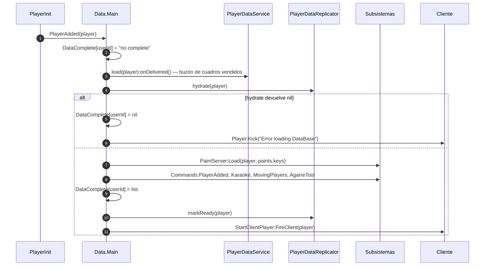

# `Data.Main` — el orquestador de sesión

`Core/ServerScriptService/Data/Main/init.server.luau` (392 líneas) es el archivo que ata
el juego entero. No implementa ningún sistema: **conecta todos los demás**. Es el único
consumidor del módulo `PlayerDataReplicator`, el que decide qué significa «el jugador está
listo», y el que define la secuencia de salida que ejecuta la capa de persistencia.

Si buscas «¿dónde arranca la sesión de un jugador?», la respuesta está aquí y no en
[Datos del jugador](./player-data.md), que solo describe el puente perfil ↔ `Instance`.

## Por qué este archivo importa más de lo que parece

**HECHO.** No hay contenedor de inyección de dependencias, ni registro de servicios, ni
ciclo de arranque declarado. En su lugar, `Data.Main` **asigna campos a módulos ya
cargados**, en orden, en el nivel superior del script:

```lua
Tablero.GlobalData = GlobalDataStore
Tablero.DataBase   = PlayerDataReplicator

Monetizacion.Cobros = Cobros
Monetizacion.AddItem = AddItem
Monetizacion.Stores = Stores

Stores.Cobros = Cobros
Stores.comprasFunct.Monetizacion    = Monetizacion
Stores.comprasFunct.ProcesosVentas  = ProcesosVentas
Stores.comprasFunct.Cuadros         = PaintServer
Stores.comprasFunct.GlobalData      = GlobalDataStore
Stores.comprasFunct.PlayerDataService = PlayerDataService
Stores.comprasFunct.Profiles        = require(SS.WorldSystem.Profiles)
Stores.comprasFunct.DataKit         = require(SS.DataKit)

PaintServer.Cuadros  = Stores.ComprasList
PaintServer.DataBase = GlobalDataStore

Karaoke.KaraokeDS = GlobalDataStore
PlayerDataReplicator.KaraokeFactory = Karaoke.CrearCancion

Commands.AdminPanel = Karaoke
Karaoke.Commands = Commands
```

**INFERENCIA.** Esto explica por qué el grafo de `require` de
[Dependencias](../architecture/dependencies.md) parece más plano de lo que el sistema
realmente es: buena parte del acoplamiento no pasa por `require`, pasa por estas
asignaciones. Un módulo como `Stores.comprasFunct` no menciona `DataKit` en ninguna parte
de su código; lo recibe aquí.

**Consecuencia práctica.** Un módulo que se cargue *antes* de que `Data.Main` corra verá
esos campos en `nil`. El orden dentro de este archivo es, por tanto, significativo aunque
nada lo declare: `Data.Main` es efectivamente el `main()` del servidor.

:::note El acoplamiento bidireccional

`Commands.AdminPanel = Karaoke` y `Karaoke.Commands = Commands` se asignan una detrás de
otra. Cada módulo guarda una referencia al otro. Ninguno de los dos se puede cargar solo.

:::

## Lo que corre y cuándo

**HECHO.** El archivo tiene tres bloques de ejecución, en este orden:

1. **Nivel superior (líneas 1–91 y 266–390)** — `require`s, inyección de dependencias, la
   creación condicional del `NightClub`, `Karaoke:Works()`, `Commands:Works()`,
   `GlobalDataStore:SetSections()` y la conexión del remote `DonarCoins`.
2. **`Init()` (línea 393, la última del archivo)** — arranca `BartenderSystem`, `Jobs`,
   conecta el ciclo de vida del jugador y registra `BindToClose`.
3. **Callbacks** — `PlayerAdded`, `PlayerRemoving`, la secuencia de salida y el bucle de
   guardado.

**OBSERVACIÓN.** `DonarCoins` se conecta en el nivel superior (línea 389), **antes** de
`Init()`. Es el único remote de este archivo que puede recibir tráfico antes de que el
ciclo de vida esté conectado.

## El arranque de un jugador



**HECHO.** La señal de «ya puedes empezar» es el `RemoteEvent` `StartClientPlayer`, y el
protocolo es un apretón de manos en dos direcciones:

```lua
function PlayerIsLoaded(Player)
	if typeof(PlayerDataReplicator.DataComplete[Player.UserId]) == "table" then
		LoadedCompleteEvent:FireClient(Player)
	else
		RequerestLoadedPlayer[Player] = true
	end
end
```

El servidor lo dispara cuando termina de cargar; el cliente puede además **preguntarlo**
disparando el mismo remote hacia el servidor (`LoadedCompleteEvent.OnServerEvent:Connect(PlayerIsLoaded)`),
para el caso de que el cliente estuviera todavía cargando cuando el servidor avisó.

**OBSERVACIÓN.** `RequerestLoadedPlayer[Player] = true` se escribe en la rama negativa y
lo limpia `PlayerRemoving`, pero **ningún código lo lee**. La reanudación real la hace el
cliente volviendo a preguntar, no el servidor consultando esta tabla.

## Los tres estados de `DataComplete`

**HECHO.** `PlayerDataReplicator.DataComplete[userId]` no es un booleano: es una máquina de
estados de tres valores que solo `Data.Main` escribe.

| Valor | Significado | Quién lo pone |
|---|---|---|
| `nil` | El jugador no ha empezado a cargar, o ya terminó de salir | estado inicial; `PlayerRemoving`; las ramas de error de `PlayerAdded` |
| `"no complete"` | Carga en curso | `PlayerAdded`, primera línea |
| tabla (`list`) | Cargado; contiene el estado por subsistema | `PlayerAdded`, tras `hydrate` |
| `"Guardando"` | Saliendo, guardado en curso | la secuencia de salida |

Tres consumidores lo leen por inyección, no por `require`:

| Consumidor | Uso |
|---|---|
| `Karaoke/RevisarCanciones` | `self.DataStore.DataBase.DataComplete[Player.UserId]` |
| `ComprasTablero` | `self.DataBase.DataComplete[Player.UserId]` como comprobación de presencia |
| `Data.Main` | como guarda de reentrada y como contador en el apagado |

**OBSERVACIÓN.** El propio `PlayerDataReplicator` documenta que el nombre está congelado
por eso mismo:

```lua
-- Registro de estado por jugador. Conserva el nombre `DataComplete` porque
-- RevisarCanciones y ComprasTablero lo leen por inyeccion (.DataBase.DataComplete).
```

## La salida: dos manejadores para el mismo evento

**HECHO.** Dos scripts distintos conectan `Players.PlayerRemoving`, y hacen cosas
diferentes:

| Script | Qué hace |
|---|---|
| `PlayerDataInit.server.luau` | `PlayerDataService.close(player)` → `onBeforeClose` → `PlayerDataReplicator.finalize` → `store:close()` |
| `Data.Main` | `PlayerRemoving(Player)` → comprueba `DataComplete` → `finalize` → limpia `DataComplete` |

**INFERENCIA.** El orden entre ambos no está garantizado: son dos conexiones al mismo
evento y Roblox no promete un orden. En la práctica da igual para los datos, porque
`finalize` es idempotente —usa un `BindableEvent` como cerrojo y limpia `tracked[player]`
al salir— y el segundo en llegar no vuelve a escribir.

Donde sí importa es en `DataComplete`, que **solo** limpia `Data.Main`.

La secuencia de salida propiamente dicha se registra en `PlayerDataReplicator` y la
ejecuta la capa de persistencia, no este archivo:

```lua
PlayerDataReplicator.setExitSequence(function(Player)
	Stores:ExitPlayer(Player)
	Monetizacion:PlayerRemoving(Player)
	Commands:PlayerRemoving(Player)
	Karaoke.RevisarCanciones:AdminRemoved(Player)
	Karaoke.TvKaraoke:UpdateMusicas()
	MovingPlayers:remove(Player)
	...
	PlayerDataReplicator.DataComplete[Player.UserId] = "Guardando"
	for _, v in DataComplete do
		if v.Exit then pcall(v.Exit, v, Player) end
	end
	...
end)
```

**HECHO.** Cada entrada de `list` puede traer su propio método `Exit`, y se invoca dentro
de `pcall`: un subsistema que falle al salir no impide que salgan los demás ni que se
guarden los datos.

**HECHO.** Los cuadros son el único dato que la secuencia de salida escribe directamente
en el perfil, en vez de dejarlo al volcado por `SPEC`:

```lua
local paints = PaintServer:PlayerRemoving(Player)
local store = PlayerDataService.get(Player)
if store and store:canWrite() and typeof(paints) == 'table' then
	store:update(function(data)
		data.paints.keys = paints
		return data
	end)
end
```

## El apagado del servidor

**HECHO.** `Data.Main` registra su propio `BindToClose`, además del que registra
`PlayerDataInit`. El suyo:

1. Para `Jobs` y cancela dos tareas periódicas (`SpawnUpdateLeaderboard`, `SalvarBucle`).
2. Lanza `PlayerRemoving` para cada jugador, **en paralelo** (`task.spawn`).
3. Guarda las palabras clave de `GlobalDataStore`.
4. Espera activamente, con un tope de **30 segundos**, a que `DataComplete` se vacíe.

```lua
local timeout = tick()
while CountDatasCompletes() > 0 and tick()-timeout < 30 do
	task.wait(.5)
end
```

**HECHO.** `CountDatasCompletes` cuenta las entradas cuyo valor no es `nil` ni
`"no complete"`. Es decir: un jugador cuya carga no había terminado **no** retrasa el
apagado, y uno que está guardando sí.

**OBSERVACIÓN.** El tope de 30 s es una elección deliberada frente al presupuesto de
`BindToClose` de Roblox, que también es de 30 s. No queda margen para nada posterior al
bucle salvo el `warn` final.

## Donaciones entre jugadores

**HECHO.** El sistema de donación vive entero en este archivo, en unas 60 líneas, y es el
único camino por el que la moneda pasa de un jugador a otro.

| Regla | Valor | Dónde |
|---|---|---|
| Tope por ventana | 1 000 `Coins` | `MaxAmountSend` |
| Ventana | 24 horas | `UpdateTime` |
| Contador | atributo `AmountSending` en `leaderstats.Coins` | `donacion.UpdateDonacion` |
| Marca de tiempo | atributo `ElapsedTime` en la misma `Instance` | ídem |

```lua
function donacion.Donar(Player, Receptor, Cantidad)
	if typeof(Cantidad)=="number" and Cantidad>0
		and typeof(Receptor)=="Instance" and Receptor:IsA("Player") and Receptor:IsDescendantOf(game) then
		Cantidad = math.round(Cantidad)
		...
		if SumaTotal <= MaxAmountSend and Cobros.charge(Player, {Coins = Cantidad}, true) then
			Cobros.Give(Receptor, {Coins = Cantidad}, true)
			Cash:SetAttribute("AmountSending", tostring(SumaTotal))
			...
```

**HECHO — el tope sí sobrevive a la reconexión.** Es la primera duda razonable al leer
esto, porque el contador vive en una `Instance` y las `Instance` no persisten. Pero sí
persisten: `SPEC` mapea la clave `stats` del perfil a la carpeta `leaderstats`, y el
serializador guarda los atributos junto al valor:

```lua
for index, attribute in value:GetAttributes() do
	record[index] = BreakDown.Set(attribute)
end
```

…y `AddValues.Create` los vuelve a poner al materializar. `ElapsedTime` y `AmountSending`
no aparecen en ningún otro archivo del repositorio, así que este es el circuito completo.
**Salir y volver a entrar no reinicia el tope diario.**

**HECHO — el orden es el correcto.** Cobra primero (`charge`) y solo concede si el cobro
tuvo éxito, al revés que la ruta de compra de [BUG-CANDIDATE-008](../testing/verification-plan.md#bug-candidate-008).

**Pero** hay un caso en el que el cobro tiene éxito y la concesión no hace nada:
[BUG-CANDIDATE-019](../testing/verification-plan.md#bug-candidate-019).

## Puntos de verificación

| Aspecto | Entrada |
|---|---|
| Salir durante la carga deja `DataComplete` sucio y rompe la reconexión al mismo servidor | [BUG-CANDIDATE-018](../testing/verification-plan.md#bug-candidate-018) |
| Donar a un jugador que aún no ha cargado destruye la moneda | [BUG-CANDIDATE-019](../testing/verification-plan.md#bug-candidate-019) |

## Observaciones registradas, que no son defectos

| Observación | Detalle |
|---|---|
| `PlayerIsLoaded`, `PlayerAdded`, `PlayerRemoving`, `SentNotification` e `Init` se declaran **globales**, sin `local` | Funciona, pero significa que cualquier otro script del mismo contexto podría sobrescribirlas |
| `RequerestLoadedPlayer` se escribe y se limpia, pero nunca se lee | El reintento real lo hace el cliente |
| En `donacion.Donar`, `local CashReceptor = Player:FindFirstChild(...)` usa `Player` donde parece querer decir `Receptor` | La variable no se usa después, así que hoy no tiene efecto |
| `donacion.Donar` no comprueba que `Receptor ~= Player` | Donarse a uno mismo es neutro en moneda; solo consume presupuesto del tope diario |
| La moneda donada cuenta como *ganada*: `Give` incrementa el atributo `earned` | Relevante si alguna clasificación usa `earned` |
| Si `leaderstats` aún no existe, `donacion.Donar` lanza error al indexar `nil` antes de cobrar | Falla cerrado: no se pierde moneda |
| `Karaoke:Works()` y `Commands:Works()` son el mismo patrón de arranque con distinto módulo | Convención informal, sin interfaz declarada |

## Implementación relacionada

| Aspecto | Código |
|---|---|
| Inyección de dependencias | `Data/Main/init.server.luau`, líneas 30–72 y 266–278 |
| Arranque del jugador | `PlayerAdded`, `PlayerIsLoaded` |
| Salida | `setExitSequence`, `PlayerRemoving` |
| Apagado | el `game:BindToClose` de `Init()` |
| Donaciones | la tabla `donacion`, líneas 330–390 |
| Ventas de cuadros en Robux | `Monetizacion:VerifyVentasPlayer` |
