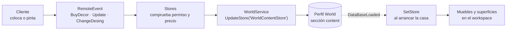

# Tiendas y decoración

`Shared/Stores` es el módulo con **más manejadores de remotes de todo el repositorio**:
trece. Cubre dos cosas que a primera vista no se parecen —los puestos de venta de arte del
place de donaciones y el mobiliario de las casas— y lo hace con **un solo archivo que
elige su comportamiento según el `PlaceId`**.

Es también donde se resuelve una incógnita que llevaba abierta desde la documentación de
Casas: **quién escribe la sección `content` del perfil `World`**.

## Un módulo, dos juegos, dos contextos

**HECHO.** `fn.new` decide en tiempo de carga qué implementación usa:

```lua
self.PlaceId_PlsDonate = false and IsStudio or 82871403803520
self.PlaceId_CasaPlaya = false and {IsStudio} or GetInfoIdsHouses()

self.Added = game.PlaceId == self.PlaceId_PlsDonate and require(script.Added)
	or table.find(self.PlaceId_CasaPlaya, game.PlaceId) and require(script.HouseAdded)
```

| Place | `self.Added` | Etiqueta de `CollectionService` | Qué gestiona |
|---|---|---|---|
| `82871403803520` (donaciones) | `Added.luau` | `Stores` | Puestos que un jugador reclama para vender cuadros por Robux |
| Cualquier `placeId` de `HousesInfo` | `HouseAdded.luau` | `ObjectsPutHouse` | El mobiliario y el diseño de una casa |
| Cualquier otro | `nil` → `IsActive` queda en `false` | — | Nada: `Works()` sale antes de conectar remotes |

**OBSERVACIÓN.** `false and IsStudio or …` es un interruptor de pruebas desactivado: la
parte izquierda siempre es `false`, así que las dos líneas equivalen a la constante y a
`GetInfoIdsHouses()`. La variable `IsStudio` que calculan solo se usa ahí, de modo que hoy
no tiene ningún efecto.

**HECHO — es el mismo código en cliente y servidor.** El archivo se carga en ambos lados y
se ramifica con `local Client = RunService:IsClient()`. La consecuencia está en `Works()`:

```lua
local BuyEvent = Client and self.StoreEvents.BuyStore.OnClientEvent
                        or  self.StoreEvents.BuyStore.OnServerEvent
BuyEvent:Connect(function(...) if #{...} <= 0 then return end self:BuyStore(...) end)
```

El **mismo método** es el manejador en los dos lados, pero las firmas no coinciden:
`OnServerEvent` antepone el `Player`, `OnClientEvent` no. Los métodos lo resuelven
reasignando argumentos a mano:

```lua
function fn:BuyDecors(Player, Decor, amount)
	if Client then
		amount = Decor      -- en cliente los argumentos venían corridos
		Decor = Player
		self.DecorEvents.BuyDecor:FireServer(Decor, amount)
	else
		...
```

**INFERENCIA.** Es un patrón de ida y vuelta: llamar al método en el cliente **envía** el
remote, y recibirlo en el servidor **ejecuta** la lógica. Ahorra un módulo de cliente
paralelo, a cambio de que cada método tenga que saber en qué lado está y de que el
significado del primer parámetro cambie según el contexto.

## Los trece remotes

**HECHO.** Los conecta `fn:Works()`, y solo si `IsActive` es verdadero:

| Remote | Carpeta | Manejador | Qué hace en el servidor |
|---|---|---|---|
| `ClaimStore` | `Stores` | `UpdateStore` | Abrir o cerrar un puesto propio (solo place de donaciones) |
| `BuyStore` | `Stores` | `BuyStore` | Comprar un puesto; precio desde `StoreTemplates/<n>/Settings` |
| `BuyDecor` | `Decors` | `BuyDecors` | Comprar, colocar o recoger mobiliario |
| `GetDecor` | `Decors` | `SetDecorPlayer` | Registrar un decor en el índice por jugador |
| `Update` | `Decors` | `UpdateDecor` | Mover, girar o recolorear un decor colocado |
| `StartClientPlayer` | `Stores` | `AddedPlayer` | Apretón de manos: el cliente pide su estado inicial |
| `ExitModeCOnstrccion` | `Stores` | `ExitModeConstruccion` | Salir del modo construcción y fijar lo colocado |
| `LikeCuadro` | `Stores` | `LikeCuadro` | Dar «me gusta» a un cuadro ajeno |
| `SellDecor` | `Decors` | `SellDecors` | Vender mobiliario y recuperar parte del precio |
| `ChangeDesing` | `Stores` | `ChangeDesing` | Cambiar color o material de suelos y paredes |
| `ComprarMaterial` | `Stores` | `ComprarMaterial` | Comprar un material del catálogo `DesingData` |
| `Delete` | `Decors` | *(inline)* | Borrar o devolver al inventario un decor colocado |
| `ActionCompras` | `Stores` | `AccionarCompras` | Comprar un cuadro por Robux, o editar el propio |

**OBSERVACIÓN.** `ExitModeCOnstrccion` está escrito así, con la errata, tanto en el
`.model.json` que declara el remote como en las dos referencias del código. Es coherente
consigo mismo, así que funciona; se documenta para que nadie lo «corrija» por un lado solo.

## Quién escribe `content` — la incógnita cerrada

La documentación de [Casas → Persistencia](./housing/persistence.md) dejaba abierta la
sección `content` del perfil `World`: estaba declarada en el esquema y ningún script leído
la escribía. **La escribe este sistema.**

**HECHO.** `WorldService` mapea `WorldContentStore → content`, y hay exactamente dos
escritores, los dos aquí:

| Escritor | Qué guarda |
|---|---|
| `Stores/init.luau`, `SetDecorPlayer` → `UpdateData` | `content.Objects` — un registro por mueble colocado, con su `UnniqueKey` |
| `Stores/HouseAdded.luau`, `ChangeDesing` | `content.Desing[carpeta][modelo]` — color y material de cada superficie |



**HECHO — el camino de vuelta.** Cuando arranca un servidor de casa, `fn:SetStore` espera
a `self.Added.DataBaseLoaded` y reconstruye el mobiliario desde el perfil:

```lua
local DataHouse = self.Added.DataBaseHouse:GetStoreData("WorldContentStore") or {}
for _, Object in DataHouse.Objects or {} do
	local decor = self.AddItem(Object.Name, true, Object)
	...
	local decor2 = self:SetDecorPlayer(Object.OwnerPlace, decor)
```

`Object.OwnerPlace` conserva **quién colocó cada mueble**, no solo quién es el dueño de la
casa. Esa distinción es la que después usa `ExitModeConstruccion` para fijar únicamente lo
que colocó cada jugador.

:::note Esto no era `BuildingSystem`

La documentación anterior apuntaba a `BuildingSystem` como escritor probable de `content`,
por eliminación. Era una hipótesis y estaba etiquetada como tal; resultó equivocada. El
sistema de construcción de parcelas es otra cosa: lo que llena `content` es el mobiliario
de casas, que vive en `Shared/Stores`.

:::

## El modelo de permisos

**HECHO.** Toda la autorización del lado casa pasa por un único método, `fn:GetStore`:

```lua
elseif typeof(Base)=="Instance" and Base:IsA("Player") then
	local UserId = tostring(Base.UserId)
	local roles = self.Added.DataBaseHouse:GetStoreData("WorldRolesStore") or {}
	if tostring(self.Added.DataBaseHouse.OwnerId)==UserId or
		(roles[UserId] and roles[UserId] ~= 46) then
		return self.Added
	end
```

Devuelve la casa si quien pregunta es el dueño **o** tiene un rol distinto de `46`. Los
manejadores que escriben empiezan pidiendo ese objeto, y si no lo obtienen no hacen nada.
El número `46` es el rol «visitante» de `RolesInfo`; ver
[Casas → Permisos](./housing/permissions.md).

**HECHO.** El límite de construcción para quien no es dueño es `MaxBuildPlace = 5`:

```lua
function fn:IsAviableToPlace(store, decore)
	return store.CountBuilds < self.MaxBuildPlace or (decore and decore.Disabled)
end
```

## Controles económicos que sí sujetan

Registrado con el mismo cuidado que los hallazgos, porque una lista de problemas sin lo
que funciona es engañosa.

| Control | Cómo |
|---|---|
| **Los precios no vienen del cliente** | `BuyStore` lee `StoreTemplates/<nombre>/Settings`; `BuyDecors` usa `verificarExistencia(Decor.Name)`; `ComprarMaterial` usa `DataDesing.FindMaterial`. El cliente manda un nombre, nunca un precio. |
| **Un precio vacío no es gratis** | `Collections.requirements` devuelve la bandera `vacio`, que solo se pone a `true` dentro del bucle. Una tabla de precio vacía devuelve `false` y el cobro no se da por bueno. Es una protección deliberada contra exactamente ese caso. |
| **No se puede comprar dos veces el mismo puesto o material** | `BuyStore` comprueba `not StoresData:FindFirstChild(NameStore)`; `ComprarMaterial` comprueba `not table.find(ListMaterials, tostring(Material.Key))`. Ambas antes de cobrar. |
| **El precio en Robux lo pone Roblox** | `Compras.Comprar` usa `self.ProductActive` —estado de servidor— y `GetProduct` para leer `Product.price`. El cliente no interviene en el importe. |
| **Amueblar la casa de otro cuenta como donación** | Colocar un mueble de pago en una casa ajena pasa por `donacion.GetState` y `donacion.Quitar`: consume el mismo tope diario de 1 000 que una transferencia directa de moneda. Es un reconocimiento explícito de que regalar mobiliario **es** transferir valor. |
| **Solo se persisten claves conocidas** | `ChangeDesing` ignora cualquier clave que no esté en `ColorTexture` (`Color`, `Material`), y `Material` además tiene que resolverse contra el catálogo y estar comprada o incluida en un gamepass. |
| **`BreakDown.Set` no deja pasar tablas** | Un valor que no sea `boolean`, `string`, `number` o uno de los seis tipos con descomposición declarada devuelve `nil`. Un cliente no puede inyectar estructuras arbitrarias en el perfil. |

## Puntos de verificación

| Aspecto | Entrada |
|---|---|
| El valor de `Color` llega del cliente sin límite de tamaño y se persiste tal cual | [BUG-CANDIDATE-020](../testing/verification-plan.md#bug-candidate-020) |
| El dueño de una casa puede vender el mueble de un invitado y cobrar el reembolso | [BUG-CANDIDATE-021](../testing/verification-plan.md#bug-candidate-021) |
| `GetInfoHouse` entrega la tabla de roles a cualquier cliente que la pida | [BUG-CANDIDATE-012](../testing/verification-plan.md#bug-candidate-012) |

## Observaciones registradas, que no son defectos

| Observación | Detalle |
|---|---|
| `BuyDecors` acepta `amount` numérico del cliente sin tope por llamada | El bucle corta en el primer cobro fallido, así que lo limita el dinero del jugador; pero un jugador con saldo puede pedir muchísimas iteraciones seguidas, sin `task.wait` entre ellas |
| En `SellDecors` y en `BuyDecors`, la rama «soy el dueño de la casa» queda fuera del `and self.Added:IsA("House")` por precedencia de operadores | Hoy es inocuo: en el place de donaciones `self.Added.DataBaseHouse` es `nil`. La forma se repite en los dos sitios |
| `ComprarMaterial` indexa `Player:FindFirstChild("Materials").Value` sin comprobar que exista | Falla cerrado: si los datos no han cargado, lanza error antes de cobrar |
| `AccionarCompras` deja una rama vacía con una línea comentada para el caso «soy el dueño y no mando actualización» | No hace nada; el comentario apunta a un remote de comandos |
| `false and IsStudio` en dos líneas de `fn.new` | Interruptor de pruebas desactivado; `IsStudio` queda sin uso real |

## Qué queda por leer de este sistema

| Archivo | Líneas | Estado |
|---|---|---|
| `init.luau` | 991 | Leído |
| `HouseAdded.luau` | 296 | Leído |
| `ColorTexture.luau` | 25 | Leído |
| `Compras.luau` | 487 | **En parte** — `Comprar` y la forma general; falta `Update`, `Like`, `ClosePurchased`, `Works` |
| `Added.luau` | 205 | **Pendiente** — los puestos del place de donaciones |
| `DecorFuncs/` (3 archivos) | 469 | **Pendiente** — la colocación física y las colisiones |
| `DecorsPlayer.luau` | 92 | **Pendiente** |

## Implementación relacionada

| Aspecto | Código |
|---|---|
| Selección de place y arranque | `Stores/init.luau`, `fn.new`, `fn:SetStore` |
| Conexión de los trece remotes | `Stores/init.luau`, `fn:Works` |
| Autorización | `Stores/init.luau`, `fn:GetStore` |
| Escritura de `content.Objects` | `Stores/init.luau`, `fn:SetDecorPlayer` → `UpdateData` |
| Escritura de `content.Desing` | `Stores/HouseAdded.luau`, `module:ChangeDesing` |
| Restauración al arrancar la casa | `Stores/init.luau`, `fn:SetStore`, rama `DataBaseLoaded` |
| Serialización de valores | `Shared/BreakDown.luau`, `Set` y `Get` |
| Compras en Robux | `Stores/Compras.luau`, `module:Comprar` |
