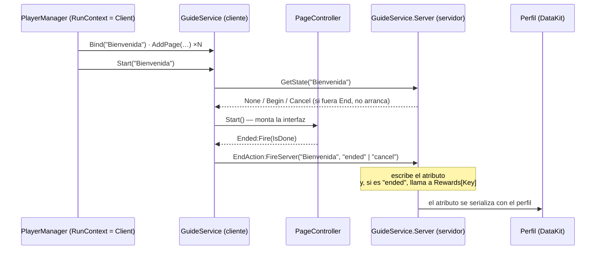

# Tutoriales y guías

`Shared/GuideService/` (394 líneas) es un visor de tutoriales por páginas, con su propio
`READ ME` escrito por su autor dentro del repositorio. `Shared/Tutorials/` (186 líneas) son
los guiones: tablas de datos, sin lógica.

| Pieza | Archivo | Líneas | Papel |
|---|---|---|---|
| Fachada | `GuideService/init.luau` | 88 | `Bind`, `AddPage`, `Start`, `End`, `Unbind` |
| Puente de red y estado | `GuideService/Server/init.luau` | 52 | Lee y escribe el estado del tutorial; el único remote |
| Recompensas | `GuideService/Server/Rewards.luau` | 5 | **Un stub**: un `__index` que devuelve `print` |
| Páginas | `GuideService/PageController/init.luau` | 91 | Una sección: sus páginas, su orden, su señal de fin |
| Validación de páginas | `PageController/VerificacionPages/` | — | Solo deja pasar `Text`, `Copy` e `Image` |
| Interfaz | `PageController/InterfaceController/` | — | Monta la GUI |
| Guiones | `Tutorials/Parametros*.luau` | 186 | Los textos e imágenes de dos tutoriales |
| Documentación del autor | `GuideService/READ ME.client.luau` | 120 | Desactivado por `.meta.json`; es un comentario largo |

## Una fachada que cambia según el contexto

**HECHO.** La última línea decide qué módulo es cada lado:

```lua
return game:GetService('RunService'):IsServer() and Server or module.new()
```

En el servidor `GuideService` **es** `Server`: solo `GetGuide`, `GetState` y `CloseGuide`.
En el cliente es la clase completa, con `Bind`, `AddPage` y `Start`. No es el idioma de
doble contexto de [Tiendas](./stores.md) —donde el mismo método envía o ejecuta según el
lado— sino dos superficies distintas que comparten nombre.

**HECHO.** Quien arranca el tutorial de bienvenida es `Client/PlayerManager.server.luau`
(un `Script` con `RunContext = Client`, ver [Arranque](../architecture/initialization.md)):

```lua
services.GuideService:Bind(ParametrosTutorialBienvenida.Name)
for page, paso in ParametrosTutorialBienvenida.Pasos do
	services.GuideService:AddPage(ParametrosTutorialBienvenida.Name, page, paso)
end
services.GuideService:Start(ParametrosTutorialBienvenida.Name)
```

## Dónde vive el estado

**HECHO.** El progreso son **atributos sobre un `BoolValue` llamado `GuideService`**
parentado al jugador. Una clave por tutorial, con los espacios sustituidos por `_`
(`QuitarEspacios.luau`), y cuatro valores posibles:

| Atributo | `Enum.UserInputState` | Significado |
|---|---|---|
| `"pending"` | `Begin` | Empezado, sin terminar |
| `"cancel"` | `Cancel` | Abandonado |
| `"ended"` | `End` | Terminado — no se vuelve a ofrecer |
| ausente | `None` | Nunca se ha visto |

**HECHO.** Ese `BoolValue` **se persiste**. `PlayerSchema` lo declara
(`guide = { Name = "GuideService", Value = false }`) y `PlayerDataReplicator` lo trata como
`kind = "record"`, que serializa el valor *y todos sus atributos*. Es decir: lo que se
escriba ahí sobrevive a la sesión y se guarda en el perfil del jugador.

Ver [Datos del jugador](./player-data.md) para cómo funciona esa serialización.

## El camino de un tutorial



## Lo que el servidor no comprueba

**HECHO.** El manejador del único remote es este, entero:

```lua
if not IsClient then
	event:WaitForChild('EndAction').OnServerEvent:Connect(module.CloseGuide)
end
```

`OnServerEvent` entrega `(Player, …)`, así que `CloseGuide` recibe
`parametro[1] = Player`, `parametro[2] = Key`, `parametro[3] = IsDone` — y **la clave y el
estado los pone el cliente**. El servidor comprueba dos cosas:

| Comprobación | Qué cubre |
|---|---|
| `typeof(Key)=='string'` | Que sea una cadena |
| `GetState(Player, Key) ~= UserInputState.End` | Que no esté ya terminado — **una vez por clave** |

No comprueba que el tutorial exista, ni que el jugador lo haya empezado, ni que lo haya
recorrido. El servidor **no tiene ninguna forma de saberlo**: `Bind`, `AddPage` y `Start`
son código de cliente; nada de ese recorrido llega al servidor.

Queda registrado como
[BUG-CANDIDATE-039](../testing/verification-plan.md#bug-candidate-039). **No se corrige
aquí:** este proyecto documenta, no cambia código.

**HECHO — y esto es lo que lo mantiene inofensivo hoy.** `Rewards.luau` es esto:

```lua
local module = {}
setmetatable(module, {__index = function() return print end})
return module
```

Cualquier clave devuelve `print`. Ningún tutorial concede nada todavía, así que hoy lo único
que se puede falsificar es una marca de «ya lo vi». La familia es la misma que
[BUG-CANDIDATE-016](../testing/verification-plan.md#bug-candidate-016): la superficie ya
está abierta, y el día que alguien rellene la tabla se abre con ella.

## Lo que sí sujeta

| Control | Cómo |
|---|---|
| Un tutorial terminado no se vuelve a marcar | `GetState(…) ~= UserInputState.End` antes de escribir |
| Un tipo de página inventado no se monta | `VerificacionPages.verifiSection` solo admite `Text`, `Copy` e `Image`, y descarta el resto |
| Solo un tutorial activo a la vez | `self.IsActive` en la fachada de cliente |
| Repetir un tutorial ya hecho no da recompensa | El propio aviso lo dice: «con `force = true` ya no obtendrá recompensas» — porque `force` salta `GetState`, pero `CloseGuide` sigue sin poder reescribir un `ended` |
| El `READ ME` no se ejecuta | `READ ME.meta.json` lo marca desactivado |

## Observaciones sin gravedad

**OBSERVACIÓN.** `module:RemovePage(...)` llama a `self:AddPage(...)`. Los dos nombres hacen
lo mismo. Con `context` nulo, `verifiSection` devuelve `nil` y la página se borra, así que
funciona por accidente de la implementación, no por diseño.

**OBSERVACIÓN.** `module:Verify` devuelve `true` cuando el valor **no** es válido y `nil`
cuando sí lo es, y todos los usos son `if self:Verify(k) then return end`. Es correcto, pero
el nombre sugiere lo contrario de lo que devuelve.

**TEORÍA.** `PageController:End` hace `self.EventInstance:Fire(...)` **antes** de limpiar
`self.actives`, y el receptor de esa señal vuelve a llamar a `GuideService:End`, que vuelve
a llamar a `PageController:End`. Con el comportamiento de señales *Deferred* —el de por
defecto en Roblox desde 2021— el `Fire` se aplaza, `self.actives` ya es `nil` cuando llega
y la segunda llamada corta en la primera línea. Con *Immediate* la recursión no tendría
freno. Depende de un ajuste del place que no está en este repositorio, así que se anota como
teoría y no como candidato: la propiedad `SignalBehavior` no es código.

## Qué queda por leer

| Archivo | Estado |
|---|---|
| `PageController/InterfaceController/init.luau` | **Pendiente** — es montaje de GUI |
| `VerificacionPages/Changed.luau` | En parte — la ruta de `Size` y `Text`; no el escalado de imagen |
| `Tutorials/Parametros*.luau` | Leídos — son datos, sin lógica |

## Implementación relacionada

| Aspecto | Código |
|---|---|
| Fachada por contexto | `Shared/GuideService/init.luau`, última línea |
| Estado y remote | `Shared/GuideService/Server/init.luau`, `CloseGuide` |
| Recompensas (stub) | `Shared/GuideService/Server/Rewards.luau` |
| Persistencia | `WorldSystem/PlayerSchema.luau` clave `guide`; `PlayerDataReplicator.luau` `kind = "record"` |
| Arranque del tutorial | `Client/PlayerManager.server.luau` |
