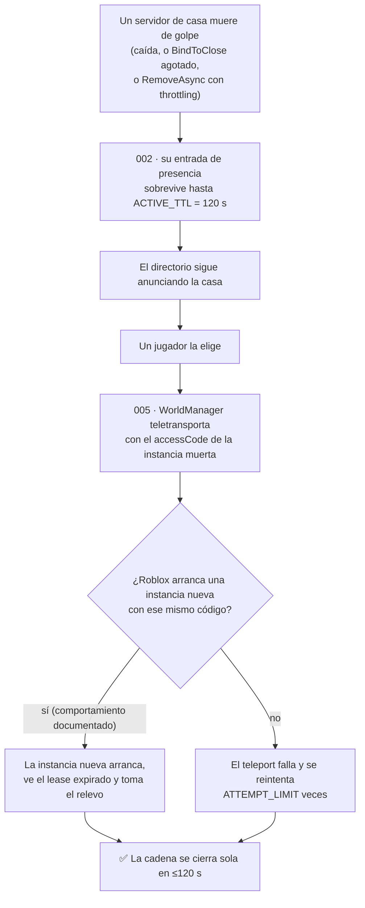
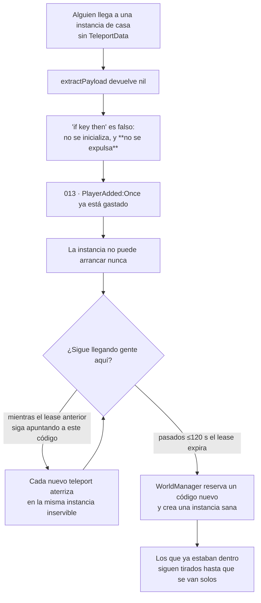

# Sistema de mundos — revisión de gravedad

Segunda pasada sobre los catorce candidatos que tocan el sistema de mundos y casas, con una
pregunta concreta y distinta de la primera vez: **¿está bien puesta la gravedad?**

La primera pasada valoró cada entrada por separado, que es como se escriben. Ésta pregunta
otra cosa: qué pasa cuando fallan **encadenados**, cuánto dura el daño, y quién lo repara.
Tres cosas cambiaron de sitio, una entrada nueva salió de debajo de otra, y varias se
confirman donde estaban — que también es un resultado.

:::caution Sigue sin haber nada verificado

Nada de esto se ha ejecutado. Son teorías con evidencia, y esta página revisa **el
razonamiento** sobre su impacto, no lo confirma. Verificar exige Roblox Studio.

:::

## El resultado, en una tabla

| ID | Título abreviado | Antes | Ahora | Qué cambió |
|---|---|---|---|---|
| [002](./verification-plan.md#bug-candidate-002) | Presencia sobrevive a su servidor | Media | **Media** | Confirmada. La cadena que abre se cierra sola |
| [004](./verification-plan.md#bug-candidate-004) | Convergencia tras anfitrión denegado | Alta / conf. Baja | **Alta / conf. Baja** | Sin cambios. La confianza baja sigue siendo honesta |
| [005](./verification-plan.md#bug-candidate-005) | Teleport a un código de instancia muerta | Media | **Baja** | ⬇️ La ruta se autorrepara; el riesgo real es el de la 013 |
| [006](./verification-plan.md#bug-candidate-006) | Studio publica un código falso en producción | Alta | **Media**, y más importante | ⬇️ en síntoma, ⬆️ en lo que implica |
| [009](./verification-plan.md#bug-candidate-009) | El nombre se fija en el primer arranque | Baja | **Baja** | Confirmada |
| [010](./verification-plan.md#bug-candidate-010) | `WorldDataReplicator` se pierde el `ready` | Media | **Media** | Confirmada, con el vecino que lo hace bien al lado |
| [011](./verification-plan.md#bug-candidate-011) | El rol `moderator` no puede moderar | Media | **Media** | Confirmada; se le extrae la nota al pie |
| [012](./verification-plan.md#bug-candidate-012) | Roles y baneos legibles por cualquiera | Baja / *Observación* | **Baja / Bug probable** | ➡️ Cambia de clase, no de gravedad |
| [013](./verification-plan.md#bug-candidate-013) | Servidor sin `TeleportData` deja tirado | Media | **Media** | Misma nota, mecanismo entendido de otra forma |
| [053](./verification-plan.md#bug-candidate-053) | La escala de roles no tiene peldaños | *(era nota al pie)* | **Media** | 🆕 Entrada propia |
| [008](./verification-plan.md#bug-candidate-008) | Compra concede antes de cobrar | Media | **Media** | Fuera de esta revisión: es economía |
| [020](./verification-plan.md#bug-candidate-020) | Color sin tope en perfil ajeno | Alta | **Alta** | Fuera de esta revisión |
| [023](./verification-plan.md#bug-candidate-023) | Posición decidida por el cliente | Baja | **Baja** | Fuera de esta revisión |
| [036](./verification-plan.md#bug-candidate-036) | Favoritos sin tope | Baja | **Baja** | Fuera de esta revisión |

## Por qué encadenarlas cambia la lectura

Las entradas se escriben de una en una, pero el sistema no falla de una en una. Dos cadenas
explican casi todo lo que hay aquí.

### Cadena A — el servidor fantasma, que se cura sola



**Ésta es la razón por la que bajo la 005 de Media a Baja.** Su propia entrada ya decía que
el comportamiento de Roblox probablemente la hace inocua; al mirarla como cadena se ve que
**los dos desenlaces posibles son benignos**. O arranca una instancia nueva y todo sigue, o
el teleport falla y el jugador se queda donde estaba con un error. En ninguno de los dos se
pierde nada ni se queda nadie tirado.

Lo que la 002 aporta de verdad no es riesgo: es **la duración de la ventana**. Los 120
segundos de `ACTIVE_TTL` son la unidad de medida de casi todo lo demás de esta página.

**Y `ServerPresence` hace bien su parte.** Merece decirse, porque es lo que impide que la
ventana sea peor:

```lua
-- Guardadas para poder soltarlas en Cleanup. Si sobreviven al cierre, el jugador que sale
-- reescribe la key que Cleanup acaba de borrar, y el servidor muerto se queda anunciado
-- en el directorio hasta que expira su TTL.
```

Ese comentario está en el código, y las conexiones se sueltan **antes** de borrar la entrada.
Alguien vio exactamente este fallo y lo cerró. La 002 sobrevive solo para los caminos que
`Cleanup` no recorre: la caída abrupta y el `RemoveAsync` con throttling.

### Cadena B — la que no se cura sola



**Aquí está el matiz que cambia el razonamiento de la 013, aunque no su nota.**

La entrada original decía, correctamente, que el `:Once` queda consumido y que un jugador
posterior tampoco podrá inicializar el servidor. Lo que no decía es **por qué llegarían más
jugadores a una instancia rota**: porque un teleport por `ReservedServerAccessCode` iría a la
instancia que ya está viva con ese código. Mientras el lease apunte ahí, la instancia
inservible **seguiría recibiendo víctimas**.

:::warning Aquí hay una suposición, y conviene marcarla

Ese enrutado es **comportamiento de Roblox**, no algo que establezca este repositorio — la
misma clase de afirmación que la [005](./verification-plan.md#bug-candidate-005) se cuida de
no dar por sentada. Si la doy por sentada aquí para sostener el argumento, estoy aplicando
dos varas distintas.

| Si el enrutado es como se supone | Si no lo es |
|---|---|
| La instancia rota atrapa a todo el que entre en la ventana | Atrapa a **uno**, y el resto va a instancias sanas |
| **Media** | **Baja** |

Todo el razonamiento de este apartado cuelga de eso, así que es lo primero que hay que
comprobar — antes incluso que la pregunta del amigo.

:::

Y lo que la salva de ser Alta es el mismo número de la cadena A: esa instancia nunca escribió
un lease —nunca llegó a `ServerPresence.new`—, así que el lease que la señala es el de la
instancia anterior y **expira en ≤120 s**. A partir de ahí `WorldManager` reserva un código
nuevo y los jugadores siguientes van a una instancia sana.

| | |
|---|---|
| Duración del sangrado | ≤ 120 s |
| A quién alcanza | A todo el que entre a esa casa en esa ventana |
| Quién lo repara | Nadie: expira |
| Qué pasa con los ya atrapados | Siguen dentro, sin mundo, hasta que se van por su cuenta |

**Media es la nota correcta**, pero por una razón distinta de la que estaba escrita: no
porque afecte a poca gente, sino porque **se agota sola**.

#### Lo que sube su probabilidad, y no estaba dicho

La 013 se leía como «hace falta un fallo raro para que falte el `TeleportData`». Hay al menos
un camino que no es raro: **entrar a una casa siguiendo a un amigo** en vez de por el flujo
del juego. Ese camino no lleva `TeleportData`.

Si la instancia ya está arrancada, no pasa nada: el `:Once` se gastó hace rato en el jugador
que la arrancó bien. El caso malo es que el amigo sea **el primero en llegar** a una
instancia recién creada — que es justamente lo que ocurre si la instancia anterior murió.

Es decir: **la cadena A alimenta a la cadena B.** La primera es inofensiva por sí sola, pero
crea la condición —una instancia nueva y vacía— en la que la segunda hace daño.

**DESCONOCIDO**, y se deja escrito en vez de rellenarlo: si Roblox permite «seguir a un
amigo» hasta un servidor reservado depende de la configuración del universo, y eso no está en
este repositorio. Es lo primero que habría que comprobar, porque de ello depende que la 013
sea un caso de laboratorio o una incidencia semanal.

## La 006 baja de nota y sube de importancia

Ésta es la revisión menos intuitiva, así que conviene el detalle.

**El síntoma es menor de lo que puse.** En Studio:

```lua
local claim, current = Profiles.World.claimStaged(serverKey, { placeId = roomInfo.placeId })
if claim then
	local code = reserveAccessCode(roomInfo.placeId)   -- Studio: un GUID inventado
	local meta = { placeId = roomInfo.placeId, accessCode = code }
	claim:setMeta(meta)      -- escribe en MemoryStore, que es de universo
	claim:tryClaim()         -- promociona el reclamo a "hosted"
	return teleportToHost(player, serverKey, meta)   -- Studio: no hace nada
```

Un jugador real que pida esa casa recibe `kind = "hosted"` y un teleport a un código que
nunca se reservó. Ese teleport **falla**: `safeTeleport` reintenta y devuelve error. El
jugador no acaba en ningún sitio raro — se queda donde estaba con un fallo.

Y el envenenamiento dura lo que dure el lease, porque **ninguna instancia lo está
refrescando**: el hub de Studio escribió el reclamo, pero no hay ningún servidor de casa vivo
manteniéndolo. Otra vez ≤120 s.

Una casa inalcanzable durante dos minutos, y solo mientras alguien está probando en Studio con
acceso a API: eso es **Media**, no Alta. Bajo la nota.

**Pero la entrada importa más, no menos.** Lo que demuestra no es un fallo de dos minutos:
demuestra que **MemoryStore y DataStore no están aislados por entorno en este proyecto**. Las
dos guardas de Studio que existen —`reserveAccessCode` y `safeTeleport`— protegen los
extremos, y **el tramo del medio escribe en producción sin saberlo**.

Eso convierte la pregunta en una mucho mayor: ¿qué otras rutas escriben datos reales desde
Studio? `WorldService.start` llama a `Profiles.World.load`, que carga y **guarda** el perfil
de la casa. `PlayerDataService` hace lo propio con el del jugador. Ninguno de los dos
comprueba `IsStudio`.

Por eso su clasificación se queda en **Bug probable** y su gravedad baja a Media, pero la
entrada gana una recomendación que antes no tenía: **lo que hay que decidir no es cómo
arreglar `hostWorld`, sino si Studio debe poder escribir en los almacenes de producción en
absoluto.** Eso es una decisión de infraestructura, no un parche.

## La 012 cambia de clase, y ésa es la corrección que más me importa

La 012 dice que cualquier ocupante puede leer los roles, los ajustes y los baneos de una casa.
La escribí como **Observación** — el tono de «esto es así, y quizá se quiso así».

Al leer `WorldDataReplicator` entero, eso ya no se sostiene. Los tres remotes de lectura son:

```lua
GetRolesRf.OnServerInvoke = function(_player: Player)
	local data = WorldService.get()
	return data and data.roles or nil
end
```

El parámetro se llama **`_player`**: el guion bajo es la convención de Luau para «recibo esto
y no lo uso». Los tres —`GetRoles`, `GetWorldSettings`, `GetBans`— están escritos igual.

Y en el **mismo archivo**, la ruta que empuja esos mismos datos sí comprueba:

```lua
local function pushStore(storeName: string)
	...
	for _, plr in PlayersService:GetPlayers() do
		local role = roleFor(data, plr.UserId)
		if role >= RolesInfo["moderator"] or data.settings.OwnerId == plr.UserId then
			WorldDataUpdated:FireClient(plr, storeName, payload)
```

**Existe una puerta, y solo está en uno de los dos caminos.** Eso descarta que la exposición
sea una decisión: si se hubiera querido pública, `pushStore` no filtraría. Es la misma forma
que la [042](./verification-plan.md#bug-candidate-042) —el rol se comprueba en el chat y no
en el remote— y que la [008](./verification-plan.md#bug-candidate-008).

Así que **la gravedad se queda en Baja** —lo que se filtra son ids y números de rol de una
casa, no credenciales— pero la clasificación pasa de *Observación* a **Bug probable**. La
diferencia importa para quien decida qué arreglar: una observación se archiva, un bug
probable se corrige, y aquí el arreglo son tres líneas en un archivo que ya tiene la función
que hace falta.

**Y hay un cuarto remote en la misma familia** que no estaba anotado:

```lua
GetUserRolRF.OnServerInvoke = function(player: Player, userId: number)
	if not userId then userId = player.UserId end
	...
	return rol
end
```

Acepta un `userId` **arbitrario**. No es una fuga nueva —`GetRoles` ya devuelve el mapa
entero— pero es el mismo descuido una cuarta vez, y conviene arreglarlo en la misma pasada.

## Lo que se confirma donde estaba

No todo cambia, y decir cuáles resistieron la segunda mirada es parte del resultado.

**[010](./verification-plan.md#bug-candidate-010) — Media, confirmada.**
`WorldDataReplicator` cablea su replicación dentro de un `GetAttributeChangedSignal` y nunca
mira el valor actual. Lo que la mantiene en Media —y no más— es que
`ModeratorManager`, **en la misma carpeta**, resuelve el mismo problema bien:

```lua
if ServerInfo:GetAttribute("status") == "ready" then
	onReady()
else
	local conn
	conn = ServerInfo:GetAttributeChangedSignal("status"):Connect(function() ... end)
end
```

Dos archivos vecinos, el mismo patrón, uno con la comprobación inicial y otro sin ella. Eso
sube la confianza de que es un descuido y no una decisión, y baja la de que sea sistémico: el
proyecto **sabe** hacerlo bien.

**[011](./verification-plan.md#bug-candidate-011) — Media, confirmada, y ahora más nítida.**
Con la [053](./verification-plan.md#bug-candidate-053) separada, la 011 queda siendo lo que
de verdad es: un operador equivocado. `canModerate` usa `>` donde `pushStore`, tres funciones
más abajo, usa `>=`. El efecto —un `moderator` ve el panel lleno y no puede tocar nada— es
exactamente el que se describía.

**[009](./verification-plan.md#bug-candidate-009) — Baja, confirmada.** El nombre de la casa
se fija en el primer arranque y no se rehace. Sigue siendo un fallo de presentación con un
arreglo evidente, y el dueño puede renombrarla a mano con `SetWorldName`. Que exista esa
salida es lo que la mantiene en Baja.

**[004](./verification-plan.md#bug-candidate-004) — Alta con confianza Baja, sin tocar.** Es
la única entrada de esta página cuya nota no puedo mejorar leyendo código: pregunta cómo se
comporta una ruta de último recurso **bajo carga**, y eso no se responde leyendo. La
confianza Baja es la respuesta honesta y se queda.

## Si hubiera que arreglar en orden

Este proyecto no arregla nada. Pero de la revisión sale un orden, y decirlo es más útil que
una lista de letras:

| Orden | Qué | Por qué primero |
|---|---|---|
| 1 | **[053](./verification-plan.md#bug-candidate-053)** + **[011](./verification-plan.md#bug-candidate-011)** | Son la misma pregunta —qué significa cada peldaño— y se arreglan de una vez, en un archivo. Hoy la escala tiene seis niveles y el código distingue dos |
| 2 | **[012](./verification-plan.md#bug-candidate-012)** | Tres líneas, en el mismo archivo, reusando `roleFor` que ya está escrita |
| 3 | **[013](./verification-plan.md#bug-candidate-013)** | Un `else` que expulse con un mensaje, y `:Connect` en vez de `:Once`. Es el único de la lista que deja a alguien tirado |
| 4 | **[010](./verification-plan.md#bug-candidate-010)** | Copiar el patrón del archivo de al lado |
| 5 | **[006](./verification-plan.md#bug-candidate-006)** | No es un parche: es decidir si Studio escribe en producción. Va el último porque es el que hay que **pensar**, no el que hay que teclear |

Los cuatro primeros suman, a ojo, menos de treinta líneas. El quinto es una conversación.

## Lo que esta revisión no puede decir

- **Si alguno ocurre.** Nada se ha ejecutado. La 013 depende de si se puede llegar a un
  servidor reservado siguiendo a un amigo, y eso es configuración del universo.
- **Con qué frecuencia se reparte `admin`.** Todo el impacto de la 053 cuelga de ese dato, y
  está en la cabeza del equipo, no en el repositorio.
- **Qué hace la interfaz.** Los paneles de administración de casa viven en `.rbxm`. Que el
  panel no ofrezca conceder `owner` no cambia que el remote lo acepte, pero sí cambia cuánta
  gente tropieza con ello sin buscarlo.

## Implementación relacionada

| Aspecto | Código |
|---|---|
| Presencia y TTL | `Core/ServerStorage/WorldSystem/ServerPresence.luau` |
| Arranque de una casa | `PlayerHouses/ServerScriptService/PlayerWorld_Init.lua.server.luau` |
| Remotes de administración | `PlayerHouses/ServerScriptService/WorldDataReplicator.server.luau` |
| Entrada y baneos | `PlayerHouses/ServerScriptService/ModeratorManager.server.luau` |
| Reserva y teleport | `Core/…/ServerScripts/WorldManager.server.luau` |
| La escala de roles | `PlayerHouses/ReplicatedStorage/RolesInfo.luau` |
